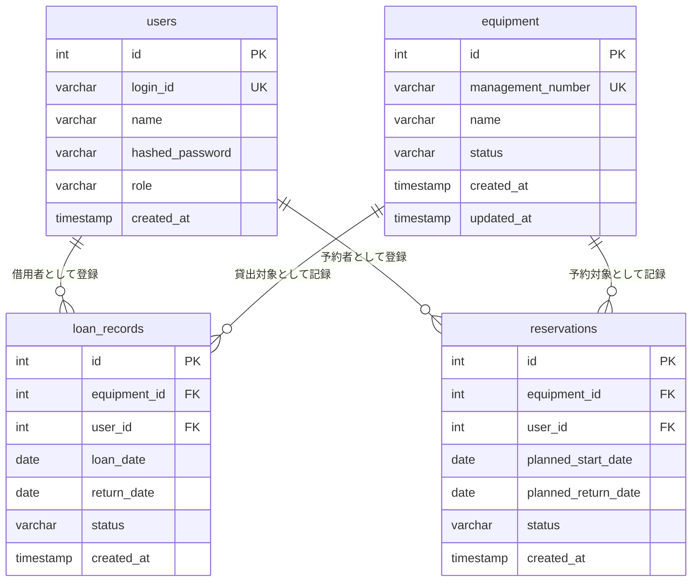
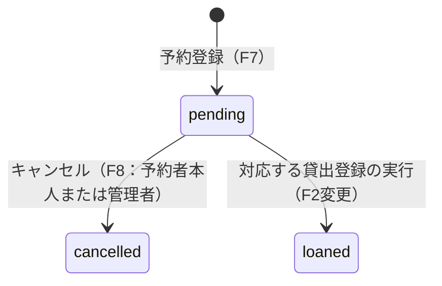
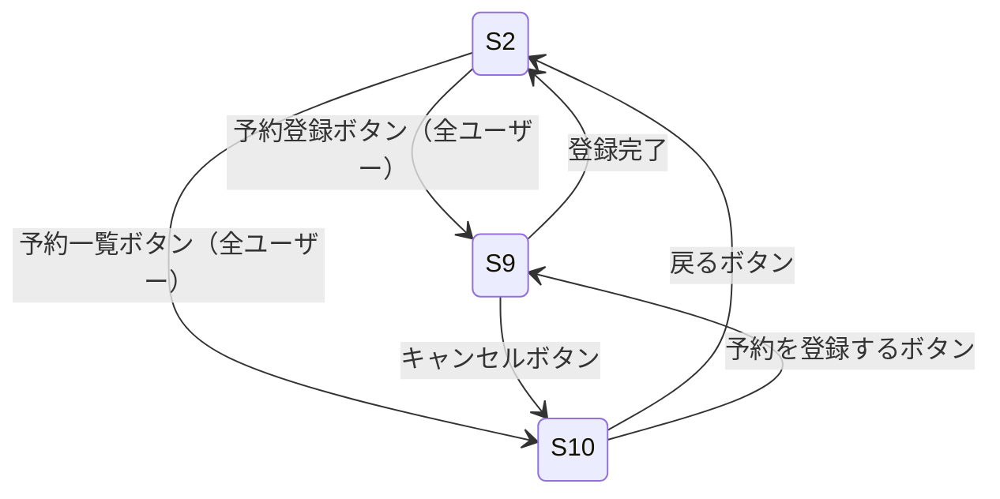
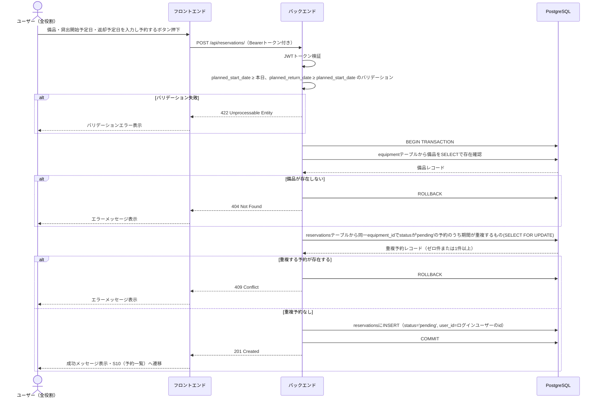
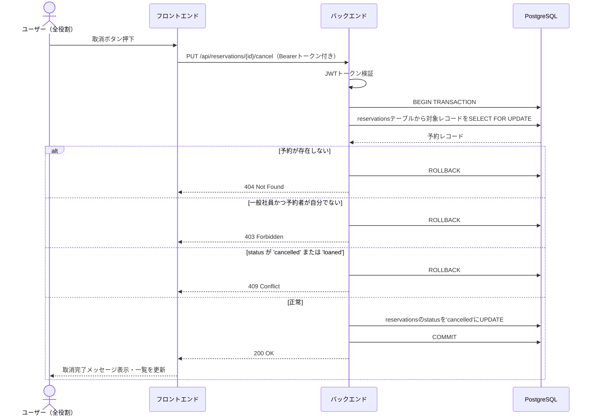
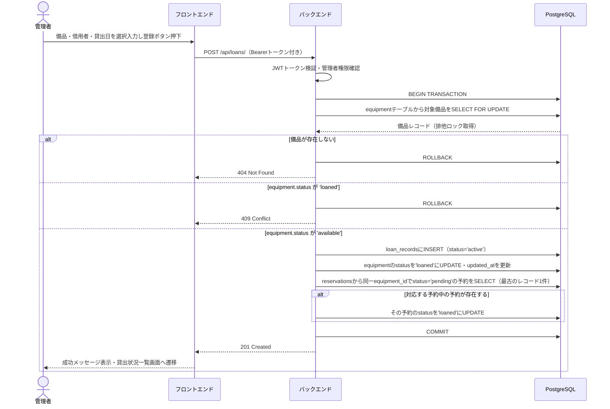
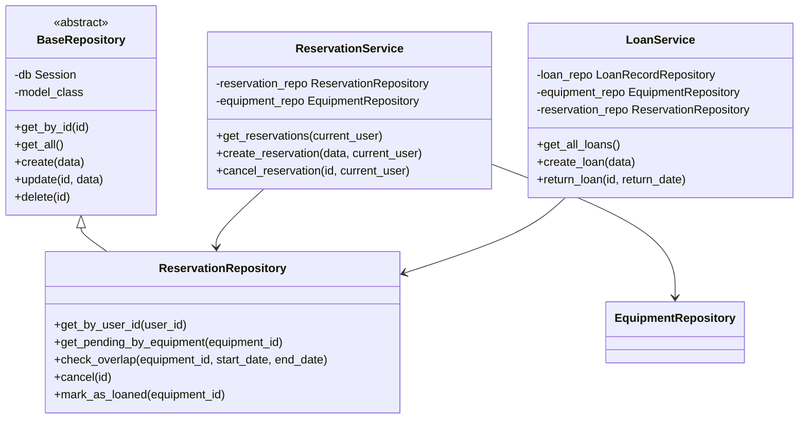
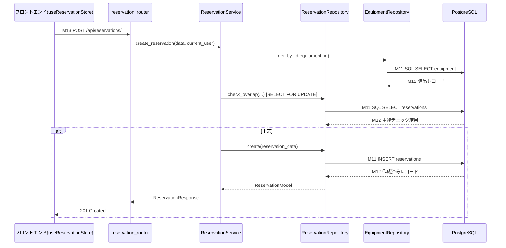

# 備品管理・貸出管理システム 変更詳細設計書（貸出予約機能追加）

> 本書は `.history/20260329-貸出予約機能追加/change_requirements.md` に基づく変更点のみを記述する。
> 変更のない項目については既存の `docs/detail_design.md` を参照すること。
> **既存の `docs/detail_design.md` は変更しない。**

---

## 変更概要

| 変更区分 | 対象 | 内容 |
|---------|------|------|
| 追加 | DBテーブル | `reservations`テーブル |
| 追加 | APIエンドポイント | `POST /api/reservations/`, `GET /api/reservations/`, `PUT /api/reservations/{id}/cancel` |
| 変更 | APIエンドポイント | `POST /api/loans/`（予約の自動貸出済更新を追加） |
| 追加 | 画面 | S9 予約登録画面、S10 予約一覧画面 |
| 変更 | 画面 | S2 貸出状況一覧画面（予約関連ボタン追加）、S3 貸出登録画面（予約表示追加） |
| 追加 | バックエンドクラス | `ReservationModel`, `ReservationRepository`, `ReservationService` |
| 変更 | バックエンドクラス | `LoanService`（予約自動更新処理追加） |
| 追加 | バックエンドスキーマ | `ReservationCreate`, `ReservationResponse` |
| 追加 | フロントエンド | `useReservationStore`, `ReservationCreateView`, `ReservationListView` |
| 変更 | フロントエンド | `DashboardView`, `LoanCreateView`, `router/index.js` |

---

## 1. 言語・フレームワーク

変更なし。既存の `docs/detail_design.md` の「1. 言語・フレームワーク」を参照すること。

---

## 2. システム構成

コンポーネント構成・ネットワーク構成に変更なし。
予約機能は既存のフロントエンド・バックエンド・DBの3コンテナ構成の中で実装する。

---

## 3. データベース設計（変更分）

### 追加テーブル

#### reservations テーブル

| カラム名 | データ型 | 制約 | 説明 |
|---------|---------|------|------|
| id | SERIAL | PK | 予約ID（自動採番） |
| equipment_id | INTEGER | NOT NULL, FK → equipment.id | 予約対象備品ID |
| user_id | INTEGER | NOT NULL, FK → users.id | 予約者ユーザーID |
| planned_start_date | DATE | NOT NULL | 貸出開始予定日 |
| planned_return_date | DATE | NOT NULL | 返却予定日 |
| status | VARCHAR(20) | NOT NULL, DEFAULT 'pending', CHECK(status IN ('pending','cancelled','loaned')) | 状態 |
| created_at | TIMESTAMP | NOT NULL, DEFAULT NOW() | 作成日時 |

### 状態値の対応

| DBの値 | 日本語表示 |
|--------|----------|
| `pending` | 予約中 |
| `cancelled` | キャンセル済 |
| `loaned` | 貸出済 |

### データ整合性制約（追加分）

| 制約種別 | 内容 |
|---------|------|
| PK制約 | reservations.id |
| FK制約 | reservations.equipment_id → equipment.id, reservations.user_id → users.id |
| CHECK制約 | reservations.status IN ('pending','cancelled','loaned') |
| 業務制約（アプリ層） | 予約登録時: planned_start_date ≥ 予約登録日（当日）であること |
| 業務制約（アプリ層） | 予約登録時: planned_return_date ≥ planned_start_date であること |
| 業務制約（アプリ層） | 予約登録時: 同一equipment_idに対してstatusが'pending'の予約の中に、planned_start_date〜planned_return_dateと1日でも重複するものが存在しないこと |
| 業務制約（アプリ層） | 予約キャンセル時: reservations.status = 'pending' であること |

### ER図（変更分）



### 予約の状態遷移



---

## 4. 外部設計（変更・追加分）

### 画面一覧（変更・追加分）

| 画面ID | 画面名 | URL | 利用者 | 種別 |
|--------|--------|-----|--------|------|
| S2 | 貸出状況一覧画面 | / | 全ユーザー（認証済み） | 変更 |
| S3 | 貸出登録画面 | /loans/create | 管理者のみ | 変更 |
| S9 | 予約登録画面 | /reservations/create | 全ユーザー（認証済み） | 追加 |
| S10 | 予約一覧画面 | /reservations | 全ユーザー（認証済み） | 追加 |

### 変更・追加画面モックアップ（AA）

#### S2 貸出状況一覧画面（管理者）— 変更後

```
+------------------------------------------------------------------+
|  備品管理システム                       管理者:田中  [ログアウト]  |
+------------------------------------------------------------------+
|  [貸出登録]  [返却登録]  [予約一覧]  [予約登録]                   |
|  [備品管理]  [ユーザー管理]                                       |
+------------------------------------------------------------------+
|  貸出状況一覧                                                    |
|  +------------+--------+----------+------------+                |
|  | 備品名      | 状態   | 借用者   | 貸出日      |                |
|  +------------+--------+----------+------------+                |
|  | ノートPC    | 貸出中 | 山田太郎  | 2026/03/01 |                |
|  | プロジェクタ | 貸出可 |    -     |     -      |                |
|  +------------+--------+----------+------------+                |
+------------------------------------------------------------------+
```

#### S2 貸出状況一覧画面（一般社員）— 変更後

```
+------------------------------------------------------------------+
|  備品管理システム                       社員:山田   [ログアウト]  |
+------------------------------------------------------------------+
|  [予約一覧]  [予約登録]                                          |
+------------------------------------------------------------------+
|  貸出状況一覧                                                    |
|  +------------+--------+----------+------------+                |
|  | 備品名      | 状態   | 借用者   | 貸出日      |                |
|  +------------+--------+----------+------------+                |
|  | ノートPC    | 貸出中 | 山田太郎  | 2026/03/01 |                |
|  | プロジェクタ | 貸出可 |    -     |     -      |                |
|  +------------+--------+----------+------------+                |
+------------------------------------------------------------------+
```

#### S3 貸出登録画面（管理者）— 変更後

```
+----------------------------------------------------------+
|  貸出登録                          [← 一覧に戻る]         |
+----------------------------------------------------------+
|                                                          |
|  備品選択   [ プロジェクタ               ▼ ]             |
|             ※ 貸出可の備品のみ表示                        |
|                                                          |
|  選択した備品の予約一覧                                   |
|  +----------+----------+------------+------------+       |
|  | 予約者    | 貸出開始予定日 | 返却予定日  | 状態  |       |
|  +----------+----------+------------+------------+       |
|  | 山田太郎  | 2026/04/10 | 2026/04/12 | 予約中  |       |
|  +----------+----------+------------+------------+       |
|  ※ 予約中の予約がない場合は「予約なし」と表示              |
|                                                          |
|  借用者     [ 山田太郎                   ▼ ]             |
|                                                          |
|  貸出日     [ 2026/04/10                    ]            |
|                                                          |
|          [キャンセル]      [  登録する  ]                  |
+----------------------------------------------------------+
```

#### S9 予約登録画面（追加）

```
+---------------------------------------------+
|  予約登録               [← 一覧に戻る]        |
+---------------------------------------------+
|                                             |
|  備品選択   [ ノートPC                 ▼ ]   |
|             ※ 全備品から選択可               |
|                                             |
|  貸出開始予定日  [ 2026/04/10          ]     |
|                                             |
|  返却予定日      [ 2026/04/12          ]     |
|                                             |
|          [キャンセル]   [  予約する  ]        |
|                                             |
|  ※ 予約期間が他の予約と重複する場合は登録不可  |
|  ※ 貸出開始予定日は本日以降を入力してください  |
+---------------------------------------------+
```

#### S10 予約一覧画面（管理者表示）（追加）

```
+------------------------------------------------------------------+
|  予約一覧                             [+ 予約を登録する]           |
+------------------------------------------------------------------+
|  +----------+-----------+------------+------------+--------+-----+
|  | 備品名    | 予約者     | 貸出開始日  | 返却予定日  | 状態  | 操作|
|  +----------+-----------+------------+------------+--------+-----+
|  | ノートPC  | 山田太郎   | 2026/04/10 | 2026/04/12 | 予約中 |[取消]|
|  | カメラ    | 鈴木花子   | 2026/04/15 | 2026/04/16 | 予約中 |[取消]|
|  | ノートPC  | 田中一郎   | 2026/03/01 | 2026/03/03 | 貸出済 |  -  |
|  +----------+-----------+------------+------------+--------+-----+
|  ※ 管理者は全ユーザーの予約を表示                               |
+------------------------------------------------------------------+
```

#### S10 予約一覧画面（一般社員表示）（追加）

```
+------------------------------------------------------------------+
|  予約一覧                             [+ 予約を登録する]           |
+------------------------------------------------------------------+
|  +----------+------------+------------+--------+------+         |
|  | 備品名    | 貸出開始日  | 返却予定日  | 状態  | 操作  |         |
|  +----------+------------+------------+--------+------+         |
|  | ノートPC  | 2026/04/10 | 2026/04/12 | 予約中 |[取消]|         |
|  +----------+------------+------------+--------+------+         |
|  ※ 自分の予約のみ表示                                           |
+------------------------------------------------------------------+
```

### 画面遷移図（変更・追加分）



### API仕様（変更・追加分）

#### 予約API（追加）

| メソッド | パス | 認証 | 権限 | 概要 |
|---------|------|------|------|------|
| POST | /api/reservations/ | 必要 | 全役割 | 予約登録 |
| GET | /api/reservations/ | 必要 | 全役割 | 予約一覧取得（一般社員は自身のみ、管理者は全件） |
| PUT | /api/reservations/{id}/cancel | 必要 | 全役割（所有者本人または管理者のみ） | 予約キャンセル |

**POST /api/reservations/**

- リクエストボディ

| フィールド | 型 | 必須 | バリデーション |
|-----------|-----|------|--------------|
| equipment_id | integer | ○ | 存在する備品のID |
| planned_start_date | date | ○ | ISO 8601形式。本日以降の日付であること |
| planned_return_date | date | ○ | ISO 8601形式。planned_start_date以降の日付であること |

- レスポンス

| ステータス | 内容 |
|-----------|------|
| 201 | `{ id, equipment_id, user_id, planned_start_date, planned_return_date, status: "pending", created_at }` |
| 401 | 未認証 |
| 404 | 備品が存在しない |
| 409 | 同一備品に期間が重複する予約中の予約が存在する |
| 422 | バリデーションエラー（過去日付、返却日 < 開始日） |

**GET /api/reservations/**

- クエリパラメータ: なし
- バックエンドでロールにより自動フィルタリング（一般社員は自身のuser_idで絞り込み、管理者は全件）

- レスポンス200: `[ { id, equipment_id, equipment_name, user_id, user_name, planned_start_date, planned_return_date, status, created_at } ]`

**PUT /api/reservations/{id}/cancel**

- リクエストボディ: なし
- 認可: 一般社員は自身が登録した予約のみキャンセル可。管理者は全予約のキャンセル可。

- レスポンス

| ステータス | 内容 |
|-----------|------|
| 200 | `{ id, equipment_id, user_id, planned_start_date, planned_return_date, status: "cancelled" }` |
| 401 | 未認証 |
| 403 | 他ユーザーの予約を一般社員がキャンセルしようとした |
| 404 | 予約が存在しない |
| 409 | 既にキャンセル済みまたは貸出済みのためキャンセル不可 |

#### 貸出記録API（変更分）

**POST /api/loans/（変更）**

リクエスト・レスポンス仕様は既存と変更なし。処理内部のみ変更（後述の「5. 内部設計」参照）。

> 変更点: 貸出登録成功後、同一備品に対してstatusが'pending'の予約が存在する場合、その予約のstatusを'loaned'に自動更新する処理を追加する。

### エンティティ・画面・API・クラス対応表（変更・追加分）

| エンティティ | 対応画面 | 対応APIパス | バックエンドモデル | リポジトリ | サービス |
|-------------|---------|------------|-----------------|----------|---------|
| 予約 | S9, S10, S3（参照のみ） | /api/reservations/ | ReservationModel | ReservationRepository | ReservationService |
| 貸出記録 | S2, S3, S4 | /api/loans/ | LoanRecordModel | LoanRecordRepository | LoanService（変更） |

---

## 5. 内部設計（変更・追加分）

### 予約登録処理フロー



### 予約キャンセル処理フロー



### 貸出登録処理フロー（変更後）



### トランザクション設計（変更・追加分）

| 処理 | トランザクション境界 | ロールバック条件 |
|------|-------------------|----------------|
| 予約登録 | 重複予約チェック（SELECT FOR UPDATE）→reservationsにINSERTを1トランザクション内で実行 | 備品が存在しない、重複する予約が存在する、バリデーション失敗、DB例外 |
| 予約キャンセル | 予約取得（SELECT FOR UPDATE）→statusをcancelledにUPDATEを1トランザクション内で実行 | 予約が存在しない、権限なし、既にcancelled/loaned、DB例外 |
| 貸出登録（変更） | 既存の貸出登録トランザクションに、対応予約のloaded更新を追加。全体を1トランザクション内で実行 | 既存のロールバック条件に加え、予約UPDATE失敗時もロールバック |

### 排他制御（変更・追加分）

| 処理 | 排他制御方式 | 対象 |
|------|------------|------|
| 予約登録 | 悲観的ロック（SELECT FOR UPDATE） | reservationsテーブルの同一equipment_idかつstatus='pending'の行（重複チェック時） |
| 予約キャンセル | 悲観的ロック（SELECT FOR UPDATE） | reservationsテーブルの対象行 |

同一備品への同時予約リクエストが発生した場合、先に取得したトランザクションが処理を完了し、後のトランザクションは409エラーで応答する。

---

## 6. クラス設計（変更・追加分）

### バックエンドクラス一覧（変更・追加分）

| クラス名 | 区分 | 種別 | 役割 |
|---------|------|------|------|
| ReservationModel | ORMモデル | 追加 | reservationsテーブルのORM定義 |
| ReservationRepository | リポジトリ | 追加 | 予約固有のデータアクセス |
| ReservationService | サービス | 追加 | 予約業務ロジック |
| LoanService | サービス | 変更 | 貸出業務ロジック（予約自動更新処理を追加） |

### バックエンドスキーマ（Pydantic）一覧（追加分）

| スキーマ名 | 用途 |
|----------|------|
| ReservationCreate | 予約登録リクエスト |
| ReservationResponse | 予約APIレスポンス |

### フロントエンドモジュール一覧（変更・追加分）

| モジュール名 | 区分 | 種別 | 役割 |
|------------|------|------|------|
| useReservationStore | Piniaストア | 追加 | 予約一覧状態の管理、予約登録・キャンセル操作のAPI呼び出し |
| ReservationCreateView | ビュー | 追加 | S9 予約登録画面 |
| ReservationListView | ビュー | 追加 | S10 予約一覧画面 |
| DashboardView | ビュー | 変更 | S2 に予約一覧・予約登録への遷移ボタンを追加 |
| LoanCreateView | ビュー | 変更 | S3 に選択備品の予約中一覧表示エリアを追加 |
| router/index.js | Vue Router | 変更 | `/reservations` と `/reservations/create` ルートを追加（認証必須、全役割アクセス可） |

### クラス詳細（追加・変更分）

#### ReservationModel

- 役割: reservationsテーブルのSQLAlchemy ORMマッピング定義
- 主な属性: id, equipment_id, user_id, planned_start_date, planned_return_date, status, created_at
- リレーション: equipment（EquipmentModelへのFKリレーション）、user（UserModelへのFKリレーション）

#### ReservationRepository（BaseRepositoryを継承）

- 役割: 予約テーブルに対するデータアクセス処理
- 主なメソッド:

| メソッド名 | 処理内容 |
|----------|---------|
| get_by_id(id) | 指定IDの予約を1件取得する（BaseRepositoryから継承） |
| get_all() | 全予約を取得する（BaseRepositoryから継承） |
| get_by_user_id(user_id) | 指定ユーザーIDの予約を全件取得する |
| get_pending_by_equipment(equipment_id) | 指定備品の予約中(status='pending')の予約を取得する |
| check_overlap(equipment_id, start_date, end_date) | 指定備品の予約中予約の中に、指定期間と重複するものがあるか確認する。重複条件: `start_date <= existing.planned_return_date AND end_date >= existing.planned_start_date` |
| cancel(id) | 指定IDの予約のstatusを'cancelled'に更新する |
| mark_as_loaned(equipment_id) | 指定備品のstatus='pending'の予約（最古の1件）のstatusを'loaned'に更新する |

#### ReservationService

- 役割: 予約のビジネスロジックを実装する
- 依存: ReservationRepository、（備品存在確認のためEquipmentRepository）
- 主なメソッド:

| メソッド名 | 処理内容 |
|----------|---------|
| get_reservations(current_user) | 管理者の場合は全予約、一般社員の場合は自身の予約のみを取得して返す |
| create_reservation(data, current_user) | バリデーション（日付制約）確認→重複チェック（check_overlapをSELECT FOR UPDATEを用いて実行）→予約をINSERT。重複があれば409例外を送出 |
| cancel_reservation(id, current_user) | 予約を取得（SELECT FOR UPDATE）→権限チェック（一般社員の場合は自身の予約のみ、違反は403）→status確認（pending以外は409）→statusをcancelledに更新 |

#### LoanService（変更）

- 変更点: `create_loan` メソッドに、貸出登録成功後にReservationRepositoryの`mark_as_loaned`を呼び出す処理を追加する。
- 依存の追加: ReservationRepository
- 変更後の `create_loan` 処理内容:
  1. 備品のSELECT FOR UPDATE（既存）
  2. equipmentのstatus確認（既存）
  3. loan_recordsにINSERT（既存）
  4. equipmentのstatusを'loaned'に更新（既存）
  5. ReservationRepository.mark_as_loaned(equipment_id) を呼び出す（**追加**）
  6. COMMIT（既存）

### クラス図（バックエンド・変更・追加分）



---

## 7. メッセージ設計（変更・追加分）

### メッセージ一覧（追加分）

| メッセージID | 発信元 | 受信先 | 内容 |
|------------|--------|--------|------|
| M13 | フロントエンド | バックエンド | 予約登録リクエスト（equipment_id, planned_start_date, planned_return_date） |
| M14 | フロントエンド | バックエンド | 予約一覧取得リクエスト（Bearerトークン付き） |
| M15 | フロントエンド | バックエンド | 予約キャンセルリクエスト（reservation_id） |

### 予約登録メッセージフロー



---

## 8. エラーハンドリング（変更・追加分）

既存のエラー一覧に以下を追加する。

| エラーコード | 発生条件 | バックエンドの応答 | フロントエンドの表示 |
|------------|---------|-----------------|-------------------|
| 403 | 一般社員が他ユーザーの予約をキャンセルしようとした | `{ detail: "この予約をキャンセルする権限がありません" }` | エラーメッセージをスナックバーで表示 |
| 409（予約登録） | 同一備品に期間重複する予約中の予約が存在する | `{ detail: "指定した期間に既に予約が存在します" }` | エラーメッセージをスナックバーで表示 |
| 409（予約キャンセル） | 既にキャンセル済みまたは貸出済みの予約をキャンセルしようとした | `{ detail: "この予約はキャンセルできません" }` | エラーメッセージをスナックバーで表示 |
| 422（予約登録） | planned_start_date が本日より過去の場合 | FastAPIデフォルトエラー形式 | フィールドエラーをフォーム上に表示 |
| 422（予約登録） | planned_return_date < planned_start_date の場合 | FastAPIデフォルトエラー形式 | フィールドエラーをフォーム上に表示 |

---

## 9. セキュリティ設計（変更・追加分）

既存のセキュリティ設計に対して以下を追加する。

| 項目 | 設計内容 |
|------|---------|
| 予約キャンセルの認可 | バックエンドのReservationServiceにて、一般社員が他ユーザーの予約に対してキャンセル操作を行った場合は403を返す。フロントエンドではS10の「取消」ボタンを、一般社員の場合は自身の予約にのみ表示する。バックエンドAPIでも必ず認可チェックを行い、フロントエンドのみへの依存は禁止する。 |
| 予約一覧の情報漏えい防止 | GET /api/reservations/ はバックエンドにてロールを確認し、一般社員には自身のuser_idで絞り込んだ結果のみ返す。フロントエンドで後からフィルタリングする方式は採用しない。 |

---

## 10. ソースコード構成（変更・追加分）

### 追加・変更ファイル一覧

#### バックエンド（追加）

| ファイルパス | 格納クラス / 役割 |
|------------|----------------|
| app/models/reservation.py | ReservationModel |
| app/schemas/reservation.py | ReservationCreate, ReservationResponse |
| app/repositories/reservation.py | ReservationRepository |
| app/services/reservation.py | ReservationService |
| app/routers/reservation.py | /api/reservations のルーター |

#### バックエンド（変更）

| ファイルパス | 変更内容 |
|------------|---------|
| app/services/loan.py | LoanServiceのcreate_loanメソッドにReservationRepositoryへの依存と予約自動更新処理を追加 |
| app/main.py | reservation_routerをFastAPIアプリに登録 |

#### フロントエンド（追加）

| ファイルパス | 格納モジュール / 役割 |
|------------|---------------------|
| src/stores/reservation.js | useReservationStore |
| src/views/ReservationCreateView.vue | S9 予約登録画面コンポーネント |
| src/views/ReservationListView.vue | S10 予約一覧画面コンポーネント |

#### フロントエンド（変更）

| ファイルパス | 変更内容 |
|------------|---------|
| src/router/index.js | `/reservations`（S10）と `/reservations/create`（S9）ルートを追加。認証必須（requiresAuth: true）、全役割アクセス可（requiresAdmin: false） |
| src/views/DashboardView.vue | 全ユーザー向けに「予約一覧」「予約登録」ボタンを追加。管理者向けには既存ボタンと並べて配置 |
| src/views/LoanCreateView.vue | 備品選択後、useReservationStoreを通じて選択備品のpending予約一覧を取得してテーブル形式で表示する区画を追加 |

### ディレクトリ構成（変更・追加分のみ）

```
backend/app/
├── models/
│   ├── reservation.py          （追加）
├── schemas/
│   ├── reservation.py          （追加）
├── repositories/
│   ├── reservation.py          （追加）
├── services/
│   ├── reservation.py          （追加）
│   └── loan.py                 （変更）
├── routers/
│   ├── reservation.py          （追加）
└── main.py                     （変更）

frontend/src/
├── stores/
│   └── reservation.js          （追加）
├── views/
│   ├── ReservationCreateView.vue  （追加）
│   ├── ReservationListView.vue    （追加）
│   ├── DashboardView.vue          （変更）
│   └── LoanCreateView.vue         （変更）
└── router/
    └── index.js                   （変更）
```

---

## 11. テスト設計（変更・追加分）

### 単体テストケース（追加分）

| テストID | 対象クラス・メソッド | テスト内容 | 正常/異常 |
|---------|------------------|----------|---------|
| UT-23 | ReservationService.create_reservation | 正常な入力で予約が作成されること | 正常 |
| UT-24 | ReservationService.create_reservation | planned_start_dateが過去日付で422例外が発生すること | 異常 |
| UT-25 | ReservationService.create_reservation | planned_return_date < planned_start_dateで422例外が発生すること | 異常 |
| UT-26 | ReservationService.create_reservation | 存在しないequipment_idで404例外が発生すること | 異常 |
| UT-27 | ReservationService.create_reservation | 重複する期間の予約が存在する場合に409例外が発生すること | 異常 |
| UT-28 | ReservationService.create_reservation | 重複しない期間の予約が存在する場合は正常に作成されること | 正常 |
| UT-29 | ReservationService.cancel_reservation | 予約者本人（一般社員）が自身の予約をキャンセルできること | 正常 |
| UT-30 | ReservationService.cancel_reservation | 管理者が任意の予約をキャンセルできること | 正常 |
| UT-31 | ReservationService.cancel_reservation | 一般社員が他ユーザーの予約のキャンセルで403例外が発生すること | 異常 |
| UT-32 | ReservationService.cancel_reservation | 存在しないIDで404例外が発生すること | 異常 |
| UT-33 | ReservationService.cancel_reservation | 既にキャンセル済みの予約で409例外が発生すること | 異常 |
| UT-34 | ReservationService.cancel_reservation | 貸出済みの予約で409例外が発生すること | 異常 |
| UT-35 | ReservationService.get_reservations | 管理者の場合は全予約が返ること | 正常 |
| UT-36 | ReservationService.get_reservations | 一般社員の場合は自身の予約のみが返ること | 正常 |
| UT-37 | LoanService.create_loan | 貸出登録成功時に対応するpending予約がloaned状態に更新されること | 正常 |
| UT-38 | LoanService.create_loan | 対応するpending予約がない場合でも貸出登録が正常に完了すること | 正常 |

### 結合テストケース（追加分）

| テストID | エンドポイント | テスト内容 | 正常/異常 |
|---------|--------------|----------|---------|
| IT-25 | POST /api/reservations/ | 認証済みユーザーが正常な入力で予約を作成できること | 正常 |
| IT-26 | POST /api/reservations/ | トークンなしで401が返ること | 異常 |
| IT-27 | POST /api/reservations/ | 過去日付のplanned_start_dateで422が返ること | 異常 |
| IT-28 | POST /api/reservations/ | planned_return_date < planned_start_dateで422が返ること | 異常 |
| IT-29 | POST /api/reservations/ | 重複期間の予約で409が返ること | 異常 |
| IT-30 | POST /api/reservations/ | 存在しないequipment_idで404が返ること | 異常 |
| IT-31 | GET /api/reservations/ | 管理者トークンで全予約が返ること | 正常 |
| IT-32 | GET /api/reservations/ | 一般社員トークンで自身の予約のみ返ること | 正常 |
| IT-33 | GET /api/reservations/ | トークンなしで401が返ること | 異常 |
| IT-34 | PUT /api/reservations/{id}/cancel | 予約者本人がキャンセルできること | 正常 |
| IT-35 | PUT /api/reservations/{id}/cancel | 管理者が任意予約をキャンセルできること | 正常 |
| IT-36 | PUT /api/reservations/{id}/cancel | 一般社員が他ユーザーの予約をキャンセルしようとして403が返ること | 異常 |
| IT-37 | PUT /api/reservations/{id}/cancel | キャンセル済み予約に対して409が返ること | 異常 |
| IT-38 | PUT /api/reservations/{id}/cancel | 存在しないIDで404が返ること | 異常 |
| IT-39 | POST /api/loans/ | 貸出登録成功時にpending予約がloaned状態に更新されること | 正常 |
| IT-40 | POST /api/loans/ | pending予約がない場合でも貸出登録が正常に完了すること | 正常 |

### システムテストケース（追加分）

| テストID | ユーザー | 操作手順 | 確認内容 |
|---------|---------|---------|---------|
| ST-15 | 一般社員 | S2（貸出状況一覧）から「予約登録」ボタンを押下し、備品・貸出開始予定日・返却予定日を入力して予約する | S10（予約一覧）に遷移し、登録した予約が「予約中」で表示されること |
| ST-16 | 一般社員 | 既に予約中の備品に対して同一期間で予約しようとする | エラーメッセージが表示され予約が登録されないこと |
| ST-17 | 一般社員 | S10（予約一覧）で自身の「予約中」の予約の「取消」ボタンを押下する | 予約が「キャンセル済」に更新されること |
| ST-18 | 一般社員 | S10（予約一覧）に他社員の予約が表示されないことを確認する | 自身の予約のみが一覧に表示されること |
| ST-19 | 管理者 | S2から「予約一覧」ボタンを押下してS10を確認する | 全社員の予約が表示されること |
| ST-20 | 管理者 | S10で他ユーザーの「予約中」の予約の「取消」ボタンを押下する | 予約が「キャンセル済」に更新されること |
| ST-21 | 管理者 | S3（貸出登録画面）で備品を選択した後、その備品のpending予約一覧が画面内に表示されることを確認する | 対象備品の予約中の予約が一覧表示されること |
| ST-22 | 管理者 | ST-15で登録された予約に対応する備品を選択し、貸出日を貸出開始予定日と同日で貸出登録する | 対応する予約が「貸出済」に更新され、貸出状況一覧に「貸出中」で表示されること |
| ST-23 | 一般社員 | 未ログイン状態でS10のURL（/reservations）に直接アクセスする | ログイン画面へリダイレクトされること |

---

## 12. 起動・運用

### DBマイグレーション

本変更では `reservations` テーブルを新規追加する。既存のテーブル（users / equipment / loan_records）およびデータは変更しない。

#### マイグレーション方針

既存システムのバックエンドはSQLAlchemyの `Base.metadata.create_all(engine)` を起動時に実行する設計であり、**存在しないテーブルのみを新規作成するため、既存テーブルとデータには影響しない**。

したがって、TASK-01で `ReservationModel` を追加し `docker compose up --build` を実行するだけで、稼働中のDBに `reservations` テーブルが追加される。DDLを手動で実行する必要はない。

#### マイグレーション手順

| ステップ | 操作 | 内容 |
|--------|------|------|
| 1 | コード実装 | TASK-01〜07（ReservationModel追加、ルーター登録）を完了させる |
| 2 | イメージ再ビルド | `docker compose up --build` を実行する |
| 3 | 自動マイグレーション | バックエンドコンテナ起動時に `create_all` が実行され、`reservations` テーブルが自動作成される |
| 4 | マイグレーション確認 | 下記の確認コマンドを実行し、テーブルが作成されていることを検証する |

#### マイグレーション確認コマンド

以下のコマンドでreservationsテーブルが存在することとカラム定義を確認する。

```
docker compose exec db psql -U postgres -d equipment_db -c "\dt"
docker compose exec db psql -U postgres -d equipment_db -c "\d reservations"
```

期待される出力（`\d reservations`）：

```
                         Table "public.reservations"
       Column        |            Type             | Nullable |      Default
---------------------+-----------------------------+----------+-------------------
 id                  | integer                     | not null | nextval(...)
 equipment_id        | integer                     | not null |
 user_id             | integer                     | not null |
 planned_start_date  | date                        | not null |
 planned_return_date | date                        | not null |
 status              | character varying(20)       | not null | 'pending'
 created_at          | timestamp without time zone | not null | now()
Indexes:
    "reservations_pkey" PRIMARY KEY, btree (id)
Foreign-key constraints:
    "reservations_equipment_id_fkey" FOREIGN KEY (equipment_id) REFERENCES equipment(id)
    "reservations_user_id_fkey" FOREIGN KEY (user_id) REFERENCES users(id)
Check constraints:
    "reservations_status_check" CHECK (status IN ('pending','cancelled','loaned'))
```

#### ロールバック手順

マイグレーション後に問題が発生した場合、以下の手順でreservationsテーブルのみを削除して元の状態に戻す。既存テーブルとデータは削除されない。

| ステップ | 操作 | 内容 |
|--------|------|------|
| 1 | テーブル削除 | `docker compose exec db psql -U postgres -d equipment_db -c "DROP TABLE IF EXISTS reservations;"` を実行する |
| 2 | コード差し戻し | ReservationModel追加・ルーター登録の変更をgit等で差し戻す |
| 3 | 再起動 | `docker compose up --build` を実行する |

> **注意**: `docker compose down -v` を実行するとすべてのDBデータ（既存データを含む）が削除される。マイグレーション時は `-v` オプションを使用しないこと。

---

## 設計完了後の不要要素確認

本変更範囲において、以下は要件に含まれないため設計に含めない。

| 除外要素 | 除外理由 |
|---------|---------|
| 予約通知（メール・プッシュ通知） | 外部連携なし。change_requirements.mdのMVP除外に明示済み |
| 予約内容の変更（日付・備品の修正） | キャンセル→再予約で対応可。change_requirements.mdのMVP除外に明示済み |
| 管理者による予約承認フロー | 自動承認のため不要。change_requirements.mdのMVP除外に明示済み |
| 現在の貸出（loan_records）との期間重複チェック | 既存貸出の返却日が未定のためチェック不可。予約同士の重複チェックのみで要件を満たす |
| 予約の詳細画面 | 一覧に必要情報を全て表示するため詳細画面は不要 |
| 予約に対するユーザー検索・フィルタ機能 | 50名規模であり一覧表示で十分 |

---

## レビュー記録

**矛盾チェック結果：問題なし**

| 確認項目 | 結果 |
|---------|------|
| APIパスと認可設定の整合 | GET/POST /api/reservations/は全役割に開放、PUT .../cancelはバックエンドで所有者チェック+管理者バイパスを明示 |
| DB業務制約とサービス処理の整合 | check_overlapの重複条件（start<=existing_end AND end>=existing_start）がreservations業務制約と一致 |
| 貸出登録との連携整合 | mark_as_loaned(equipment_id)は同一備品のpending予約1件を更新する定義で、重複禁止制約により最大1件しか存在しないため矛盾なし |
| トランザクション境界の整合 | 予約登録・キャンセル・貸出登録（変更後）いずれもSELECT FOR UPDATE→UPDATE/INSERTを1トランザクション内で定義済み |
| 画面遷移と認可の整合 | S9・S10は認証済み全役割アクセス可として定義。ナビゲーションガードのrequiresAdmin:falseで明示 |
| 共通処理の重複なし | ReservationRepositoryはBaseRepositoryを継承し共通CRUDを再実装しない。認証依存はdependencies.pyの既存共通処理を再利用 |
| 情報漏えい防止の徹底 | GETの絞り込みはバックエンドで実施する設計を9節セキュリティに明示済み |
| マイグレーションの安全性 | SQLAlchemyのcreate_allは既存テーブルを変更しないため、既存データへの影響なし。ロールバック手順も12節に明示済み |

**冗長チェック結果：問題なし**

| 確認項目 | 結果 |
|---------|------|
| 将来拡張の記述 | なし |
| 実装スケジュールの記述 | なし |
| コード例の記述 | なし |
| 業務課題に紐づかない設計要素 | 不要要素として明示し除外済み |
