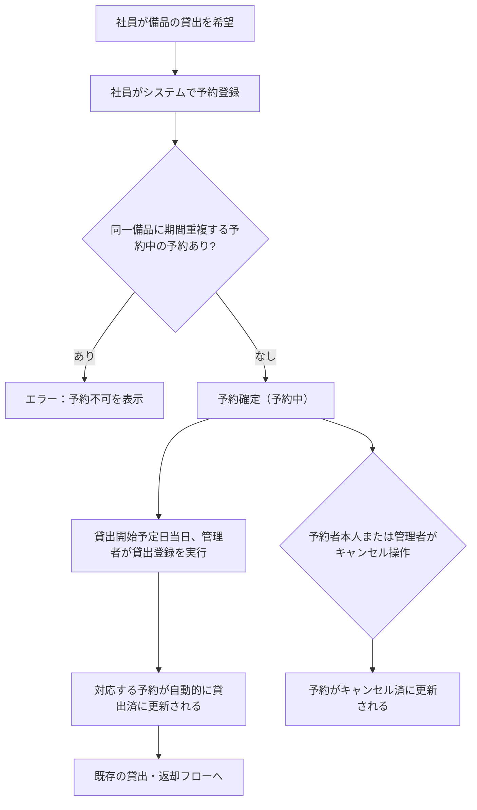
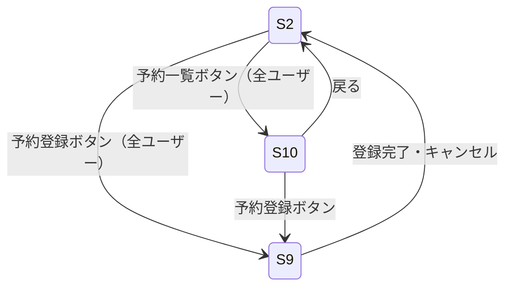
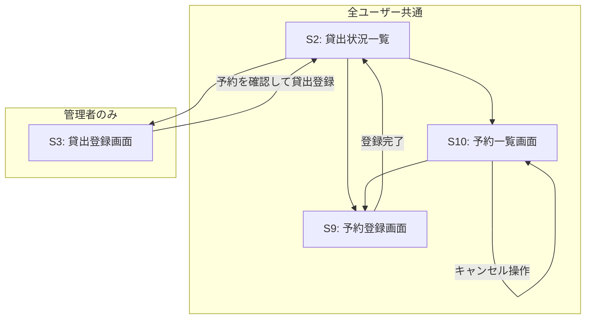
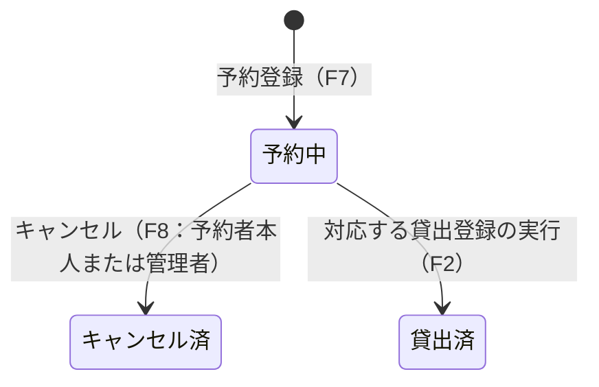

# 備品管理・貸出管理システム 変更要件定義書（貸出予約機能追加）

---

## 1. 目的・前提

### 変更の目的

一般社員が総務担当者に口頭で依頼することなく、システム上から希望する備品の貸出を事前に予約できる仕組みを提供する。

### 解決すべき課題

| 課題ID | 業務課題 | 現状 | KPI（目標） |
|--------|----------|------|-------------|
| C2 | 口頭・メール等での予約依頼により、管理者の把握漏れや二重予約が発生している | 予約の仕組みがシステム化されておらず、管理者がアドホックな依頼を管理しきれない | システム上での予約登録率100%（口頭依頼件数0件/月） |

### 用語集（追加）

| 用語 | 定義 |
|------|------|
| 予約 | 全ユーザーが、将来の貸出開始予定日・返却予定日を指定して備品の使用を事前に確保すること。申請即確定（管理者承認不要） |
| 予約者 | 予約を登録したユーザー |
| 貸出開始予定日 | 予約で指定した備品を受け取る予定の日付 |
| 返却予定日 | 予約で指定した備品を返却する予定の日付 |

---

## 2. 業務

### 対象業務の追加

| # | 業務名 | 担当者 |
|---|--------|--------|
| B5 | 貸出予約登録・キャンセル | 全ユーザー（管理者・一般社員） |

### 業務フロー（追加分）



### 業務の範囲・担当者

| 担当者 | 追加担当業務 |
|--------|-------------|
| 一般社員 | 予約の登録、自分の予約の閲覧・キャンセル |
| 管理者（総務担当者） | 全予約の閲覧、任意の予約のキャンセル、予約に基づく貸出登録 |

### 業務課題・KPI

| 課題ID | 業務課題 | 現状 | KPI（目標） |
|--------|----------|------|-------------|
| C2 | 口頭・メール等での予約依頼による管理者の把握漏れ・二重予約 | 予約の仕組みがシステム化されていない | システム上での予約登録率100%（口頭依頼件数0件/月） |

### 解決すべき課題と対応方針

| 課題ID | 対応方針 |
|--------|----------|
| C2 | 全ユーザーがシステム上から直接予約を登録できる画面を提供し、管理者も全予約を一覧で把握できるようにする。同一備品の予約期間重複チェックをシステムが自動で行い、二重予約を防止する |

### 見込み経営効果

| 効果区分 | 内容 |
|----------|------|
| Soft Saving（人件費削減） | 管理者が口頭・メールでの予約依頼対応に費やす工数の削減 |
| Cost Avoidance（コスト回避） | 二重予約・予約漏れによる業務トラブルの抑制 |

---

## 3. 機能要件

### 機能一覧（追加・変更）

| 機能ID | 機能名 | 種別 | 対応課題 | この機能がない場合の問題 |
|--------|--------|------|---------|--------------------------|
| F7 | 予約登録 | 追加 | C2 | 社員がシステム上で予約できず課題が解消されない |
| F8 | 予約キャンセル | 追加 | C2 | 不要になった予約を取り消せず他の社員の予約が不可のまま残る |
| F9 | 予約一覧表示 | 追加 | C2 | 管理者・社員が予約状況を把握できず課題が解消されない |
| F2（変更） | 貸出登録 | 変更 | C2 | 貸出登録時に対応する予約を自動的に貸出済にできず予約状態が正確でなくなる |

### 入力データ

| データ | 入力者 | 入力方法 |
|--------|--------|---------|
| 予約情報（備品、貸出開始予定日、返却予定日） | 全ユーザー | 画面選択・手入力 |

### 出力データ

| データ | 出力先 |
|--------|--------|
| 予約一覧（備品名・予約者氏名・貸出開始予定日・返却予定日・状態） | 画面表示 |

### 外部連携

なし（既存要件に準拠）

### 全画面仕様（追加・変更）

| 画面ID | 画面名 | 利用者 | 種別 | 主な操作・表示内容 |
|--------|--------|--------|------|-------------------|
| S9 | 予約登録画面 | 全ユーザー | 追加 | 備品選択（全備品から選択可）、貸出開始予定日・返却予定日入力、登録ボタン、キャンセルボタン |
| S10 | 予約一覧画面 | 全ユーザー | 追加 | 予約一覧の表示（一般社員は自分の予約のみ、管理者は全予約）、各予約のキャンセルボタン（予約中のもののみ） |
| S2（変更） | 貸出状況一覧画面 | 全ユーザー | 変更 | 既存表示に加え、予約一覧画面（S10）への遷移ボタンおよび予約登録画面（S9）への遷移ボタンを追加 |
| S3（変更） | 貸出登録画面 | 管理者 | 変更 | 既存の操作に加え、選択した備品の「予約中」の予約を表示し確認した上で貸出登録が可能 |

#### S9 予約登録画面（モックアップ）

```
+---------------------------------------------+
|  予約登録               [← 一覧に戻る]        |
+---------------------------------------------+
|                                             |
|  備品選択   [ ノートPC                 ▼ ]   |
|                                             |
|  貸出開始予定日  [ 2026/04/10          ]     |
|                                             |
|  返却予定日      [ 2026/04/12          ]     |
|                                             |
|          [キャンセル]   [  予約する  ]        |
|                                             |
|  ※ 予約期間が他の予約と重複する場合は登録不可  |
+---------------------------------------------+
```

#### S10 予約一覧画面（モックアップ・管理者）

```
+------------------------------------------------------------------+
|  予約一覧                             [+ 予約を登録する]           |
+------------------------------------------------------------------+
|  +----------+-----------+------------+------------+--------+     |
|  | 備品名    | 予約者     | 貸出開始日  | 返却予定日  | 状態   |     |
|  +----------+-----------+------------+------------+--------+     |
|  | ノートPC  | 山田太郎   | 2026/04/10 | 2026/04/12 | 予約中 |[取消]|
|  | カメラ    | 鈴木花子   | 2026/04/15 | 2026/04/16 | 予約中 |[取消]|
|  +----------+-----------+------------+------------+--------+     |
|   ※ 自分の予約のみ表示（一般社員の場合）                           |
+------------------------------------------------------------------+
```

### 画面遷移（追加・変更分）



### ユーザー利用フロー（追加・変更分）



### 業務フローとの対応関係（追加分）

| 業務フローステップ | 対応機能ID | 対応画面 |
|-------------------|-----------|---------|
| 社員が予約登録 | F7 | S9 |
| 予約の閲覧・キャンセル | F8, F9 | S10 |
| 管理者が予約に基づき貸出登録 | F2（変更） | S3 |

---

## 4. データ

### 業務エンティティ（追加）

| エンティティ | 種別 | 主な属性 | 登録 | 参照 | 更新 | 削除 | 一覧 | 状態管理 |
|-------------|------|---------|------|------|------|------|------|---------|
| 予約 | 内部データ | 予約ID、備品、予約者、貸出開始予定日、返却予定日、状態 | ○（F7） | ○（F9） | ○（キャンセル・貸出済への状態変更のみ） | × | ○ | 予約中 / キャンセル済 / 貸出済 |

### 予約の状態遷移



### 業務制約（追加）

| 制約 | 内容 |
|------|------|
| 重複予約禁止 | 同一備品に対して、貸出開始予定日〜返却予定日が既存の「予約中」の予約期間と1日でも重複する場合は新規予約を拒否する |
| 過去日付禁止 | 貸出開始予定日は予約登録日以降の日付でなければならない |
| 返却予定日制約 | 返却予定日は貸出開始予定日以降の日付でなければならない |
| 自分の予約のみキャンセル可（一般社員） | 一般社員は自分が登録した予約のみキャンセルできる。管理者は全予約をキャンセルできる |

### データ保持期間

| エンティティ | 保持期間 |
|-------------|---------|
| 予約 | 無期限（キャンセル済・貸出済も保持） |

### 外部DB接続先

なし（システム内部DBのみ使用、既存要件に準拠）

---

## 5. 非機能要件

既存の非機能要件から変更なし。

---

## 要件網羅性チェック

### エンティティ網羅確認

| エンティティ | 登録 | 参照（一覧） | 更新 | 削除 | 状態遷移定義 |
|-------------|------|-------------|------|------|------------|
| 予約 | F7/S9 | F9/S10 | F8（キャンセル）、F2（貸出済） | 削除なし | ○（予約中 / キャンセル済 / 貸出済） |

### 機能カテゴリ網羅確認

| カテゴリ | 対応機能 |
|---------|---------|
| 業務機能（追加） | F7 予約登録、F8 予約キャンセル、F9 予約一覧 |
| 既存機能の変更 | F2 貸出登録（対応する予約を貸出済に自動更新する処理を追加） |
| マスタ管理 | 変更なし |
| 共通（認証・認可） | 変更なし（予約操作は認証済み全ユーザーが対象、キャンセルは既存の認可ルールに準拠） |
| 外部連携 | なし |

### MVPから除外した要件

| 除外要件 | 除外理由 |
|---------|---------|
| 予約通知（メール等） | 外部連携なし（既存要件に準拠）、課題解決に不要 |
| 予約の変更（日付・備品の修正） | キャンセル後に再予約で対応可能であり最小構成で課題解決できる |
| 管理者による承認フロー | 申請即確定（自動承認）のため不要 |
| 現在の貸出（status=loaned）との期間重複チェック | 既存貸出の返却日が未定のためチェック不可、予約同士の重複チェックのみで課題解決できる |
