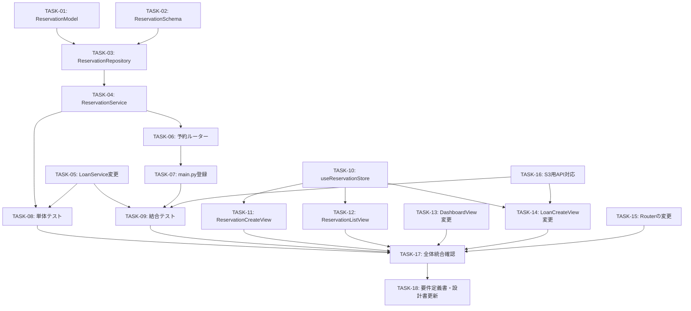

# 実装タスク一覧（貸出予約機能追加）

> 変更要件定義書: `.history/20260329-貸出予約機能追加/change_requirements.md`
> 変更設計書: `.history/20260329-貸出予約機能追加/change_detail_design.md`

---

## タスク一覧

### TASK-01: ReservationModel の作成

- **対象ファイル**: `backend/app/models/reservation.py` （新規作成）
- **作業内容**: 変更設計書「3. データベース設計」に従い、ReservationModelをSQLAlchemy ORMで定義する。equipment・userへのFKリレーション、status CHECK制約を含める。
- **完了条件**:
  - ReservationModelクラスが定義されていること
  - `backend/app/models/__init__.py` にReservationModelがインポートされていること
  - `docker compose up --build` 後にreservationsテーブルが自動作成されること（`docker compose exec db psql -U postgres -d equipment_db -c "\dt"` で確認）
- **バリデーションタスク**: Docker起動後にテーブルが存在することをSQLで確認する

---

### TASK-02: ReservationスキーマPydantic の作成

- **対象ファイル**: `backend/app/schemas/reservation.py` （新規作成）
- **作業内容**: 変更設計書「6. クラス設計」に従い、`ReservationCreate`、`ReservationResponse` スキーマを定義する。
  - `ReservationCreate`: equipment_id (int), planned_start_date (date), planned_return_date (date)
  - `ReservationResponse`: id, equipment_id, equipment_name, user_id, user_name, planned_start_date, planned_return_date, status, created_at
- **完了条件**:
  - 両スキーマクラスが定義されていること
  - `backend/app/schemas/__init__.py` にインポートされていること
- **バリデーションタスク**: Python構文エラーが発生しないこと（`docker compose exec backend python -c "from app.schemas.reservation import ReservationCreate, ReservationResponse"` で確認）

---

### TASK-03: ReservationRepository の作成

- **対象ファイル**: `backend/app/repositories/reservation.py` （新規作成）
- **作業内容**: 変更設計書「6. クラス設計」に従い、ReservationRepositoryをBaseRepositoryを継承して作成する。以下のメソッドを実装する。
  - `get_by_user_id(user_id)`: 指定user_idで絞り込んで全件取得
  - `get_pending_by_equipment(equipment_id)`: status='pending'かつ指定equipment_idの予約を取得
  - `check_overlap(equipment_id, start_date, end_date)`: status='pending'の予約の中にstart〜endと1日でも重複するものがあるかSELECT FOR UPDATEで確認。重複条件: `start_date <= planned_return_date AND end_date >= planned_start_date`
  - `cancel(id)`: 対象のstatusを'cancelled'にUPDATE
  - `mark_as_loaned(equipment_id)`: 対象備品のpending予約(最古の1件)のstatusを'loaned'にUPDATE
- **完了条件**: 全メソッドが実装されていること
- **バリデーションタスク**: `docker compose exec backend python -c "from app.repositories.reservation import ReservationRepository"` でインポートエラーが発生しないこと

---

### TASK-04: ReservationService の作成

- **対象ファイル**: `backend/app/services/reservation.py` （新規作成）
- **作業内容**: 変更設計書「6. クラス設計」に従い、ReservationServiceを作成する。以下のメソッドを実装する。
  - `get_reservations(current_user)`: 管理者は全件、一般社員は自身のみ
  - `create_reservation(data, current_user)`:
    1. planned_start_date が本日以降であることを検証（違反は422）
    2. planned_return_date が planned_start_date 以降であることを検証（違反は422）
    3. 備品の存在確認（EquipmentRepositoryのget_by_id使用、なければ404）
    4. check_overlap で重複チェック（重複あれば409）
    5. 予約をINSERT（user_id=current_user.id, status='pending'）
  - `cancel_reservation(id, current_user)`:
    1. 予約の取得（SELECT FOR UPDATE、なければ404）
    2. 一般社員の場合は自身の予約か確認（違反は403）
    3. status が 'pending' であることを確認（違反は409）
    4. statusを'cancelled'にUPDATE
- **完了条件**: 全メソッドが実装されていること
- **バリデーションタスク**: 単体テストUT-23〜UT-36が全て通ること（テストコードはTASK-08で作成）

---

### TASK-05: LoanService の変更

- **対象ファイル**: `backend/app/services/loan.py` （変更）
- **作業内容**: 変更設計書「6. クラス設計」に従い、`create_loan` メソッドを変更する。
  - コンストラクタにReservationRepositoryへの依存を追加する
  - `create_loan` の処理フロー末尾（COMMIT前）に、`ReservationRepository.mark_as_loaned(equipment_id)` を呼び出す処理を追加する
- **完了条件**:
  - LoanServiceのcreate_loanが正常に完了したとき、対応するpending予約のstatusが'loaned'に更新されること
  - 対応するpending予約が存在しない場合でも、貸出登録が正常に完了すること（エラーが発生しないこと）
- **バリデーションタスク**: 単体テストUT-37, UT-38が通ること

---

### TASK-06: 予約ルーターの作成

- **対象ファイル**: `backend/app/routers/reservation.py` （新規作成）
- **作業内容**: 変更設計書「4. 外部設計」のAPI仕様に従い、3つのエンドポイントを実装する。
  - `POST /api/reservations/`: 全認証済みユーザー向け。ReservationServiceのcreate_reservationを呼び出す。
  - `GET /api/reservations/`: 全認証済みユーザー向け。ReservationServiceのget_reservationsを呼び出す。
  - `PUT /api/reservations/{id}/cancel`: 全認証済みユーザー向け。ReservationServiceのcancel_reservationを呼び出す。
- **完了条件**: 3エンドポイントが定義されていること。CommonDependenciesのget_current_userを認証に使用していること（require_adminは使用しない）。
- **バリデーションタスク**: 結合テストIT-25〜IT-38が全て通ること（テストコードはTASK-09で作成）

---

### TASK-07: main.py へのルーター登録

- **対象ファイル**: `backend/app/main.py` （変更）
- **作業内容**: `reservation_router` を `app.include_router` でFastAPIアプリに登録する。プレフィックスは `/api/reservations`、タグは `reservations` とする。
- **完了条件**: `docker compose up --build` 後に `/api/reservations/` エンドポイントが `http://localhost/api/reservations/` でアクセス可能であること（401が返ること）
- **バリデーションタスク**: `curl -i http://localhost/api/reservations/` が401を返すこと

---

### TASK-08: 単体テストの追加

- **対象ファイル**:
  - `tests/unit/backend/test_reservation_service.py` （新規作成）
  - `tests/unit/backend/test_loan_service.py` （変更、UT-37・UT-38を追加）
- **作業内容**: 変更設計書「11. テスト設計」の単体テストケース（UT-23〜UT-38）を全て実装する。
- **完了条件**: UT-23〜UT-38が全て pass すること
- **バリデーションタスク**: `docker compose exec backend pytest tests/unit/ -v` を実行し、全テストがpassすること

---

### TASK-09: 結合テストの追加

- **対象ファイル**:
  - `tests/integration/backend/test_reservation_api.py` （新規作成）
  - `tests/integration/backend/test_loan_api.py` （変更、IT-39・IT-40を追加）
- **作業内容**: 変更設計書「11. テスト設計」の結合テストケース（IT-25〜IT-40）を全て実装する。
- **完了条件**: IT-25〜IT-40が全て pass すること
- **バリデーションタスク**: `docker compose exec backend pytest tests/integration/ -v` を実行し、全テストがpassすること

---

### TASK-10: useReservationStore の作成

- **対象ファイル**: `frontend/src/stores/reservation.js` （新規作成）
- **作業内容**: Piniaストアとして、以下のAPI呼び出しメソッドと状態を定義する。
  - state: `reservations`（予約一覧）、`loading`、`error`
  - actions:
    - `fetchReservations()`: GET /api/reservations/ を呼び出し、reservationsを更新する
    - `createReservation(data)`: POST /api/reservations/ を呼び出す
    - `cancelReservation(id)`: PUT /api/reservations/{id}/cancel を呼び出す
    - `fetchPendingByEquipment(equipmentId)`: GET /api/reservations/?equipment_id={id}... ※ S3用に選択備品のpending予約を取得する（バックエンドAPIのフィルタ方式はTASK-06の実装に合わせる）
- **完了条件**: 全ActionがapiClientを通してAPIを呼び出すこと。Viewから直接axiosを使用しないこと。
- **バリデーションタスク**: ESLint/Vue構文エラーがないこと

---

### TASK-11: ReservationCreateView（S9）の作成

- **対象ファイル**: `frontend/src/views/ReservationCreateView.vue` （新規作成）
- **作業内容**: 変更設計書「4. 外部設計」のS9モックアップに従い、予約登録画面を実装する。
  - 全備品の選択（useEquipmentStoreから一覧取得）
  - 貸出開始予定日・返却予定日の入力（Vuetifyのv-text-fieldまたはv-date-picker）
  - 「予約する」ボタン押下でuseReservationStore.createReservationを呼び出す
  - 成功時はS10（/reservations）へ遷移する
  - バリデーションエラー・409エラーはスナックバーで表示する
- **完了条件**: モックアップ通りの画面が表示されること
- **バリデーションタスク**: 正常な入力で予約が登録でき、S10に遷移すること。過去日付入力時にエラーが表示されること。

---

### TASK-12: ReservationListView（S10）の作成

- **対象ファイル**: `frontend/src/views/ReservationListView.vue` （新規作成）
- **作業内容**: 変更設計書「4. 外部設計」のS10モックアップに従い、予約一覧画面を実装する。
  - 画面表示時にuseReservationStore.fetchReservationsを呼び出す
  - 管理者: 備品名・予約者名・貸出開始日・返却予定日・状態・操作（取消ボタン）を表示
  - 一般社員: 備品名・貸出開始日・返却予定日・状態・操作（取消ボタン）を表示（予約者列は非表示）
  - 「取消」ボタンはstatus='pending'の行にのみ表示する
  - 取消操作ではuseReservationStore.cancelReservationを呼び出す
  - 右上に「予約を登録する」ボタンを配置し、S9に遷移する
- **完了条件**: モックアップ通りの画面が表示されること。一般社員で他ユーザーの予約が表示されないこと。
- **バリデーションタスク**: 一般社員でログインして予約一覧を確認し、自身の予約のみ表示されること。管理者で全予約が表示されること。

---

### TASK-13: DashboardView（S2）の変更

- **対象ファイル**: `frontend/src/views/DashboardView.vue` （変更）
- **作業内容**: 変更設計書「4. 外部設計」のS2変更後モックアップに従い、ボタンを追加する。
  - 全ユーザー（admin・general共通）に「予約一覧」ボタン（/reservationsへ遷移）を追加する
  - 全ユーザーに「予約登録」ボタン（/reservations/createへ遷移）を追加する
  - 管理者向けの既存ボタン（貸出登録・返却登録・備品管理・ユーザー管理）は変更しない
- **完了条件**: 一般社員でログインして「予約一覧」「予約登録」ボタンがS2に表示されること
- **バリデーションタスク**: 一般社員のS2に2ボタンが表示されること。管理者のS2に既存4ボタン＋新規2ボタンが全て表示されること。

---

### TASK-14: LoanCreateView（S3）の変更

- **対象ファイル**: `frontend/src/views/LoanCreateView.vue` （変更）
- **作業内容**: 変更設計書「4. 外部設計」のS3変更後モックアップに従い、予約一覧表示エリアを追加する。
  - 備品選択ドロップダウンの変更イベントで、useReservationStoreを通じて選択備品のpending予約を取得する
  - 取得した予約をテーブル形式（予約者名・貸出開始予定日・返却予定日・状態）で備品選択の下に表示する
  - pending予約がない場合は「この備品の予約はありません」と表示する
- **完了条件**: 備品を選択した際に、その備品のpending予約一覧が表示されること
- **バリデーションタスク**: 予約済みの備品をS3で選択したとき、予約者名と日程が表示されること

---

### TASK-15: Vue Routerの変更

- **対象ファイル**: `frontend/src/router/index.js` （変更）
- **作業内容**: 変更設計書「ソースコード構成」に従い、2つのルートを追加する。
  - `{ path: '/reservations', component: ReservationListView, meta: { requiresAuth: true } }`
  - `{ path: '/reservations/create', component: ReservationCreateView, meta: { requiresAuth: true } }`
  - 既存のナビゲーションガード（requiresAdmin: trueのルートへのアクセス制御）は変更しない
- **完了条件**: /reservations と /reservations/create に认証済みユーザーがアクセスできること。未認証でアクセスするとログイン画面へリダイレクトされること。
- **バリデーションタスク**: 未ログイン状態で /reservations にアクセスするとログイン画面にリダイレクトされること（ST-23）

---

### TASK-16: S3用予約取得APIエンドポイントの対応

- **対象ファイル**: `backend/app/routers/reservation.py`（TASK-06で作成済みの場合は変更）
- **作業内容**: LoanCreateView（S3）から特定備品のpending予約を取得するためのAPI対応を確認・実装する。  
  - GET /api/reservations/ にクエリパラメータ `equipment_id` を追加し、指定した場合は当該備品のpending予約のみを返すようにする。
  - または GET /api/reservations/pending/{equipment_id} などの専用エンドポイントを追加する（いずれか設計に整合する方を選択する）。
  - 管理者のみアクセス可とする（S3は管理者専用画面のため）。
- **完了条件**: S3で備品を選択したとき、バックエンドから当該備品のpending予約が取得できること
- **バリデーションタスク**: 管理者トークンで対象APIを呼び出し、pending予約のみが返ること

---

### TASK-17: 全体統合確認

- **作業内容**: TASK-01〜16が全て完了した後、システム全体を起動してシステムテストケースを手動で実行する。
- **確認対象テストケース（変更設計書 ST-15〜ST-23）**:
  - ST-15: 一般社員が予約登録でき、S10に「予約中」で表示されること
  - ST-16: 期間重複する予約が登録エラーになること
  - ST-17: 一般社員が自身の予約をキャンセルできること
  - ST-18: 一般社員のS10に他社員の予約が表示されないこと
  - ST-19: 管理者のS10に全社員の予約が表示されること
  - ST-20: 管理者が他ユーザーの予約をキャンセルできること
  - ST-21: S3で備品選択後にpending予約一覧が表示されること
  - ST-22: 貸出登録後にpending予約が「貸出済」に更新されること
  - ST-23: 未ログイン状態で /reservations にアクセスするとログイン画面にリダイレクトされること
- **加えて既存テストが全て通ることを確認する（ST-01〜ST-14が回帰しないこと）**
- **完了条件**: ST-01〜ST-23が全て正常に動作すること。単体テスト・結合テストが全て pass すること。
- **バリデーションタスク**: `docker compose exec backend pytest tests/ -v` で全テストがpassすること

---

### TASK-18: 要件定義書・設計書の更新

> **このタスクはTASK-17（全体統合確認）完了後に実施すること**

- **対象ファイル**:
  - `docs/requirements.md` （変更）
  - `docs/detail_design.md` （変更）
- **作業内容**: `change_requirements.md` と `change_detail_design.md` の内容を既存文書に反映する。
  - `docs/requirements.md` への反映内容:
    - 用語集に「予約」「予約者」「貸出開始予定日」「返却予定日」を追加
    - 対象業務一覧にB5を追加
    - 業務フローに予約フローを追加
    - 機能一覧にF7・F8・F9を追加、F2に変更を記載
    - 画面一覧にS9・S10を追加、S2・S3の変更を記載
    - 業務エンティティ一覧に「予約」を追加
    - 業務課題・KPIにC2を追加
    - MVPから除外した要件を更新
  - `docs/detail_design.md` への反映内容:
    - DBテーブル一覧・テーブル定義・ER図にreservationsテーブルを追加
    - 画面一覧・モックアップ・画面遷移図にS9・S10追加とS2・S3変更を反映
    - API仕様に予約APIを追加、貸出APIの変更を記載
    - 内部設計に予約登録・キャンセル処理フロー、変更後貸出登録フローを追加
    - トランザクション設計・排他制御に予約処理分を追加
    - クラス設計に追加・変更クラスを追記
    - エラーハンドリング一覧に追加分を反映
    - セキュリティ設計に追加分を反映
    - ソースコード構成（ディレクトリ・ファイル一覧）に追加・変更ファイルを反映
    - テスト設計にUT-23〜UT-38・IT-25〜IT-40・ST-15〜ST-23を追加
- **完了条件**: docs/requirements.md と docs/detail_design.md に変更内容が漏れなく反映されていること
- **バリデーションタスク**: 変更後の設計書を読み、change_requirements.mdおよびchange_detail_design.mdの全変更点と矛盾がないことを確認すること

---

## タスク実行順序

