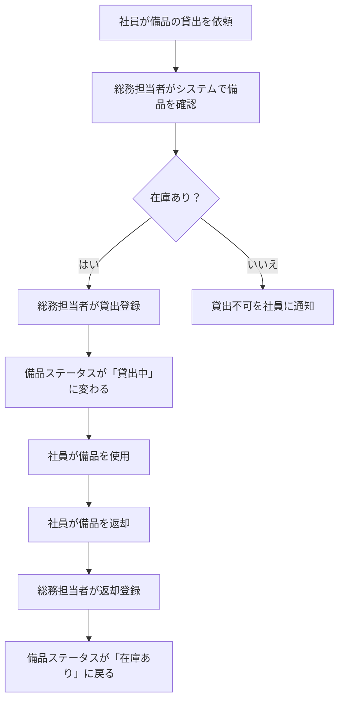
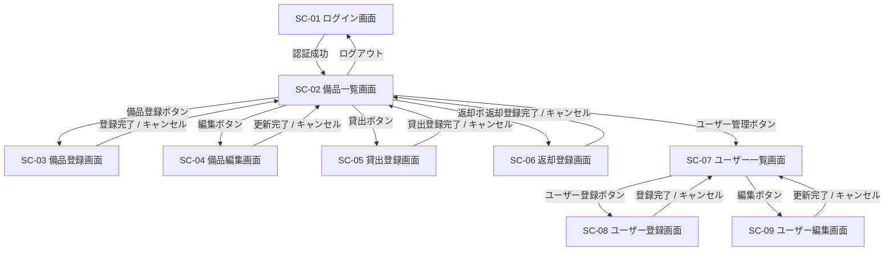
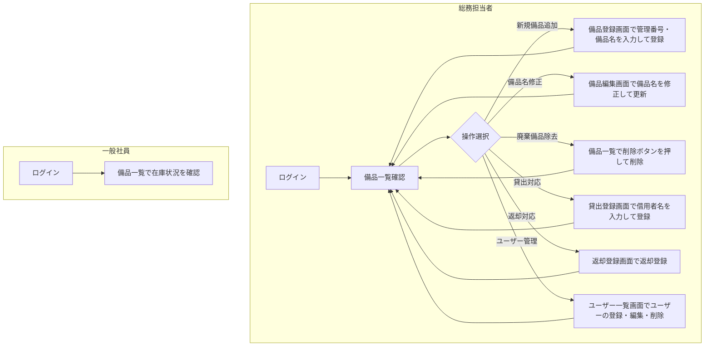
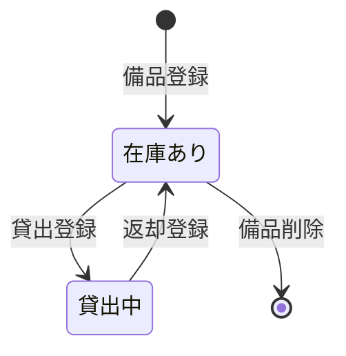
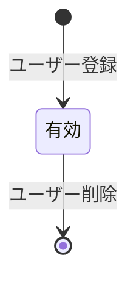

# 要件定義書：備品管理・貸出管理Webアプリ

## 1. 目的・前提

### システム目的

会社のオフィス備品（PC・プロジェクター等）の貸出状況をリアルタイムで可視化し、「誰が何を借りているか分からない」という課題を解消する。総務担当者が貸出・返却をシステムに登録し、全社員が最新の在庫状況を確認できるWebアプリを提供する。

### インターフェース

GUI（Webアプリ、PCブラウザのみ対応）

### 用語集

| 用語 | 定義 |
|------|------|
| 備品 | 会社が所有する貸出対象の物品（PC、プロジェクター等） |
| 管理番号 | 備品を一意に識別する番号（例：PC-001） |
| 総務担当者 | 備品の登録・貸出・返却操作を行う権限を持つユーザー |
| 一般社員 | 備品一覧の閲覧のみ可能なユーザー |
| 在庫あり | 備品が返却済みで貸出可能な状態 |
| 貸出中 | 備品が誰かに貸し出されており貸出不可な状態 |

---

## 2. 業務

### 対象業務一覧

| # | 業務名 | 担当者 |
|---|--------|--------|
| 1 | 備品マスタ管理 | 総務担当者 |
| 2 | 貸出登録 | 総務担当者 |
| 3 | 返却登録 | 総務担当者 |
| 4 | 備品在庫状況確認 | 一般社員・総務担当者 |

### 業務フロー

### 業務課題・KPI

| 課題 | 現状 | 目標KPI |
|------|------|---------|
| 誰が何を借りているか把握できない | Excelで管理、更新漏れが発生 | 貸出状況の確認時間：5分 → 30秒以内 |
| 貸出中の備品に重複貸出が発生する | ステータス管理が属人的 | 重複貸出件数：ゼロ |

### 解決方針

- 備品ごとにステータス（在庫あり／貸出中）をシステムで一元管理する
- 貸出登録時に借用者名を記録し、誰が借りているかを常に参照可能にする
- 貸出中の備品は再貸出できないようにシステムで制御する

### 見込み経営効果

| 効果区分 | 内容 |
|----------|------|
| Soft Saving（人件費削減） | 総務担当者の備品確認・問い合わせ対応工数の削減（推定：月2〜3時間/人） |
| Cost Avoidance | 重複貸出・紛失リスクの低減による備品の無駄な再購入防止 |

---

## 3. 機能要件

### 機能一覧

| # | 機能カテゴリ | 機能名 | 対応業務課題 | この機能が無いと何が困るか |
|---|-------------|--------|-------------|--------------------------|
| F-01 | マスタ管理 | 備品登録 | 備品の一元管理 | 管理対象備品をシステムに登録できない |
| F-02 | マスタ管理 | 備品編集 | 備品の一元管理 | 備品名の誤りを修正できない |
| F-03 | マスタ管理 | 備品削除 | 備品の一元管理 | 廃棄した備品をシステムから除去できない |
| F-04 | 業務機能 | 貸出登録 | 重複貸出防止・貸出状況把握 | 誰が借りているか記録できない |
| F-05 | 業務機能 | 返却登録 | 貸出状況把握 | 返却後もステータスが「貸出中」のままになる |
| F-06 | 業務機能 | 備品一覧表示 | 貸出状況把握 | 現在の在庫状況を確認できない |
| F-07 | 共通 | ログイン | アクセス制限 | 誰でも貸出・返却操作ができてしまう |
| F-08 | 共通 | ログアウト | アクセス制限 | セッションを終了できない |
| F-09 | マスタ管理 | ユーザー登録 | アクセス制限 | 新しい総務担当者・社員のアカウントを作成できない |
| F-10 | マスタ管理 | ユーザー編集 | アクセス制限 | ユーザー名やロールの誤りを修正できない |
| F-11 | マスタ管理 | ユーザー削除 | アクセス制限 | 退職者のアカウントを削除できず不正アクセスのリスクが残る |
| F-12 | マスタ管理 | ユーザー一覧表示 | アクセス制限 | 登録済みアカウントを確認できない |

### 入力データ

| データ項目 | 入力元 | 対象機能 |
|-----------|--------|---------|
| 管理番号 | 総務担当者（手入力） | F-01 |
| 備品名 | 総務担当者（手入力） | F-01、F-02 |
| 借用者名 | 総務担当者（手入力） | F-04 |
| ログインID・パスワード | ユーザー（手入力） | F-07 |
| ユーザー名、ログインID、パスワード、ロール | 総務担当者（手入力） | F-09、F-10 |

### 出力データ

| データ項目 | 出力先 | 対象機能 |
|-----------|--------|---------|
| 備品一覧（管理番号・備品名・ステータス・借用者名） | 画面表示 | F-06 |
| ユーザー一覧（ユーザー名・ログインID・ロール） | 画面表示 | F-12 |

### 外部連携

なし

### 全画面仕様

#### 画面一覧

| 画面ID | 画面名 | 利用者 |
|--------|--------|--------|
| SC-01 | ログイン画面 | 全ユーザー |
| SC-02 | 備品一覧画面 | 全ユーザー |
| SC-03 | 備品登録画面 | 総務担当者 |
| SC-04 | 備品編集画面 | 総務担当者 |
| SC-05 | 貸出登録画面 | 総務担当者 |
| SC-06 | 返却登録画面 | 総務担当者 |
| SC-07 | ユーザー一覧画面 | 総務担当者 |
| SC-08 | ユーザー登録画面 | 総務担当者 |
| SC-09 | ユーザー編集画面 | 総務担当者 |

#### SC-01 ログイン画面

- 入力項目：ログインID、パスワード
- 操作：ログインボタン
- バリデーション：未入力時はエラーメッセージを表示する
- 認証失敗時：「IDまたはパスワードが正しくありません」を表示する

#### SC-02 備品一覧画面

- 表示項目：管理番号、備品名、ステータス（在庫あり／貸出中）、借用者名（貸出中の場合のみ）
- 総務担当者向け操作：備品登録ボタン、各備品行の編集ボタン・削除ボタン・貸出ボタン（在庫ありの場合のみ活性）・返却ボタン（貸出中の場合のみ活性）
- 一般社員向け操作：なし（閲覧のみ）

#### SC-03 備品登録画面

- 入力項目：管理番号（必須）、備品名（必須）
- 操作：登録ボタン、キャンセルボタン
- バリデーション：管理番号の重複チェック、未入力チェック

#### SC-04 備品編集画面

- 入力項目：備品名（必須）※管理番号は変更不可
- 操作：更新ボタン、キャンセルボタン
- バリデーション：未入力チェック

#### SC-05 貸出登録画面

- 表示項目：管理番号、備品名（変更不可）
- 入力項目：借用者名（必須）
- 操作：貸出登録ボタン、キャンセルボタン
- バリデーション：未入力チェック

#### SC-06 返却登録画面

- 表示項目：管理番号、備品名、借用者名（変更不可）
- 操作：返却登録ボタン、キャンセルボタン

#### SC-07 ユーザー一覧画面

- 表示項目：ユーザー名、ログインID、ロール（総務担当者／一般社員）
- 操作：ユーザー登録ボタン、各ユーザー行の編集ボタン・削除ボタン
- 制約：自分自身のアカウントは削除できない

#### SC-08 ユーザー登録画面

- 入力項目：ユーザー名（必須）、ログインID（必須）、パスワード（必須）、ロール（必須：総務担当者／一般社員）
- 操作：登録ボタン、キャンセルボタン
- バリデーション：ログインIDの重複チェック、未入力チェック

#### SC-09 ユーザー編集画面

- 入力項目：ユーザー名（必須）、ロール（必須）※ログインIDは変更不可
- 操作：更新ボタン、キャンセルボタン
- バリデーション：未入力チェック

### 画面遷移

### ユーザー利用フロー

---

## 4. データ

### 業務エンティティ一覧

| エンティティ | 属性 | 説明 |
|-------------|------|------|
| 備品 | 管理番号（PK）、備品名、ステータス、借用者名 | 管理対象の物品 |
| ユーザー | ユーザーID（PK）、ユーザー名、ログインID、パスワード（ハッシュ）、ロール | ログインユーザー情報 |

### 備品エンティティの状態遷移

### 備品エンティティのCRUD定義

| 操作 | 機能 | 実行者 |
|------|------|--------|
| Create | 備品登録（F-01） | 総務担当者 |
| Read（一覧） | 備品一覧表示（F-06） | 全ユーザー |
| Update（属性） | 備品編集（F-02） | 総務担当者 |
| Update（状態） | 貸出登録（F-04）、返却登録（F-05） | 総務担当者 |
| Delete | 備品削除（F-03） | 総務担当者 |

### ユーザーエンティティの状態遷移

### ユーザーエンティティのCRUD定義

| 操作 | 機能 | 実行者 |
|------|------|--------|
| Create | ユーザー登録（F-09） | 総務担当者 |
| Read（一覧） | ユーザー一覧表示（F-12） | 総務担当者 |
| Update | ユーザー編集（F-10） | 総務担当者 |
| Delete | ユーザー削除（F-11） | 総務担当者 |

### 内部データ / 外部データ

| 区分 | エンティティ | 保持場所 |
|------|-------------|---------|
| 内部データ | 備品 | システム内部DB |
| 内部データ | ユーザー | システム内部DB |

### データ保持期間

| エンティティ | 保持期間 |
|-------------|---------|
| 備品 | システム運用期間中（削除操作まで） |
| ユーザー | システム運用期間中 |

### 外部DB接続

なし

---

## 5. 非機能要件

### 性能

| 項目 | 要件 |
|------|------|
| 画面応答時間 | 通常操作（一覧表示・登録・更新）は3秒以内 |
| 対象データ量 | 備品数：最大50件程度 |

### 利用人数

| 項目 | 要件 |
|------|------|
| 総ユーザー数 | 総務担当者2〜3名 ＋ 一般社員（社内全員） |
| 同時接続数 | 最大10名程度 |

### セキュリティ

| 項目 | 要件 |
|------|------|
| 認証 | ログインID・パスワードによる認証 |
| 認可 | 総務担当者のみ登録・編集・削除・貸出・返却操作が可能。一般社員は一覧閲覧のみ |
| パスワード保存 | パスワードはハッシュ化して保存する |
| アクセス制限 | 未ログイン状態では備品一覧画面を含む全画面にアクセスできない |
