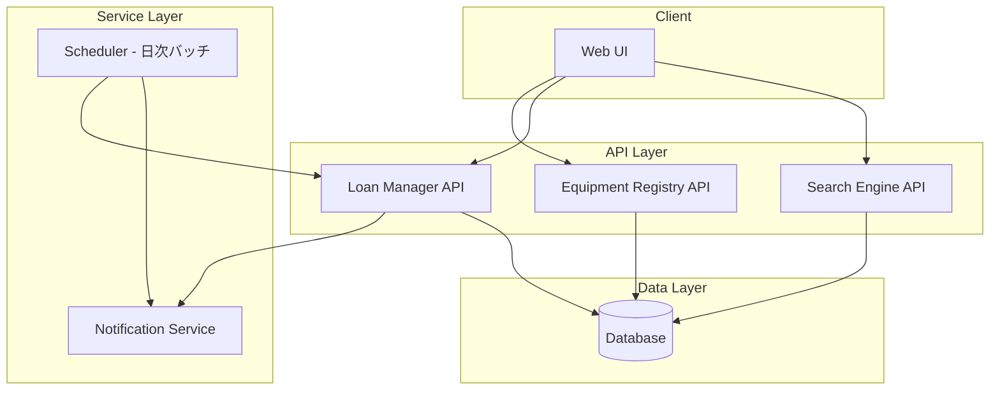
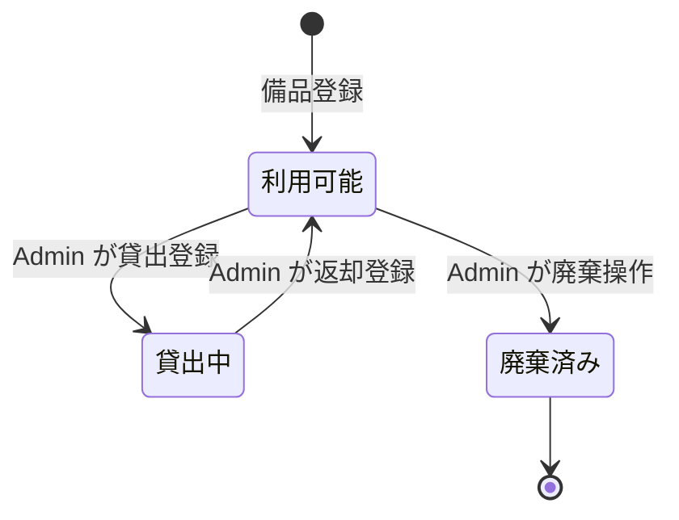

# 設計ドキュメント: 備品管理・貸出管理アプリ

## Overview

本アプリは、社内の備品（オフィス用品・PC・プロジェクターなど）を一元管理し、管理者（Admin）が貸出・返却を登録するシステムです。

主な機能:
- 備品の登録・編集・廃棄（論理削除）
- 備品の検索・一覧表示
- 管理者による貸出・返却登録
- 貸出履歴の確認
- 返却期限超過の通知

**スコープの制約（ユーザー指定）:**
- 貸出・返却の登録は Admin のみ実施（一般 User は申請不可）
- メンテナンス機能は対象外
- `Equipment_Status` は `利用可能 / 貸出中 / 廃棄済み` の3種類のみ

---

## Architecture

### システム構成



### 認証・認可

- JWT ベースの認証
- ロール: `USER` / `ADMIN`
- 貸出・返却・備品登録・編集・廃棄は `ADMIN` ロールのみ許可
- 検索・一覧・履歴参照は `USER` / `ADMIN` 両方許可

---

## Components and Interfaces

### Equipment Registry

備品の CRUD を担当するモジュール。

| エンドポイント | メソッド | 権限 | 説明 |
|---|---|---|---|
| `/equipments` | GET | USER, ADMIN | 一覧取得（ページネーション） |
| `/equipments` | POST | ADMIN | 備品登録 |
| `/equipments/{id}` | GET | USER, ADMIN | 備品詳細取得 |
| `/equipments/{id}` | PUT | ADMIN | 備品情報更新 |
| `/equipments/{id}` | DELETE | ADMIN | 備品廃棄（論理削除） |

### Loan Manager

貸出・返却処理と履歴管理を担当するモジュール。

| エンドポイント | メソッド | 権限 | 説明 |
|---|---|---|---|
| `/loans` | POST | ADMIN | 貸出登録 |
| `/loans/{id}/return` | POST | ADMIN | 返却登録 |
| `/loans/user/{userId}` | GET | USER, ADMIN | ユーザー別貸出履歴 |
| `/loans/equipment/{equipmentId}` | GET | ADMIN | 備品別貸出履歴 |

### Search Engine

備品の検索・フィルタリングを担当するモジュール。

| エンドポイント | メソッド | 権限 | 説明 |
|---|---|---|---|
| `/equipments/search` | GET | USER, ADMIN | キーワード・カテゴリ・ステータスで検索 |

クエリパラメータ: `q` (キーワード), `category`, `status`, `page`, `size`

### Notification Service

通知送信を担当するモジュール（内部サービス）。

- `sendReturnReminder(userId, loanRecord)` — 返却期限前日通知
- `sendOverdueNotification(userId, loanRecord)` — 返却期限超過通知

### Scheduler

日次バッチ処理（毎日 AM 9:00 実行）。

- 返却予定日が翌日の Loan_Record を取得 → 前日リマインダー送信
- 返却予定日を過ぎた未返却の Loan_Record を取得 → 超過通知送信

---

## Data Models

### Equipment

```typescript
interface Equipment {
  id: string;                  // 一意のシステムID (UUID)
  assetNumber: string;         // 管理番号（一意）
  name: string;                // 備品名
  category: string;            // カテゴリ
  quantity: number;            // 数量
  status: EquipmentStatus;     // 現在のステータス
  createdAt: Date;             // 登録日時
  updatedAt: Date;             // 更新日時
}

enum EquipmentStatus {
  AVAILABLE = "利用可能",
  ON_LOAN   = "貸出中",
  DISPOSED  = "廃棄済み",
}
```

### LoanRecord

```typescript
interface LoanRecord {
  id: string;              // 一意のID (UUID)
  equipmentId: string;     // 対象備品ID
  userId: string;          // 貸出者のUser ID
  loanDate: Date;          // 貸出日
  dueDate: Date;           // 返却予定日
  returnedAt: Date | null; // 返却日時（未返却の場合 null）
  createdAt: Date;         // レコード作成日時
}
```

### User（参照用）

```typescript
interface User {
  id: string;
  name: string;
  email: string;
  role: "USER" | "ADMIN";
}
```

### ステータス遷移



> 注: 要件定義書の要件7（メンテナンス中ステータス）はスコープ外のため、ステータス遷移から除外しています。

---
