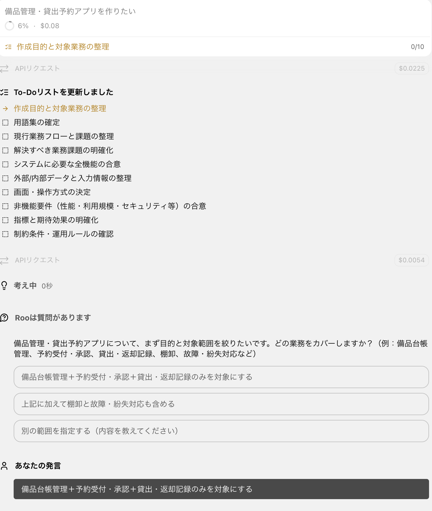
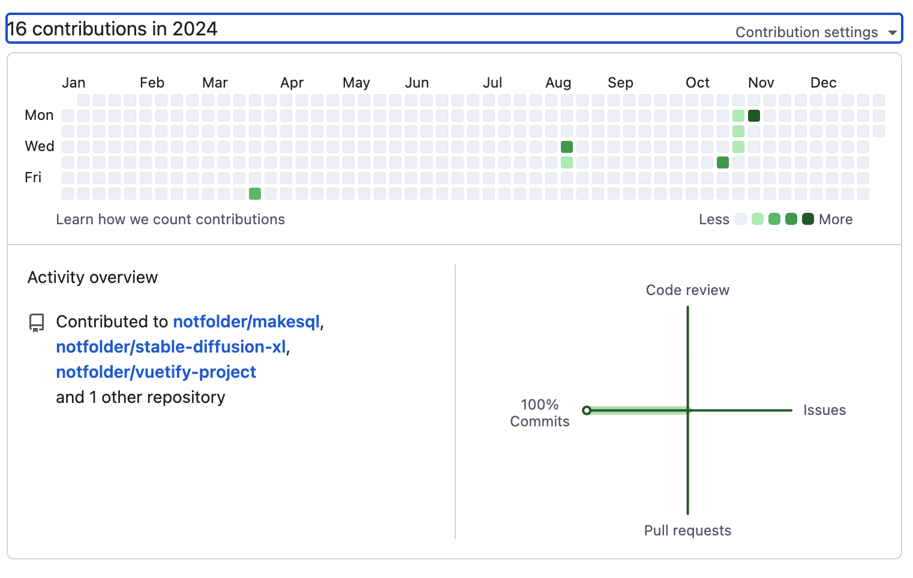
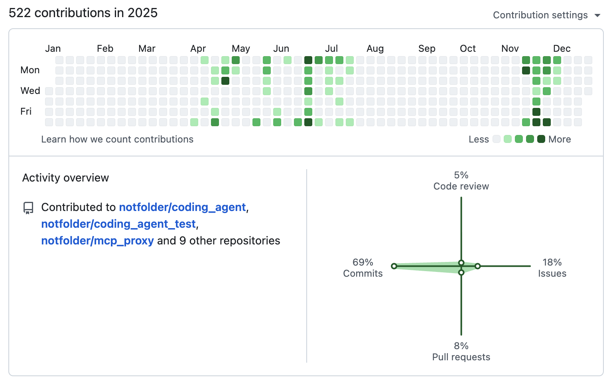

# roo_code_test
roo codeで仕様書から詳細設計、コードを生成するテスト
AIは人間と同じでサボるものだ。人間と同じようにプロジェクトコントロールをしてみる。
古代からのウォーターフローで抑えられるはず。AIなのでアジャイルより早くウォーターフォールを回せるはず。
人間のプロジェクトマネージャーがやることをAIにやらせる。人間はAIのプロジェクトマネージャーになる。
そのためのroo codeのagentを作ってみる。

## お試し開発

# 三回目の正直
- プロンプトの整理
- マスターなどの漏れを防ぎ、かつシンプルな要件・設計を出すようにプロンプトを改良・・・したつもり

「備品管理・貸出予約アプリを作りたい」


#　二回目まで
「備品管理・貸出予約アプリを作りたい」だけから始めて、roo codeで仕様書から詳細設計、コードを生成するテスト



延々と質問に答えていくと最終的に要件定義書ができるので、人間でチェックする。
よければ次。とりあえずテストなので何も考えずに次に行く

「requirements.mdに従って設計して下さい」から設計をさせる
一発で出してきたので念の為「もう一度チェックして下さい」という。大きな変更が出てきたらしつこく「もう一度チェックして下さい」と言う。
設計書は人間は見ない。チェックしない。AIに任せないとコード書いているのと同じなので、チェックしない。AIに任せる。

設計書の重箱を突き始めたので、「実装して下さい」でコード生成させる。コードも人間は見ない。チェックしない。AIに任せる。
一発でできるわけがないので、ここでもしつこく「進めて下さい」「もう一度チェックして下さい」と言う。
おっと。起動方法の説明をREADME.mdに書いておいてと設計書に書くようにエージェントを修正。設計ドキュメントに仕込んでおく。
レート制限に引っかかりまくる。。。簡単なアプリでも難しくしちゃってるかな。
次はなるべく単純な要件,設計をするように強くエージェントに指示しよう:done
デザインパターンを採用して、出来るだけ整理した設計を出せるように指示してみよう。:done

適当なところで動かしてみて、動かないところを直してもらって完成。
開いたらエラーだったので、直してもらう
DBの構築面倒なので、「sqlスキーマの構築をbackend起動時に自動で行うようにして下さい」って頼むてへぺろ
あー、設計でdocker-compose.yml出してもらうようにしよう:done
とりあえず作ってもらう
docker-compose前提設計にしていないと動かすまでに大変。。。
AdminPass123

備品マスターの作成漏れ。。。これじゃダメだな。
一旦終わる。


AI前


AI後


## Playwright MCP サーバー設定

Docker Composeの`test_playwright`サービス（port 9999）をMCPサーバーとして各ツールに接続する方法。

起動コマンド:
```bash
docker compose up test_playwright
```

エンドポイント: `http://localhost:9999/mcp`

### GitHub Copilot

`.vscode/mcp.json` に追加:

```json
{
  "servers": {
    "test_playwright": {
      "type": "http",
      "url": "http://localhost:9999/mcp"
    }
  }
}
```

### Claude Code

```bash
claude mcp add --transport http test_playwright http://localhost:9999/mcp
```

### Roo Code

`settings.json` に追加:

```json
{
  "roo-cline.mcpServers": {
    "test_playwright": {
      "disabled": false,
      "timeout": 60,
      "type": "streamable-http",
      "url": "http://localhost:9999/mcp"
    }
  }
}
```

> **注意**: Playwright MCP v0.0.70以降、`--port`で起動した場合のエンドポイントは `/mcp` です（`/sse` ではありません）。
