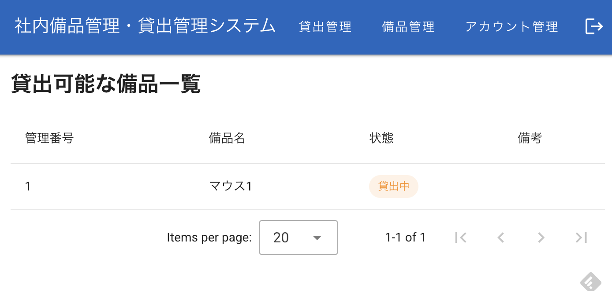

# 社内備品管理・貸出管理システム

社内備品の貸出状況をリアルタイムで一元管理するWebアプリケーション。

## 前提条件

- Docker
- Docker Compose

## 起動方法

### 1. 環境変数の設定（任意）

`.env` ファイルをプロジェクトルートに作成して初期管理担当者アカウントを設定できます。

```env
INITIAL_ADMIN_NAME=admin
INITIAL_ADMIN_PASSWORD=AdminPass123
SECRET_KEY=your-secret-key-here
```

設定しない場合は上記のデフォルト値が使用されます。

### 2. 起動

```bash
docker compose up -d
```

### 3. アクセス

ブラウザで <http://localhost> にアクセスしてください。

### 4. 初期ログイン

| 項目 | 値 |
| ---- | -- |
| アカウント名 | admin（または.envで設定した値） |
| パスワード | AdminPass123（または.envで設定した値） |

### 5. 停止

```bash
docker compose down
```

データベースのデータも削除する場合：

```bash
docker compose down -v
```



## 操作説明

### 管理担当者

- **備品管理**: ヘッダーの「備品管理」から備品の登録・編集・削除ができます
- **貸出・返却管理**: ヘッダーの「貸出管理」から貸出の記録・返却の記録・履歴確認ができます
- **アカウント管理**: ヘッダーの「アカウント管理」から社員アカウントの作成・削除ができます

### 一般社員

- ログイン後、貸出可能な備品の一覧を確認できます
