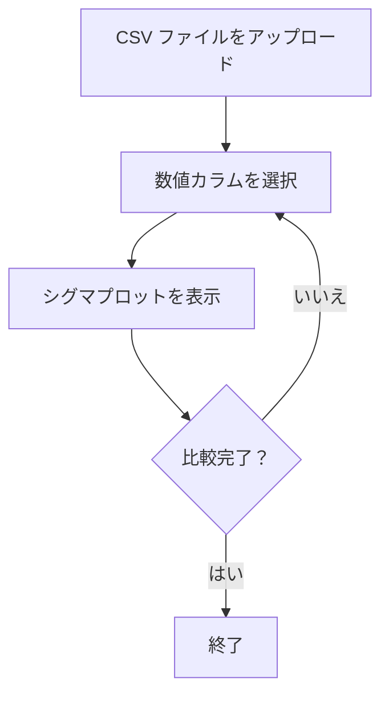
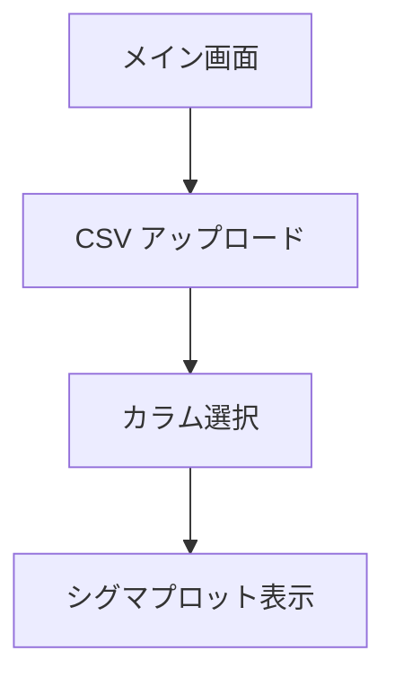

# 要件定義書：シグマプロット可視化アプリ

## 1. 目的・前提

### 1.1 システム目的
CSV ファイルに含まれる2つの数値カラムの分布形状をシグマプロットで比較し、分布のパターン違いを視覚的に把握する。

### 1.2 用語集
- **シグマプロット**：平均を0、標準偏差を1として正規化した分布の可視化
- **数値カラム**：連続した数値データを含む CSV の列

### 1.3 GUI/CUI
GUI（Web ブラウザ上で動作する画面）

## 2. 業務

### 2.1 対象業務
CSV ファイルから数値カラムを選択し、分布形状を比較する。

### 2.2 業務フロー

### 2.3 業務課題・KPI
- **課題**：2 つの数値カラムの分布形状の違いが直感的に把握できない
- **KPI**：分布比較にかかる時間を短縮

### 2.4 解決すべき課題と対応方針
| 業務課題 | 対応方針 |
|---------|---------|
| 分布形状の違いが数値だけでは把握困難 | シグマプロットによる視覚化 |
| 2 つのカラムを比較する手間がかかる | 1 画面で重ね表示 |

### 2.5 経営効果
- Soft Saving：データ分析にかかる時間の削減

## 3. 機能要件

### 3.1 機能一覧
| 機能 ID | 機能名 | 業務課題との紐づけ |
|--------|-------|------------------|
| F01 | CSV ファイルのアップロード | データ入力 |
| F02 | 数値カラムの選択 | 比較対象の指定 |
| F03 | シグマプロットの表示 | 分布形状の比較 |

**この機能が無いと何が困るか**：
- F01 がない：データを読み込めない
- F02 がない：比較対象を指定できない
- F03 がない：分布形状を視覚化できない

### 3.2 入力データ
- CSV ファイル（人手でアップロード）

### 3.3 出力データ
- シグマプロット画像（画面表示）

### 3.4 外部連携
- なし

### 3.5 GUI 画面仕様

#### メイン画面
| 項目 | 仕様 |
|-----|------|
| CSV ファイルアップロードエリア | ドラッグ＆ドロップまたはファイル選択 |
| 数値カラム選択 | 2 つのカラムをドロップダウンから選択 |
| シグマプロット表示エリア | 2 つのカラムの分布を色分けして重ね表示 |
| 基本統計量テーブル | カラム名、平均、標準偏差、最小値、最大値 |

### 3.6 画面遷移

### 3.7 ユーザー利用フロー（網羅）
| ステップ | 操作 | 期待される結果 |
|---------|------|---------------|
| 1 | CSV ファイルをアップロード | カラム一覧が表示される |
| 2 | 数値カラムを2つ選択 | シグマプロットが自動生成される |
| 3 | ホバー | 詳細数値が表示される |

### 3.8 業務フローとの対応関係
| 業務ステップ | 機能 ID |
|-------------|--------|
| データ読み込み | F01 |
| 比較対象指定 | F02 |
| 分布確認 | F03 |

## 4. データ

### 4.1 業務エンティティ一覧
| エンティティ | 説明 | CRUD | 一覧 | 詳細 | 検索 | 状態 |
|------------|------|-----|-----|-----|-----|-----|
| CSV ファイル | アップロードされたデータ | C | - | - | - | - |
| 数値カラム | CSV から抽出された数値列 | R | - | - | - | - |

### 4.2 データ保持期間
- メモリ上でのみ保持（ページ遷移時に破棄）

### 4.3 外部 DB 接続
- なし

## 5. 非機能要件

### 5.1 性能
- 応答時間：CSV ファイル読み込みから表示まで2秒以内

### 5.2 利用人数
- 同時接続：1 人（個人利用想定）

### 5.3 セキュリティ
- ファイルアップロード時のウイルスチェックは不要（ローカル環境利用）

## 6. テスト用利用シナリオ

| シナリオ ID | テストの目的 | 前提条件 | テスト手順 | 期待される結果 |
|------------|-------------|---------|-----------|---------------|
| S01 | CSV ファイルが正しく読み込めるか確認する | CSV ファイルが存在する | 1. CSV ファイルをアップロードする 2. カラム選択画面が表示される | 数値カラムの一覧が表示される |
| S02 | シグマプロットが正しく表示されるか確認する | CSV ファイルが読み込まれている | 1. 数値カラムを2つ選択する 2. シグマプロットが表示される | 2 つのカラムの分布が色分けされて表示される |
| S03 | ホバーで詳細数値が表示されるか確認する | シグマプロットが表示されている | 1. プロットの任意の部分をホバーする | 詳細数値がツールチップとして表示される |

## 7. 要件網羅性チェック

### 7.1 削除可能な要件
- ズーム機能：分布形状の比較には不要
- エクスポート機能：画面表示のみで業務が成立する

### 7.2 MVP に必要最低限の要件
- F01、F02、F03 のみで業務が成立

### 7.3 矛盾・不足のレビュー
- **矛盾**：なし
- **不足**：なし

## 8. 承認
- 作成日：2026 年 4 月 12 日
- レビュー結果：要件に矛盾はなく、MVP に必要な機能のみを網羅している