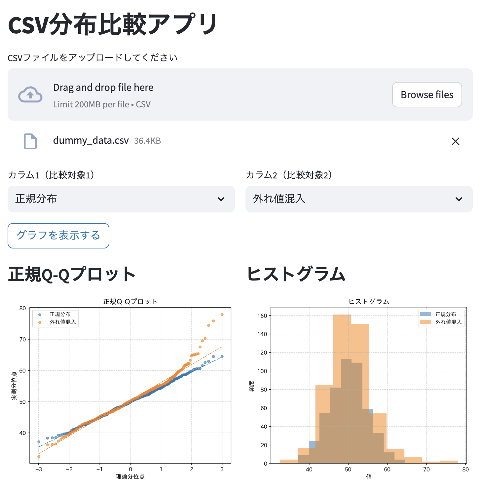

# CSV分布比較アプリ

CSVファイルから2つのカラムを選択し、正規Q-Qプロットとヒストグラムで分布を重ねて比較するアプリです。

## 必要環境

- Docker
- Docker Compose v2以上

## 起動方法

```bash
cd csv_distribution_compare
docker compose up --build
```

起動後、ブラウザで以下のURLにアクセスしてください。

```
http://localhost:8501
```

停止する場合は `Ctrl+C` を押してください。

## 操作手順

1. **CSVファイルをアップロード**
   画面上部のファイルアップローダーにCSVファイルをドラッグ＆ドロップ、またはクリックして選択します。

2. **比較するカラムを2つ選択**
   「カラム1」「カラム2」のドロップダウンから、比較したい数値カラムをそれぞれ選択します。

3. **グラフを表示**
   「グラフを表示する」ボタンを押すと、正規Q-Qプロットとヒストグラムが左右に並んで表示されます。

## CSVファイルの形式要件

| 項目 | 要件 |
|------|------|
| 文字コード | UTF-8 |
| 区切り文字 | カンマ（,） |
| 1行目 | ヘッダ行（カラム名） |
| 2行目以降 | 数値データ |
| 数値カラム | 2件以上必要 |

### 画面イメージ



### CSVの例

```
改善前,改善後
10.2,11.5
9.8,10.9
10.5,11.2
9.6,11.8
```
