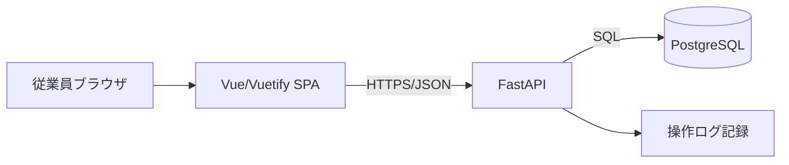
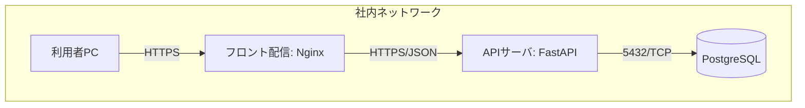
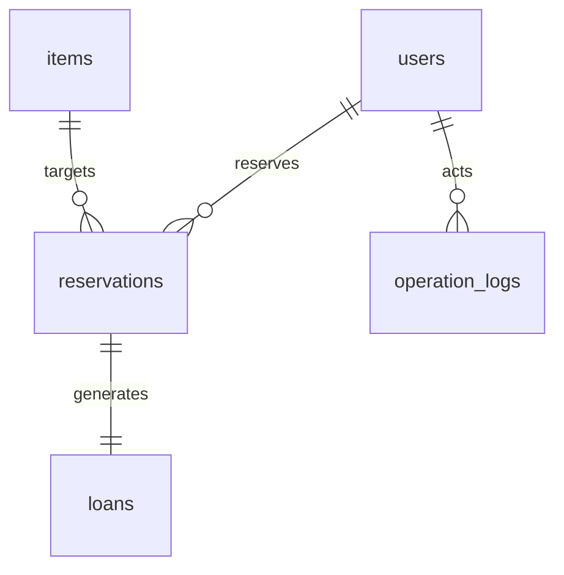
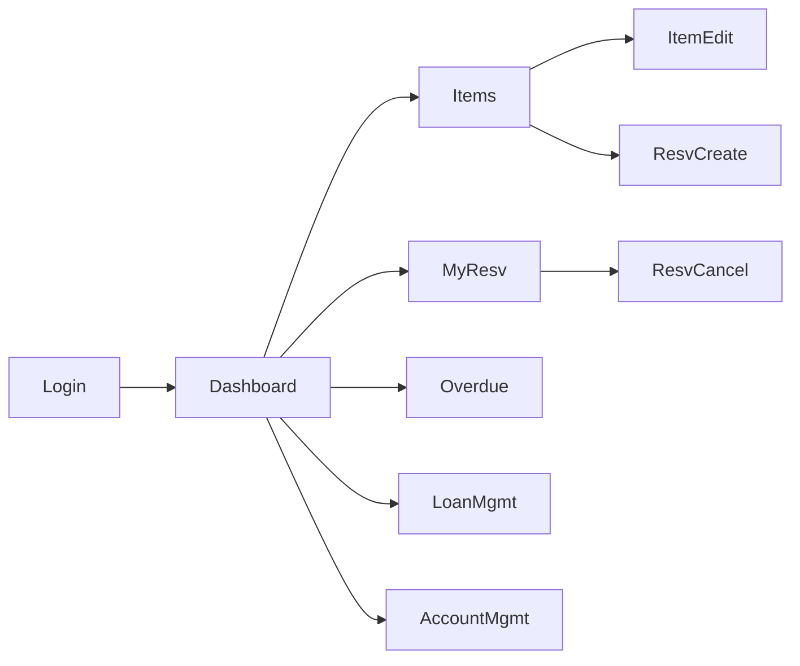
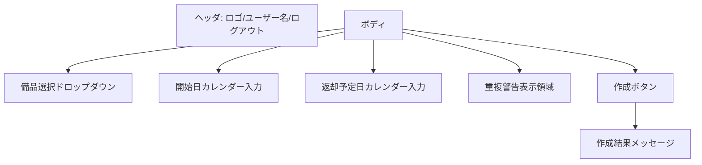
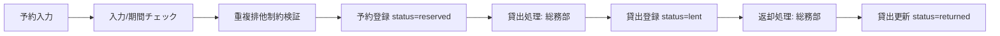
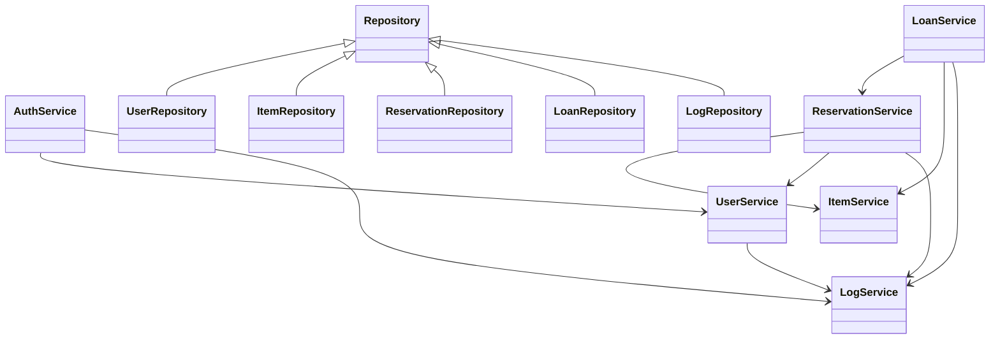
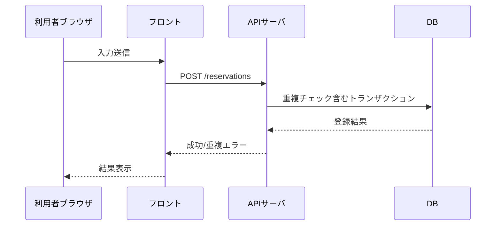
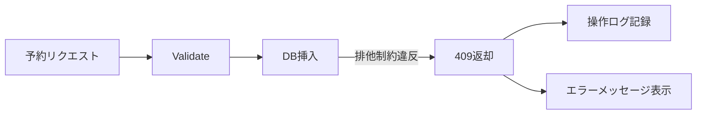

# 備品管理・貸出予約アプリ 詳細設計書

本書は [requirements.md](requirements.md) の要件に基づく詳細設計である。コード例や拡張案、実装スケジュールは含めない。

## 1. 言語・フレームワーク選定
| 区分 | 選定 | 役割 | 使用理由 |
| --- | --- | --- | --- |
| バックエンド | Python 3.x / FastAPI | API サーバ | 非同期 I/O で軽量、型定義とバリデーションが容易。社内向け小規模に適合 |
| フロントエンド | Vue 3 / Vuetify | SPA UI | 画面数8、直線的でない遷移のため Streamlit 不適、UI部品が豊富でPCブラウザ最適化しやすい |
| DB | PostgreSQL | 永続化 | 排他制御と日付範囲の排他制約が扱いやすい |
| 認証 | JWT + HTTPOnly Cookie | セッション管理 | SPA との相性が良く、社内利用でシンプルに運用可能 |
| コンテナ | Docker / docker-compose | 実行環境 | 依存を固定しデプロイ簡素化 |

## 2. システム構成
### 2.1 コンポーネント一覧
| コンポーネント | 役割 | 主な機能 |
| --- | --- | --- |
| Web フロント (Vue/Vuetify) | UI 提供 | ログイン、備品閲覧/検索、予約、マイ予約、貸出/返却、未返却一覧、アカウント管理 |
| API サーバ (FastAPI) | ビジネスロジック | 認証、ロール判定、備品/予約/貸出/返却/アカウント API、重複予約検知、操作ログ記録 |
| DB (PostgreSQL) | データ永続化 | テーブル・制約・トランザクション管理 |
| 認証モジュール | トークン発行/検証 | パスワード検証、JWT 発行、HTTPOnly Cookie 設定、ロール付与判定 |
| ログモジュール | 操作監査 | 操作ログ生成・保存 |

### 2.2 システム構成図


### 2.3 コンポーネント間インターフェースとデータフロー
- フロント→API: JSON REST、JWT ベアラーもしくは HTTPOnly Cookie で認証。
- API→DB: SQL (SQLAlchemy)。予約時は日付範囲の重複排除制約で競合防止。
- API→ログ: 同一トランザクション内で操作ログを永続化し、ロール/ユーザー/対象を記録。

### 2.4 ネットワーク構成図


## 3. データベース設計 (PostgreSQL)
### 3.1 テーブル定義
| テーブル | カラム | 型 | 制約 |
| --- | --- | --- | --- |
| users | id | UUID | PK |
|  | email | varchar(255) | UNIQUE, NOT NULL |
|  | name | varchar(100) | NOT NULL |
|  | role | varchar(20) | NOT NULL, 値: general/admin |
|  | password_hash | varchar(255) | NOT NULL |
|  | created_at | timestamp | NOT NULL, default now |
|  | updated_at | timestamp | NOT NULL, default now |
| items | id | UUID | PK |
|  | item_code | varchar(50) | UNIQUE, NOT NULL |
|  | name | varchar(255) | NOT NULL |
|  | status | varchar(20) | NOT NULL, 値: active/retired |
|  | created_at | timestamp | NOT NULL |
|  | updated_at | timestamp | NOT NULL |
| reservations | id | UUID | PK |
|  | item_id | UUID | FK items(id) |
|  | user_id | UUID | FK users(id) |
|  | start_date | date | NOT NULL |
|  | end_date | date | NOT NULL |
|  | status | varchar(20) | NOT NULL, 値: reserved/cancelled |
|  | created_at | timestamp | NOT NULL |
|  | updated_at | timestamp | NOT NULL |
| loans | id | UUID | PK |
|  | reservation_id | UUID | FK reservations(id) UNIQUE |
|  | loan_start_date | date | NOT NULL |
|  | planned_return_date | date | NOT NULL |
|  | actual_return_date | date | NULL |
|  | status | varchar(20) | NOT NULL, 値: lent/returned/overdue |
|  | created_at | timestamp | NOT NULL |
|  | updated_at | timestamp | NOT NULL |
| operation_logs | id | UUID | PK |
|  | actor_id | UUID | FK users(id) |
|  | action_type | varchar(50) | NOT NULL |
|  | target_type | varchar(50) | NOT NULL |
|  | target_id | UUID | NULL |
|  | message | text | NOT NULL |
|  | created_at | timestamp | NOT NULL |

### 3.2 主な制約
- reservations: item_id と日付範囲に対する重複禁止を排除制約で実装 (EXCLUDE USING gist ON item_id WITH = AND daterange(start_date, end_date, '[]') WITH &&)。
- reservations: end_date は start_date 以上、期間最大7日を CHECK。
- loans: status は lent または returned または overdue。reservation_id にユニーク制約で一対一。
- users: role は general または admin。

### 3.3 ER 図


## 4. 外部設計 (GUI)
### 4.1 画面一覧と要素
| 画面 | 主要要素 | 主な操作 |
| --- | --- | --- |
| ログイン | メール, パスワード, ログインボタン | 認証、JWT 受領 |
| ダッシュボード | 簡易お知らせ、未返却数サマリ | 状態確認 |
| 備品一覧/詳細 | 検索条件、一覧表、詳細表示 | 閲覧、(管理) 編集/廃棄設定 |
| 備品登録/編集 | フォーム: 個別ID、名称、状態 | 登録/更新、廃棄設定 |
| 予約作成 | 備品選択、開始日、返却予定日、確認 | 予約作成（自動承認）、重複エラー表示 |
| 予約一覧/マイ予約 | フィルタ、一覧、ステータス | キャンセル（開始日前日まで） |
| 貸出/返却管理 | 予約検索、貸出開始、返却完了 | 貸出/返却処理 |
| 未返却一覧 | 一覧: 備品ID、名称、借用者、開始日、返却予定日 | 参照のみ |
| アカウント管理 | 利用者一覧、登録フォーム、削除 | アカウント登録/削除、ロール設定 |

### 4.2 画面遷移図


### 4.3 画面レイアウト概要 (例: 予約作成)


### 4.4 AAモックアップ
- ログイン画面
```
[ ログイン ]
メール:  ______________________
パスワード: ********************
[ ログイン ]
```
- 予約作成
```
--------------------------------------------------
| 備品: [▼ 選択]                                 |
| 開始日: [2024-05-01]  返却予定日: [2024-05-05] |
| [ 予約を作成 ]                                  |
| 重複エラー:                                    |
--------------------------------------------------
```
- 未返却一覧
```
--------------------------------------------------
| 未返却一覧                                      |
| 備品ID | 名称    | 借用者 | 貸出開始 | 返却予定 |
|  A001  | プロジェクタ | 山田 | 05-01   | 05-05   |
|  ...                                           |
--------------------------------------------------
```

## 5. 内部設計
### 5.1 処理フロー (予約〜貸出〜返却)


### 5.2 バッチ処理
- 定期バッチは不要。未返却通知は要件外。未返却一覧は都度照会。

### 5.3 外部システム連携
- なし。

### 5.4 外部データベース連携
- なし。

## 6. クラス設計 (論理クラス)
### 6.1 クラス一覧と役割
| クラス | 役割 | 主な責務 | 採用パターン |
| --- | --- | --- | --- |
| AuthService | 認証/認可 | パスワード検証、JWT発行/検証、ロール確認 | Facade |
| UserService | アカウント管理 | 登録/削除、ロール設定、パスワードポリシー適用 | Factory Method (ユーザー生成) |
| ItemService | 備品管理 | 登録/編集/廃棄、検索 | Service |
| ReservationService | 予約管理 | 期間検証、重複検知、キャンセル | Strategy (検証ロジック差替え) |
| LoanService | 貸出/返却管理 | 貸出開始、返却完了、未返却取得 | Service |
| LogService | 操作ログ | ログメッセージ生成・保存 | Singleton (ロガー共有) |
| Repository各種 | 永続化 | users/items/reservations/loans/logs CRUD | Repository |

### 6.2 主属性・メソッド (例示的定義)
| クラス | 主な属性 | 主なメソッド |
| --- | --- | --- |
| AuthService | token_signer, user_repo | authenticate(email, password), issue_token(user), authorize(role) |
| UserService | user_repo | create_user(data), delete_user(id), list_users() |
| ItemService | item_repo | create_item(data), update_item(id,data), retire_item(id) |
| ReservationService | reservation_repo, overlap_checker | create_reservation(data), cancel_reservation(id,user), list_reservations(filter) |
| LoanService | loan_repo, reservation_repo | start_loan(reservation_id), finish_loan(loan_id), list_overdue() |
| LogService | log_repo | record(actor, action, target, message) |

### 6.3 クラス関係図


### 6.4 GoF パターン検討
- Factory Method: UserService がユーザー生成時にロール別初期化を行う。
- Strategy: ReservationService が期間検証戦略を切り替え可能に設計（最大日数/重複検知）。
- Facade: AuthService が認証・ロールチェックを一元化し API から簡潔に利用。
- Singleton: LogService の内部ロガーを単一生成にし、全サービスで共有。

## 7. メッセージ設計 (API リクエスト/レスポンス)
### 7.1 メッセージ一覧
| 種別 | 用途 | 主フィールド |
| --- | --- | --- |
| POST /auth/login | ログイン | email, password |
| POST /auth/logout | ログアウト | なし (Cookie 無効化) |
| GET /items | 備品一覧 | filters: keyword, status |
| POST /items | 備品登録 | item_code, name, status |
| PUT /items/{id} | 備品更新 | name, status |
| POST /reservations | 予約作成 | item_id, start_date, end_date |
| GET /reservations | 予約一覧/マイ予約 | filters: user, item |
| POST /reservations/{id}/cancel | キャンセル | なし |
| POST /loans | 貸出開始 | reservation_id |
| POST /loans/{id}/return | 返却完了 | actual_return_date |
| GET /loans/overdue | 未返却一覧 | なし |
| GET /users | アカウント一覧 | なし |
| POST /users | アカウント登録 | email, name, role, password |
| DELETE /users/{id} | アカウント削除 | なし |

### 7.2 メッセージフロー (例: 予約作成)


## 8. エラーハンドリング設計
### 8.1 エラー一覧
| エラー | 原因 | 対応 | 表示 |
| --- | --- | --- | --- |
| 認証失敗 | メール/パスワード不一致 | 401, ログ記録 | 「認証に失敗しました」 |
| 権限不足 | ロール不一致 | 403, ログ記録 | 「権限がありません」 |
| 重複予約 | 日付範囲排他制約違反 | 409, ロールバック | 「選択した期間は予約済みです」 |
| 入力不正 | 必須/形式不備 | 400 | バリデーションメッセージ |
| 資源不存在 | ID 不存在 | 404 | 「対象が見つかりません」 |
| サーバ内部 | 予期せぬ例外 | 500, ログ記録 | 汎用エラー |

### 8.2 エラーフロー (重複予約例)


## 9. セキュリティ設計
| 要件 | 対策 |
| --- | --- |
| パスワード8文字以上 | 登録/変更時にサーバ側バリデーション、ハッシュ保存 (bcrypt) |
| 社内ネットワークのみ | デプロイを社内 LAN/VPN 範囲に限定、FW で外部遮断 |
| 認証 | JWT を HTTPOnly, Secure Cookie とし、TLS 前提 |
| 認可 | ロール general/admin で API ごとにチェック |
| 操作ログ無期限 | operation_logs に全操作を記録、DB バックアップで保全 |
| 入力検証 | FastAPI のバリデーション、サーバ側日付制約 |
| CSRF | Cookie 使用時は SameSite=Lax、必要に応じて CSRF トークン検証 |

## 10. ソースコード設計
### 10.1 ディレクトリ構成 (AA)
```
project-root/
  backend/
    app/
      api/
      core/
      models/
      repositories/
      services/
      schemas/
      logs/
    tests/
  frontend/
    src/
      components/
      pages/
      store/
      router/
    tests/
  docker-compose.yml
  README.md
```

### 10.2 ファイル/役割
| ディレクトリ/ファイル | 役割 |
| --- | --- |
| backend/app/api | FastAPI ルータ定義 |
| backend/app/core | 設定、認証、依存注入 |
| backend/app/models | ORM モデル定義 |
| backend/app/repositories | CRUD 実装 |
| backend/app/services | ビジネスロジック層 |
| backend/app/schemas | Pydantic スキーマ |
| backend/app/logs | 操作ログユーティリティ |
| backend/tests | バックエンド単体/結合テスト |
| frontend/src/components | 共通 UI 部品 |
| frontend/src/pages | 画面コンポーネント |
| frontend/src/store | 状態管理 |
| frontend/src/router | ルーティング |
| frontend/tests | フロント単体/E2E テスト |
| docker-compose.yml | API/DB/フロントのコンテナ定義 |
| README.md | 起動手順と操作説明 |

### 10.3 コーディング規約
| 項目 | 規約 |
| --- | --- |
| Python | PEP8 準拠、型ヒント必須、関数/クラスは英語スネーク/パスカル |
| FastAPI | エンドポイントは HTTP 動詞に合わせた動詞なし名詞形パス、依存注入を使用 |
| Vue | Composition API、SFC、PascalCase コンポーネント、SCSS モジュール化 |
| テスト | pytest/uvu 名称規約 test_*、テスト毎に前提/操作/期待を明示 |
| コメント | 処理意図を日本語で記述、過剰冗長を避ける |

## 11. テスト設計
### 11.1 種類と目的
| 種別 | 目的 | 方法 |
| --- | --- | --- |
| 単体テスト | サービス/リポジトリのロジック検証 | pytest, モックDB |
| 結合テスト | API と DB の連携、制約確認 | TestClient + テストDB |
| E2E/総合 | ユーザー操作シナリオ確認 | フロントE2E (Playwright 等) |

### 11.2 テストケース（主要）
| 対象 | ケース |
| --- | --- |
| 認証 | 正常ログイン、誤パスワード、ロール不一致アクセス拒否 |
| 備品 | 登録必須チェック、重複 item_code 拒否、廃棄後は予約不可 |
| 予約 | 正常登録、期間重複で409、開始日前日キャンセル可、開始日当日キャンセル不可、最大7日超で拒否 |
| 貸出 | 予約状態でのみ開始可、開始後ステータス更新、非存在予約は404 |
| 返却 | 返却でステータス returned、返却予定超過時 overdue 表示 |
| 未返却一覧 | overdue/lent のみ取得 |
| アカウント | 登録時8文字未満拒否、メール重複拒否、削除で紐づく予約は残しロールチェック |
| 操作ログ | 主要操作でログが記録されること |

## 12. 起動・操作説明方針
- docker-compose で API・DB・フロントを起動する設計とし、README.md に起動手順・操作方法を明記する。
- バックエンド起動時に自動マイグレーションを実行し、初期管理者アカウントを作成する設計とする。

## 13. レビュー
- 要件整合: 自動承認・日単位・期間重複不可・最大7日・延長不可・キャンセルは開始日前日まで・通知なしを各設計に反映。
- 範囲整合: 単一拠点、PCブラウザ、帳票不要、外部連携なしを明記。
- セキュリティ整合: 社内ネットワーク限定、パスワードポリシー、ロール認可、操作ログ無期限を反映。
- 矛盾・冗長確認: 各セクションの用語とフローが一致し、冗長な説明はないことを確認した。
