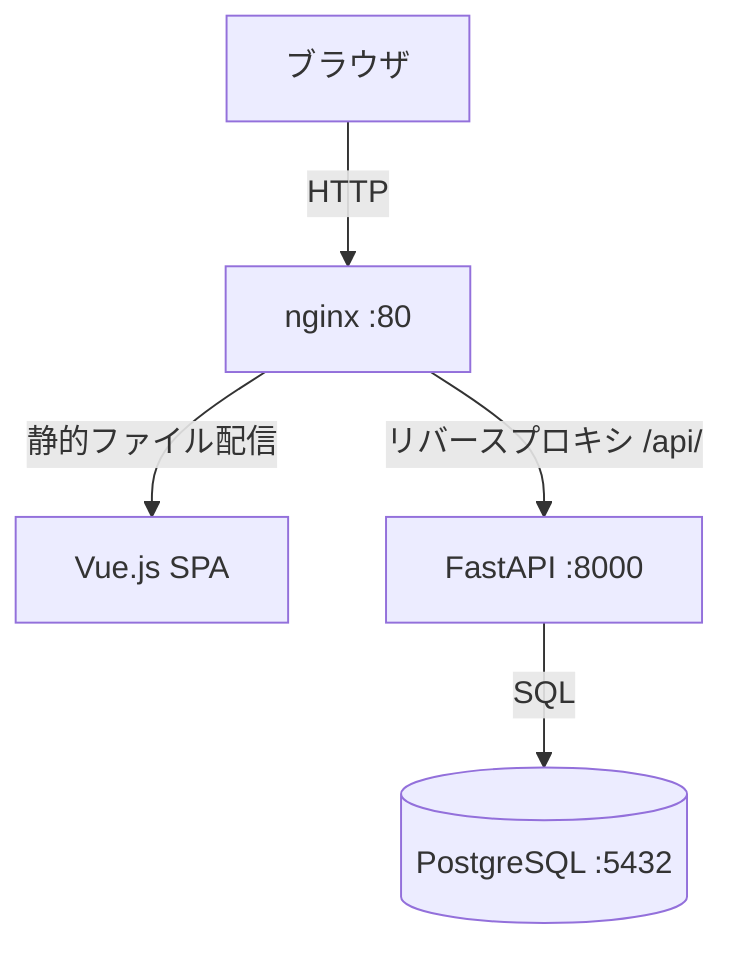
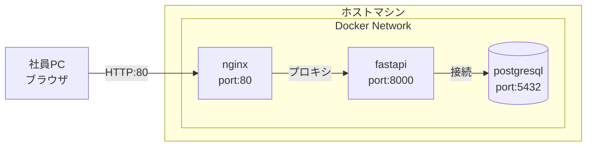
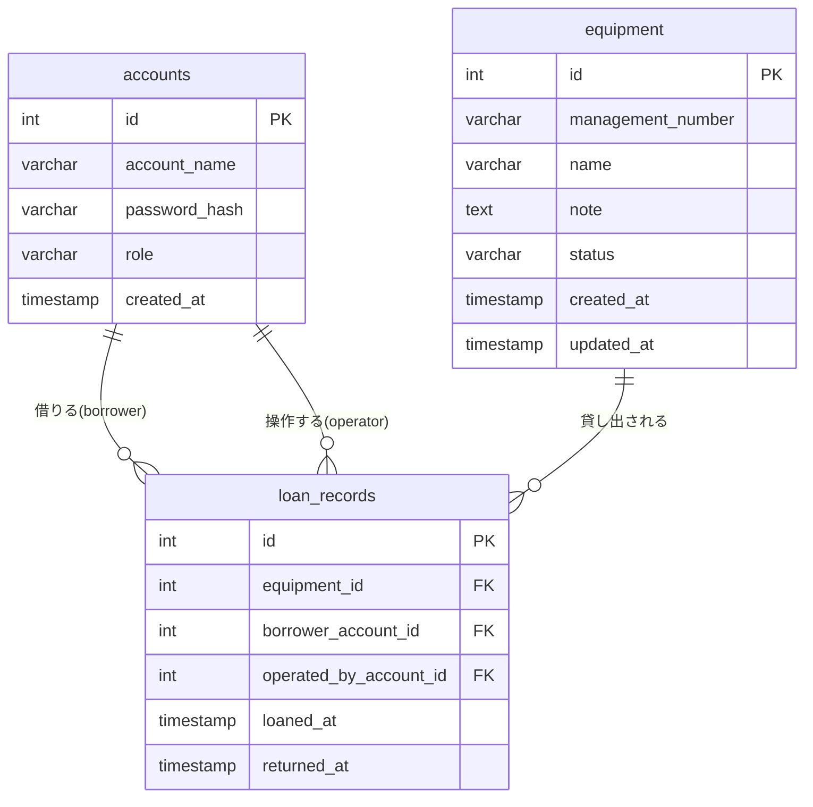
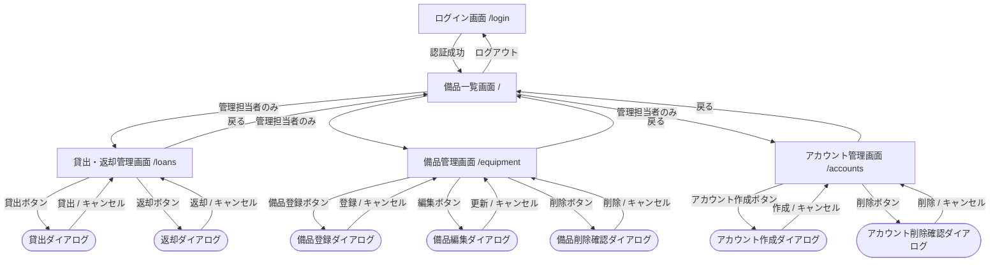
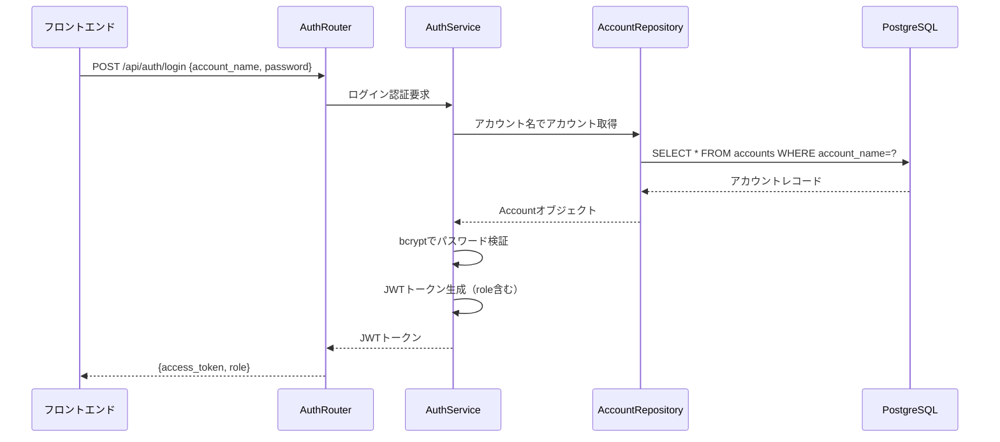
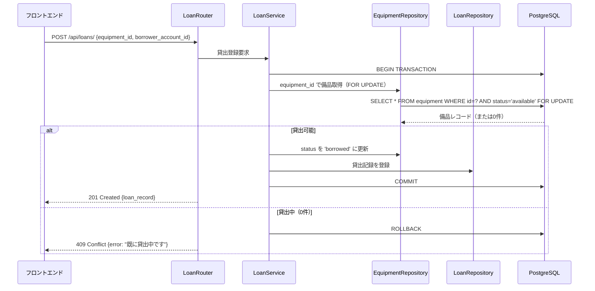
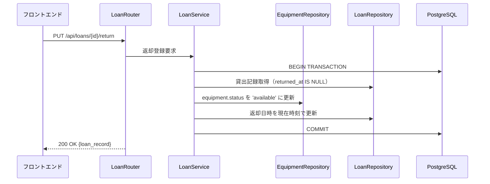
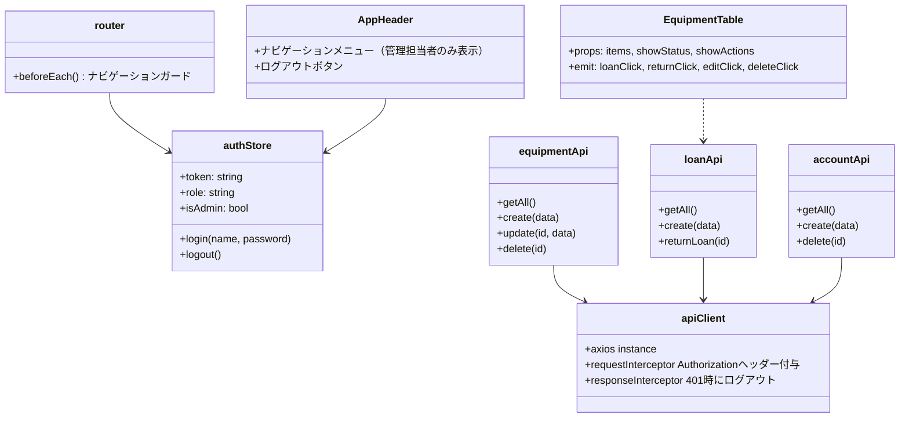
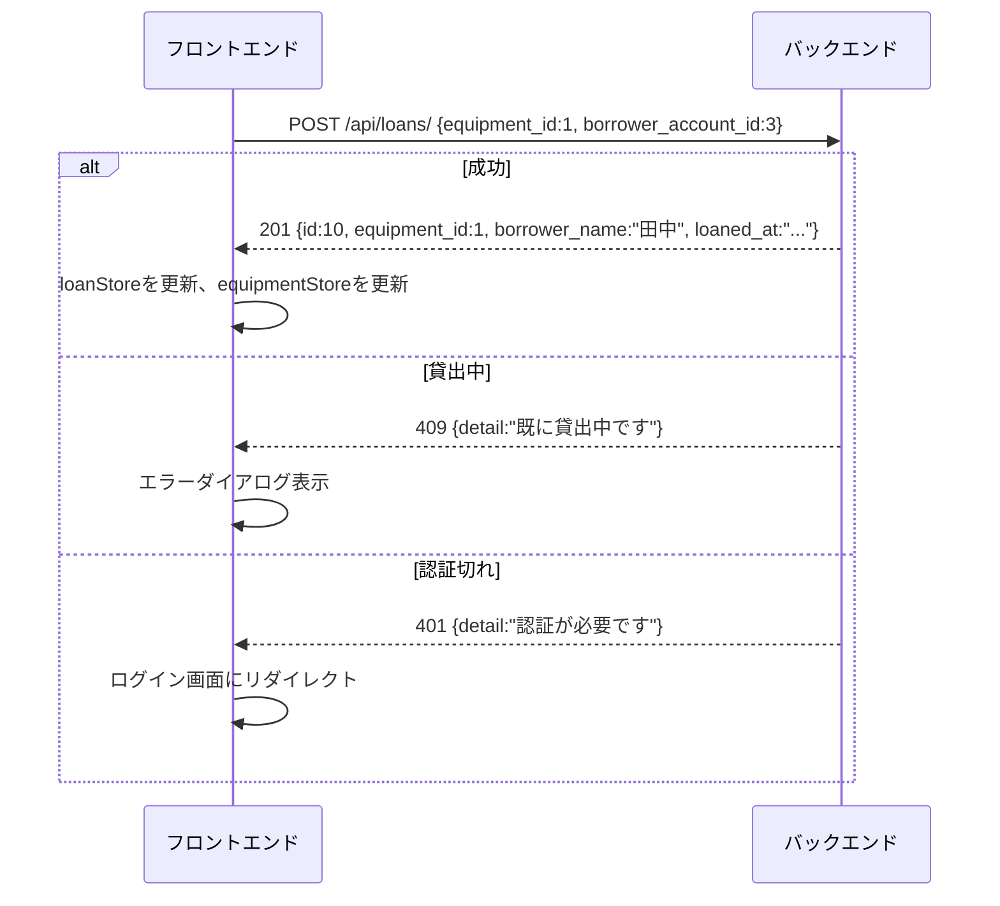

# 詳細設計書：社内備品管理・貸出管理システム

---

## 1. 言語・フレームワーク

| 区分 | 採用技術 | 選定理由 |
| ---- | -------- | -------- |
| バックエンド言語 | Python 3.11 | デフォルト言語 |
| バックエンドFW | FastAPI | 非同期対応・型安全なREST API |
| フロントエンドFW | Vue.js 3 + Vuetify 3 | 複数画面・役割別メニューが必要なため |
| データベース | PostgreSQL 15 | 同時接続・トランザクション管理に適切 |
| Webサーバー | nginx | フロントエンド配信・バックエンドリバースプロキシ |
| コンテナ | Docker Compose | 統一された起動・運用管理 |

### フロントエンドビルド方針

フロントエンドはマルチステージビルドを採用する。
- **ステージ1（buildステージ）**: Node.jsイメージでnpmによりVue.jsアプリをビルドし静的ファイルを生成する
- **ステージ2（productionステージ）**: nginxイメージにビルド済み静的ファイルをコピーし、Webサーバーとして動作させる

### バックエンドリバースプロキシ方針

nginxはすべてのリクエストを受け付け、パスに応じてルーティングする。
- `/api/` 以下のリクエストはすべてFastAPIバックエンドにプロキシする
- それ以外のリクエストはVue.jsの静的ファイルを返す
- フロントエンドのすべてのAPIリクエストは `/api/` 以下のパスを使用する

---

## 2. システム構成

### コンポーネント一覧

| コンポーネント | 役割 |
| -------------- | ---- |
| nginx | 静的ファイル配信、`/api/`へのリバースプロキシ |
| Vue.js + Vuetify | ブラウザ上で動作するSPA（シングルページアプリ） |
| FastAPI | REST APIサーバー。認証・認可・業務ロジックを担う |
| PostgreSQL | 備品・アカウント・貸出記録を永続化するRDBMS |

### システム構成図



### ネットワーク構成図



### コンポーネント間インターフェース

| 送信元 | 送信先 | プロトコル | 内容 |
| ------ | ------ | ---------- | ---- |
| ブラウザ | nginx | HTTP | 画面遷移・API呼び出し |
| nginx | FastAPI | HTTP（プロキシ） | `/api/`以下のAPIリクエスト |
| FastAPI | PostgreSQL | TCP（psycopg2） | SQL（CRUD操作） |

---

## 3. データベース設計

### テーブル一覧

| テーブル名 | 対応エンティティ |
| ---------- | ---------------- |
| accounts | アカウント |
| equipment | 備品 |
| loan_records | 貸出記録 |

### accounts テーブル

| カラム名 | データ型 | 制約 | 説明 |
| -------- | -------- | ---- | ---- |
| id | SERIAL | PRIMARY KEY | 内部ID |
| account_name | VARCHAR(100) | UNIQUE, NOT NULL | アカウント名（ログインID） |
| password_hash | VARCHAR(255) | NOT NULL | bcryptハッシュ化パスワード |
| role | VARCHAR(20) | NOT NULL, CHECK(admin/employee) | 役割（admin=管理担当者、employee=一般社員） |
| created_at | TIMESTAMP | NOT NULL, DEFAULT NOW() | 作成日時 |

### equipment テーブル

| カラム名 | データ型 | 制約 | 説明 |
| -------- | -------- | ---- | ---- |
| id | SERIAL | PRIMARY KEY | 内部ID |
| management_number | VARCHAR(50) | UNIQUE, NOT NULL | 管理番号 |
| name | VARCHAR(200) | NOT NULL | 備品名 |
| note | TEXT | | 備考 |
| status | VARCHAR(20) | NOT NULL, DEFAULT 'available', CHECK(available/borrowed) | 貸出状態 |
| created_at | TIMESTAMP | NOT NULL, DEFAULT NOW() | 作成日時 |
| updated_at | TIMESTAMP | NOT NULL, DEFAULT NOW() | 更新日時 |

### loan_records テーブル

| カラム名 | データ型 | 制約 | 説明 |
| -------- | -------- | ---- | ---- |
| id | SERIAL | PRIMARY KEY | 内部ID |
| equipment_id | INTEGER | NOT NULL, FK → equipment.id | 貸出対象備品 |
| borrower_account_id | INTEGER | NOT NULL, FK → accounts.id | 借りた社員のアカウント |
| operated_by_account_id | INTEGER | NOT NULL, FK → accounts.id | 操作した管理担当者のアカウント |
| loaned_at | TIMESTAMP | NOT NULL, DEFAULT NOW() | 貸出日時 |
| returned_at | TIMESTAMP | NULL | 返却日時（NULLの間は貸出中） |

### ER図



### データ整合性制約

| 制約 | 内容 |
| ---- | ---- |
| PK制約 | 全テーブルにSERIAL主キー |
| UK制約 | accounts.account_name, equipment.management_number は一意 |
| FK制約 | loan_records の各外部キーは参照先が存在すること |
| CHECK制約 | accounts.role は 'admin' または 'employee' のみ |
| CHECK制約 | equipment.status は 'available' または 'borrowed' のみ |
| 業務制約 | 貸出操作時、equipment.status が 'available' であること（楽観的ロックで保証） |
| 業務制約 | 削除対象のequipmentがloan_recordsから参照されている場合は削除不可 |

---

## 4. 外部設計

### 4-1. 画面一覧

| 画面名 | パス | 利用者 | 主な要素 |
| ------ | ---- | ------ | -------- |
| ログイン画面 | `/login` | 全ユーザー | アカウント名入力・パスワード入力・ログインボタン |
| 備品一覧画面 | `/` | 全ユーザー | 貸出可能備品テーブル・管理者用ナビゲーション |
| 貸出・返却管理画面 | `/loans` | 管理担当者 | 全備品テーブル・貸出ダイアログ・返却ダイアログ・貸出履歴テーブル |
| 備品管理画面 | `/equipment` | 管理担当者 | 備品一覧テーブル・登録ダイアログ・編集ダイアログ・削除確認ダイアログ |
| アカウント管理画面 | `/accounts` | 管理担当者 | アカウント一覧テーブル・作成ダイアログ・削除確認ダイアログ |

### 4-2. 画面遷移図



### 4-3. 画面モックアップ（AA）

**ログイン画面**
```
+=============================================+
|   社内備品管理・貸出管理システム            |
+=============================================+
|                                             |
|   アカウント名                              |
|   [                              ]          |
|                                             |
|   パスワード                                |
|   [                              ]          |
|                                             |
|           [     ログイン     ]              |
|                                             |
+=============================================+
```

**備品一覧画面（一般社員）**
```
+=============================================+
| 備品管理システム          [ログアウト]      |
+=============================================+
| 貸出可能な備品一覧                          |
+----------+------------------+---------------+
| 管理番号 | 備品名           | 備考          |
+----------+------------------+---------------+
| PC-001   | ノートPC A       |               |
| PJ-001   | プロジェクター   | HDMI対応      |
+----------+------------------+---------------+
```

**備品一覧画面（管理担当者）**
```
+================================================================+
| 備品管理システム  [貸出管理] [備品管理] [アカウント管理] [ログアウト] |
+================================================================+
| 貸出可能な備品一覧                                             |
+----------+------------------+--------+------------------------+
| 管理番号 | 備品名           | 状態   | 備考                   |
+----------+------------------+--------+------------------------+
| PC-001   | ノートPC A       | 貸出可 |                        |
| PJ-001   | プロジェクター   | 貸出中 | HDMI対応               |
+----------+------------------+--------+------------------------+
```

**貸出・返却管理画面**
```
+================================================================+
| 備品管理システム  [貸出管理] [備品管理] [アカウント管理] [ログアウト] |
+================================================================+
| 貸出・返却管理                                                 |
+----------+------------------+--------+----------+------------+
| 管理番号 | 備品名           | 状態   | 借用者   | 操作       |
+----------+------------------+--------+----------+------------+
| PC-001   | ノートPC A       | 貸出可 |          | [貸出]     |
| PJ-001   | プロジェクター   | 貸出中 | 田中太郎 | [返却]     |
+----------+------------------+--------+----------+------------+

| 貸出履歴                                                       |
+----------+----------+----------+------------------+-----------+
| 管理番号 | 借用者   | 貸出日時 | 返却日時         | 操作担当  |
+----------+----------+----------+------------------+-----------+
| PJ-001   | 田中太郎 | 03/28 09:00 | -             | 管理者    |
+----------+----------+----------+------------------+-----------+
```

**備品管理画面**
```
+================================================================+
| 備品管理システム  [貸出管理] [備品管理] [アカウント管理] [ログアウト] |
+================================================================+
| 備品管理                                    [+ 備品登録]       |
+----------+------------------+--------+-------+----------------+
| 管理番号 | 備品名           | 状態   | 備考  | 操作           |
+----------+------------------+--------+-------+----------------+
| PC-001   | ノートPC A       | 貸出可 |       | [編集] [削除]  |
| PJ-001   | プロジェクター   | 貸出中 | HDMI  | [編集] [削除]  |
+----------+------------------+--------+-------+----------------+
```

**アカウント管理画面**
```
+================================================================+
| 備品管理システム  [貸出管理] [備品管理] [アカウント管理] [ログアウト] |
+================================================================+
| アカウント管理                              [+ アカウント作成] |
+------------------+----------+---------------------------+------+
| アカウント名     | 役割     | 作成日時                  | 操作 |
+------------------+----------+---------------------------+------+
| admin            | 管理担当者 | 2026-03-28 09:00         | [削除] |
| tanaka           | 一般社員  | 2026-03-28 09:10         | [削除] |
+------------------+----------+---------------------------+------+
```

#### 備品登録ダイアログ（EquipmentFormDialog：登録モード）

備品管理画面の「+ 備品登録」ボタンを押すと表示されるダイアログ。

```text
+================================================================+
| 備品管理システム  [貸出管理] [備品管理] [アカウント管理] [ログアウト] |
+================================================================+
| 備品管理                                    [+ 備品登録]       |
  +-----------------------------------------+
  | 備品登録                                |
  |                                         |
  | 管理番号 *                              |
  | [                                   ]   |
  |                                         |
  | 備品名 *                                |
  | [                                   ]   |
  |                                         |
  | 備考                                    |
  | [                                   ]   |
  |                                         |
  |         [キャンセル]  [  登録  ]        |
  +-----------------------------------------+
```

#### 備品編集ダイアログ（EquipmentFormDialog：編集モード）

備品管理画面の「編集」ボタンを押すと表示されるダイアログ。選択した備品の現在値が初期表示される。

```text
+================================================================+
| 備品管理システム  [貸出管理] [備品管理] [アカウント管理] [ログアウト] |
+================================================================+
| 備品管理                                    [+ 備品登録]       |
  +-----------------------------------------+
  | 備品編集                                |
  |                                         |
  | 管理番号 *                              |
  | [ PC-001                            ]   |
  |                                         |
  | 備品名 *                                |
  | [ ノートPC A                        ]   |
  |                                         |
  | 備考                                    |
  | [                                   ]   |
  |                                         |
  |         [キャンセル]  [  更新  ]        |
  +-----------------------------------------+
```

#### 備品削除確認ダイアログ

備品管理画面の「削除」ボタンを押すと表示される確認ダイアログ。

```text
+================================================================+
| 備品管理システム  [貸出管理] [備品管理] [アカウント管理] [ログアウト] |
+================================================================+
| 備品管理                                    [+ 備品登録]       |
  +-------------------------------+
  | 削除確認                      |
  |                               |
  | PC-001 ノートPC A             |
  | を削除してもよいですか？       |
  |                               |
  |   [キャンセル]  [  削除  ]    |
  +-------------------------------+
```

#### アカウント作成ダイアログ（AccountFormDialog）

アカウント管理画面の「+ アカウント作成」ボタンを押すと表示されるダイアログ。

```text
+================================================================+
| 備品管理システム  [貸出管理] [備品管理] [アカウント管理] [ログアウト] |
+================================================================+
| アカウント管理                              [+ アカウント作成] |
  +-----------------------------------------+
  | アカウント作成                          |
  |                                         |
  | アカウント名 *                          |
  | [                                   ]   |
  |                                         |
  | パスワード *                            |
  | [                                   ]   |
  |                                         |
  | 役割 *                                  |
  | ( ) 管理担当者  (●) 一般社員            |
  |                                         |
  |         [キャンセル]  [  作成  ]        |
  +-----------------------------------------+
```

#### アカウント削除確認ダイアログ

アカウント管理画面の「削除」ボタンを押すと表示される確認ダイアログ。

```text
+================================================================+
| 備品管理システム  [貸出管理] [備品管理] [アカウント管理] [ログアウト] |
+================================================================+
| アカウント管理                              [+ アカウント作成] |
  +-------------------------------+
  | 削除確認                      |
  |                               |
  | アカウント「tanaka」           |
  | を削除してもよいですか？       |
  |                               |
  |   [キャンセル]  [  削除  ]    |
  +-------------------------------+
```

#### 貸出ダイアログ（LoanDialog）

貸出・返却管理画面の「貸出」ボタンを押すと表示されるダイアログ。

```text
  +-----------------------------------------+
  | 貸出登録                                |
  |                                         |
  | 備品: PC-001 ノートPC A                 |
  |                                         |
  | 借りる社員 *                            |
  | [ ▼ アカウントを選択             ]      |
  |                                         |
  |         [キャンセル]  [  貸出  ]        |
  +-----------------------------------------+
```

#### 返却ダイアログ（ReturnDialog）

貸出・返却管理画面の「返却」ボタンを押すと表示される確認ダイアログ。

```text
  +-------------------------------+
  | 返却確認                      |
  |                               |
  | PJ-001 プロジェクター          |
  | 借用者：田中太郎               |
  | を返却しますか？               |
  |                               |
  |   [キャンセル]  [  返却  ]    |
  +-------------------------------+
```

### 4-4. 外部システム・外部DB連携

外部システム・外部DBとの連携はなし。

---

## 5. 内部設計

### APIエンドポイント一覧

| メソッド | パス | 利用者 | 機能 |
| -------- | ---- | ------ | ---- |
| POST | /api/auth/login | 全ユーザー | ログイン・JWTトークン発行 |
| POST | /api/auth/logout | 全ユーザー | ログアウト |
| GET | /api/equipment/ | 全ユーザー | 備品一覧取得 |
| POST | /api/equipment/ | 管理担当者 | 備品登録 |
| PUT | /api/equipment/{id} | 管理担当者 | 備品編集 |
| DELETE | /api/equipment/{id} | 管理担当者 | 備品削除 |
| GET | /api/loans/ | 管理担当者 | 貸出記録一覧取得 |
| POST | /api/loans/ | 管理担当者 | 貸出登録 |
| PUT | /api/loans/{id}/return | 管理担当者 | 返却登録 |
| GET | /api/accounts/ | 管理担当者 | アカウント一覧取得 |
| POST | /api/accounts/ | 管理担当者 | アカウント作成 |
| DELETE | /api/accounts/{id} | 管理担当者 | アカウント削除 |

### 主要処理フロー

**ログイン処理**


**貸出処理**


**返却処理**


### 排他制御

| 操作 | 制御方式 | 詳細 |
| ---- | -------- | ---- |
| 貸出登録 | 悲観的ロック | トランザクション内で `SELECT ... FOR UPDATE` により対象備品をロックし、status='available' を確認後に更新する。0件の場合は409エラーを返す |
| 返却登録 | 悲観的ロック | トランザクション内で貸出記録と備品を順次更新する |

### トランザクション境界

| 処理 | トランザクション範囲 | ロールバック条件 |
| ---- | -------------------- | ---------------- |
| 貸出登録 | 備品status更新 + 貸出記録INSERT | 備品が貸出中（status≠available）、DB例外 |
| 返却登録 | 貸出記録UPDATE + 備品status更新 | 対象貸出記録が存在しない、DB例外 |
| 備品削除 | 備品DELETE | 貸出記録に参照あり（FK制約違反） |

### バッチ処理

バッチ処理は不要（すべての処理はリクエスト起動型）。

---

## 6. クラス設計

### クラス一覧

| 区分 | クラス名 | 役割 |
| ---- | -------- | ---- |
| バックエンド：モデル | Account | accountsテーブルのORMモデル |
| バックエンド：モデル | Equipment | equipmentテーブルのORMモデル |
| バックエンド：モデル | LoanRecord | loan_recordsテーブルのORMモデル |
| バックエンド：スキーマ | LoginRequest | ログインリクエストの入力定義 |
| バックエンド：スキーマ | TokenResponse | JWTトークンレスポンスの定義 |
| バックエンド：スキーマ | AccountCreate | アカウント作成の入力定義 |
| バックエンド：スキーマ | AccountResponse | アカウントレスポンスの定義 |
| バックエンド：スキーマ | EquipmentCreate | 備品登録の入力定義 |
| バックエンド：スキーマ | EquipmentUpdate | 備品編集の入力定義 |
| バックエンド：スキーマ | EquipmentResponse | 備品レスポンスの定義 |
| バックエンド：スキーマ | LoanCreate | 貸出登録の入力定義 |
| バックエンド：スキーマ | LoanResponse | 貸出記録レスポンスの定義 |
| バックエンド：リポジトリ | AccountRepository | アカウントのDB操作を集約 |
| バックエンド：リポジトリ | EquipmentRepository | 備品のDB操作を集約 |
| バックエンド：リポジトリ | LoanRepository | 貸出記録のDB操作を集約 |
| バックエンド：サービス | AuthService | 認証・JWTトークン生成・検証 |
| バックエンド：サービス | AccountService | アカウント業務ロジック |
| バックエンド：サービス | EquipmentService | 備品業務ロジック |
| バックエンド：サービス | LoanService | 貸出・返却業務ロジック（トランザクション制御含む） |
| バックエンド：ルーター | AuthRouter | `/api/auth/` のルーティング |
| バックエンド：ルーター | AccountRouter | `/api/accounts/` のルーティング |
| バックエンド：ルーター | EquipmentRouter | `/api/equipment/` のルーティング |
| バックエンド：ルーター | LoanRouter | `/api/loans/` のルーティング |
| バックエンド：共通 | database | DBセッション管理・接続設定 |
| バックエンド：共通 | security | bcryptハッシュ化・JWT生成・JWT検証 |
| バックエンド：共通 | dependencies | 認証済みユーザー取得・管理担当者権限チェック（DIで各ルーターから利用） |
| フロントエンド：ビュー | LoginView | ログイン画面 |
| フロントエンド：ビュー | EquipmentListView | 備品一覧画面 |
| フロントエンド：ビュー | LoanManagementView | 貸出・返却管理画面 |
| フロントエンド：ビュー | EquipmentManagementView | 備品管理画面 |
| フロントエンド：ビュー | AccountManagementView | アカウント管理画面 |
| フロントエンド：コンポーネント | AppHeader | 全画面共通ヘッダー（ナビゲーション・ログアウト） |
| フロントエンド：コンポーネント | EquipmentTable | 備品テーブル表示（一覧画面・管理画面で共用） |
| フロントエンド：コンポーネント | LoanDialog | 貸出操作ダイアログ |
| フロントエンド：コンポーネント | ReturnDialog | 返却操作ダイアログ |
| フロントエンド：コンポーネント | EquipmentFormDialog | 備品登録・編集ダイアログ（登録・編集を1コンポーネントで処理） |
| フロントエンド：コンポーネント | AccountFormDialog | アカウント作成ダイアログ |
| フロントエンド：ストア | authStore | ログイン状態・JWTトークン・ユーザー情報の管理 |
| フロントエンド：ストア | equipmentStore | 備品一覧データの管理 |
| フロントエンド：ストア | loanStore | 貸出記録一覧データの管理 |
| フロントエンド：ストア | accountStore | アカウント一覧データの管理 |
| フロントエンド：API | apiClient | axiosインスタンス。共通エラーハンドリング・JWTヘッダー付与を行う |
| フロントエンド：API | authApi | 認証APIの呼び出し |
| フロントエンド：API | equipmentApi | 備品APIの呼び出し |
| フロントエンド：API | loanApi | 貸出APIの呼び出し |
| フロントエンド：API | accountApi | アカウントAPIの呼び出し |
| フロントエンド：ルーター | router | Vue Router。ナビゲーションガードで未認証・権限不足を制御 |

### クラス図（バックエンド）

```mermaid
classDiagram
    class database {
        +get_db() Session
        +engine
        +SessionLocal
    }
    class security {
        +hash_password(plain: str) str
        +verify_password(plain: str, hashed: str) bool
        +create_access_token(data: dict) str
        +decode_access_token(token: str) dict
    }
    class dependencies {
        +get_current_user(token: str, db: Session) Account
        +require_admin(current_user: Account) Account
    }
    class AccountRepository {
        +find_by_name(db, name: str) Account
        +find_all(db) list[Account]
        +create(db, account: AccountCreate) Account
        +delete(db, account_id: int) void
    }
    class EquipmentRepository {
        +find_all(db) list[Equipment]
        +find_available(db) list[Equipment]
        +find_by_id_for_update(db, id: int) Equipment
        +create(db, data: EquipmentCreate) Equipment
        +update(db, equipment: Equipment, data: EquipmentUpdate) Equipment
        +delete(db, equipment: Equipment) void
    }
    class LoanRepository {
        +find_all(db) list[LoanRecord]
        +find_active_by_equipment(db, equipment_id: int) LoanRecord
        +create(db, data: LoanCreate, operator_id: int) LoanRecord
        +set_returned(db, loan: LoanRecord) LoanRecord
    }
    class AuthService {
        +login(db, name: str, password: str) TokenResponse
    }
    class AccountService {
        +list_accounts(db) list[AccountResponse]
        +create_account(db, data: AccountCreate) AccountResponse
        +delete_account(db, account_id: int) void
    }
    class EquipmentService {
        +list_equipment(db, available_only: bool) list[EquipmentResponse]
        +create_equipment(db, data: EquipmentCreate) EquipmentResponse
        +update_equipment(db, id: int, data: EquipmentUpdate) EquipmentResponse
        +delete_equipment(db, id: int) void
    }
    class LoanService {
        +list_loans(db) list[LoanResponse]
        +create_loan(db, data: LoanCreate, operator_id: int) LoanResponse
        +return_loan(db, loan_id: int, operator_id: int) LoanResponse
    }

    AuthService --> AccountRepository
    AuthService --> security
    AccountService --> AccountRepository
    EquipmentService --> EquipmentRepository
    LoanService --> EquipmentRepository
    LoanService --> LoanRepository
    dependencies --> AccountRepository
    dependencies --> security
```



### クラス図（フロントエンド）



---

## 7. メッセージ設計（API入出力仕様）

### メッセージ一覧

| メッセージID | 方向 | エンドポイント | 内容 |
| ------------ | ---- | -------------- | ---- |
| M01 | 入力 | POST /api/auth/login | account_name, password |
| M02 | 出力 | POST /api/auth/login | access_token, token_type, role |
| M03 | 出力 | GET /api/equipment/ | id, management_number, name, note, status の配列 |
| M04 | 入力 | POST /api/equipment/ | management_number, name, note |
| M05 | 入力 | PUT /api/equipment/{id} | management_number, name, note |
| M06 | 出力 | POST,PUT /api/equipment/ | id, management_number, name, note, status |
| M07 | 出力 | GET /api/loans/ | id, equipment_id, management_number, equipment_name, borrower_name, operator_name, loaned_at, returned_at の配列 |
| M08 | 入力 | POST /api/loans/ | equipment_id, borrower_account_id |
| M09 | 出力 | POST /api/loans/, PUT /api/loans/{id}/return | id, equipment_id, borrower_name, loaned_at, returned_at |
| M10 | 出力 | GET /api/accounts/ | id, account_name, role, created_at の配列 |
| M11 | 入力 | POST /api/accounts/ | account_name, password, role |
| M12 | 出力 | エラー全般 | detail（エラー内容文字列） |

### バリデーション仕様

| 項目 | 制約 |
| ---- | ---- |
| account_name | 1文字以上100文字以内、必須 |
| password | 8文字以上255文字以内、必須 |
| management_number | 1文字以上50文字以内、必須 |
| name（備品名） | 1文字以上200文字以内、必須 |
| role | 'admin' または 'employee' のみ |

### メッセージフロー（貸出）



---

## 8. エラーハンドリング

### エラー一覧

| エラー種別 | 発生箇所 | HTTPステータス | フロント側の対応 |
| ---------- | -------- | -------------- | ---------------- |
| 認証失敗（パスワード不一致） | ログイン | 401 | ログイン画面にエラーメッセージ表示 |
| 未認証アクセス（トークン無効・期限切れ） | 全保護エンドポイント | 401 | ログイン画面にリダイレクト |
| 権限不足（一般社員が管理者APIにアクセス） | 管理者限定エンドポイント | 403 | エラーメッセージ表示 |
| リソース不存在（ID指定の備品・記録が存在しない） | GET/PUT/DELETE | 404 | エラーメッセージ表示 |
| 貸出中の備品への貸出操作 | POST /api/loans/ | 409 | エラーメッセージ「既に貸出中です」表示 |
| 管理番号・アカウント名の重複 | 備品登録・アカウント作成 | 409 | エラーメッセージ「既に存在します」表示 |
| バリデーションエラー（必須項目欠如等） | 全入力エンドポイント | 422 | 入力フォームにフィールド別エラー表示 |
| 貸出中備品の削除 | DELETE /api/equipment/ | 409 | エラーメッセージ「貸出中のため削除できません」表示 |
| サーバー内部エラー | 全エンドポイント | 500 | エラーダイアログ「システムエラーが発生しました」表示 |

### ログ設計

| ログ種別 | 記録内容 | 出力先 |
| -------- | -------- | ------ |
| アクセスログ | リクエストメソッド・パス・ステータス・処理時間 | 標準出力（Docker logs） |
| エラーログ | 500エラー発生時のスタックトレース | 標準エラー出力（Docker logs） |
| 監査ログ | ログイン・貸出・返却・備品変更・アカウント変更の操作（操作者・日時・対象） | DBのloan_recordsおよびアクセスログで代替 |

---

## 9. セキュリティ設計

| 項目 | 設計内容 |
| ---- | -------- |
| 認証方式 | JWTトークン（Bearer）。有効期限8時間。フロントエンドはlocalStorageに保存し、全APIリクエストのAuthorizationヘッダーに付与する |
| パスワード保護 | bcryptでハッシュ化してDBに保存。平文パスワードは保存しない |
| 認可 | JWTペイロードのroleフィールドで役割を判定。管理担当者限定エンドポイントはdependencies.require_adminで保護 |
| CORS | FastAPIのCORSミドルウェアで、nginxからのリクエストのみ許可（本番はsame-origin） |
| 初期管理者アカウント | docker-compose.ymlの環境変数（INITIAL_ADMIN_NAME, INITIAL_ADMIN_PASSWORD）で設定し、起動時にDBが空の場合のみ自動作成する |

---

## 10. ソースコード構成

```
/
├── docker-compose.yml
├── nginx/
│   └── default.conf
├── backend/
│   ├── Dockerfile
│   ├── requirements.txt
│   └── app/
│       ├── main.py              （FastAPIアプリ初期化・ルーター登録・DB初期化）
│       ├── database.py          （DBエンジン・セッション管理）
│       ├── security.py          （bcrypt・JWT）
│       ├── dependencies.py      （get_current_user・require_admin）
│       ├── models/
│       │   ├── account.py       （Accountモデル）
│       │   ├── equipment.py     （Equipmentモデル）
│       │   └── loan_record.py   （LoanRecordモデル）
│       ├── schemas/
│       │   ├── auth.py          （LoginRequest, TokenResponse）
│       │   ├── account.py       （AccountCreate, AccountResponse）
│       │   ├── equipment.py     （EquipmentCreate, EquipmentUpdate, EquipmentResponse）
│       │   └── loan.py          （LoanCreate, LoanResponse）
│       ├── repositories/
│       │   ├── account_repository.py
│       │   ├── equipment_repository.py
│       │   └── loan_repository.py
│       ├── services/
│       │   ├── auth_service.py
│       │   ├── account_service.py
│       │   ├── equipment_service.py
│       │   └── loan_service.py
│       └── routers/
│           ├── auth.py
│           ├── accounts.py
│           ├── equipment.py
│           └── loans.py
├── frontend/
│   ├── Dockerfile               （マルチステージビルド）
│   ├── package.json
│   └── src/
│       ├── main.js              （Vueアプリ初期化・Vuetify/Pinia/Router登録）
│       ├── router/
│       │   └── index.js         （ルート定義・ナビゲーションガード）
│       ├── stores/
│       │   ├── auth.js
│       │   ├── equipment.js
│       │   ├── loan.js
│       │   └── account.js
│       ├── api/
│       │   ├── client.js        （axiosインスタンス・共通インターセプター）
│       │   ├── auth.js
│       │   ├── equipment.js
│       │   ├── loan.js
│       │   └── account.js
│       ├── views/
│       │   ├── LoginView.vue
│       │   ├── EquipmentListView.vue
│       │   ├── LoanManagementView.vue
│       │   ├── EquipmentManagementView.vue
│       │   └── AccountManagementView.vue
│       └── components/
│           ├── AppHeader.vue
│           ├── EquipmentTable.vue
│           ├── LoanDialog.vue
│           ├── ReturnDialog.vue
│           ├── EquipmentFormDialog.vue
│           └── AccountFormDialog.vue
└── tests/
    ├── unit/                    （単体テスト）
    └── integration/             （結合テスト）
```

### ファイルとクラスの対応

| ファイルパス | 含まれるクラス/定義 |
| ------------ | ------------------- |
| app/database.py | database（エンジン・セッション） |
| app/security.py | security（hash_password, verify_password, create/decode_token） |
| app/dependencies.py | dependencies（get_current_user, require_admin） |
| app/models/account.py | Account |
| app/models/equipment.py | Equipment |
| app/models/loan_record.py | LoanRecord |
| app/schemas/auth.py | LoginRequest, TokenResponse |
| app/schemas/account.py | AccountCreate, AccountResponse |
| app/schemas/equipment.py | EquipmentCreate, EquipmentUpdate, EquipmentResponse |
| app/schemas/loan.py | LoanCreate, LoanResponse |
| app/repositories/account_repository.py | AccountRepository |
| app/repositories/equipment_repository.py | EquipmentRepository |
| app/repositories/loan_repository.py | LoanRepository |
| app/services/auth_service.py | AuthService |
| app/services/account_service.py | AccountService |
| app/services/equipment_service.py | EquipmentService |
| app/services/loan_service.py | LoanService |
| app/routers/auth.py | AuthRouter |
| app/routers/accounts.py | AccountRouter |
| app/routers/equipment.py | EquipmentRouter |
| app/routers/loans.py | LoanRouter |
| src/api/client.js | apiClient |
| src/stores/auth.js | authStore |
| src/stores/equipment.js | equipmentStore |
| src/stores/loan.js | loanStore |
| src/stores/account.js | accountStore |

### コーディング規約

| 項目 | 規約 |
| ---- | ---- |
| Python命名規則 | クラス名：PascalCase、関数・変数：snake_case、定数：UPPER_SNAKE_CASE |
| Python型注釈 | 全関数の引数・戻り値に型注釈を付ける |
| Pythonコメント | 日本語で処理内容を記述する |
| Vue命名規則 | コンポーネント名：PascalCase、変数・関数：camelCase |
| Vueコメント | 日本語で処理内容を記述する |
| 共通処理 | 2箇所以上で使用される処理は必ず共通モジュール（security.py, dependencies.py, api/client.js）に集約する |

---

## 11. エンティティ・画面・API・クラスの対応関係

| エンティティ | 画面 | APIエンドポイント | バックエンドクラス | フロントエンドクラス |
| ------------ | ---- | ----------------- | ------------------ | -------------------- |
| 備品 | 備品一覧画面, 備品管理画面 | GET/POST/PUT/DELETE /api/equipment/ | EquipmentService, EquipmentRepository | equipmentStore, equipmentApi, EquipmentTable, EquipmentFormDialog |
| アカウント | アカウント管理画面 | GET/POST/DELETE /api/accounts/ | AccountService, AccountRepository | accountStore, accountApi, AccountFormDialog |
| 貸出記録 | 貸出・返却管理画面 | GET/POST /api/loans/, PUT /api/loans/{id}/return | LoanService, LoanRepository | loanStore, loanApi, LoanDialog, ReturnDialog |
| 認証 | ログイン画面 | POST /api/auth/login | AuthService, AccountRepository | authStore, authApi, router（ナビゲーションガード） |

---

## 12. テスト設計

### テスト種別

| 種別 | 目的 | 対象 | 実施方法 |
| ---- | ---- | ---- | -------- |
| 単体テスト | 各モジュールの個別動作確認 | 全リポジトリ・サービス・security | pytest（インメモリSQLite使用） |
| 結合テスト | APIエンドポイントの入出力確認 | 全APIエンドポイント | pytest + FastAPI TestClient（テストDB使用） |
| 総合テスト | ユーザー視点での業務フロー確認 | ブラウザ操作を想定した全機能 | 手動またはPlaywright |

### 単体テストケース

| テスト対象 | テストケース | 観点 |
| ---------- | ------------ | ---- |
| security.hash_password | パスワードをハッシュ化できる | 正常 |
| security.verify_password | 正しいパスワードで検証が通る | 正常 |
| security.verify_password | 誤ったパスワードで検証が通らない | 異常 |
| security.create_access_token | トークンを生成できる | 正常 |
| security.decode_access_token | 有効なトークンをデコードできる | 正常 |
| security.decode_access_token | 期限切れトークンでエラーになる | 異常 |
| AccountRepository.find_by_name | 存在するアカウント名で取得できる | 正常 |
| AccountRepository.find_by_name | 存在しないアカウント名でNoneを返す | 異常 |
| AccountRepository.create | アカウントを作成できる | 正常 |
| AccountRepository.create | 重複アカウント名でエラーになる | 異常 |
| AccountRepository.delete | アカウントを削除できる | 正常 |
| EquipmentRepository.find_available | 貸出可能な備品のみ取得できる | 正常 |
| EquipmentRepository.find_by_id_for_update | 存在する備品を取得できる | 正常 |
| EquipmentRepository.find_by_id_for_update | 存在しない備品でNoneを返す | 異常 |
| EquipmentRepository.create | 備品を登録できる | 正常 |
| EquipmentRepository.create | 重複管理番号でエラーになる | 異常 |
| EquipmentRepository.delete | 貸出記録が存在しない備品を削除できる | 正常 |
| LoanRepository.create | 貸出記録を作成できる | 正常 |
| LoanRepository.find_active_by_equipment | 貸出中の記録を取得できる | 正常 |
| LoanRepository.set_returned | 返却日時を記録できる | 正常 |

### 結合テストケース

| 機能ID | テストケース | 入力 | 期待結果 |
| ------ | ------------ | ---- | -------- |
| F01 | 正しい認証情報でログイン | 正しいaccount_name, password | 200 + JWTトークン |
| F01 | 誤ったパスワードでログイン | 誤ったpassword | 401 |
| F01 | 存在しないアカウントでログイン | 存在しないaccount_name | 401 |
| F02 | 一般社員で備品一覧取得 | 一般社員トークン | 200 + 貸出可能備品のみ |
| F02 | 管理担当者で備品一覧取得 | 管理担当者トークン | 200 + 全備品 |
| F02 | 未認証で備品一覧取得 | トークンなし | 401 |
| F03 | 貸出可能な備品を貸出 | 管理担当者トークン, 貸出可能equipment_id | 201 + 貸出記録 |
| F03 | 貸出中の備品を貸出 | 管理担当者トークン, 貸出中equipment_id | 409 |
| F03 | 一般社員が貸出操作 | 一般社員トークン | 403 |
| F04 | 貸出中の備品を返却 | 管理担当者トークン, 有効なloan_id | 200 + 返却記録 |
| F04 | 既に返却済みの記録に返却操作 | 管理担当者トークン, 返却済みloan_id | 404 |
| F05 | 貸出履歴一覧取得 | 管理担当者トークン | 200 + 全貸出記録 |
| F05 | 一般社員が履歴取得 | 一般社員トークン | 403 |
| F06 | 備品登録 | 管理担当者トークン, 正常データ | 201 + 備品情報 |
| F06 | 重複管理番号で備品登録 | 管理担当者トークン, 重複management_number | 409 |
| F06 | 備品編集 | 管理担当者トークン, 変更データ | 200 + 更新備品 |
| F06 | 貸出中でない備品を削除 | 管理担当者トークン | 204 |
| F06 | 貸出中の備品を削除 | 管理担当者トークン | 409 |
| F07 | アカウント作成 | 管理担当者トークン, 正常データ | 201 + アカウント情報 |
| F07 | 重複アカウント名で作成 | 管理担当者トークン, 重複account_name | 409 |
| F07 | アカウント削除 | 管理担当者トークン, 有効account_id | 204 |

### 総合テストケース（ユーザー視点）

| シナリオ | 手順 | 期待結果 |
| -------- | ---- | -------- |
| 管理担当者が備品を登録し貸出する | ①ログイン → ②備品管理で備品登録 → ③貸出管理で貸出操作 | 備品一覧で「貸出中」に変わる |
| 管理担当者が返却を記録する | ①ログイン → ②貸出管理で返却操作 | 備品一覧で「貸出可能」に変わる・履歴に返却日時が記録される |
| 一般社員が貸出可能備品を確認する | ①ログイン → ②備品一覧画面を確認 | 貸出可能な備品のみ表示される・管理メニューは表示されない |
| 一般社員が管理画面にアクセスしようとする | ①ログイン → ②/loansに直接アクセス | ログイン画面またはトップ画面にリダイレクトされる |
| 未認証ユーザーがアクセスする | ①ブラウザで直接/にアクセス | ログイン画面にリダイレクトされる |

---

## 13. 起動・運用

### Docker Compose構成

| サービス名 | イメージ | 役割 |
| ---------- | -------- | ---- |
| nginx | frontend Dockerfile（マルチステージビルド） | フロントエンド配信・バックエンドへのリバースプロキシ |
| backend | backend Dockerfile | FastAPI APIサーバー |
| db | postgres:15 | PostgreSQLデータベース |

### DB初期化設計

バックエンドの `main.py` 起動時に以下を自動実行する。
1. SQLAlchemyの `create_all` により全テーブルを作成する（既存テーブルはスキップ）
2. accountsテーブルが空の場合のみ、環境変数（`INITIAL_ADMIN_NAME`, `INITIAL_ADMIN_PASSWORD`）で指定した初期管理担当者アカウントを1件作成する

### 起動・操作説明

起動方法と操作説明は `README.md` に記述すること。記述内容は以下を含む。
- 前提条件（Docker・Docker Composeのインストール）
- 環境変数の設定方法（`.env` ファイルの作成方法と項目説明）
- 起動コマンド（`docker compose up -d`）
- 初期ログイン方法（初期管理担当者のアカウント名・パスワード）
- 停止コマンド（`docker compose down`）

---

## レビュー結果

**矛盾チェック**: なし
- 貸出操作は悲観的ロックで二重貸出を防止している
- 一般社員は備品一覧の参照のみ。管理担当者専用エンドポイントはrequire_adminで保護
- フロントエンドのナビゲーションガードとバックエンドの認可は両方実装（多重防御）
- EquipmentTableは備品一覧画面・貸出管理画面・備品管理画面の3箇所で共用し、propsで表示内容を切り替える（DRY）
- apiClientは全APIモジュールで共用し、認証ヘッダー付与・401処理を一元管理（DRY）
- EquipmentFormDialogは備品の登録・編集を1コンポーネントで処理（DRY）

**冗長チェック**: 削除した要素
- バッチ処理：不要（すべてリクエスト起動型）
- 外部システム連携：要件になし
- 貸出記録の検索機能：要件になし（一覧のみ）

**完全性チェック**:
- エンティティ×CRUD: ✅ 全エンティティにCRUD/一覧/状態管理を定義
- エンティティ×画面×API×クラスの対応: ✅ 対応表で明示
- トランザクション境界・ロールバック: ✅ 定義済み
- 排他制御: ✅ 貸出・返却に悲観的ロックを定義
- APIバリデーション・エラー仕様: ✅ 定義済み
- データ整合性（PK/FK/業務制約）: ✅ 定義済み
- 認証・認可・監査ログ: ✅ JWT・role制御・アクセスログを定義
- 状態遷移: ✅ 備品の貸出可能/貸出中を定義
- テスト（正常/異常）: ✅ 全機能に対応
- DRY原則: ✅ 共通処理はsecurity.py, dependencies.py, apiClient, EquipmentTableに集約
