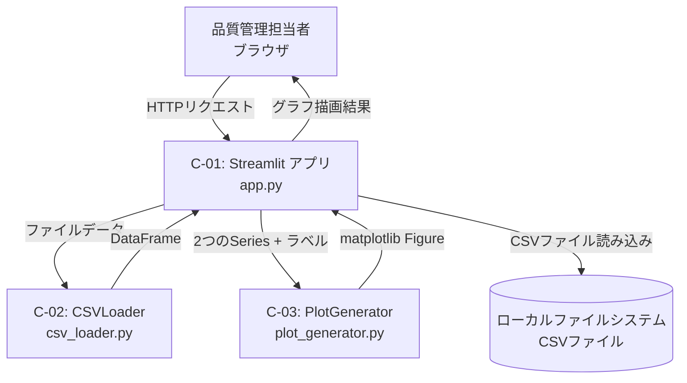
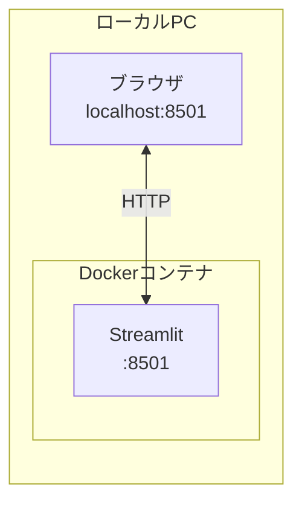
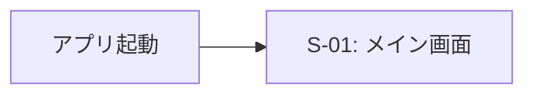
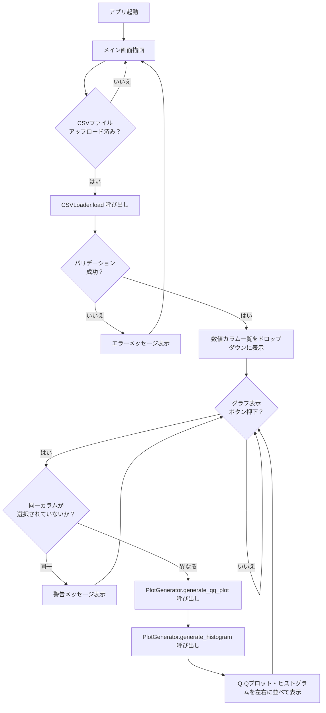
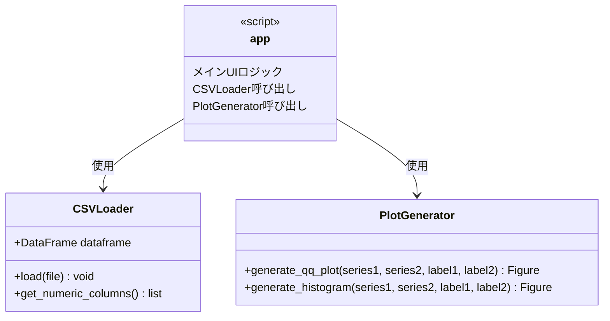
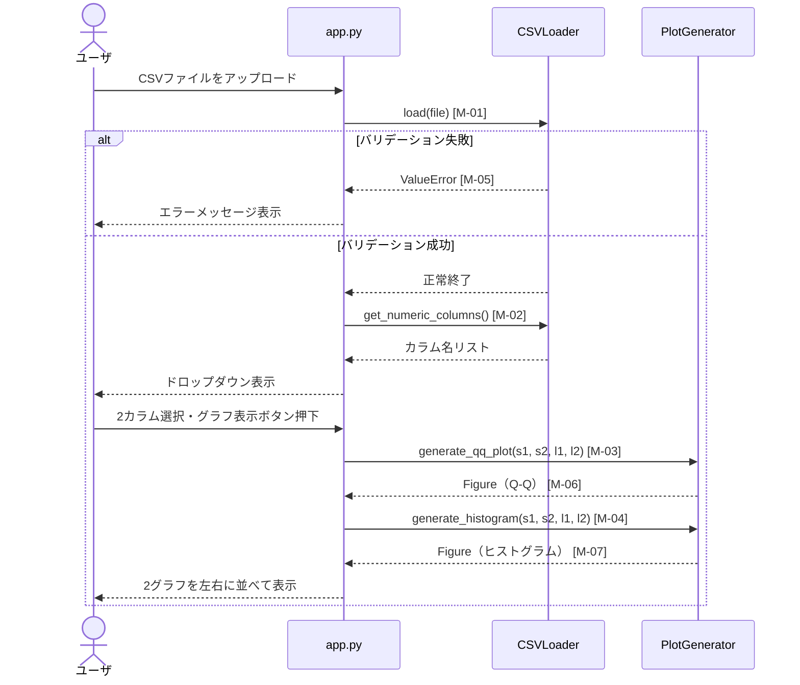

# 詳細設計書：CSV分布比較アプリ

## 1. 言語・フレームワーク

| 項目 | 選定内容 | 選定理由 |
|------|---------|---------|
| 言語 | Python 3.11 | 要件に指定あり。データ処理・可視化ライブラリが豊富 |
| GUIフレームワーク | Streamlit | 単一画面・シンプルなUIのため。複雑な画面遷移なし |
| CSVパース | pandas | CSV読み込み・数値カラム判定に使用 |
| グラフ描画 | matplotlib | Q-Qプロット・ヒストグラムの描画に使用 |
| 統計処理 | scipy.stats | 正規Q-Qプロットの分位点計算に使用 |
| コンテナ | Docker + Docker Compose | 起動・環境統一のため |

---

## 2. システム構成

### コンポーネント一覧

| コンポーネントID | コンポーネント名 | 役割 |
|----------------|---------------|------|
| C-01 | Streamlit アプリ | ユーザインタフェースの提供・各コンポーネントの呼び出し |
| C-02 | CSVLoader | CSVファイルの読み込みとバリデーション |
| C-03 | PlotGenerator | Q-Qプロット・ヒストグラムの生成 |

### システム構成図



### コンポーネント間のインタフェースとデータフロー

| 呼び出し元 | 呼び出し先 | 渡すデータ | 受け取るデータ |
|-----------|-----------|-----------|--------------|
| C-01 | C-02 | アップロードされたファイルオブジェクト | pandas DataFrame または エラー情報 |
| C-01 | C-03 | 2つの pandas Series・各ラベル文字列 | matplotlib Figure（Q-Q用）、matplotlib Figure（ヒストグラム用） |

### ネットワーク構成図



外部ネットワーク通信は一切発生しない。すべてローカルPC内で完結する。

---

## 3. データベース設計

本アプリはデータを永続化しないため、データベースは使用しない。
CSVから読み込んだデータはアプリのセッションメモリ上にのみ保持し、ブラウザセッション終了時に破棄される。

---

## 4. 外部設計

### 4-1. 画面設計

#### 画面一覧

| 画面ID | 画面名 | 説明 |
|--------|--------|------|
| S-01 | メイン画面 | 全操作を1画面で提供する。CSVアップロード・カラム選択・グラフ表示 |

#### 画面遷移図



画面遷移は存在しない。

#### S-01 メイン画面 モックアップ

```
┌──────────────────────────────────────────────────────────┐
│  CSV分布比較アプリ                                        │
├──────────────────────────────────────────────────────────┤
│                                                          │
│  CSVファイルをアップロードしてください                    │
│  ┌────────────────────────────────────────────────────┐  │
│  │  ファイルをドラッグ＆ドロップ または [参照...]      │  │
│  └────────────────────────────────────────────────────┘  │
│                                                          │
│  カラム1（比較対象1）                                    │
│  ┌──────────────────────────────┐                        │
│  │ （カラム名）              ▼  │                        │
│  └──────────────────────────────┘                        │
│                                                          │
│  カラム2（比較対象2）                                    │
│  ┌──────────────────────────────┐                        │
│  │ （カラム名）              ▼  │                        │
│  └──────────────────────────────┘                        │
│                                                          │
│  ┌────────────────┐                                      │
│  │  グラフを表示  │                                      │
│  └────────────────┘                                      │
│                                                          │
├────────────────────────┬─────────────────────────────────┤
│  正規Q-Qプロット       │  ヒストグラム                   │
│                        │                                 │
│          /             │    ██                           │
│        /               │    ████                         │
│      /                 │   ██████                        │
│    /                   │  ████████                       │
│  ___________________   │  ___________________________    │
│  カラム1  カラム2凡例  │  カラム1  カラム2凡例           │
└────────────────────────┴─────────────────────────────────┘
```

#### S-01 画面要素詳細

| 要素名 | 種別 | 表示条件 | 動作仕様 |
|--------|------|---------|---------|
| ファイルアップローダー | Streamlit file_uploader | 常時表示 | CSVファイルを受け付ける。アップロード完了後、カラム選択ドロップダウンを有効化する |
| カラム1ドロップダウン | Streamlit selectbox | CSVアップロード後に有効化 | CSVの数値カラム名一覧を選択肢として表示する |
| カラム2ドロップダウン | Streamlit selectbox | CSVアップロード後に有効化 | CSVの数値カラム名一覧を選択肢として表示する |
| グラフ表示ボタン | Streamlit button | CSVアップロード後に表示 | 押下時にQ-Qプロットとヒストグラムを生成・描画する |
| Q-Qプロット表示エリア | Streamlit pyplot | グラフ表示ボタン押下後 | matplotlibのFigureを左カラムに表示する |
| ヒストグラム表示エリア | Streamlit pyplot | グラフ表示ボタン押下後 | matplotlibのFigureを右カラムに表示する |
| エラーメッセージ | Streamlit error/warning | エラー発生時 | エラー内容を日本語でメッセージ表示する |

### 4-2. 外部システム連携

外部システムとの連携はなし。

### 4-3. 外部データベース連携

外部データベースとの連携はなし。

---

## 5. 内部設計

### 処理フロー全体



### Q-Qプロット生成処理詳細

1. scipy.stats.probplot を使用して、各Seriesの理論的正規分位点と実測分位点を計算する
2. カラム1のデータを1色目（例：青）でプロットする
3. カラム2のデータを2色目（例：橙）で同一グラフ上に重ねてプロットする
4. 各カラムについて、正規分布に近い場合に一直線となる参照線を描画する
5. 凡例にカラム名を表示する
6. 軸ラベルを日本語で設定する（横軸：理論分位点、縦軸：実測分位点）

### ヒストグラム生成処理詳細

1. カラム1のデータを半透明（alpha=0.5）の1色目（例：青）で描画する
2. カラム2のデータを半透明（alpha=0.5）の2色目（例：橙）で同一グラフ上に重ねて描画する
3. ビン数はスタージェスの公式（ビン数 = 1 + log₂(n)の切り上げ）で自動計算する
4. 凡例にカラム名を表示する
5. 軸ラベルを日本語で設定する（横軸：値、縦軸：頻度）

---

## 6. クラス設計

### クラス一覧

| クラス名 | 配置ファイル | 役割 |
|---------|------------|------|
| CSVLoader | csv_loader.py | CSVファイルの読み込みとバリデーション |
| PlotGenerator | plot_generator.py | Q-Qプロットとヒストグラムの生成 |
| ※メインアプリ | app.py | StreamlitのUIロジック（クラス化なし、スクリプト形式） |

### CSVLoader クラス

| 項目 | 内容 |
|------|------|
| 役割 | アップロードされたCSVファイルを読み込み、数値カラムを抽出する |

#### 属性

| 属性名 | 型 | 説明 |
|--------|---|------|
| dataframe | pandas.DataFrame | 読み込んだCSVデータ |

#### メソッド

| メソッド名 | 引数 | 戻り値 | 処理内容 |
|-----------|------|--------|---------|
| load | file: UploadedFile | なし（self.dataframeにセット） | UTF-8エンコードでCSVを読み込む。失敗時はValueErrorを送出する |
| get_numeric_columns | なし | list[str] | dataframeから数値型のカラム名一覧を返す。0件の場合はValueErrorを送出する |

### PlotGenerator クラス

| 項目 | 内容 |
|------|------|
| 役割 | 2つのpandas.Seriesを受け取り、グラフFigureを生成して返す |

#### 属性

なし（ステートレスクラス）

#### メソッド

| メソッド名 | 引数 | 戻り値 | 処理内容 |
|-----------|------|--------|---------|
| generate_qq_plot | series1: pd.Series, series2: pd.Series, label1: str, label2: str | matplotlib.figure.Figure | 2つのSeriesの正規Q-Qプロットを重ねて描画したFigureを返す |
| generate_histogram | series1: pd.Series, series2: pd.Series, label1: str, label2: str | matplotlib.figure.Figure | 2つのSeriesのヒストグラムを半透明で重ねて描画したFigureを返す |

### クラス図



---

## 7. オブジェクト指向設計におけるメッセージの整理

### メッセージ一覧

| メッセージID | 送信元 | 受信先 | メッセージ内容 | タイミング |
|------------|--------|--------|--------------|---------|
| M-01 | app | CSVLoader | load(file) | CSVファイルアップロード時 |
| M-02 | app | CSVLoader | get_numeric_columns() | M-01成功後、ドロップダウン構築時 |
| M-03 | app | PlotGenerator | generate_qq_plot(series1, series2, label1, label2) | グラフ表示ボタン押下時 |
| M-04 | app | PlotGenerator | generate_histogram(series1, series2, label1, label2) | M-03完了直後 |
| M-05 | CSVLoader | app | ValueError（エラー情報） | バリデーション失敗時 |
| M-06 | PlotGenerator | app | matplotlib.figure.Figure（Q-Q） | M-03の戻り値 |
| M-07 | PlotGenerator | app | matplotlib.figure.Figure（ヒストグラム） | M-04の戻り値 |

### メッセージフロー図



---

## 8. エラーハンドリング

### エラー一覧

| エラーID | 発生箇所 | 発生条件 | 対応処理 | 画面表示メッセージ |
|---------|---------|---------|---------|----------------|
| E-01 | CSVLoader.load | ファイルがUTF-8でデコードできない | ValueErrorを送出 | 「CSVファイルの文字コードはUTF-8のみ対応しています」 |
| E-02 | CSVLoader.load | pandasがCSVとして解析できない | ValueErrorを送出 | 「正しいCSV形式のファイルを選択してください」 |
| E-03 | CSVLoader.get_numeric_columns | 数値型カラムが1件以下 | ValueErrorを送出 | 「数値型のカラムが2件以上必要です」 |
| E-04 | app（UIロジック） | カラム1とカラム2に同じカラムが選択されている | 警告表示・グラフ生成を行わない | 「異なる2つのカラムを選択してください」 |
| E-05 | app（UIロジック） | 選択カラムの有効データ（非NaN）が0件 | エラー表示・グラフ生成を行わない | 「選択したカラムに有効なデータがありません」 |

---

## 9. セキュリティ設計

| 項目 | 設計内容 |
|------|---------|
| データの外部送信 | Streamlitはローカルで起動するため、データは外部に送信されない |
| ネットワーク公開 | Dockerコンテナのポートはlocalhostにのみバインドする（0.0.0.0ではなく127.0.0.1:8501） |
| ファイルアクセス | Streamlitのfile_uploaderで受け付けたファイルのみ処理し、サーバのファイルシステムへの直接アクセスは行わない |
| 認証・認可 | ローカル個人利用のため不要 |
| 入力バリデーション | CSVLoader内でファイル形式・文字コード・データ型を検証し、不正データは処理しない |

---

## 10. ソースコード構成

### ディレクトリ構成

```
csv_distribution_compare/
├── app.py
├── csv_loader.py
├── plot_generator.py
├── requirements.txt
├── Dockerfile
├── docker-compose.yml
└── README.md
```

### ファイル一覧

| ファイル名 | 役割 | 含まれるクラス・内容 |
|-----------|------|------------------|
| app.py | Streamlitアプリのエントリポイント。UIロジック全体 | クラスなし（スクリプト形式） |
| csv_loader.py | CSV読み込み・バリデーション | CSVLoader |
| plot_generator.py | グラフ生成ロジック | PlotGenerator |
| requirements.txt | Pythonライブラリの依存関係定義 | — |
| Dockerfile | Dockerイメージのビルド定義 | — |
| docker-compose.yml | コンテナ起動設定 | — |
| README.md | 起動方法・操作説明 | — |

### コーディング規約

| 項目 | 規約内容 |
|------|---------|
| 命名規則（クラス） | UpperCamelCase（例：CSVLoader） |
| 命名規則（メソッド・変数） | snake_case（例：get_numeric_columns） |
| 命名規則（定数） | UPPER_SNAKE_CASE |
| インデント | スペース4文字 |
| 文字コード | UTF-8 |
| 型ヒント | 全メソッドの引数・戻り値に型ヒントを付与する |
| コメント | 日本語で処理の意図を記述する。自明な処理にはコメント不要 |
| 1ファイル1クラス | クラスは対応するファイル名のファイルに配置する |
| 共通処理の重複禁止 | Q-Qプロット・ヒストグラムの共通グラフ設定（凡例・軸ラベル設定）はPlotGenerator内の共通メソッドに集約する |
| エラーハンドリング | 全てのValueErrorはapp.pyのUI層でキャッチし、st.errorまたはst.warningで表示する |

---

## 11. テスト設計

### テスト種別一覧

| テスト種別 | 目的 | 実施方法 |
|-----------|------|---------|
| 単体テスト | 各クラスのメソッドが単独で正しく動作することを確認 | pytest |
| 結合テスト | CSVLoader → PlotGeneratorの連携が正しく動作することを確認 | pytest |
| 総合テスト | ユーザ視点でアプリ全体の動作を確認 | 手動操作による確認 |

### 単体テストケース一覧

#### CSVLoader

| テストケースID | テスト対象メソッド | 入力条件 | 期待結果 | 正常/異常 |
|--------------|----------------|---------|---------|---------|
| UT-01 | load | 正常なUTF-8・カンマ区切りCSVファイル | dataframeに正しくデータが格納される | 正常 |
| UT-02 | load | UTF-8でないファイル（例：Shift-JIS） | ValueErrorが送出される | 異常 |
| UT-03 | load | CSVとして解析不可能なファイル | ValueErrorが送出される | 異常 |
| UT-04 | load | ヘッダ行のみで2行目以降が空のCSV | dataframeが0行のDataFrameとして格納される | 正常 |
| UT-05 | get_numeric_columns | 数値カラムが2件以上あるDataFrame | 数値カラム名のリストが返される | 正常 |
| UT-06 | get_numeric_columns | 数値カラムが0件のDataFrame | ValueErrorが送出される | 異常 |
| UT-07 | get_numeric_columns | 数値カラムが1件のDataFrame | ValueErrorが送出される | 異常 |

#### PlotGenerator

| テストケースID | テスト対象メソッド | 入力条件 | 期待結果 | 正常/異常 |
|--------------|----------------|---------|---------|---------|
| UT-08 | generate_qq_plot | 有効な2つのSeries・ラベル | matplotlib.figure.Figureオブジェクトが返される | 正常 |
| UT-09 | generate_qq_plot | データ件数が異なる2つのSeries | matplotlib.figure.Figureオブジェクトが返される | 正常 |
| UT-10 | generate_histogram | 有効な2つのSeries・ラベル | matplotlib.figure.Figureオブジェクトが返される | 正常 |
| UT-11 | generate_histogram | データ件数が異なる2つのSeries | matplotlib.figure.Figureオブジェクトが返される | 正常 |

### 結合テストケース一覧

| テストケースID | テスト内容 | 入力条件 | 期待結果 | 正常/異常 |
|--------------|---------|---------|---------|---------|
| IT-01 | F-01 + F-02：CSV読み込みからカラム抽出まで | 正常なCSVファイル | カラム名リストが取得できる | 正常 |
| IT-02 | F-02 + F-03：カラム選択からQ-Qプロット生成まで | 2つの有効なSeries | Q-QプロットのFigureが生成される | 正常 |
| IT-03 | F-02 + F-04：カラム選択からヒストグラム生成まで | 2つの有効なSeries | ヒストグラムのFigureが生成される | 正常 |
| IT-04 | F-01エラー伝播：不正CSVの場合 | UTF-8でないCSVファイル | エラーがapp.pyまで伝播し、UIにエラー表示される | 異常 |

### 総合テストケース一覧

| テストケースID | テスト内容 | 操作手順 | 期待結果 | 正常/異常 |
|--------------|---------|---------|---------|---------|
| ST-01 | 正常フロー全体 | ①アプリ起動②正常CSVアップロード③2カラム選択④グラフ表示ボタン押下 | Q-Qプロットとヒストグラムが左右に並んで表示される | 正常 |
| ST-02 | 異常CSVアップロード | ①アプリ起動②UTF-8でないCSVをアップロード | エラーメッセージが表示され、グラフは表示されない | 異常 |
| ST-03 | 同一カラム選択 | ①正常CSVアップロード②カラム1とカラム2に同じカラムを選択③グラフ表示ボタン押下 | 警告メッセージが表示され、グラフは表示されない | 異常 |
| ST-04 | グラフ再描画 | ①ST-01完了後②別のカラムを選択③グラフ表示ボタン再押下 | 新しいカラムのグラフに更新される | 正常 |

---

## 12. 起動・運用

### 起動方法

Docker Composeを使用して起動する。

```
docker-compose up --build
```

起動後、ブラウザで `http://localhost:8501` にアクセスする。

詳細な起動手順・操作説明はREADME.mdに記述する。

### Dockerfileの構成

| 項目 | 設定内容 |
|------|---------|
| ベースイメージ | python:3.11-slim |
| 公開ポート | 8501（Streamlitのデフォルトポート） |
| 起動コマンド | streamlit run app.py --server.address=0.0.0.0 |
| 依存ライブラリ | requirements.txtをCOPY後にpip installで導入 |

### docker-compose.yml の構成

| 項目 | 設定内容 |
|------|---------|
| サービス名 | app |
| ポートバインド | 127.0.0.1:8501:8501（ローカルのみ公開） |
| ボリューム | マウントなし（コンテナ内のソースコードを使用） |
| 初期化処理 | 不要（データベースなし） |

### README.mdに記述すべき内容

- 必要環境（Docker, Docker Compose のバージョン）
- 起動コマンド
- アクセスURL
- 操作手順（CSVアップロード → カラム選択 → グラフ表示）
- CSVファイルの形式要件（UTF-8・カンマ区切り・1行目ヘッダ・数値データ）

---

## 完全性チェック結果

### エンティティとクラス・画面の対応確認

| エンティティ | 対応クラス | 対応画面 | 状態管理 |
|------------|---------|---------|---------|
| CSVファイル | CSVLoader | S-01（ファイルアップローダー） | 未読み込み → 読み込み済み |
| カラムデータ | CSVLoader, PlotGenerator | S-01（ドロップダウン・グラフ領域） | 未選択 → 選択済み → グラフ表示済み |

### トランザクション・排他制御

本アプリはローカル単一ユーザ利用かつデータを永続化しないため、トランザクション管理・排他制御は不要。

### 不要な要素の確認

| 確認項目 | 判定 | 理由 |
|---------|------|------|
| バッチ処理 | 不要 | リアルタイム処理のみ |
| 認証・認可・監査ログ | 不要 | ローカル個人利用のため |
| 外部API・外部DB連携設計 | 不要 | 外部連携なし |
| データベース設計 | 不要 | データ永続化なし |

削除可能な要素は上記のとおりで、設計書から除外済み。

### 同一コードの重複禁止確認

| 共通処理 | 集約先 |
|---------|--------|
| グラフの軸ラベル・凡例設定 | PlotGenerator内の共通プライベートメソッド（`_apply_common_graph_settings`）に集約 |
| エラーメッセージのUI表示 | app.py内でValueErrorを一括キャッチして表示する単一の処理ブロックに集約 |
