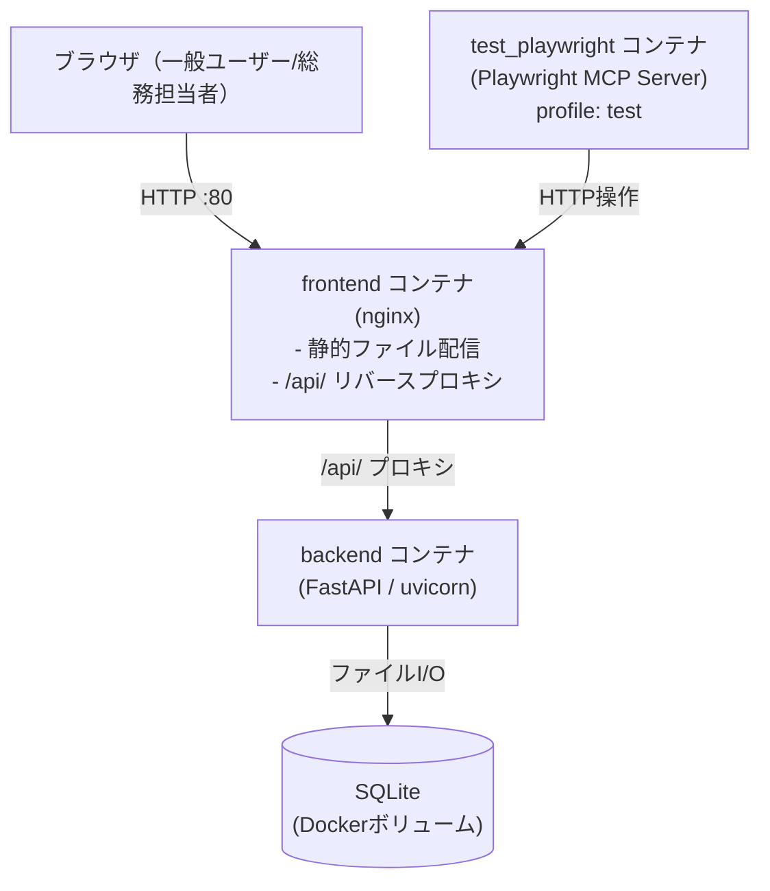
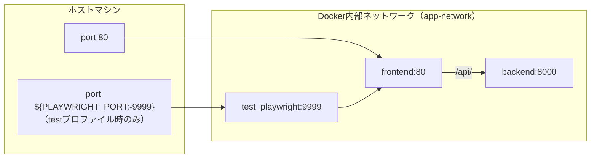
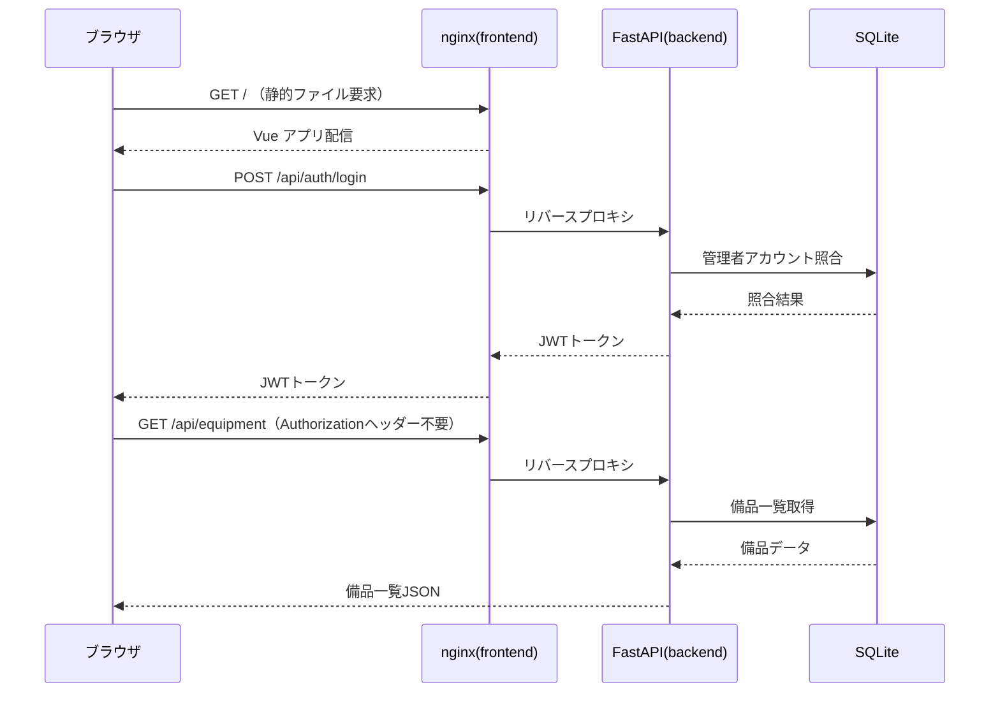
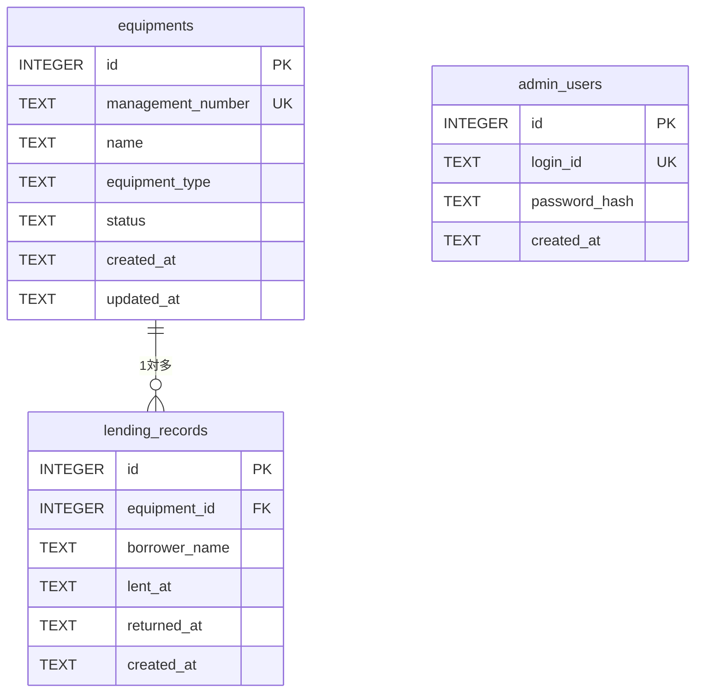
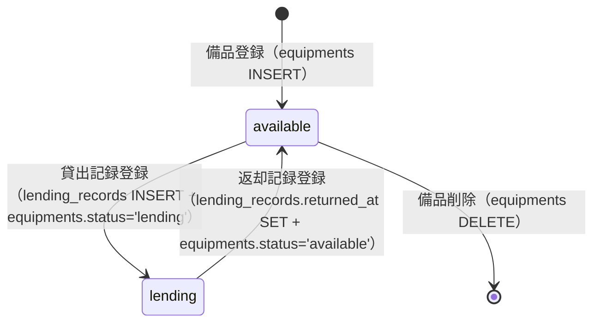
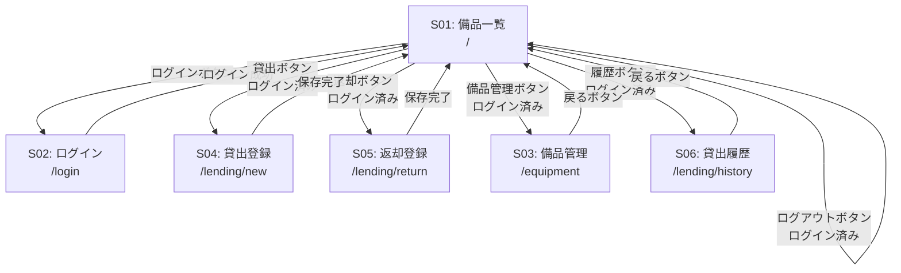
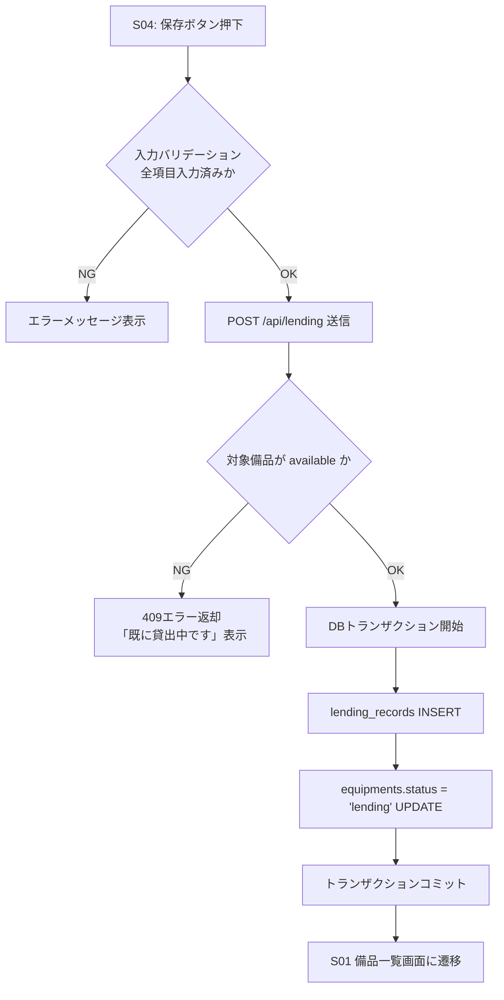
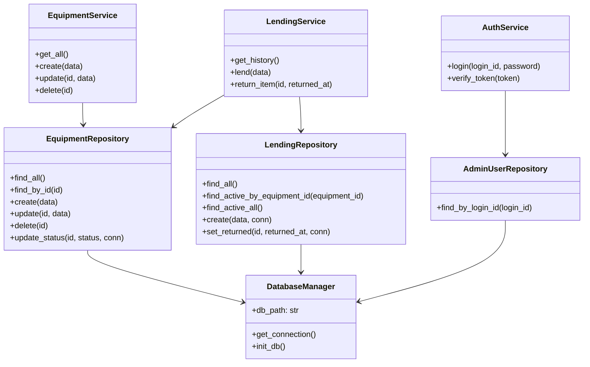
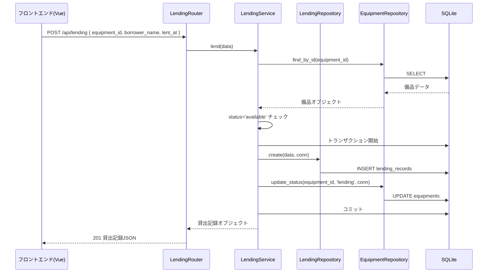

# 備品管理・貸出管理アプリ 詳細設計書

---

## 1. 言語・フレームワーク

| 区分 | 採用技術 | 選定理由 |
|------|---------|---------|
| フロントエンド | Vue 3 + Vuetify 3 | ログイン状態によるUI切替・ロールベースのボタン表示など、条件付き画面制御が必要なため |
| バックエンド | Python 3.12 + FastAPI | 要件に合わせたMVP構成、型安全なAPI定義 |
| データベース | SQLite | 外部DB不要、最大20人・小規模利用のため |
| 認証 | JWT（JSON Web Token） | ステートレス認証、実装シンプル |
| コンテナ | Docker / Docker Compose | 環境統一・起動手順の簡略化 |

### フロントエンドビルド方式

フロントエンドはマルチステージDockerfileで構築する。

- **ステージ1（ビルド）**: Node.jsイメージで `npm run build` を実行し、静的ファイルを生成する
- **ステージ2（配信）**: nginxイメージで生成した静的ファイルを配信する
- nginxはフロントエンド静的ファイルの配信と、`/api/` 以下へのリクエストをバックエンドにリバースプロキシする役割を担う
- フロントエンドのすべてのAPIリクエストは `/api/` 以下のパスに送信する

---

## 2. システム構成

### コンポーネント一覧

| コンポーネント | 技術 | 役割 |
|-------------|-----|------|
| frontend | Vue 3 + Vuetify 3 + nginx | UIの提供・静的ファイル配信・/api/リバースプロキシ |
| backend | FastAPI（Python） | 業務ロジック・REST API提供 |
| db_volume | Dockerボリューム（SQLiteファイル） | データ永続化 |
| test_playwright | Playwright MCP Server v0.0.70 | E2Eテスト実行環境（profileがtestのときのみ起動） |

### システム構成図



### ネットワーク構成図



### データフロー



---

## 3. データベース設計

### テーブル一覧

#### equipments（備品マスタ）

| カラム名 | データ型 | 制約 | 説明 |
|--------|--------|-----|------|
| id | INTEGER | PRIMARY KEY, AUTOINCREMENT | 内部ID |
| management_number | TEXT | NOT NULL, UNIQUE | 管理番号（例: PC-001） |
| name | TEXT | NOT NULL | 備品名 |
| equipment_type | TEXT | NOT NULL | 種別（ノートPC / プロジェクター） |
| status | TEXT | NOT NULL, DEFAULT 'available' | ステータス（available / lending） |
| created_at | TEXT | NOT NULL | 登録日時（ISO8601形式） |
| updated_at | TEXT | NOT NULL | 更新日時（ISO8601形式） |

業務制約: status が 'lending' の備品は削除不可。

#### lending_records（貸出記録）

| カラム名 | データ型 | 制約 | 説明 |
|--------|--------|-----|------|
| id | INTEGER | PRIMARY KEY, AUTOINCREMENT | 内部ID |
| equipment_id | INTEGER | NOT NULL, FK→equipments.id | 対象備品 |
| borrower_name | TEXT | NOT NULL | 借用者名 |
| lent_at | TEXT | NOT NULL | 貸出日（ISO8601形式） |
| returned_at | TEXT | NULL | 返却日（NULL=貸出中、ISO8601形式） |
| created_at | TEXT | NOT NULL | 登録日時（ISO8601形式） |

業務制約: 同一備品に対して returned_at が NULL の貸出記録は1件のみ存在可能。

#### admin_users（管理者アカウント）

| カラム名 | データ型 | 制約 | 説明 |
|--------|--------|-----|------|
| id | INTEGER | PRIMARY KEY, AUTOINCREMENT | 内部ID |
| login_id | TEXT | NOT NULL, UNIQUE | ログインID |
| password_hash | TEXT | NOT NULL | bcryptハッシュ化済みパスワード |
| created_at | TEXT | NOT NULL | 登録日時（ISO8601形式） |

初期データ: システム起動時に1件の管理者アカウント（環境変数から設定）を自動投入する。

### ER図



### 状態遷移



---

## 4. 外部設計

### API仕様

すべてのAPIはパス `/api/` 以下に配置する。

#### 認証API

| メソッド | パス | 認証要否 | 説明 |
|--------|-----|---------|------|
| POST | /api/auth/login | 不要 | ログイン（JWT発行） |
| POST | /api/auth/logout | 不要 | ログアウト（クライアント側トークン破棄） |

**POST /api/auth/login**

- リクエスト: `{ "login_id": "文字列", "password": "文字列" }`
- レスポンス成功(200): `{ "access_token": "JWT文字列", "token_type": "bearer" }`
- レスポンス失敗(401): `{ "detail": "IDまたはパスワードが正しくありません" }`
- バリデーション: login_id・password は必須、空文字不可

#### 備品API

| メソッド | パス | 認証要否 | 説明 |
|--------|-----|---------|------|
| GET | /api/equipment | 不要 | 備品一覧取得 |
| POST | /api/equipment | 必要 | 備品登録 |
| PUT | /api/equipment/{id} | 必要 | 備品編集 |
| DELETE | /api/equipment/{id} | 必要 | 備品削除 |

**GET /api/equipment**

- レスポンス(200): 備品オブジェクトの配列
  - 各オブジェクト: `{ id, management_number, name, equipment_type, status, borrower_name(貸出中のみ) }`

**POST /api/equipment**

- リクエスト: `{ "management_number": "文字列", "name": "文字列", "equipment_type": "文字列" }`
- バリデーション: 全項目必須、management_number は重複不可
- レスポンス成功(201): 登録した備品オブジェクト
- レスポンス失敗(409): management_number重複

**PUT /api/equipment/{id}**

- リクエスト: `{ "management_number": "文字列", "name": "文字列", "equipment_type": "文字列" }`
- バリデーション: 全項目必須、management_number は自分以外と重複不可
- レスポンス成功(200): 更新後の備品オブジェクト
- レスポンス失敗(404): 対象備品が存在しない

**DELETE /api/equipment/{id}**

- バリデーション: 貸出中（status='lending'）の場合は削除不可
- レスポンス成功(204): ボディなし
- レスポンス失敗(409): 貸出中のため削除不可
- レスポンス失敗(404): 対象備品が存在しない

#### 貸出・返却API

| メソッド | パス | 認証要否 | 説明 |
|--------|-----|---------|------|
| POST | /api/lending | 必要 | 貸出記録登録 |
| PUT | /api/lending/{id}/return | 必要 | 返却記録登録 |
| GET | /api/lending | 必要 | 貸出履歴一覧取得 |

**POST /api/lending**

- リクエスト: `{ "equipment_id": 整数, "borrower_name": "文字列", "lent_at": "ISO8601日付文字列" }`
- バリデーション: 全項目必須、対象備品が available であること
- レスポンス成功(201): 登録した貸出記録オブジェクト
- レスポンス失敗(409): 対象備品が既に貸出中

**PUT /api/lending/{id}/return**

- リクエスト: `{ "returned_at": "ISO8601日付文字列" }`
- バリデーション: 対象貸出記録が返却済みでないこと、returned_at は lent_at 以降であること
- レスポンス成功(200): 更新後の貸出記録オブジェクト
- レスポンス失敗(409): 既に返却済み

**GET /api/lending**

- レスポンス(200): 貸出記録オブジェクトの配列（全件、降順）
  - 各オブジェクト: `{ id, equipment_id, management_number, name, borrower_name, lent_at, returned_at }`

### 画面一覧・要素

| 画面ID | 画面名 | URL | 認証要否 | 主要UI要素 |
|--------|--------|-----|---------|----------|
| S01 | 備品一覧画面 | / | 不要 | 備品テーブル（管理番号・名前・種別・ステータス・借用者）、ログインボタン、ログイン済みの場合は貸出・返却・備品管理・履歴・ログアウトボタン |
| S02 | ログイン画面 | /login | 不要 | ログインIDフィールド、パスワードフィールド、ログインボタン、エラーメッセージ |
| S03 | 備品マスタ管理画面 | /equipment | 必要 | 備品テーブル、追加ダイアログ、編集ダイアログ、削除確認ダイアログ |
| S04 | 貸出記録登録画面 | /lending/new | 必要 | 備品選択（利用可能のみ）、借用者名入力、貸出日入力、保存ボタン |
| S05 | 返却記録登録画面 | /lending/return | 必要 | 貸出中備品選択（貸出記録一覧）、返却日入力、保存ボタン |
| S06 | 貸出履歴一覧画面 | /lending/history | 必要 | 履歴テーブル（管理番号・備品名・借用者・貸出日・返却日） |

### 画面遷移図



認証ガード: S03・S04・S05・S06 は未認証状態でアクセスした場合、S02（ログイン画面）にリダイレクトする。

### 画面モックアップ（AA）

**S01 備品一覧画面（未ログイン時）**

```
+----------------------------------------------------------+
| 備品管理システム                     [ログイン]           |
+----------------------------------------------------------+
| 備品一覧                                                 |
|                                                          |
| 管理番号  | 備品名        | 種別     | 状態     | 借用者  |
|-----------|---------------|----------|----------|---------|
| PC-001    | ノートPC A    | ノートPC | 利用可能 |         |
| PC-002    | ノートPC B    | ノートPC | 貸出中   | 山田太郎|
| PJ-001    | プロジェクター| プロジェクター| 利用可能|        |
+----------------------------------------------------------+
```

**S01 備品一覧画面（ログイン時）**

```
+----------------------------------------------------------+
| 備品管理システム  [貸出][返却][備品管理][履歴][ログアウト]|
+----------------------------------------------------------+
| 備品一覧                                                 |
|                                                          |
| 管理番号  | 備品名        | 種別     | 状態     | 借用者  |
|-----------|---------------|----------|----------|---------|
| PC-001    | ノートPC A    | ノートPC | 利用可能 |         |
| PC-002    | ノートPC B    | ノートPC | 貸出中   | 山田太郎|
+----------------------------------------------------------+
```

**S02 ログイン画面**

```
+----------------------------------+
| 備品管理システム ログイン         |
|                                  |
| ログインID: [________________]   |
| パスワード: [________________]   |
|                                  |
| [エラーメッセージ表示エリア]       |
|                                  |
|              [ログイン]          |
+----------------------------------+
```

**S03 備品マスタ管理画面**

```
+----------------------------------------------------------+
| 備品マスタ管理                     [+ 追加] [← 戻る]     |
+----------------------------------------------------------+
| 管理番号  | 備品名        | 種別     | 状態     | 操作   |
|-----------|---------------|----------|----------|--------|
| PC-001    | ノートPC A    | ノートPC | 利用可能 |[編集][削除]|
| PC-002    | ノートPC B    | ノートPC | 貸出中   |[編集]  |
+----------------------------------------------------------+
※貸出中の備品は削除ボタン非表示
```

**S04 貸出記録登録画面**

```
+----------------------------------+
| 貸出記録登録           [← 戻る]  |
|                                  |
| 備品:    [PC-001 ノートPC A ▼]  |
|          ※利用可能な備品のみ表示 |
| 借用者名: [________________]     |
| 貸出日:  [2026-04-06      📅]   |
|                                  |
|              [保存]              |
+----------------------------------+
```

**S05 返却記録登録画面**

```
+----------------------------------+
| 返却記録登録           [← 戻る]  |
|                                  |
| 貸出記録:                        |
| [PC-002 ノートPC B / 山田太郎 ▼]|
|          ※貸出中の記録のみ表示   |
| 返却日:  [2026-04-06      📅]   |
|                                  |
|              [保存]              |
+----------------------------------+
```

**S06 貸出履歴一覧画面**

```
+----------------------------------------------------------+
| 貸出履歴                                      [← 戻る]  |
+----------------------------------------------------------+
| 管理番号 | 備品名     | 借用者   | 貸出日     | 返却日    |
|----------|------------|----------|------------|-----------|
| PC-002   | ノートPC B | 山田太郎 | 2026-04-01 | 2026-04-05|
| PC-001   | ノートPC A | 鈴木花子 | 2026-03-20 | 2026-03-25|
+----------------------------------------------------------+
```

---

## 5. 内部設計

### 処理フロー

#### 貸出記録登録処理



#### 返却記録登録処理

```mermaid
flowchart TD
    A[S05: 保存ボタン押下] --> B{入力バリデーション\n全項目入力済みか}
    B -->|NG| C[エラーメッセージ表示]
    B -->|OK| D[PUT /api/lending/{id}/return 送信]
    D --> E{対象記録がNOT returned か}
    E -->|NG| F[409エラー返却\n「既に返却済みです」表示]
    E -->|OK| G[DBトランザクション開始]
    G --> H[lending_records.returned_at SET]
    H --> I[equipments.status = 'available' UPDATE]
    I --> J[トランザクションコミット]
    J --> K[S01 備品一覧画面に遷移]
```

### トランザクション境界

| 処理 | トランザクション境界 | ロールバック条件 |
|------|------------------|----------------|
| 貸出記録登録 | lending_records INSERT + equipments status UPDATE | どちらか一方が失敗した場合 |
| 返却記録登録 | lending_records returned_at UPDATE + equipments status UPDATE | どちらか一方が失敗した場合 |
| 備品登録・編集・削除 | equipments の単一操作 | INSERT/UPDATE/DELETE 失敗時 |

### 排他制御

| 対象 | 方式 | 詳細 |
|------|------|------|
| 貸出記録登録 | 楽観的ロック | equipments.status が 'available' であることをトランザクション内で確認。同時貸出を DB の UNIQUE 制約（贈出中 1件のみ許可）で防止 |
| 返却記録登録 | 楽観的ロック | lending_records.returned_at が NULL であることをトランザクション内で確認 |

---

## 6. クラス設計

### クラス一覧

| クラス名 | 区分 | 役割 |
|--------|-----|------|
| DatabaseManager | 共通 | SQLite接続管理（シングルトン）、テーブル作成・初期データ投入 |
| EquipmentRepository | リポジトリ | 備品テーブルのCRUD操作 |
| LendingRepository | リポジトリ | 貸出記録テーブルのCRUD操作 |
| AdminUserRepository | リポジトリ | 管理者アカウントテーブルの照合 |
| EquipmentService | サービス | 備品に関する業務ロジック（登録・編集・削除・一覧） |
| LendingService | サービス | 貸出・返却に関する業務ロジック |
| AuthService | サービス | ログイン照合・JWTトークン生成・検証 |
| EquipmentRouter | ルーター | FastAPI 備品APIエンドポイント定義 |
| LendingRouter | ルーター | FastAPI 貸出・返却APIエンドポイント定義 |
| AuthRouter | ルーター | FastAPI 認証APIエンドポイント定義 |

### 各クラスの主な属性とメソッド

#### DatabaseManager

- 属性: db_path（SQLiteファイルパス）
- メソッド:
  - get_connection: DBコネクションを返す
  - init_db: テーブル作成・初期管理者データ投入（起動時に1回実行）

#### EquipmentRepository

- メソッド:
  - find_all: 全備品取得（貸出中の場合は借用者名も結合して返す）
  - find_by_id: IDで備品取得
  - create: 備品登録
  - update: 備品更新
  - delete: 備品削除
  - update_status: ステータス更新（トランザクション内で使用）

#### LendingRepository

- メソッド:
  - find_all: 全貸出記録取得（備品情報結合）
  - find_active_by_equipment_id: 指定備品の貸出中記録取得
  - find_active_all: 全貸出中記録取得
  - create: 貸出記録登録
  - set_returned: 返却日をセット

#### AdminUserRepository

- メソッド:
  - find_by_login_id: ログインIDで管理者取得

#### EquipmentService

- 依存: EquipmentRepository
- メソッド:
  - get_all: 全備品一覧を返す
  - create: バリデーション後に備品登録
  - update: バリデーション後に備品更新
  - delete: 貸出中チェック後に備品削除

#### LendingService

- 依存: LendingRepository, EquipmentRepository
- メソッド:
  - get_history: 全貸出履歴を返す
  - lend: 貸出可能チェック後にトランザクションで貸出登録・備品ステータス更新
  - return_item: 返却済みチェック後にトランザクションで返却登録・備品ステータス更新

#### AuthService

- 依存: AdminUserRepository
- メソッド:
  - login: ログインID照合・パスワードハッシュ照合・JWT生成
  - verify_token: JWTトークン検証・ユーザー情報抽出

### クラス図



---

## 7. メッセージ整理

| メッセージ名 | 送信元 | 送信先 | 内容 |
|-----------|------|------|------|
| ログインリクエスト | フロントエンド | AuthRouter | login_id, password |
| JWTトークン | AuthRouter | フロントエンド | access_token（localStorage保存） |
| 備品一覧リクエスト | フロントエンド | EquipmentRouter | なし（認証不要） |
| 備品一覧レスポンス | EquipmentRouter | フロントエンド | 備品オブジェクト配列 |
| 貸出登録リクエスト | フロントエンド | LendingRouter | equipment_id, borrower_name, lent_at, Authorizationヘッダー |
| 返却登録リクエスト | フロントエンド | LendingRouter | returned_at, Authorizationヘッダー |
| エラーレスポンス | バックエンド | フロントエンド | `{ "detail": "エラーメッセージ" }` |

### メッセージフロー（貸出登録）



---

## 8. エラーハンドリング

| エラー種別 | 発生箇所 | HTTPステータス | ユーザー向けメッセージ |
|----------|---------|-------------|------------------|
| ログインID・パスワード不一致 | AuthService | 401 | IDまたはパスワードが正しくありません |
| JWTトークン無効・期限切れ | AuthService | 401 | 認証が必要です。再ログインしてください |
| 備品 管理番号重複 | EquipmentService | 409 | この管理番号はすでに登録されています |
| 備品 貸出中のため削除不可 | EquipmentService | 409 | 貸出中の備品は削除できません |
| 備品 存在しない | EquipmentRepository | 404 | 指定された備品が見つかりません |
| 貸出対象備品が貸出中 | LendingService | 409 | この備品はすでに貸出中です |
| 返却対象が返却済み | LendingService | 409 | この貸出記録はすでに返却済みです |
| 入力バリデーションエラー | FastAPI（Pydantic） | 422 | 入力内容を確認してください |
| DBアクセスエラー | Repository全般 | 500 | システムエラーが発生しました |
| 未認証でのAPIアクセス | 認証依存ルーター | 401 | 認証が必要です |

フロントエンドは全APIレスポンスのエラーを axios のインターセプターで一元的に受け取り、画面上に表示する。

---

## 9. セキュリティ設計

| 項目 | 設計内容 |
|------|---------|
| パスワード保存 | bcrypt でハッシュ化して保存。平文パスワードはDBに保存しない |
| 認証方式 | JWT（HS256）。有効期限は8時間 |
| JWT保存先 | フロントエンドの localStorage に保存 |
| 認可制御 | 管理操作APIは FastAPI Dependency で JWT 検証を必須とする |
| 未認証リダイレクト | フロントエンドの Vue Router ナビゲーションガードで S02 にリダイレクト |
| CORS | バックエンドは frontend コンテナのオリジンのみ許可（docker内部通信のためnginxが唯一のリバースプロキシ） |
| SQLインジェクション | SQLite アクセスはすべてプレースホルダーバインドを使用 |
| 監査ログ | 貸出・返却・備品変更操作はバックエンドの標準ログ（uvicornアクセスログ）に記録される |

---

## 10. ソースコード構成

```
project/
├── docker-compose.yml
├── .env.example
├── README.md
├── frontend/
│   ├── Dockerfile           # マルチステージ: node ビルド → nginx 配信
│   ├── nginx.conf           # /api/ リバースプロキシ設定
│   ├── package.json
│   └── src/
│       ├── main.js          # Vue アプリエントリーポイント
│       ├── App.vue          # ルートコンポーネント
│       ├── router/
│       │   └── index.js     # ルーティング定義・ナビゲーションガード
│       ├── stores/
│       │   └── auth.js      # Pinia: 認証状態管理
│       ├── api/
│       │   └── client.js    # axios インスタンス・インターセプター・全API関数
│       └── pages/
│           ├── EquipmentList.vue        # S01: 備品一覧
│           ├── LoginPage.vue            # S02: ログイン
│           ├── EquipmentManagement.vue  # S03: 備品マスタ管理
│           ├── LendingNew.vue           # S04: 貸出記録登録
│           ├── LendingReturn.vue        # S05: 返却記録登録
│           └── LendingHistory.vue       # S06: 貸出履歴
├── backend/
│   ├── Dockerfile
│   ├── requirements.txt
│   ├── main.py              # FastAPI アプリ定義・ルーター登録・CORS設定
│   ├── database.py          # DatabaseManager クラス
│   ├── models/
│   │   ├── equipment.py     # Pydantic スキーマ: Equipment
│   │   ├── lending_record.py # Pydantic スキーマ: LendingRecord
│   │   └── admin_user.py    # Pydantic スキーマ: AdminUser
│   ├── repositories/
│   │   ├── equipment_repository.py
│   │   ├── lending_repository.py
│   │   └── admin_user_repository.py
│   ├── services/
│   │   ├── equipment_service.py
│   │   ├── lending_service.py
│   │   └── auth_service.py
│   ├── routers/
│   │   ├── equipment.py     # EquipmentRouter
│   │   ├── lending.py       # LendingRouter
│   │   └── auth.py          # AuthRouter
│   └── common/
│       ├── auth.py          # JWT 生成・検証・認証 Dependency
│       └── errors.py        # 共通例外クラス定義
└── e2e/
    ├── tests/
    │   └── scenarios.spec.js # E2Eテストコード（Playwright）
    └── playwright.config.js
```

### ファイル・クラス対応表

| ファイル | 格納クラス・役割 |
|--------|--------------|
| backend/database.py | DatabaseManager |
| backend/repositories/equipment_repository.py | EquipmentRepository |
| backend/repositories/lending_repository.py | LendingRepository |
| backend/repositories/admin_user_repository.py | AdminUserRepository |
| backend/services/equipment_service.py | EquipmentService |
| backend/services/lending_service.py | LendingService |
| backend/services/auth_service.py | AuthService |
| backend/routers/equipment.py | EquipmentRouter（FastAPI APIRouter） |
| backend/routers/lending.py | LendingRouter（FastAPI APIRouter） |
| backend/routers/auth.py | AuthRouter（FastAPI APIRouter） |
| backend/common/auth.py | JWT生成・検証・get_current_admin Dependency |
| backend/common/errors.py | AppError, NotFoundError, ConflictError の基底例外 |
| frontend/src/api/client.js | axios インスタンス・全API呼び出し関数 |
| frontend/src/stores/auth.js | Pinia認証ストア |

### コーディング規約

| 項目 | 規約 |
|------|-----|
| Python 変数・関数名 | スネークケース（snake_case） |
| Python クラス名 | パスカルケース（PascalCase） |
| Vue コンポーネント名 | パスカルケース（PascalCase） |
| JavaScript 変数・関数名 | キャメルケース（camelCase） |
| API パス | ケバブケース（/lending-records）ただし今回はシンプルな単語のみ |
| 共通処理 | 2回以上使用される処理は必ず共通モジュール（common/ または api/client.js）に配置する |
| コメント | 日本語で記述する |

---

## 11. 起動・運用設計

### docker-compose.yml 構成

```
services:
  frontend:
    build: ./frontend（マルチステージ）
    ports: 80:80
    depends_on: backend

  backend:
    build: ./backend
    volumes: db_data:/app/db
    env_file: .env
    ※ 起動時に DatabaseManager.init_db() を自動実行してテーブル作成・初期管理者登録

  test_playwright:
    image: mcr.microsoft.com/playwright:v1.50.0（または playwright-mcp:0.0.70）
    ports: ${PLAYWRIGHT_PORT:-9999}:9999
    profiles: ["test"]               ← 通常起動では起動しない
    volumes: ./e2e:/e2e              ← テストコードをマウント（変更が即時反映）
    command: playwright mcp --port 9999

volumes:
  db_data:
```

### 初期化処理

- バックエンドの起動時（FastAPIアプリ起動イベント）に `DatabaseManager.init_db()` を実行する
- init_db は以下を行う:
  1. 全テーブルが存在しなければ CREATE TABLE
  2. admin_users テーブルにレコードが0件の場合、環境変数 `ADMIN_LOGIN_ID` と `ADMIN_PASSWORD` から初期管理者アカウントを bcrypt ハッシュ化して INSERT

### 環境変数（.env.example）

| 変数名 | 説明 | デフォルト例 |
|--------|------|------------|
| ADMIN_LOGIN_ID | 初期管理者ログインID | admin |
| ADMIN_PASSWORD | 初期管理者パスワード | AdminPass123 |
| JWT_SECRET_KEY | JWT署名キー | 本番環境では必ず変更すること |
| PLAYWRIGHT_PORT | PlaywrightMCPポート | 9999 |

### README.md 記述事項

README.md には以下を記述すること:

1. **起動方法**
   - `docker compose up --build` で全サービス起動
   - アクセスURL: `http://localhost`
   - 初期管理者ログイン: .env の ADMIN_LOGIN_ID / ADMIN_PASSWORD を参照

2. **E2Eテスト実行方法**
   - `docker compose --profile test up --build` でPlaywright MCP含む全サービス起動
   - MCP接続エンドポイント: `http://localhost:9999/mcp`

3. **Playwright MCP接続手順**
   - GitHub Copilot: `.vscode/mcp.json` に `{ "servers": { "test_playwright": { "type": "http", "url": "http://localhost:9999/mcp" } } }` を追加
   - Claude Code: `claude mcp add --transport http test_playwright http://localhost:9999/mcp`
   - Roo Code: settings.json の `roo-cline.mcpServers` に追加

---

## 12. テスト設計

### テスト種別一覧

| 種別 | 対象 | 目的 |
|------|------|------|
| 単体テスト | 各 Service・Repository クラス | 各クラスの処理が正しく動作すること |
| 結合テスト | FastAPI エンドポイント（TestClient使用） | API仕様通りのリクエスト・レスポンスが返ること |
| E2Eテスト | Playwright MCP経由ブラウザ操作 | ユーザー視点での全シナリオが動作すること |

### 単体テストケース一覧

| テスト対象 | テストケース | 正常/異常 |
|----------|-----------|---------|
| EquipmentService.create | 正常な備品登録 | 正常 |
| EquipmentService.create | 管理番号重複登録 | 異常 |
| EquipmentService.delete | 利用可能な備品の削除 | 正常 |
| EquipmentService.delete | 貸出中備品の削除 | 異常 |
| LendingService.lend | 利用可能な備品への貸出 | 正常 |
| LendingService.lend | 貸出中備品への貸出 | 異常 |
| LendingService.return_item | 貸出中の返却 | 正常 |
| LendingService.return_item | 既に返却済みの再返却 | 異常 |
| AuthService.login | 正しいID・PW | 正常 |
| AuthService.login | 誤ったID・PW | 異常 |
| AuthService.verify_token | 有効なJWT | 正常 |
| AuthService.verify_token | 無効・期限切れのJWT | 異常 |

### 結合テストケース一覧

| エンドポイント | テストケース | 期待ステータス |
|------------|-----------|------------|
| POST /api/auth/login | 正常ログイン | 200 |
| POST /api/auth/login | 認証失敗 | 401 |
| GET /api/equipment | 未認証で一覧取得 | 200 |
| POST /api/equipment | 認証済みで備品登録 | 201 |
| POST /api/equipment | 未認証で備品登録 | 401 |
| POST /api/equipment | 管理番号重複 | 409 |
| DELETE /api/equipment/{id} | 貸出中備品の削除 | 409 |
| POST /api/lending | 利用可能備品の貸出 | 201 |
| POST /api/lending | 貸出中備品の貸出 | 409 |
| PUT /api/lending/{id}/return | 正常返却 | 200 |
| PUT /api/lending/{id}/return | 返却済みへの再返却 | 409 |
| GET /api/lending | 認証済みで履歴取得 | 200 |
| GET /api/lending | 未認証で履歴取得 | 401 |

---

## 13. E2Eテスト設計

### 実行フロー

1. 全コードの実装完了後、`docker compose --profile test up --build` で起動する
2. Playwright MCP サーバー (`http://localhost:9999/mcp`) に接続する
   - MCP サーバーが利用できない場合は、ユーザーに接続手順（README.md を参照）を案内する
3. 以下の全シナリオについて MCP 経由でブラウザ操作し E2E テストを実行する
4. テスト結果を確認し、失敗があれば実装を修正し再実行する
5. 全テストが成功するまで繰り返す

### playwrightテスト環境

- Playwright MCP Server v0.0.70 を使用する
- エンドポイント: `http://localhost:${PLAYWRIGHT_PORT:-8931}/mcp`（v0.0.70以降は `/mcp`、`/sse` ではない）
- docker-compose の profile を `test` とし、通常起動（`docker compose up`）では起動しない
- `./e2e` ディレクトリをコンテナにマウントし、テストコードの変更が即時反映されるようにする

### E2Eテストシナリオ一覧

| No | シナリオ名 | 前提条件 | テスト手順 | 期待される結果 |
|----|-----------|---------|-----------|--------------|
| T01 | 一般ユーザーが備品一覧を閲覧する | 初期データあり | `http://localhost` にアクセス | 備品テーブルが表示される。ログインボタンのみが表示され、貸出・返却ボタンは表示されない |
| T02 | 総務担当者がログインする | S01表示中 | ログインボタンクリック → ログインID・パスワード入力 → ログインボタンクリック | S01に戻り、貸出・返却・備品管理・履歴・ログアウトボタンが表示される |
| T03 | 総務担当者が備品を登録する | ログイン済み | 備品管理ボタンクリック → 追加ボタンクリック → 管理番号「PC-TEST」・備品名「テストPC」・種別「ノートPC」入力 → 保存 | S03の備品一覧に「PC-TEST」が追加表示される |
| T04 | 総務担当者が備品を編集する | ログイン済み、PC-TESTが登録済み | S03で PC-TEST の編集ボタンクリック → 備品名を「テストPC改」に変更 → 保存 | 備品一覧の PC-TEST の名前が「テストPC改」に更新される |
| T05 | 総務担当者が備品を削除する | ログイン済み、PC-TESTが利用可能 | S03でPC-TESTの削除ボタンクリック → 確認ダイアログで確認 | 備品一覧から PC-TEST が消える |
| T06 | 貸出記録を登録する | ログイン済み、利用可能な備品あり | 貸出ボタンクリック → 備品選択 → 借用者名「山田太郎」入力 → 貸出日入力 → 保存 | S01で対象備品のステータスが「貸出中」になり借用者名「山田太郎」が表示される |
| T07 | 返却記録を登録する | ログイン済み、貸出中の備品あり | 返却ボタンクリック → 貸出記録選択 → 返却日入力 → 保存 | S01で対象備品のステータスが「利用可能」に戻る |
| T08 | 貸出履歴を確認する | ログイン済み、貸出記録あり | 履歴ボタンクリック | S06に貸出履歴テーブルが表示される |
| T09 | 未ログイン時に操作ボタンが非表示 | 未ログイン状態 | `http://localhost` にアクセス | 貸出・返却・備品管理・履歴ボタンが表示されない |
| T10 | ログアウトする | ログイン済み | ログアウトボタンクリック | 貸出・返却・備品管理・履歴ボタンが非表示になり、ログインボタンが表示される |

---

## 14. 設計レビュー結果

### 矛盾チェック

| チェック項目 | 結果 |
|------------|------|
| 全APIのパスが /api/ 以下に統一されているか | ✓ |
| 画面とAPIの対応が一致しているか | ✓ |
| 状態遷移（available/lending）が DB・API・フロントで一貫しているか | ✓ |
| 未認証での閲覧（S01, GET /api/equipment）が一貫して許可されているか | ✓ |
| 貸出中備品の削除を DB・Service・E2Eで防いでいるか | ✓ |
| トランザクション境界がサービス層で定義されているか | ✓ |

### 冗長設計の排除

| 削除した要素 | 理由 |
|-----------|------|
| 管理者アカウントのCRUD画面 | 担当者固定運用のため初期データ投入のみで足りる |
| 備品検索機能 | 備品数が少なく（ノートPC・プロジェクターのみ）不要 |
| 将来拡張（予約・通知）| 要件外 |

### 共通化確認

- 全APIリクエスト処理は `frontend/src/api/client.js` に集約（重複なし）
- JWT検証ロジックは `backend/common/auth.py` の Dependency に集約（重複なし）
- エラーレスポンス生成は `backend/common/errors.py` の例外クラスに集約（重複なし）
- DB接続は `DatabaseManager` シングルトンに集約（重複なし）
