# 備品管理・貸出予約アプリ 詳細設計書

## 0. 方針・前提
- 本書は要件定義書[doc/requirements.md](doc/requirements.md:1)に基づき作成する。
- 言語: Python 3.11。
- フロントエンド: Vue 3 + Vuetify（複数画面/ロール切替のため）。
- バックエンド: FastAPI。
- DB: PostgreSQL 15。
- 起動: docker compose。コンテナ起動時にマイグレーション・初期管理者作成を自動実行する。
- 非機能: 主要画面応答10秒以内、同時接続約10人。
- ログ/監査: 操作ログは取得しない。認証失敗ログのみDB保存し、アプリログ（INFO/ERROR）をファイル出力。通知・外部連携なし。
- 本書ではコード例を記述しない。

## 1. システム構成

### 1.1 コンポーネント一覧
| コンポーネント | 技術 | 役割/機能 |
|---|---|---|
| Webブラウザ | Chrome等 | ユーザー/管理者のGUI利用 |
| フロントエンド | Vue 3 + Vuetify | 認証、画面表示、API呼び出し、ロール別メニュー制御 |
| バックエンドAPI | FastAPI | 認証、業務ロジック、排他制御、バリデーション、スケジュールバッチ実行 |
| DB | PostgreSQL | 永続化、排他/整合性制約、トランザクション管理 |
| バッチ（スケジューラ） | cron + バックエンドAPI呼出 | 返却予定超過の状態更新（日次） |

### 1.2 システム構成図
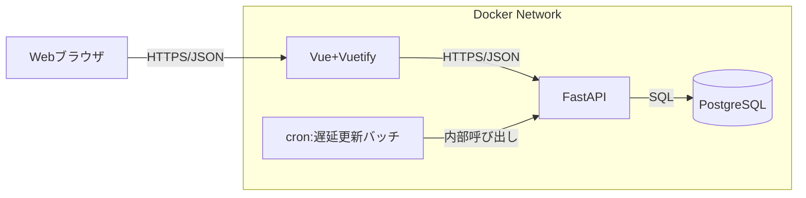

### 1.3 ネットワーク構成図
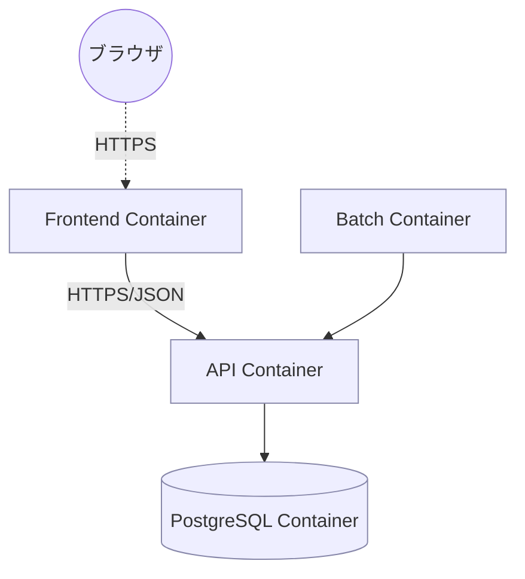

### 1.4 コンポーネント間インターフェース・データフロー
- フロントエンド⇔バックエンド: HTTPS/JSON (REST)。JWTベアラートークンで認証。
- バックエンド⇔DB: psycopg2/SQLAlchemyによるSQL。トランザクション境界でACIDを担保。
- バッチ⇔バックエンド: 内部HTTP呼び出し、またはバックエンド内のスケジュールジョブ実行。

## 2. 言語・フレームワーク選定理由
- 画面数が多くロール別メニューが必要なため、コンポーネント指向のVue+Vuetifyを採用。
- 非同期I/Oとスキーマ化されたAPIバリデーションのためFastAPIを採用。
- 排他・日付範囲重複チェックをDBレイヤーで強固にするためPostgreSQLを採用（EXCLUDE制約活用）。

## 3. データベース設計

### 3.1 テーブル定義
| テーブル | 主キー | 主なカラム | 制約 |
|---|---|---|---|
| users | id(UUID) | email(UNIQUE), password_hash, name, role(user/admin), status(active/inactive), created_at, updated_at, last_login_at | email一意、statusチェック、roleチェック |
| equipments | id(UUID) | name, category, model, serial_no, asset_tag(UNIQUE), purchase_date, note, status(available/reserved/loaned/overdue/retired), created_at, updated_at | asset_tag一意、statusチェック |
| reservations | id(UUID) | equipment_id(FK), user_id(FK), start_date, end_date, status(confirmed/cancelled/finished/overdue), cancel_reason, created_at, updated_at | EXCLUDE USING GIST (equipment_id WITH =, daterange(start_date,end_date,'[]') WITH &&)で重複禁止、start<=end、end-start<=7日、start<=today+30日 |
| lendings | id(UUID) | reservation_id(FK UNIQUE), lent_by(FK users), lend_date, due_date, status(loaned/returned/overdue), created_at, updated_at | reservation_id一意、statusチェック、lend_dateは予約開始日以上、due_dateは予約のend_dateと一致させる |
| returns | id(UUID) | lending_id(FK UNIQUE), returned_by(FK users), return_date, condition_note, created_at | lending_id一意 |
| auth_fail_logs | id(BIGSERIAL) | email, reason, occurred_at, ip | 監査用（認証失敗のみ） |

### 3.2 リレーションとER図
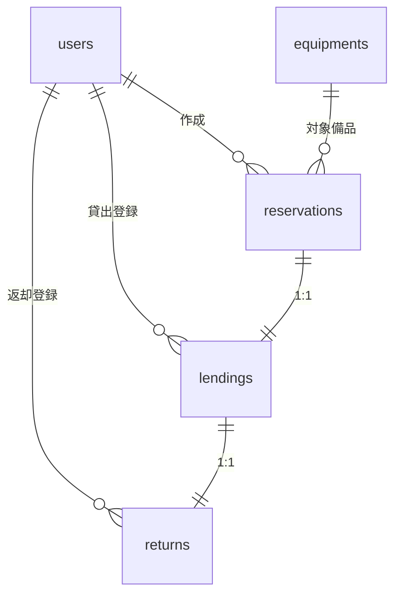

### 3.3 業務エンティティとCRUD/状態

| エンティティ | CRUD/一覧/詳細/検索 | 状態 | 状態遷移 |
|---|---|---|---|
| ユーザー | あり | active/inactive | active↔inactive（管理者操作） |
| 備品 | あり | available/reserved/loaned/overdue/retired | available→reserved→loaned→available；期限超過でoverdue→返却でavailable；retiredは終端 |
| 予約 | あり | confirmed/cancelled/finished/overdue | confirmed→(前日まで)cancelled→(貸出完了後)finished；期限超過でoverdue |
| 貸出 | あり | loaned/returned/overdue | loaned→returned；期限超過でoverdue |
| 返却 | あり | なし | 貸出に1:1で紐づく実績 |

- PK: 全テーブルでUUID（auth_fail_logs除く）。
- FK: reservations.equipment_id→equipments.id、reservations.user_id→users.id、lendings.reservation_id→reservations.id、returns.lending_id→lendings.id。
- 業務制約: 予約期間は開始≦終了、最長7日、開始は当日以降30日先まで、貸出は予約開始日以降に限定し、貸出のdue_dateは予約end_dateと一致させる。
- 排他: reservationsにGIST EXCLUDEで日付範囲重複を禁止（同一equipment_id）。
- 一意: users.email、equipments.asset_tag、lendings.reservation_id、returns.lending_id。
- 参照整合性: ON DELETE RESTRICT（履歴保持のため削除不可、廃止はstatusで管理）。

### 3.4 状態遷移図（エンティティ別）
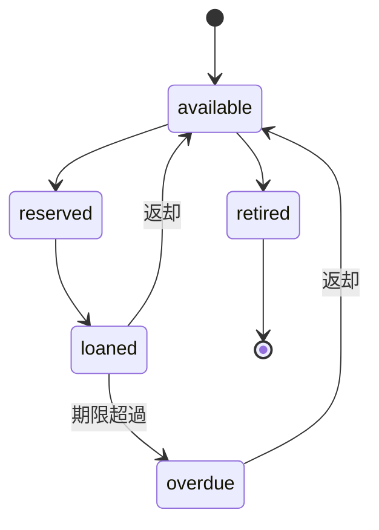
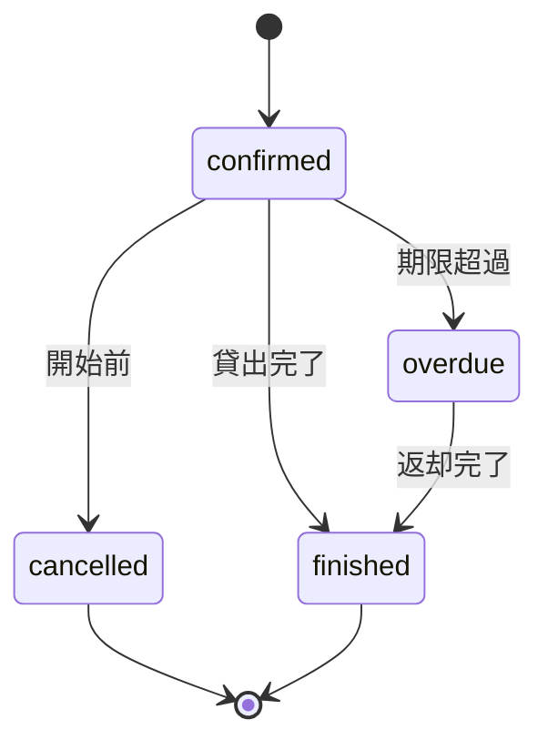
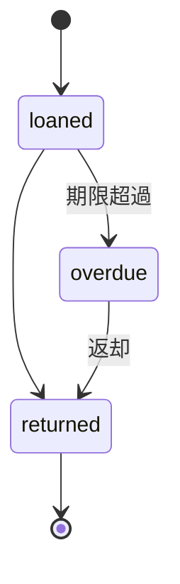

### 3.5 トランザクション境界とロールバック条件（エンティティ別）
- ユーザー: 単一トランザクション。email一意違反やrole/statusバリデーション違反時にロールバック。
- 備品: 単一トランザクション。asset_tag一意違反、状態遷移不整合時にロールバック。
- 予約: EXCLUDE制約評価を含むトランザクション。重複/期間違反/状態不整合でロールバック。
- 貸出: reservation行をFOR UPDATEし、予約・備品の状態更新を同一トランザクションで実施。状態不整合・日付違反でロールバック。
- 返却: lending行をFOR UPDATEし、貸出・予約・備品の状態更新を同一トランザクションで実施。日付/状態不整合でロールバック。
- バッチ: overdue更新をトランザクション単位でコミット。失敗時は当該バッチ単位でロールバックし、次回再実行。

## 4. 外部設計（画面/UI）

### 4.1 画面一覧と要素
| 画面 | 主要要素/機能 |
|---|---|
| ログイン | メール、パスワード、ログインボタン、認証失敗メッセージ |
| 備品一覧/空き状況 | カレンダー（日単位）、備品検索（名称/分類/ステータス）、空き表示、予約遷移リンク |
| 予約作成/変更/キャンセル | 備品選択、日付選択（開始・終了）、確認、作成/変更/キャンセルボタン、期間バリデーション、重複エラー表示 |
| 貸出登録（管理者） | 予約選択、貸出日入力、担当者選択（自分）、登録ボタン、ステータス更新表示 |
| 返却登録（管理者） | 貸出選択、返却日入力、状態メモ、登録ボタン、遅延判定表示 |
| 遅延一覧（管理者） | overdueフィルタ、予約/貸出情報表示、対応メモ欄（表示のみ） |
| 履歴一覧 | 予約/貸出/返却履歴テーブル、フィルタ（期間、備品、利用者） |
| 備品登録・編集（管理者） | 名称、分類、型番、シリアル、資産番号、購入日、備考、状態（retired含む） |
| ユーザー管理（管理者） | メール、氏名、ロール、状態(active/inactive)、パスワードリセット |

### 4.2 画面遷移図
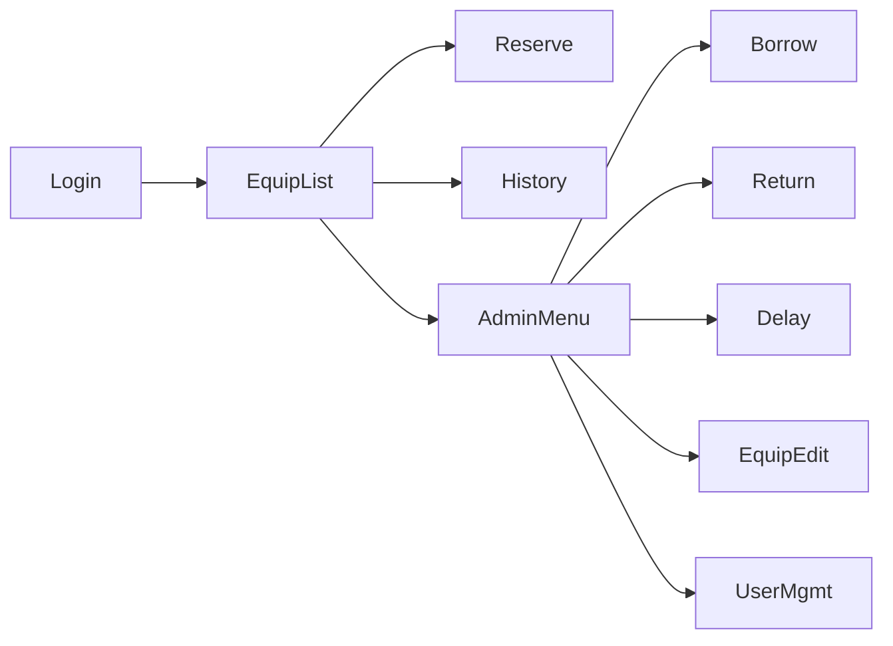

### 4.3 画面AAモック
#### ログイン
```
┌───────────────────────┐
│ メール [_____________]│
│ パスワード [________]│
│ [ ログイン ]          │
│ (メッセージ領域)       │
└───────────────────────┘
```

#### 備品一覧/空き状況
```
┌検索条件──────────────┐
│ 名称/分類 [_____ ] 状態[▼] │
│ [検索]                    │
└───────────┬────────┘
            カレンダー(日)
            備品ごとの空き/予約表示
            [予約へ]
```

#### 予約作成/変更/キャンセル
```
┌予約──────────────┐
│ 備品 [▼]             │
│ 開始日 [____] 終了日[____]│
│ [期間チェック結果]    │
│ [作成/変更][キャンセル]│
└────────────────┘
```

#### 貸出登録（管理者）
```
┌貸出──────────────┐
│ 予約選択 [▼]         │
│ 貸出日 [____]         │
│ 担当者:ログイン者表示 │
│ [貸出登録]            │
└────────────────┘
```

#### 返却登録（管理者）
```
┌返却──────────────┐
│ 貸出選択 [▼]         │
│ 返却日 [____]         │
│ 状態メモ [________]   │
│ [返却登録]            │
└────────────────┘
```

#### 遅延一覧（管理者）
```
┌遅延一覧────────────┐
│ フィルタ:備品/利用者   │
│ テーブル: 予約ID/備品/利用者/期限 │
└────────────────┘
```

#### 履歴一覧
```
┌履歴──────────────┐
│ フィルタ:期間/備品/利用者 │
│ テーブル: 種別/日付/担当  │
└────────────────┘
```

#### 備品登録・編集（管理者）
```
┌備品──────────────┐
│ 名称/分類/型番/資産番号 │
│ シリアル/購入日/備考    │
│ 状態[available|retired] │
│ [登録/更新]             │
└────────────────┘
```

#### ユーザー管理（管理者）
```
┌ユーザー───────────┐
│ メール/氏名/ロール    │
│ 状態[active|inactive] │
│ [作成][更新][無効化]  │
└────────────────┘
```

### 4.4 外部システム・外部DB
- 連携なし（通知・カレンダー・外部DBなし）。

## 5. API設計（REST, JSON）
| API | メソッド/パス | 認可 | 入力バリデーション | 出力 | エラー仕様 |
|---|---|---|---|---|---|
| ログイン | POST /auth/login | なし | email必須(メール形式)、password必須(8文字以上) | JWT, user情報 | 401:認証失敗（auth_fail_logs記録） |
| ユーザー一覧/詳細 | GET /users, /users/{id} | admin | クエリ:status/role | ユーザー配列/詳細 | 400:不正パラメータ |
| ユーザー登録/更新/無効化/パスワードリセット | POST /users, PUT /users/{id}, PUT /users/{id}/disable, POST /users/{id}/reset-password | admin | email一意、role∈{user,admin}、status∈{active,inactive}、password 8文字以上 | ユーザー | 400:形式違反, 409:email重複 |
| 備品一覧/詳細 | GET /equipments, /equipments/{id} | user/admin | クエリ:名称/分類/状態 | 備品配列/詳細 | 400:不正パラメータ |
| 備品登録/更新/廃止 | POST /equipments, PUT /equipments/{id}, PUT /equipments/{id}/retire | admin | 名称必須、asset_tag一意、status∈{available,reserved,loaned,overdue,retired} | 備品 | 400:形式違反, 409:asset_tag重複 |
| 予約作成 | POST /reservations | user/admin | equipment_id必須, start<=end, 期間<=7日, start<=today+30 | 予約 | 409:重複予約, 400:期間違反 |
| 予約更新/キャンセル | PUT /reservations/{id}, DELETE /reservations/{id} | user(本人)/admin | キャンセルは開始前のみ（管理者は当日以降可） | 更新後予約 | 403:権限不足, 409:状態不整合 |
| 予約一覧/詳細 | GET /reservations, /reservations/{id} | adminは全件/利用者は自分 | フィルタ:期間/備品/状態 | 予約配列/詳細 | 400:不正パラメータ |
| 貸出登録/一覧/詳細 | POST /lendings, GET /lendings, GET /lendings/{id} | admin | reservation.status=confirmedのみ、lend_date>=予約開始 | 貸出 | 409:状態不整合, 400:日付不正 |
| 返却登録/一覧/詳細 | POST /returns, GET /returns, GET /returns/{id} | admin | lending_id必須、return_date>=lend_date | 返却 | 409:状態不整合, 400:日付不正 |
| 遅延一覧 | GET /overdues | admin | なし | overdueの予約/貸出一覧 | 200のみ |
| 履歴一覧 | GET /histories | user/admin | 種別/期間フィルタ | 履歴配列 | 200のみ |
| バッチ実行 | POST /jobs/mark-overdue | admin/internal | 実行トークンまたは管理者ロール | 実行結果 | 500:内部エラー |

エラー応答はJSON `{code, message}`。バリデーションエラーは400、認証401、認可403、重複/整合性409、存在しないリソース404、内部500。

## 6. 内部設計（処理・トランザクション）

### 6.1 トランザクション境界・排他
- ユーザー: 単一トランザクション。email一意違反時ロールバック。
- 備品: 単一トランザクション。asset_tag一意違反時ロールバック。
- 予約作成/変更: トランザクション内でEXCLUDE制約により重複を防止。必要に応じequipment行をSELECT ... FOR UPDATEでロックし状態更新を直列化。失敗時はロールバック。
- 貸出登録: reservation行をFOR UPDATE、ステータスconfirmedのみ許可。貸出作成と予約ステータス更新、備品ステータス更新を同一トランザクションで実施。失敗時ロールバック。
- 返却登録: lending行をFOR UPDATE。返却作成、貸出ステータスreturned、予約finished、備品available更新を同一トランザクション。
- バッチ: overdue判定を1トランザクション単位で更新（件数が多い場合はバッチサイズ分割）。
- 排他方式: 予約重複はDBのGIST EXCLUDE（厳密）。状態更新は悲観ロック（SELECT ... FOR UPDATE）で整合性確保。楽観ロックは使用しない。

### 6.2 処理フロー
#### ログイン
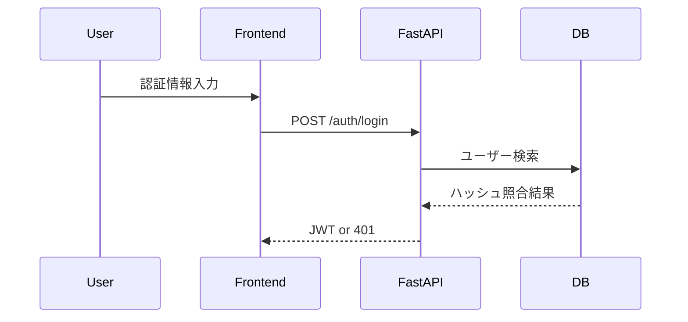

#### 予約作成
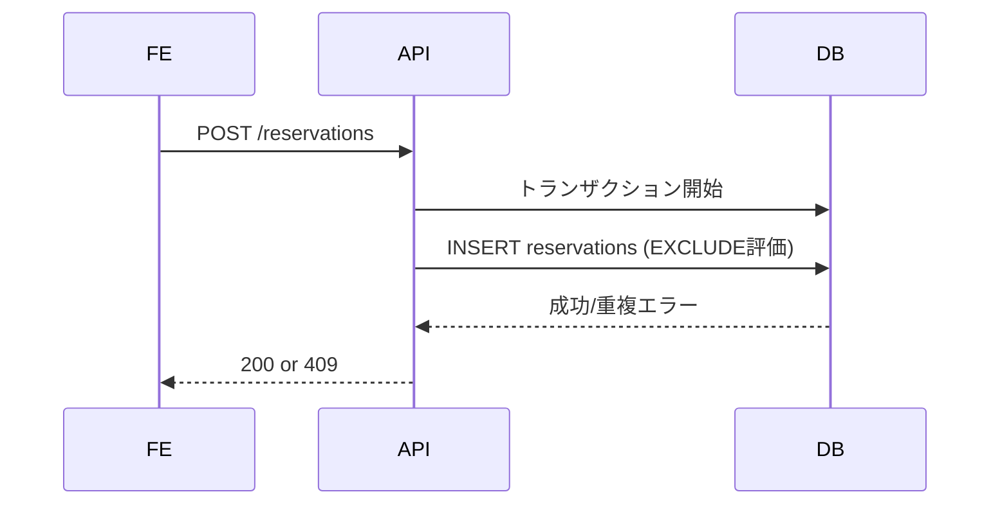

#### 貸出登録
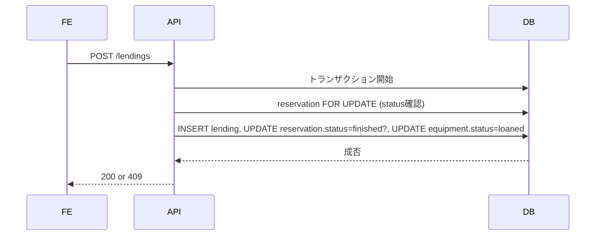

#### 返却登録
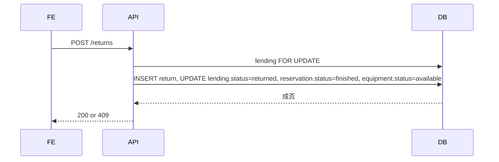

#### 遅延バッチ（日次）
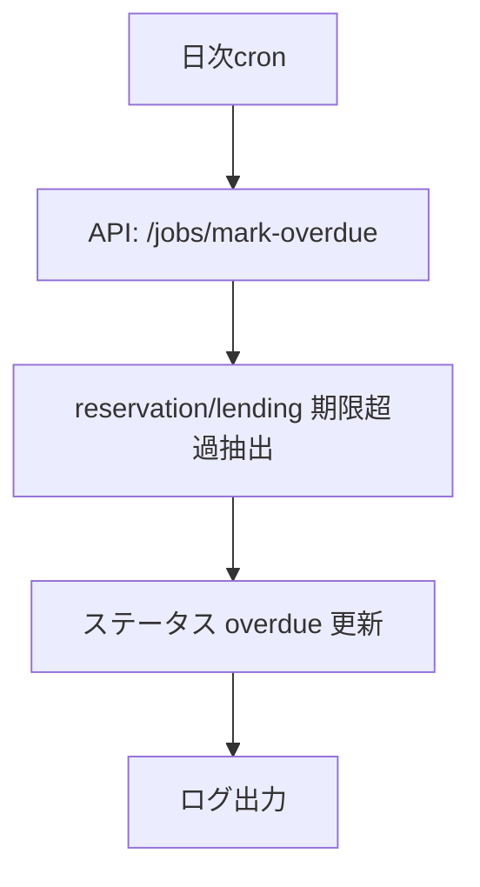

### 6.3 バッチ設計
- ジョブ: 返却予定日超過の予約/貸出をoverdueへ更新。
- スケジュール: 1日1回 00:30。コンテナ内cron→API内部処理。
- リトライ: 失敗時はアプリログにERROR、次回実行で再試行。DBトランザクション単位でロールバック。

## 7. クラス設計

### 7.1 クラス一覧（バックエンド）
| クラス | 役割 | 主な属性 | 主なメソッド |
|---|---|---|---|
| AuthService | 認証/トークン発行 | repo, jwt_secret | login(email,pw), verify(token) |
| UserService | ユーザー管理 | repo | create, update, disable, reset_password, list, get |
| EquipmentService | 備品管理 | repo | create, update, retire, list, get |
| ReservationService | 予約管理 | repo | create, update, cancel, list, get, checkOverlap |
| LendingService | 貸出管理 | repo | create, list, get |
| ReturnService | 返却管理 | repo | create, list, get |
| OverdueJob | バッチ | services | run |
| Repositories(各) | DBアクセス | session | add, find, list, update |
| DTO(各API) | 入出力バリデーション | フィールド定義 | to_domain, from_domain |

### 7.1.1 共通モジュール
- CommonValidation: 日付範囲チェック（期間<=7日、開始<=終了、開始<=today+30）。
- JwtProvider: JWT発行/検証（HS256）。
- PasswordHasher: PBKDF2ハッシュ/検証。

### 7.2 クラス図
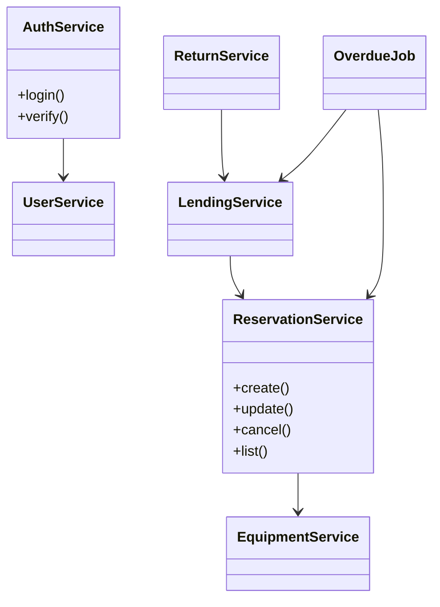

### 7.3 エンティティ⇔画面・API・クラス対応
| エンティティ | 画面 | API | クラス |
|---|---|---|---|
| ユーザー | ユーザー管理、ログイン | /auth/login, /users | AuthService, UserService |
| 備品 | 備品一覧/編集 | /equipments | EquipmentService |
| 予約 | 備品一覧/空き、予約画面 | /reservations | ReservationService |
| 貸出 | 貸出登録 | /lendings | LendingService |
| 返却 | 返却登録 | /returns | ReturnService |

### 7.4 共通化と重複禁止方針
- 日付バリデーション、JWT発行/検証、パスワードハッシュはbackend/app/commonに集約し、各サービスで再実装しない。
- 予約重複チェックはReservationService.checkOverlapに集約し、すべての予約系APIで共通利用する。
- ロール/権限ガードは共通ミドルウェアで実装し、各ルーターで重複実装しない。

## 8. メッセージ設計

### 8.1 メッセージ一覧
| 名称 | 方向 | 内容 | 役割 |
|---|---|---|---|
| LoginRequest | FE→API | email, password | 認証 |
| LoginResponse | API→FE | token, user | トークン供給 |
| UserListRequest | FE→API | status, role | ユーザー一覧取得 |
| UserCommandRequest | FE→API | email, name, role, status, password | ユーザー作成/更新/無効化/リセット |
| EquipmentListRequest | FE→API | フィルタ | 備品検索 |
| EquipmentCommandRequest | FE→API | name, category, asset_tag, status | 備品登録/更新/廃止 |
| ReservationCreateRequest | FE→API | equipment_id, start_date, end_date | 予約作成 |
| ReservationQueryRequest | FE→API | 期間/備品/状態 | 予約一覧取得 |
| ReservationCreateResponse | API→FE | 予約 | 確定通知 |
| LendingCreateRequest | FE→API | reservation_id, lend_date | 貸出登録 |
| LendingListRequest | FE→API | 予約ID/状態 | 貸出一覧取得 |
| ReturnCreateRequest | FE→API | lending_id, return_date | 返却登録 |
| ReturnListRequest | FE→API | 貸出ID | 返却一覧取得 |
| OverdueListRequest | FE→API | なし | 遅延一覧取得 |
| HistoryListRequest | FE→API | 種別/期間 | 履歴一覧取得 |
| BatchRunRequest | FE→API(管理/internal) | 実行トークン | バッチ実行指示 |
| ErrorResponse | API→FE | code, message | エラー提示 |

### 8.2 メッセージフロー図（予約作成）
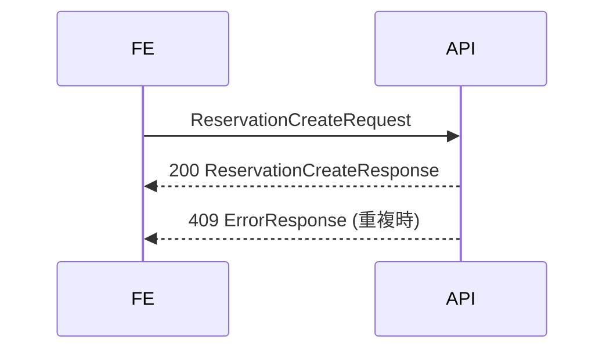

## 9. エラーハンドリング
| 事象 | ステータス | メッセージ例 | 対応 |
|---|---|---|---|
| 認証失敗 | 401 | 認証に失敗しました | auth_fail_logsに記録 |
| 権限不足 | 403 | 権限がありません | 処理中断 |
| バリデーション違反 | 400 | 入力が不正です | フィールド別エラー返却 |
| 予約重複 | 409 | 同一期間に予約があります | トランザクションロールバック |
| 状態不整合 | 409 | 現在の状態では処理できません | ロールバック |
| 内部エラー | 500 | サーバーエラー | ログ出力のみ |

## 10. セキュリティ設計
- 認証: JWT（HS256）、有効期限1日。ログイン時に発行。
- 認可: ロールベース（user/admin）。エンドポイント毎にガード。
- パスワード: PBKDF2でハッシュ保存。8文字以上をAPIで検証。
- 通信: HTTPS前提。リバースプロキシでTLS終端。
- CSRF: JWTをAuthorizationヘッダ送信とし、Cookie未使用のため不要。
- 入力検証: FastAPI/Pydanticで型・必須・範囲チェック。
- ログ: 認証失敗をauth_fail_logsに保存。操作ログなし。

## 11. ソース構成

### 11.1 ディレクトリ構成（AA）
```
project-root
├ backend
│ ├ app
│ │ ├ api
│ │ ├ services
│ │ ├ repositories
│ │ ├ schemas
│ │ ├ models
│ │ ├ common
│ │ └ jobs
│ ├ tests
│ └ alembic
├ frontend
│ ├ src
│ │ ├ components
│ │ ├ views
│ │ ├ router
│ │ └ store
│ └ tests
├ docker-compose.yml
└ README.md
```

### 11.2 ディレクトリ役割・主クラス
| ディレクトリ | 役割 | 主なクラス/ファイル |
|---|---|---|
| backend/app/api | FastAPIルーター | 各APIエンドポイント定義 |
| backend/app/services | ドメインロジック | AuthService, ReservationService等 |
| backend/app/repositories | DBアクセス | 各リポジトリ |
| backend/app/schemas | 入出力スキーマ | DTO/Pydanticモデル |
| backend/app/models | ORMモデル | users, equipments, reservations等 |
| backend/app/common | 共通処理 | JwtProvider, CommonValidation, PasswordHasher |
| backend/app/jobs | バッチ | OverdueJob |
| backend/tests | 単体/結合テスト | pytestケース |
| frontend/src/views | 画面 | 各Vue画面コンポーネント |
| frontend/src/router | ルーティング | ロール別ガード |
| frontend/src/store | 状態管理 | 認証/画面状態 |
| frontend/tests | フロント単体/統合テスト | テストケース |

### 11.3 コーディング規約
- Python: PEP8準拠、型ヒント必須、関数名/変数名はsnake_case、クラス名はPascalCase、docstringで目的記載。
- FastAPI: ルーターは機能別モジュール、サービスとリポジトリを分離、例外はHTTPExceptionに集約。
- Vue: Composition API、Script setup、ファイル名はPascalCase.vue、i18n不要、日本語ラベル固定。
- テスト: pytestでGiven-When-Thenコメント、データ固定にfixture。
- 共通処理: バリデーション、日付計算、JWT発行は共通モジュールに集約し重複禁止。

## 12. テスト設計

### 12.1 テスト種別
| 種別 | 内容 |
|---|---|
| 単体テスト | サービス/リポジトリ/スキーマのメソッド単体 |
| 結合テスト | APIエンドポイントとDBの連携、排他制約の検証 |
| 総合テスト | ブラウザ経由のユーザーフロー（ログイン→予約→貸出→返却→履歴） |

### 12.2 テストケース（抜粋・全機能網羅）
- 認証: 正常ログイン、パスワード誤り(401, ログ記録)。
- ユーザー: 正常登録、email重複(409)、role/status異常(400)、無効化後ログイン不可確認、パスワードリセットで再ログイン可。
- 備品: 正常登録、asset_tag重複(400/409)、retired状態で予約不可確認。
- 予約: 正常作成、7日超過(400)、30日超過(400)、開始>終了(400)、重複(409: EXCLUDE)、キャンセル権限制御（利用者は前日まで）。
- 貸出: 予約がconfirmedでない場合(409)、貸出日が予約開始前(400)、成功でstatus更新。
- 返却: 返却日が貸出日前(400)、返却で備品availableに戻る、遅延時overdue→available更新。
- 遅延一覧: 期限超過でoverdue表示。
- 履歴: フィルタで期間/利用者絞り込み。
- 権限: userが管理API呼出で403、adminは許可。
- バッチ: 期限超過データをoverdueへ更新、ロールバック確認。
- UI: 各画面で入力必須チェック、エラー表示、ロール別メニュー表示。

## 13. 起動・運用
- docker composeでAPI/DB/フロント/バッチ/（任意でnginx）を起動。
- 起動時フロー: DB起動→alembicマイグレーション→初期管理者作成→API起動→フロント起動。
- 初期化: 初期管理者メール/パスワードは環境変数で受け取り、存在しない場合のみ作成。
- 運用: バックアップはDB側スナップショット手順をREADMEに記載。通知/監査ログは不要。
- READMEに起動方法・環境変数・初期ユーザー情報・マイグレーション手順を記載する。

## 14. 不要要素の列挙
- 通知・外部カレンダー連携: 要件で不要。
- バーコード/QR対応: 不要。
- 帳票/CSV出力: 不要。
- 複数拠点管理: 不要。

## 15. レビュー（矛盾・冗長チェック）
- 要件との整合: GUI、日単位予約、30日先/最長7日、二重予約防止をEXCLUDE制約と悲観ロックで担保。通知や外部連携を含めていない。
- 冗長排除: 履歴は既存テーブルを参照し、別途履歴テーブルを設けない。共通処理（JWT、日付バリデーション）は共通モジュールに集約し重複実装を禁止。
- セキュリティ: 要件に従いMFA/監査ログなし、認証失敗のみ記録。
- テスト: 全機能に正常/異常を定義済み。
