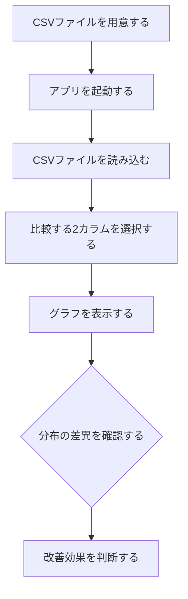
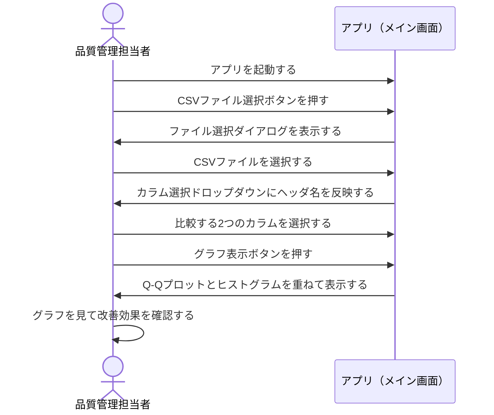

# 要件定義書：CSV分布比較アプリ

## 1. 目的・前提

### システム目的
CSVファイルから任意の2カラムを選択し、改善前後の検査データの分布を正規Q-Qプロットとヒストグラムで重ねて可視化することで、品質管理担当者が改善効果を視覚的に確認できるようにする。

### 用語集

| 用語 | 説明 |
|------|------|
| 正規Q-Qプロット | データが正規分布に従っているかを視覚的に確認するグラフ。横軸に理論的な正規分布の分位点、縦軸に実測データの分位点をプロットする |
| ヒストグラム | データの値の頻度分布を棒グラフで表したもの |
| 分布比較 | 2つのデータセットの分布形状・ばらつきを重ねて表示し、差異を確認すること |
| 改善前データ | 品質改善施策を実施する前の検査測定値 |
| 改善後データ | 品質改善施策を実施した後の検査測定値 |

### インタフェース形式
- **GUI**（グラフィカルユーザインタフェース）

---

## 2. 業務

### 対象業務一覧

| No | 業務名 | 担当者 |
|----|--------|--------|
| B-01 | 改善前後データの分布比較確認 | 品質管理担当者 |

### 業務フロー

### 業務の範囲・担当者
- **担当者**：品質管理担当者（1〜2名）
- **範囲**：CSVファイルの準備から、グラフによる分布確認・判断まで

### 業務課題・KPI

| 業務課題ID | 課題内容 | KPI |
|-----------|---------|-----|
| P-01 | 改善前後のデータ分布を手動でグラフ化するのに時間がかかる | グラフ生成までの時間を5分以内に短縮 |
| P-02 | 分布の正規性と変化を同一画面で確認できない | Q-Qプロットとヒストグラムを同時に確認できること |

### 解決すべき課題と対応方針

| 課題ID | 対応方針 |
|--------|---------|
| P-01 | CSVファイルとカラムを選択するだけでグラフを自動生成する機能を提供する |
| P-02 | Q-Qプロットとヒストグラムを1画面に同時表示し、改善前後を重ねて描画する |

### システム化による見込み経営効果

| 効果区分 | 内容 |
|---------|------|
| Soft Saving（人件費削減） | グラフ手動作成時間の削減。1回あたり約30分 → 5分未満に短縮（担当者1〜2名分） |

---

## 3. 機能要件

### 機能一覧

| 機能ID | 機能名 | 対応業務課題 | この機能が無いと何が困るか |
|--------|--------|------------|--------------------------|
| F-01 | CSVファイル読み込み | P-01 | データを取り込めず、グラフを生成できない |
| F-02 | カラム選択 | P-01 | 比較対象を指定できず、グラフを生成できない |
| F-03 | 正規Q-Qプロット表示 | P-02 | データの正規性と改善前後の差異を確認できない |
| F-04 | ヒストグラム表示 | P-02 | データの頻度分布の変化を確認できない |

### 入力データ

| 項目 | 内容 |
|------|------|
| CSVファイル | UTF-8・カンマ区切り。1行目はヘッダ行（カラム名）。2行目以降は数値データ |
| カラム選択 | ユーザがドロップダウンから2カラムを選択 |

### 出力データ

| 項目 | 内容 |
|------|------|
| 正規Q-Qプロット | 選択した2カラムのデータを重ねて表示 |
| ヒストグラム | 選択した2カラムのデータを重ねて表示 |

### 外部連携
なし

### 画面一覧

| 画面ID | 画面名 | 説明 |
|--------|--------|------|
| S-01 | メイン画面 | CSVファイル選択・カラム選択・グラフ表示をすべて1画面で行う |

### 画面遷移

画面遷移は存在しない（メイン画面のみ）。

### S-01 メイン画面 仕様

| 要素 | 種別 | 説明 |
|------|------|------|
| CSVファイル選択ボタン | ボタン | ファイル選択ダイアログを開き、CSVファイルを指定する |
| カラム選択（1つ目） | ドロップダウン | CSVのヘッダ行から比較対象の1つ目のカラムを選択する |
| カラム選択（2つ目） | ドロップダウン | CSVのヘッダ行から比較対象の2つ目のカラムを選択する |
| グラフ表示ボタン | ボタン | 選択したカラムのQ-Qプロットとヒストグラムを生成・表示する |
| グラフ表示エリア（Q-Q） | グラフ領域 | 正規Q-Qプロットを表示する。2カラム分を重ねて描画 |
| グラフ表示エリア（Hist） | グラフ領域 | ヒストグラムを表示する。2カラム分を重ねて描画 |

### ユーザ利用フロー

### 業務フローとの対応関係

| 業務フローステップ | 対応機能ID |
|------------------|-----------|
| CSVファイルを読み込む | F-01 |
| 比較する2カラムを選択する | F-02 |
| グラフを表示する | F-03, F-04 |

---

## 4. データ

### 業務エンティティ一覧

| エンティティ | 説明 | 内部/外部 |
|------------|------|---------|
| CSVファイル | 改善前後の検査測定値を含むファイル | 外部 |
| カラムデータ | CSVから選択された列の数値データ | 内部（読み込み時に生成） |

### 外部データ

| データ | 形式 | 文字コード | 区切り文字 |
|--------|------|-----------|----------|
| CSVファイル | CSV | UTF-8 | カンマ（,） |

### データ保持期間
- アプリはデータを永続化しない。CSVファイルはアプリ起動中のみメモリ上で保持する。

### 外部DB接続
なし

---

## 5. 非機能要件

### 性能

| 項目 | 要件 |
|------|------|
| グラフ生成時間 | CSVファイル読み込みからグラフ表示完了まで5秒以内（データ件数1万件以下を想定） |

### 利用人数

| 項目 | 要件 |
|------|------|
| 同時利用者数 | 1〜2名（ローカル環境での単独起動） |

### セキュリティ

| 項目 | 要件 |
|------|------|
| データの外部送信 | CSVデータは外部に一切送信しない。ローカル処理のみ |
| 認証・認可 | 不要（ローカル環境での個人利用のため） |

---

## 網羅性チェック結果

### エンティティのCRUD確認

| エンティティ | 一覧 | 詳細 | 検索 | 状態管理 |
|------------|------|------|------|---------|
| CSVファイル | ー | ー | ー | 読み込み済み／未読み込み |
| カラムデータ | ドロップダウンで一覧表示 | グラフで可視化 | ー | 選択済み／未選択 |

※本アプリはデータを永続化しないため、CRUDのCreate/Update/Deleteは対象外。

### 機能カテゴリ網羅確認

| カテゴリ | 該当機能 | 備考 |
|---------|---------|------|
| 業務機能 | F-01, F-02, F-03, F-04 | 対応済み |
| マスタ管理 | ー | マスタデータ不要 |
| 共通（認証・認可・ログ） | ー | ローカル個人利用のため不要 |
| 運用 | ー | ローカル起動のため不要 |
| 外部連携 | ー | 外部連携なし |

### 削除可能な要件の確認

削除可能な要件は現時点でなし。全機能が業務課題P-01・P-02に直接紐づいている。
