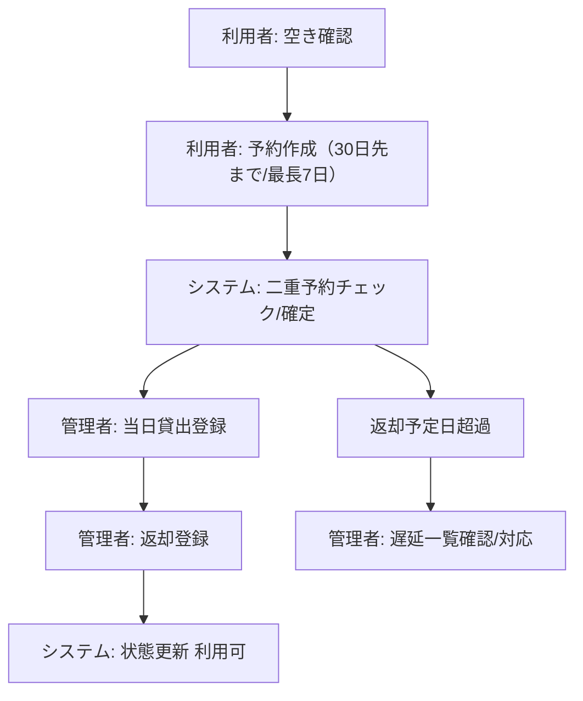
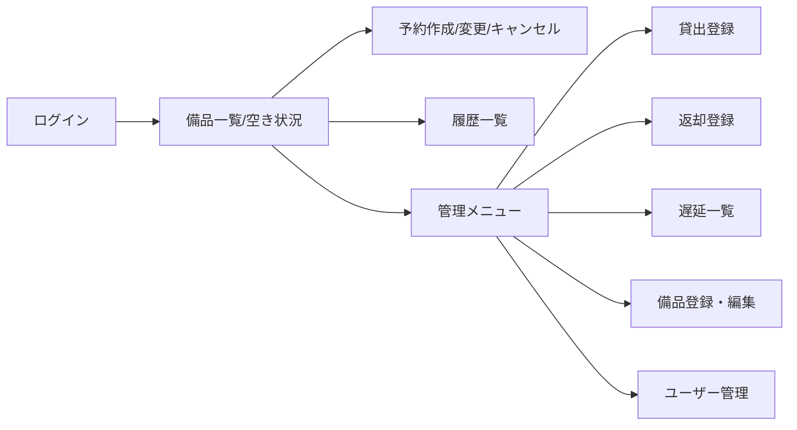
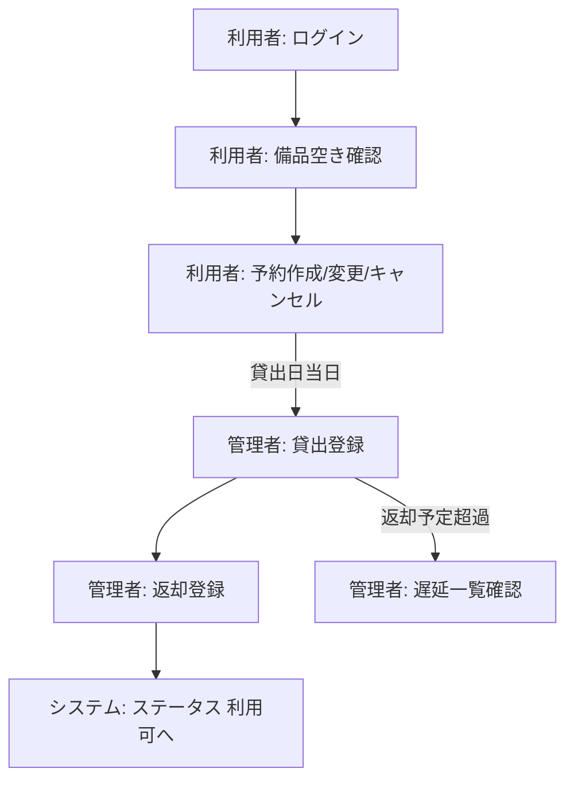

# 備品管理・貸出予約アプリ 要件定義書

## 1. 目的・前提
- システム目的: 会議室機材を個体単位で予約・貸出し、二重予約を防止し所在を明確化することで、予約重複件数をゼロにする。
- 利用対象: 社内利用者（社員・アルバイト）。
- UI形態: GUI（ブラウザベース）。
- 認証方式: 社内メール＋パスワード（8文字以上、文字種指定なし、MFA不要）。
- 用語集:
  - 備品: 個体管理する会議室機材（プロジェクタ、マイク等）。
  - 予約: 利用者が日単位で作成する利用予定。
  - 貸出: 管理者が予約を起点に当日登録する受け渡し実績。
  - 返却: 管理者が登録する返却実績。
  - ステータス: システムが自動管理する「利用可／予約済／貸出中／返却遅延」等の状態。

## 2. 業務
- 対象業務一覧
  - 備品台帳管理（個体登録・更新・廃止）。
  - 予約受付（日単位、30日先まで、最長7日間）。
  - 貸出・返却登録（管理者が当日処理）。
  - 返却遅延確認（通知なし、一覧で確認）。
- 業務範囲・担当者
  - 利用者: ログイン、備品検索・空き状況参照、予約作成・変更・キャンセル（貸出開始前日まで）。
  - 管理者: 備品登録/編集、ユーザー管理、貸出登録、返却登録、遅延確認、予約の当日以降変更/キャンセル。
- 業務フロー（概要）

- 業務課題・KPI
  - 課題: 予約の二重取りが発生し所在が不明確。
  - KPI: 月次の予約重複件数を0件に維持。
- 解決すべき課題と対応方針
  - 二重予約防止: 予約確定時に個体ステータスを「予約済」にし、重複不可の排他ロジックを適用。これがないと同一日で貸出不可が発生する。
  - 所在把握: 貸出・返却登録でステータスを「貸出中」「返却遅延」へ自動更新。これがないと所在不明が解消しない。
  - 遅延可視化: 返却予定日超過の一覧を管理者が確認。これがないと遅延に気づかず次予約に影響する。
- 見込み経営効果
  - Cost Avoidance: 二重予約による会議遅延・レンタル代発生を回避。
  - Soft Saving: 貸出・返却の問い合わせ削減による管理者工数削減。
  - Total Cost of Ownership Savings: 通知・外部連携を省き最小構成とすることで運用・保守コストを抑制。

## 3. 機能要件
- 機能一覧（業務課題への紐付け）
  1) 認証/ユーザー管理（共通）: ログイン、ユーザー登録/無効化。無いと利用制御できない。
  2) 備品台帳管理（マスタ管理）: 備品の登録/編集/廃止、ステータス参照。無いと個体予約ができない。
  3) 空き状況照会（業務機能）: 日単位の空き表示。無いと利用者が予約可否を判断できない。
  4) 予約作成・変更・キャンセル（業務機能）: 重複排他、30日先まで/最長7日、前日まで利用者変更、当日以降は管理者のみ。無いと二重取り防止できない。
  5) 貸出登録（業務機能）: 予約を貸出中に更新。無いと所在が確定しない。
  6) 返却登録（業務機能）: 貸出中→利用可、遅延時は「返却遅延」可視化。無いと返却状況がわからない。
  7) 遅延一覧（業務機能）: 返却予定超過の抽出。無いと遅延対応できない。
  8) 履歴閲覧（運用）: 予約・貸出・返却履歴一覧。無いとトレーサビリティが確保できない。
- 入力データ
  - ユーザー: メール、パスワード（8文字以上）、氏名。
  - 備品: 名称（必須）、分類/型番/シリアル/資産番号/購入日/備考（任意）。
  - 予約: 備品ID、利用開始日、利用終了日（最長7日）、利用者。
  - 貸出/返却: 対応する予約ID、貸出日、返却日。
- 出力データ
  - 画面表示: 備品一覧、日別空き状況、予約一覧、貸出/返却状況、遅延一覧、履歴一覧。
  - ファイル出力: 不要（帳票・CSV出力なし）。
- 外部連携: なし（通知・カレンダー・SSOなし）。
- 画面一覧（GUI）
  - ログイン画面
  - 備品一覧/空き状況（日単位カレンダー表示）
  - 予約作成・変更・キャンセル画面
  - 貸出登録画面（管理者）
  - 返却登録画面（管理者）
  - 遅延一覧画面（管理者）
  - 履歴一覧画面
  - 備品登録・編集画面（管理者）
  - ユーザー管理画面（管理者）
- 画面遷移（概要）

- 全機能のユーザーフロー

- 業務フローとの対応
  - 備品台帳管理: 業務「備品台帳管理」に対応。
  - 空き状況照会/予約: 業務「予約受付」に対応。
  - 貸出/返却/遅延一覧: 業務「貸出・返却登録」「返却遅延確認」に対応。
  - 履歴閲覧: 全業務のトレーサビリティに対応。

## 4. データ要件
- 業務エンティティ一覧と要件
  - ユーザー: CRUD/一覧/詳細/検索/状態（有効・無効）。保持: 無期限。
  - 備品: CRUD/一覧/詳細/検索/状態（利用可・予約済・貸出中・返却遅延）。保持: 無期限。
  - 予約: CRUD/一覧/詳細/検索/状態（予約確定・キャンセル・利用終了・期限超過）。保持: 無期限。
  - 貸出（貸出実績）: CRUD/一覧/詳細/検索/状態（貸出中・返却済・返却遅延）。保持: 無期限。
  - 返却（返却実績）: CRUD/一覧/詳細/検索。保持: 無期限。
- 状態遷移（代表）
  - 備品: 利用可 → 予約済 → 貸出中 → 利用可；返却予定超過で返却遅延 → 返却時に利用可。
  - 予約: 予約確定 → (利用開始前キャンセル) キャンセル → (貸出完了後) 利用終了；返却予定超過で期限超過。
  - 貸出: 貸出中 → 返却済；返却予定超過で返却遅延。
- 内部データ/外部データ
  - すべて内部データ。外部DB連携なし。
- データ保持期間: 全エンティティ無期限。
- 外部DB接続: なし。

## 5. 非機能要件
- 性能: 主要画面応答 10秒以内（一覧/カレンダー/予約操作）。
- 同時利用: 全体ユーザー数約100人、同時接続約10人。
- セキュリティ: パスワード8文字以上、文字種不問、MFAなし。通信はHTTPS前提。操作ログは取得しないが、認証失敗ログのみ保持。
- 可用性: 平日日中利用前提（24x365は不要）。
- バックアップ: 特に要件なし。

## 6. 網羅性チェックと削除可否
- エンティティ: ユーザー/備品/予約/貸出/返却を列挙し、CRUD・一覧・詳細・検索・状態を定義済み。
- マスタ管理: 備品、ユーザーを管理者が管理。
- 共通機能: 認証のみ（監査ログ不要）。
- 業務機能: 予約、貸出、返却、遅延一覧を定義。
- 運用: 履歴閲覧を定義。
- 外部連携: なし。
- 状態遷移: 備品/予約/貸出で定義済み。
- 画面と機能対応: 画面一覧と業務フローを対応付け済み。
- 削除可能な要件（削除しても業務が成立するもの）
  - 通知/外部カレンダー連携: 不要と確認済み。
  - バーコード/QR対応: 手入力で十分のため削除。
  - 帳票/CSV出力: 不要と確認済み。
  - 複数拠点/場所管理: 単一拠点のため不要。

## 7. 不整合・不足の指摘
- 不足なし。要求に基づき通知・外部連携・監査ログを除外しているため、将来追加時は要件追記が必要。

## 8. レビュー結果
- 仕様間の矛盾: なし（UIはブラウザ、予約は日単位、個体管理、通知なし、性能10秒以内で整合）。
- 冗長な要件: 通知・バーコード・帳票を削除済み。
- 課題と機能の対応: 二重予約防止・所在把握・遅延可視化に対し、空き照会/予約、貸出/返却、遅延一覧を用意し整合。
