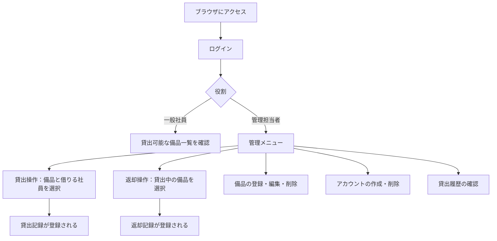
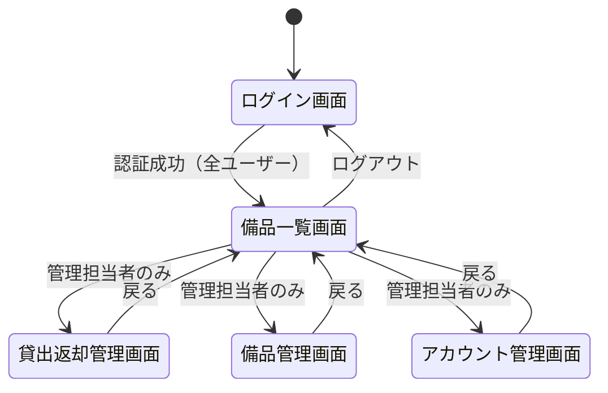
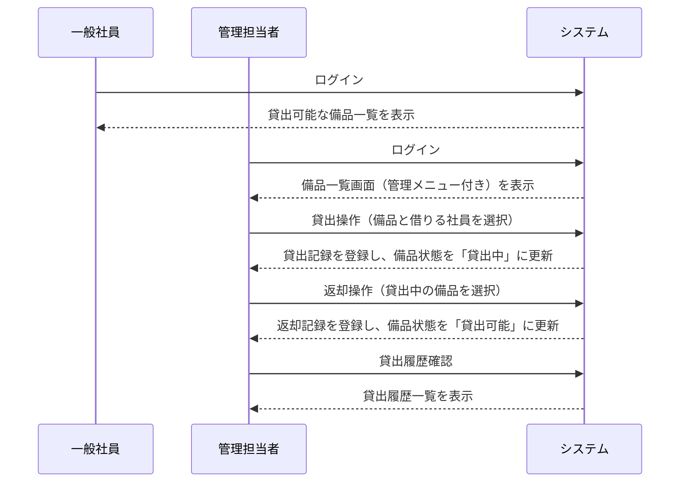
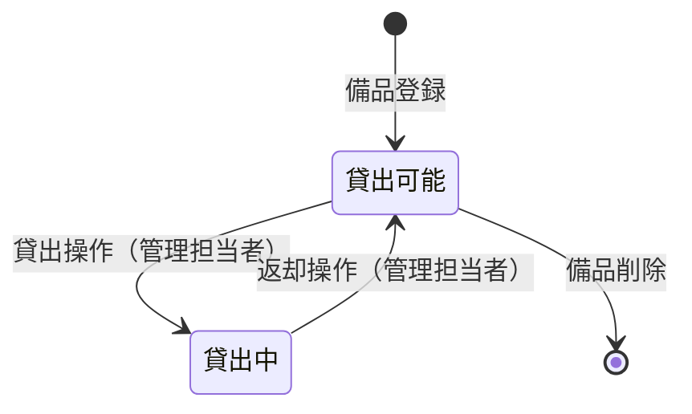

# 要件定義書：社内備品管理・貸出管理システム

## 1. 目的・前提

### システム目的
社内備品（PC・プロジェクター等）の貸出状況をリアルタイムで一元管理し、Excelによる記載ミスやバージョン管理の不備によって貸出先が不明になる問題を解消する。

### 用語集

| 用語 | 説明 |
|------|------|
| 備品 | 社内の物品（PC・プロジェクター等） |
| 管理番号 | 備品を一意に識別するための番号 |
| 貸出 | 管理担当者が備品を社員に貸し出すこと |
| 返却 | 管理担当者が備品の返却を記録すること |
| 管理担当者 | 備品・アカウント・貸出返却を管理する権限を持つユーザー |
| 一般社員 | 備品の貸出可能一覧を参照するユーザー |

### インターフェース
- PCブラウザで利用するWebアプリケーション（GUI）

---

## 2. 業務

### 対象業務一覧

| 業務 | 担当者 |
|------|--------|
| 備品マスタ管理（登録・編集・削除） | 管理担当者 |
| アカウント管理（作成・削除） | 管理担当者 |
| 備品の貸出記録 | 管理担当者 |
| 備品の返却記録 | 管理担当者 |
| 貸出可能備品の確認 | 一般社員・管理担当者 |
| 貸出履歴の確認 | 管理担当者 |

### 業務フロー

### 業務課題と解決方針

| 業務課題 | この要件が無いと何が困るか | 解決方針 |
|----------|---------------------------|----------|
| Excelの記載ミスにより貸出先が不明になる | 誰が何を借りているか追跡できず、備品の紛失・二重貸出が発生する | システムで貸出・返却を記録し、常に最新の状態を表示する |
| バージョン管理の不備で最新状態が把握できない | 複数人が同じExcelを編集してデータが競合する | 単一のデータベースで一元管理し、リアルタイムで状態を反映する |

### 見込み経営効果
- **Soft Saving（人件費削減）**: 貸出状況確認・Excelメンテナンスの工数削減

---

## 3. 機能要件

### 機能一覧

| 機能ID | 機能名 | 担当者 | 対応する業務課題 |
|--------|--------|--------|-----------------|
| F01 | ログイン・ログアウト | 全ユーザー | 不正アクセス防止 |
| F02 | 貸出可能備品一覧表示 | 全ユーザー | 貸出先不明の解消 |
| F03 | 貸出操作 | 管理担当者 | 貸出先不明の解消 |
| F04 | 返却操作 | 管理担当者 | 貸出先不明の解消 |
| F05 | 貸出履歴表示 | 管理担当者 | 貸出先不明の解消 |
| F06 | 備品登録・編集・削除 | 管理担当者 | 備品マスタの一元管理 |
| F07 | アカウント作成・削除 | 管理担当者 | アクセス管理 |

### 画面一覧

| 画面名 | 利用者 | 主な機能 |
|--------|--------|---------|
| ログイン画面 | 全ユーザー | アカウント名・パスワードによる認証 |
| 備品一覧画面 | 全ユーザー | 貸出可能な備品の一覧表示 |
| 貸出・返却管理画面 | 管理担当者 | 貸出操作・返却操作・貸出履歴表示 |
| 備品管理画面 | 管理担当者 | 備品の登録・編集・削除 |
| アカウント管理画面 | 管理担当者 | アカウントの作成・削除・一覧 |

### 画面遷移図

### ユーザー利用フロー

---

## 4. データ

### 業務エンティティ一覧

| エンティティ | 説明 | 操作 |
|-------------|------|------|
| 備品 | 管理対象の物品 | 登録・編集・削除・一覧 |
| アカウント | システム利用者 | 作成・削除・一覧 |
| 貸出記録 | 貸出・返却の履歴 | 登録（貸出時・返却時）・一覧 |

### 備品エンティティの状態遷移

### 各エンティティのデータ項目

**備品**

| 項目名 | 説明 | 制約 |
|--------|------|------|
| 管理番号 | 備品を一意に識別する番号 | 必須・一意 |
| 備品名 | 備品の名称 | 必須 |
| 備考 | 備品に関する補足情報 | 任意 |
| 貸出状態 | 「貸出可能」または「貸出中」 | 必須 |

**アカウント**

| 項目名 | 説明 | 制約 |
|--------|------|------|
| アカウント名 | ログインに使用する名前 | 必須・一意 |
| パスワード | 認証用パスワード | 必須 |
| 役割 | 「管理担当者」または「一般社員」 | 必須 |

**貸出記録**

| 項目名 | 説明 | 制約 |
|--------|------|------|
| 貸出日時 | 貸出操作を行った日時 | 必須・自動記録 |
| 返却日時 | 返却操作を行った日時 | 返却時に自動記録 |
| 備品（管理番号） | 貸出対象の備品 | 必須 |
| 借りた社員のアカウント名 | 実際に借りている社員 | 必須（管理担当者が選択） |

### データ保持期間

| エンティティ | 保持期間 |
|-------------|----------|
| 備品 | 削除操作まで |
| アカウント | 削除操作まで |
| 貸出記録 | 無期限 |

### 内部データ / 外部データ

- すべて内部データ。外部システム・外部DBとの連携はなし。

---

## 5. 非機能要件

| 項目 | 要件 |
|------|------|
| 性能（応答時間） | 通常操作（貸出・返却・一覧表示）は3秒以内に応答 |
| 同時接続 | 社内社員数を想定（数十名程度） |
| セキュリティ | アカウント名・パスワードによる認証。パスワードはハッシュ化して保存。役割による画面・操作の制限 |

---

## レビュー結果

**矛盾チェック**: なし
- 貸出中の備品は再度貸出不可（状態遷移で制御）
- 貸出・返却操作は管理担当者のみ実行可能
- 一般社員は貸出可能備品の参照のみ（操作不可）
- 管理担当者専用画面は一般社員からアクセス不可

**冗長チェック**: 削除可能な要件の確認
- カテゴリ管理: ユーザーより不要と確認済み → 含まず
- 貸出予約機能: ユーザーより不要と確認済み → 含まず
- 購入日・保管場所等の備品属性: ユーザーより不要と確認済み → 含まず
- 一般社員による貸出履歴表示: 今回の修正で削除（管理担当者のみ）

**網羅性チェック**:
- 各エンティティのCRUD: ✅ 備品（CRUD）、アカウント（作成・削除・一覧）、貸出記録（登録・一覧）
- 状態遷移: ✅ 備品の貸出可能/貸出中の遷移を定義
- 認証・認可: ✅ ログイン・役割による権限分離を定義
- 全機能が業務課題に紐づいている: ✅
