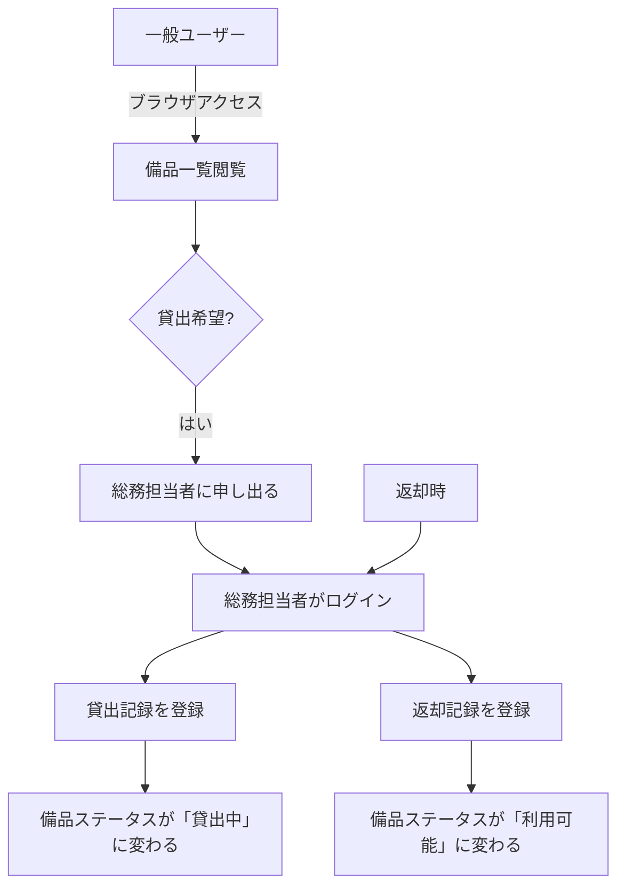
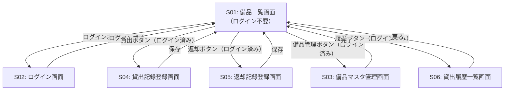
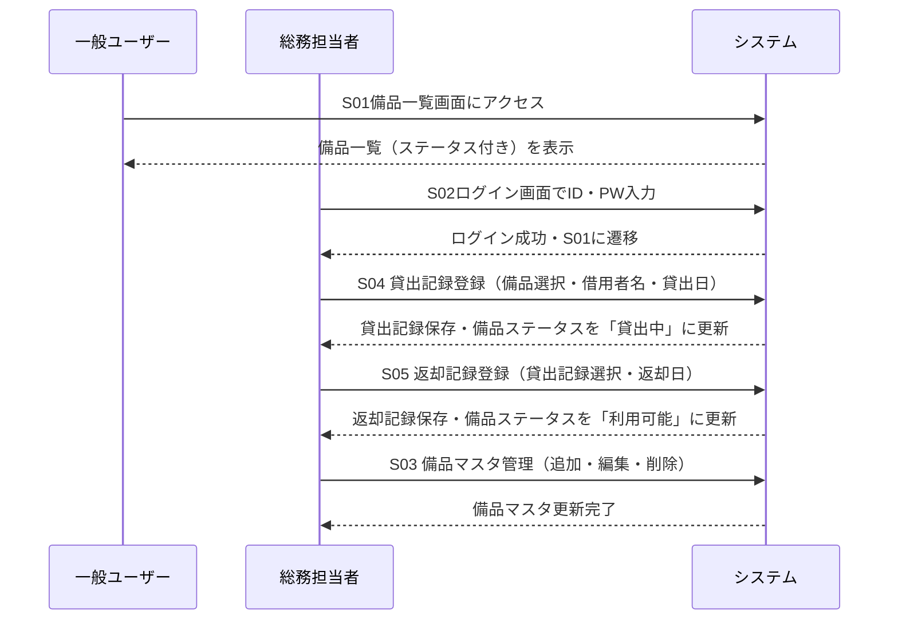
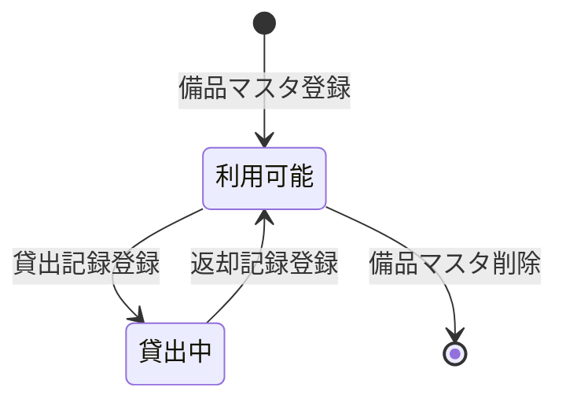

# 備品管理・貸出管理アプリ 要件定義書

## 1. 目的・前提

### システム目的

総務担当者が備品の貸出・返却を都度記録し、現時点の貸出先を常に把握できるようにする。
これにより、Excelの複数バージョン管理に起因する「貸出先不明」問題を解消する。

### 用語集

| 用語 | 意味 |
|------|------|
| 備品 | 管理番号が付与された貸出可能な物品（ノートPC・プロジェクター） |
| 管理番号 | 備品を一意に識別する番号（例：PC-001） |
| 貸出記録 | 誰にいつ貸し出したかの記録 |
| 返却記録 | いつ返却されたかの記録 |
| 総務担当者 | ログインして貸出・返却・備品管理を行う担当者 |
| 一般ユーザー | ログイン不要で備品一覧を閲覧するだけの利用者 |

### UI方式

GUI（Webブラウザで利用）

---

## 2. 業務

### 対象業務一覧

| No | 業務名 | 担当者 |
|----|--------|--------|
| 1 | 備品貸出記録 | 総務担当者 |
| 2 | 備品返却記録 | 総務担当者 |
| 3 | 備品マスタ管理 | 総務担当者 |
| 4 | 備品一覧閲覧 | 一般ユーザー・総務担当者 |

### 業務フロー

### 業務課題・KPI

| 課題 | 現状 | KPI目標 |
|------|------|---------|
| Excelの複数バージョン管理により貸出先が不明になる | 月に数回発生 | 貸出先不明件数 0件/月 |

### 解決すべき課題と対応方針

| 課題 | 対応方針 |
|------|---------|
| Excelバージョン管理の煩雑さにより貸出先が不明になる | 単一のWebシステムに記録を集約し、常に最新状態を参照できるようにする |

### システム化による経営効果

| 分類 | 内容 |
|------|------|
| Soft Saving | 貸出先調査・照合のための総務担当者工数削減（月推定1〜2時間） |
| Cost Avoidance | 貸出先不明による備品紛失リスクの回避 |

---

## 3. 機能要件

### 機能一覧

| No | 機能名 | 対応業務課題 | この機能が無いと困ること |
|----|--------|------------|----------------------|
| F01 | ログイン・ログアウト | - | 総務担当者以外が記録を操作できてしまう |
| F02 | 備品一覧表示 | 貸出先不明 | 現在の貸出状況を確認できない |
| F03 | 備品マスタ登録・編集・削除 | 貸出先不明 | 存在しない備品や廃棄済み備品が一覧に残る |
| F04 | 貸出記録登録 | 貸出先不明 | 誰が借りているか記録できない |
| F05 | 返却記録登録 | 貸出先不明 | 返却されたことが反映されず貸出中のまま残る |
| F06 | 貸出履歴一覧表示 | 貸出先不明 | 過去の貸出状況を遡って確認できない |

### 入力データ

| 機能 | 入力項目 |
|------|---------|
| F03 備品マスタ登録 | 管理番号、備品名、種別 |
| F04 貸出記録登録 | 備品（管理番号）、借用者名、貸出日 |
| F05 返却記録登録 | 貸出記録の選択、返却日 |

### 出力データ

| 機能 | 出力内容 |
|------|---------|
| F02 備品一覧 | 管理番号、備品名、種別、現在のステータス（利用可能／貸出中）、貸出中の場合は借用者名 |
| F06 貸出履歴一覧 | 管理番号、備品名、借用者名、貸出日、返却日 |

### 外部連携

なし

### 全画面仕様

| 画面ID | 画面名 | 利用者 | 主な操作 |
|--------|--------|--------|---------|
| S01 | 備品一覧画面 | 全員（ログイン不要） | 備品の一覧・ステータス確認 |
| S02 | ログイン画面 | 総務担当者 | ID・パスワード入力 |
| S03 | 備品マスタ管理画面 | 総務担当者 | 備品の追加・編集・削除 |
| S04 | 貸出記録登録画面 | 総務担当者 | 貸出情報の入力・保存 |
| S05 | 返却記録登録画面 | 総務担当者 | 返却情報の入力・保存 |
| S06 | 貸出履歴一覧画面 | 総務担当者 | 貸出履歴の確認 |

### 画面遷移

### ユーザー利用フロー

---

## 4. データ

### 業務エンティティ一覧

| エンティティ | 種別 | 主な属性 | CRUD | 一覧 | 詳細 | 検索 | 状態管理 |
|-------------|------|---------|------|------|------|------|---------|
| 備品 | 内部・マスタ | 管理番号、備品名、種別、ステータス | ○ | ○ | - | - | 利用可能／貸出中 |
| 貸出記録 | 内部 | 備品ID、借用者名、貸出日、返却日 | C/R/U | ○ | - | - | 貸出中／返却済 |
| 総務担当者アカウント | 内部・マスタ | ログインID、パスワード（ハッシュ） | C/R/U | - | - | - | - |

### 備品ステータス遷移

### データ保持期間

| データ | 保持期間 |
|--------|---------|
| 備品マスタ | 削除操作まで無期限 |
| 貸出記録 | 無期限 |
| 総務担当者アカウント | 削除操作まで無期限 |

### 外部DB接続

なし（システム内部DBのみ）

---

## 5. 非機能要件

| 項目 | 要件 |
|------|------|
| 応答時間 | 通常操作で3秒以内 |
| 同時接続 | 最大20人 |
| セキュリティ | 総務担当者のパスワードはハッシュ化して保存する。ログインしていない状態では貸出・返却・マスタ管理操作は不可とする。 |

---

## 6. テスト用利用シナリオ

| No | シナリオ名 | 前提条件 | テスト手順 | 期待される結果 |
|----|-----------|---------|-----------|--------------|
| T01 | 一般ユーザーが備品一覧を閲覧する | システムが起動済み、備品が1件以上登録済み | S01備品一覧画面にアクセスする | ログイン不要で備品一覧（管理番号・備品名・ステータス）が表示される |
| T02 | 総務担当者がログインする | S01画面表示中 | ログインボタン押下→S02でID・PW入力→ログインボタン押下 | S01に遷移し、貸出・返却・管理ボタンが表示される |
| T03 | 総務担当者が備品を登録する | ログイン済み | S03備品マスタ管理画面を開く→管理番号・備品名・種別を入力→保存 | 備品一覧に新しい備品が表示され、ステータスが「利用可能」になっている |
| T04 | 総務担当者が備品を編集する | ログイン済み、備品が1件以上登録済み | S03で備品を選択→備品名を変更→保存 | 変更後の備品名が一覧に反映される |
| T05 | 総務担当者が備品を削除する | ログイン済み、貸出中でない備品が存在する | S03で備品を選択→削除ボタン押下→確認 | 備品一覧から該当備品が消える |
| T06 | 貸出記録を登録する | ログイン済み、利用可能な備品が存在する | S04を開く→備品選択・借用者名・貸出日入力→保存 | 対象備品のステータスが「貸出中」に変わり、借用者名が一覧に表示される |
| T07 | 返却記録を登録する | ログイン済み、貸出中の備品が存在する | S05を開く→貸出記録を選択・返却日入力→保存 | 対象備品のステータスが「利用可能」に戻る |
| T08 | 貸出履歴を確認する | ログイン済み、貸出記録が1件以上存在する | S06貸出履歴一覧画面を開く | 貸出日・返却日・借用者名が一覧表示される |
| T09 | 未ログインユーザーが貸出操作を試みる | 未ログイン状態でS01表示中 | 貸出・返却・管理ボタンが存在しないことを確認 | 操作ボタンが表示されない（またはログイン画面に遷移する） |
| T10 | ログアウトする | ログイン済み | ログアウトボタン押下 | 未ログイン状態に戻り、操作ボタンが非表示になる |

---

## 要件網羅性チェック結果

### エンティティCRUD確認

| エンティティ | C | R | U | D | 一覧 | 状態管理 |
|-------------|---|---|---|---|------|---------|
| 備品 | ○ | ○ | ○ | ○ | ○ | ○ |
| 貸出記録 | ○ | ○ | ○（返却日更新） | - | ○ | ○ |
| 担当者アカウント | 初期データ | - | - | - | - | - |

### 削除可能要件の検討

- 貸出履歴一覧（F06）: 削除すると「過去の貸出先確認」ができなくなるため**削除不可**
- 担当者アカウントのCRUD画面: 担当者は固定運用で初期データのみで足りるため**画面は不要**（初期データとして登録）

### MVP確認

- 予約機能: 不要（予約なし）→ 含まない
- 通知機能: 要件外 → 含まない
- 検索機能: 備品数が少ない（ノートPC・プロジェクターのみ）ため不要 → 含まない

以上、MVPに必要最低限の要件のみで構成されていることを確認しました。
