# 備品管理・貸出予約アプリ 詳細設計書

## 0. 前提
- 参照要件: [`docs/requirements.md`](docs/requirements.md)
- 利用環境: 社内LAN、PCブラウザ(Chrome最新版)、外部連携なし
- 予約制約: 30分刻み、最大30日先、1回最長4時間、同一利用者の同時予約上限2件、開始1時間前までキャンセル可、延長不可
- データ保持: 備品台帳=無期限(論理削除)、予約・貸出履歴=5年、操作ログ=1年
- 出力: CSVはShift_JIS/CRLF

## 1. 言語・フレームワーク
| レイヤ | 技術 | 役割 | 使用理由 |
| --- | --- | --- | --- |
| フロントエンド | TypeScript + React | SPAによる画面提供 | Chrome向けGUI、状態管理とバリデーションの容易さ |
| バックエンド | TypeScript + Node.js (Express相当の軽量REST) | REST API提供、業務ロジック実装 | 非同期I/Oで同時アクセス対応、学習コスト低 |
| テンプレート/SSR | なし（SPAのみ） | 不使用 | 要件がSPAで充足 |
| DB | PostgreSQL | 永続化 | トランザクションと排他制御で二重予約防止を実装しやすい |
| スケジューラ | cron（サーバ内） | ログ・履歴の期間外削除 | 追加サービス不要で運用簡素 |

## 2. システム構成

### 2.1 コンポーネント一覧
| コンポーネント | 役割 | 補足 |
| --- | --- | --- |
| ブラウザ(利用者/管理者) | 画面操作 | 社内LANのみ |
| フロントエンドSPA | 画面レンダリング・入力検証 | 静的配信(同一サーバ内) |
| APIサーバ | 認証、業務ロジック、CSV出力、操作ログ記録 | REST/JSON、内部でDBトランザクション |
| DB(PostgreSQL) | 台帳・予約・ログの永続化 | 排他制御・整合性保持 |
| スケジューラ | バッチ実行 | 期間外データ削除 |

### 2.2 システム構成図 (Mermaid)
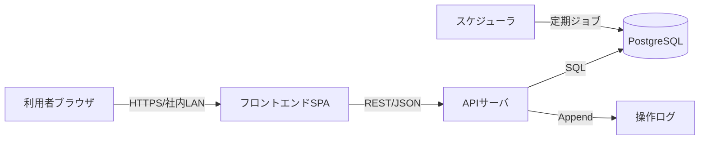

### 2.3 ネットワーク構成図 (Mermaid)
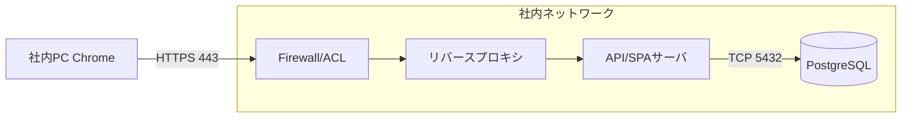

### 2.4 コンポーネント間インターフェースとデータフロー
- フロントエンド→API: REST/JSON。主要エンドポイントはメッセージ設計を参照。
- API→DB: トランザクション+行ロックで二重予約と同時2件超を防止。
- API→ログ: 監査用に操作ログテーブルへ非同期追加（同一トランザクション内で永続化）。
- API→フロント: 返却遅延フラグをレスポンスに含め、一覧・詳細で警告表示（管理者通知は行わない）。

## 3. データベース設計

### 3.1 テーブル一覧
| テーブル | 用途 | 主な制約 |
| --- | --- | --- |
| users | ユーザー管理 | login_id UNIQUE, role(admin/user), パスワード有効期限 |
| equipment | 備品台帳 | management_number UNIQUE, status(available/broken/maintenance), 論理削除 |
| reservations | 予約・貸出履歴 | 設備×時間帯の重複禁止、同一利用者同時2件超禁止(アプリ側制御)、30分刻み/4時間/30日先チェック |
| operation_logs | 操作ログ | 1年保持、PII最小化 |

### 3.2 テーブル定義
#### users
| カラム | 型 | 制約 | 説明 |
| --- | --- | --- | --- |
| id | serial | PK | ユーザーID |
| login_id | varchar(64) | UNIQUE, NOT NULL | ログインID |
| name | varchar(100) | NOT NULL | 氏名 |
| role | varchar(10) | NOT NULL | admin/user |
| password_hash | varchar(255) | NOT NULL | ハッシュ済みパスワード |
| password_expires_at | timestamp | NOT NULL | パスワード有効期限(90日) |
| is_locked | boolean | NOT NULL default false | アカウントロック有無 |
| created_at | timestamp | NOT NULL | 作成日時 |
| updated_at | timestamp | NOT NULL | 更新日時 |
| deleted_at | timestamp | NULL | 論理削除 |

#### equipment
| カラム | 型 | 制約 | 説明 |
| --- | --- | --- | --- |
| id | serial | PK | 備品ID |
| management_number | varchar(50) | UNIQUE, NOT NULL | 管理番号 |
| name | varchar(150) | NOT NULL | 名称 |
| category | varchar(50) | NOT NULL | カテゴリ名(任意文字列) |
| location | varchar(100) | NOT NULL | 設置場所 |
| status | varchar(15) | NOT NULL | available/broken/maintenance |
| description | text | NOT NULL | 説明 |
| created_at | timestamp | NOT NULL | 作成日時 |
| updated_at | timestamp | NOT NULL | 更新日時 |
| deleted_at | timestamp | NULL | 論理削除 |

#### reservations
| カラム | 型 | 制約 | 説明 |
| --- | --- | --- | --- |
| id | serial | PK | 予約ID |
| equipment_id | int | FK equipment.id, NOT NULL | 備品 |
| user_id | int | FK users.id, NOT NULL | 予約者 |
| purpose | varchar(200) | NOT NULL | 利用目的 |
| start_at | timestamp | NOT NULL | 開始日時(30分刻み) |
| end_at | timestamp | NOT NULL | 終了日時(開始<終了, 最大4h) |
| status | varchar(15) | NOT NULL | reserved/cancelled/completed |
| cancelled_at | timestamp | NULL | キャンセル日時 |
| usage_start_at | timestamp | NULL | 利用開始記録 |
| usage_end_at | timestamp | NULL | 返却記録 |
| created_at | timestamp | NOT NULL | 作成日時 |
| updated_at | timestamp | NOT NULL | 更新日時 |

#### operation_logs
| カラム | 型 | 制約 | 説明 |
| --- | --- | --- | --- |
| id | serial | PK | ログID |
| actor_user_id | int | FK users.id, NULL可 | 実行者 |
| action | varchar(50) | NOT NULL | 種別(例: CREATE_EQUIPMENT) |
| target_type | varchar(30) | NOT NULL | 対象種別(equipment/reservation/user) |
| target_id | int | NULL | 対象ID |
| detail | text | NOT NULL | 変更内容(PIIを最小化) |
| created_at | timestamp | NOT NULL | 記録日時 |

### 3.3 リレーション(ER図)
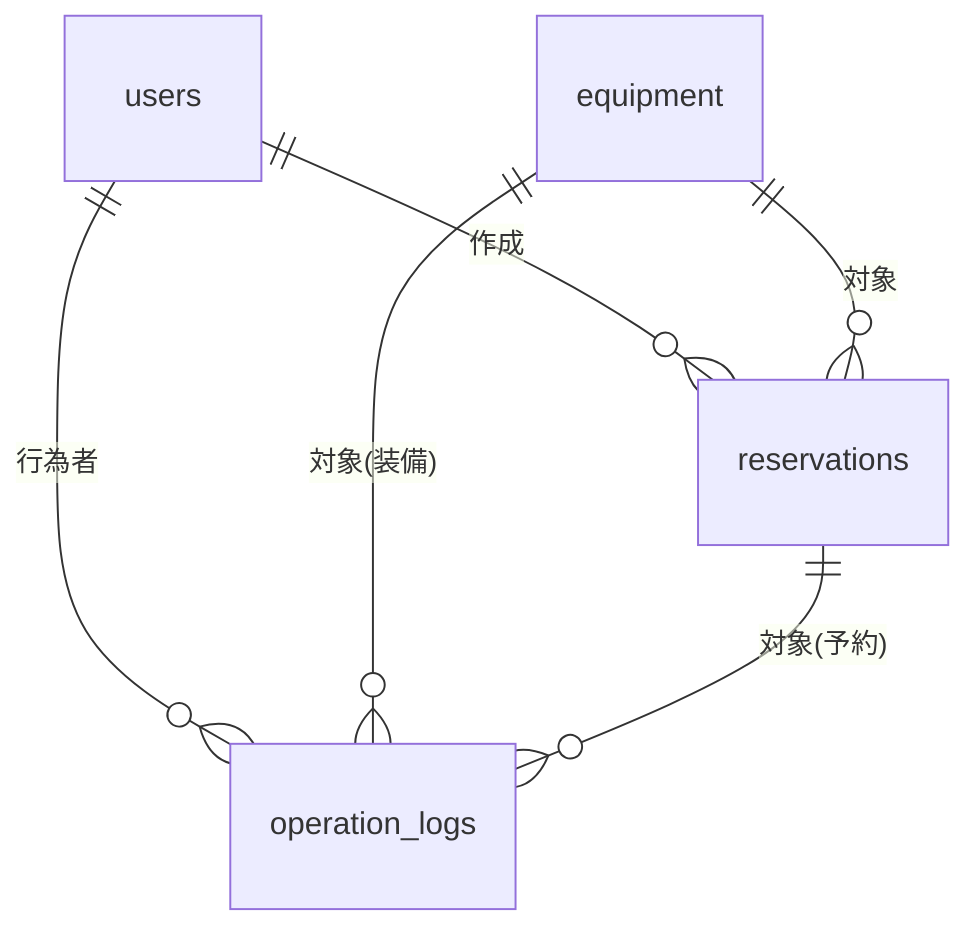

### 3.4 インデックス/整合性
- reservations(equipment_id, start_at, end_at) にインデックス
- reservations(user_id, start_at, end_at) にインデックス
- equipment.management_number UNIQUE
- 時間重複判定: トランザクション内で `start_at < 既存.end_at AND end_at > 既存.start_at` をチェックし、行ロックで重複登録防止。
- 同一利用者同時2件制限: user_idで重複チェックし件数>1を許容しない。

## 4. 外部設計 (UI/CUI)

### 4.1 画面一覧
| 画面 | 主機能 | 利用者 |
| --- | --- | --- |
| ログイン | 認証 | 全員 |
| 備品一覧 | 台帳閲覧・状態表示 | 全員 |
| 予約作成 | 30分刻み入力、目的入力、自動承認 | 全員 |
| 空き状況(カレンダー/リスト) | 備品別の空き/予約表示 | 全員 |
| 予約詳細/キャンセル | 予約確認・開始1時間前までのキャンセル | 全員 |
| 貸出・返却記録 | 利用開始/返却記録 | 管理者 |
| 遅延警告表示 | 返却期限超過の警告バッジ表示(通知なし) | 管理者 |
| CSV出力 | 期間・備品・利用者フィルタ、Shift_JIS/CRLF | 管理者 |
| ユーザー管理 | ユーザー登録/ロック/パスワードリセット | 管理者 |
| 操作ログ参照 | 期間・対象フィルタ | 管理者 |

### 4.2 画面遷移図 (Mermaid)
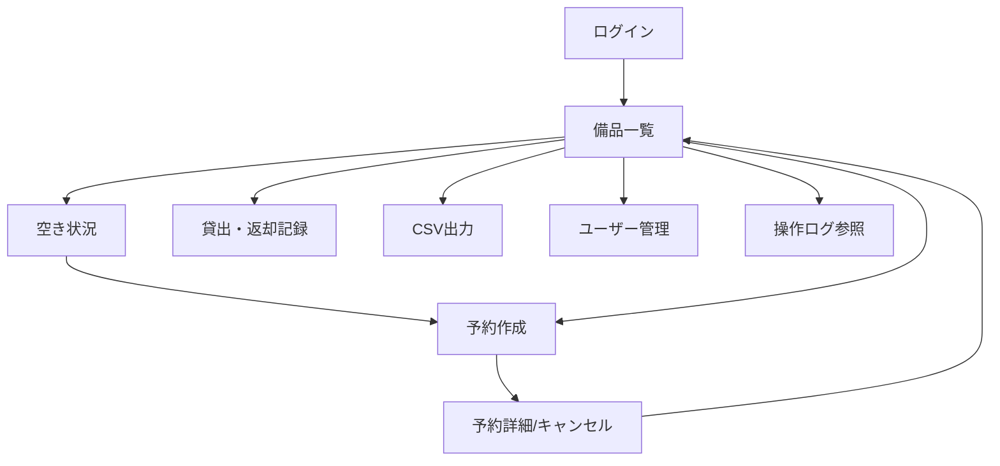

### 4.3 画面レイアウトイメージ (Mermaid)
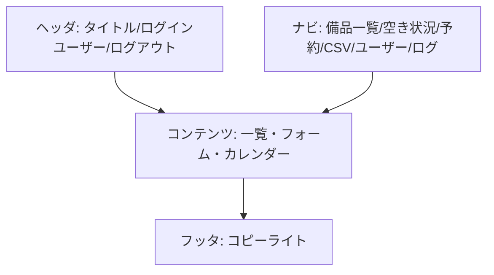

### 4.4 AAモックアップ（主要画面）
#### 備品一覧
```
+----------------------------------------------------------+
| ヘッダ: 備品管理・貸出予約   [ユーザー名] (ログアウト)     |
+----------------------------------------------------------+
| [検索] カテゴリ[ ] 場所[ ] 状態[▼] キーワード[       ]   |
|----------------------------------------------------------|
| 管理番号 | 名称 | カテゴリ | 場所 | 状態 | 操作(空き状況/予約) |
|----------------------------------------------------------|
| EQ-001   | プロジェクタA | 会議 | 3F | 利用可 | [空き] [予約] |
| ...                                                      |
+----------------------------------------------------------+
```

#### 予約作成
```
+----------------- 予約作成 --------------------------------+
| 備品: [選択済み表示]                                      |
| 利用目的: [                 ]                             |
| 開始日時: [日付] [時刻(30分刻み)]                         |
| 終了日時: [日付] [時刻(30分刻み)] (最大4時間)             |
| 注意: 同時予約は2件まで / 開始1時間前までキャンセル可能   |
| [確認して予約]                                            |
+-----------------------------------------------------------+
```

#### 空き状況（カレンダー）
```
+----------------- 空き状況(カレンダー) ---------------------+
| 備品選択: [▼]  表示範囲: [週/月]                          |
|-----------------------------------------------------------|
| 週カレンダー: 30分刻みで予約枠を色分け表示                |
| 予約枠クリックで詳細/キャンセルへ                          |
+-----------------------------------------------------------+
```

### 4.5 入力バリデーション
- 日付/時刻: 30分刻み、終了は開始より後、差分<=4時間、予約は現在から+30日以内
- キャンセル: 開始1時間前まで
- 目的: 必須、200文字以内
- CSV出力: 期間・備品・利用者いずれも必須

### 4.6 CSV出力仕様
- 文字コード: Shift_JIS、改行: CRLF
- 出力項目: 管理番号、名称、カテゴリ、設置場所、予約者、開始日時、終了日時、状態(reserved/cancelled/completed)
- エスケープ: 先頭が `= + - @ \t` の場合は先頭にシングルクォートを付与

## 5. 内部設計

### 5.1 主要処理フロー
#### 予約作成フロー (Mermaid)
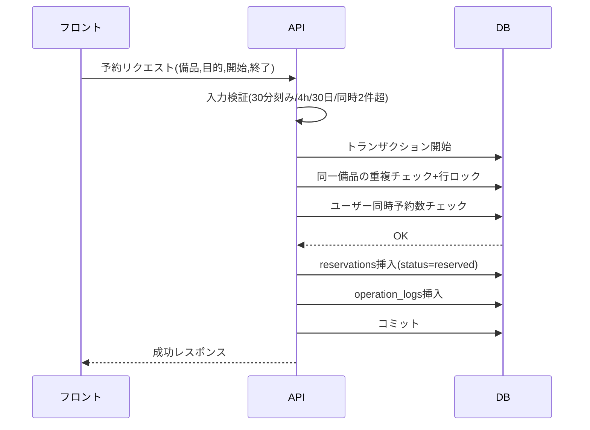

#### キャンセルフロー
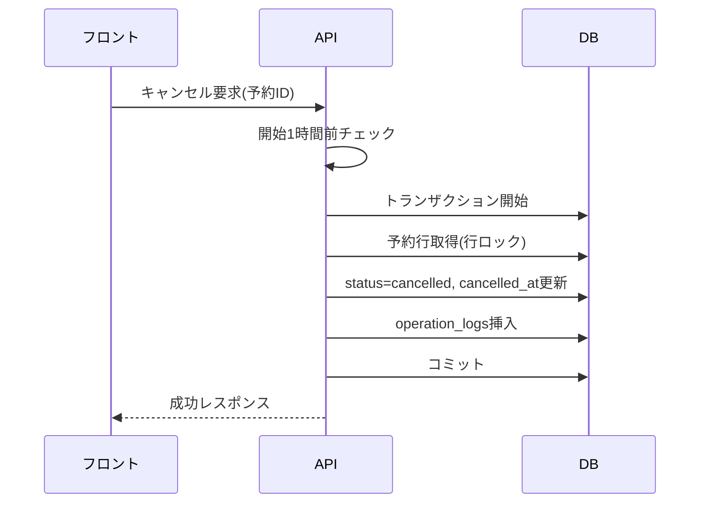

#### 貸出・返却記録フロー
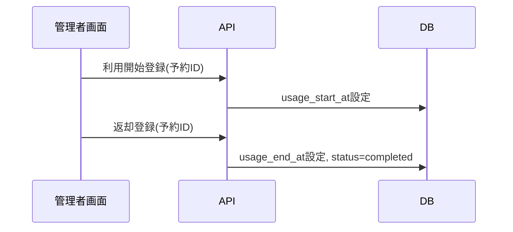

#### CSV出力フロー
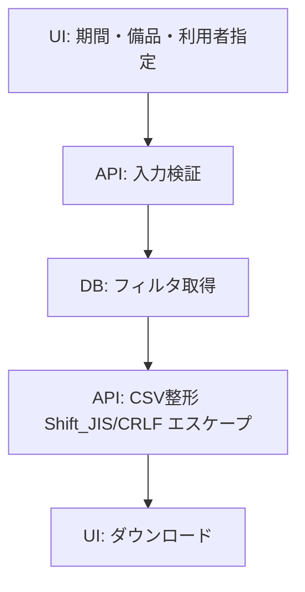

#### 返却遅延警告フロー
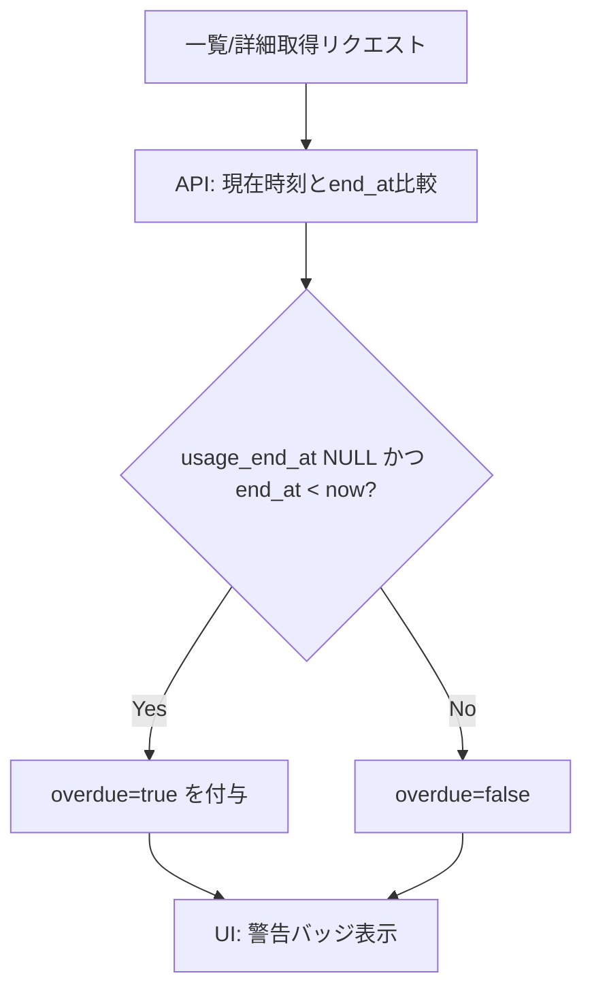

### 5.2 バッチ設計
- ログ・予約履歴削除: 毎日深夜にoperation_logsで1年超を削除、reservationsで5年超を削除(論理削除不要データは物理削除)。
- 実装: サーバ内cronでAPIサーバのメソッドを呼び出し、操作ログも記録。

### 5.3 外部システム連携
- なし（要件に基づく）。

### 5.4 外部DB連携
- なし（要件に基づく）。

## 6. クラス設計（バックエンド）

### 6.1 クラス一覧と役割
| クラス | 役割 | 主メソッド(代表) |
| --- | --- | --- |
| AuthService | 認証・パスワードポリシー検証 | authenticate, rotatePassword |
| UserService | ユーザー管理 | createUser, lockUser, resetPassword |
| EquipmentService | 備品台帳管理 | listEquipment, updateStatus |
| ReservationService | 予約/キャンセル/重複判定 | createReservation, cancelReservation, recordUsage |
| AvailabilityService | 空き状況検索 | searchAvailability |
| CsvExportService | CSV生成(Shift_JIS/CRLF) | exportReservations |
| LogService | 操作ログ記録 | addLog |
| BatchJobService | バッチ実行 | purgeOldLogs, purgeOldReservations |

### 6.2 クラス図 (Mermaid)
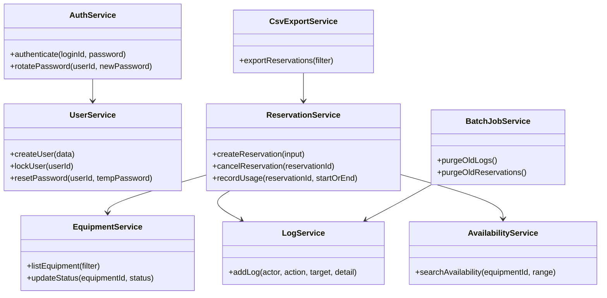

### 6.3 属性とメソッド概要
- ReservationService
  - 属性: dbConnection, logService
  - 主要メソッド: createReservation(入力検証→重複/同時2件チェック→登録)、cancelReservation(開始1時間前判定→status変更)、recordUsage(usage_start_at/usage_end_at更新)
- AuthService
  - 属性: userRepo, passwordPolicy
  - 主要メソッド: authenticate(ロック/有効期限確認)、rotatePassword(有効期限90日更新)
- CsvExportService
  - 属性: reservationRepo
  - 主要メソッド: exportReservations(フィルタ取得→CSV変換→Shift_JIS変換→CRLF)

## 7. メッセージ設計 (REST API概要)
| パス | メソッド | 用途 | 主なリクエスト項目 | 主なレスポンス項目 |
| --- | --- | --- | --- | --- |
| /auth/login | POST | 認証 | login_id, password | token, user(role) |
| /equipment | GET | 備品一覧 | category, location, status, q | equipment[] |
| /equipment/{id}/status | PUT | 状態変更 | status | updated equipment |
| /reservations | POST | 予約作成 | equipment_id, purpose, start_at, end_at | reservation |
| /reservations | GET | 予約一覧/空き状況 | equipment_id, range | reservations/空き枠 |
| /reservations/{id}/cancel | POST | キャンセル | none | updated reservation |
| /reservations/{id}/usage/start | POST | 利用開始記録 | none | updated reservation |
| /reservations/{id}/usage/end | POST | 返却記録 | none | updated reservation |
| /reservations/overdue | GET | 返却遅延一覧 | none | reservations(overdue=true) |
| /csv/reservations | GET | CSV出力 | period_from, period_to, equipment, user | CSV(Shift_JIS/CRLF) |
| /users | POST | ユーザー登録 | login_id, name, role, temp_password | user |
| /users/{id}/lock | POST | ロック | none | user |
| /logs | GET | 操作ログ | period, actor, target | logs |

### 7.1 メッセージフロー (予約作成)
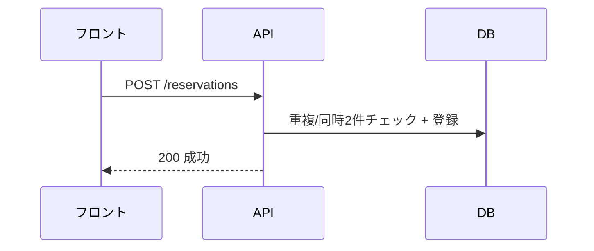

## 8. エラーハンドリング設計

### 8.1 エラー一覧
| エラー | 原因 | 処理 |
| --- | --- | --- |
| AUTH_INVALID | 認証失敗 | 401、試行回数累積でロック |
| AUTH_EXPIRED | パスワード期限切れ | 403、管理者経由でリセット案内 |
| VALIDATION_ERROR | 入力不備 | 400、項目別メッセージ返却 |
| DOUBLE_BOOKING | 重複予約検知 | 409、重複時間帯を返却 |
| USER_LIMIT_EXCEEDED | 同時2件超 | 409、既存予約情報返却 |
| CANCEL_WINDOW_CLOSED | 開始1時間前経過 | 409、キャンセル不可通知 |
| NOT_FOUND | 対象なし | 404 |
| SERVER_ERROR | 想定外 | 500、操作ログ記録 |

### 8.2 エラーフロー (予約キャンセル)
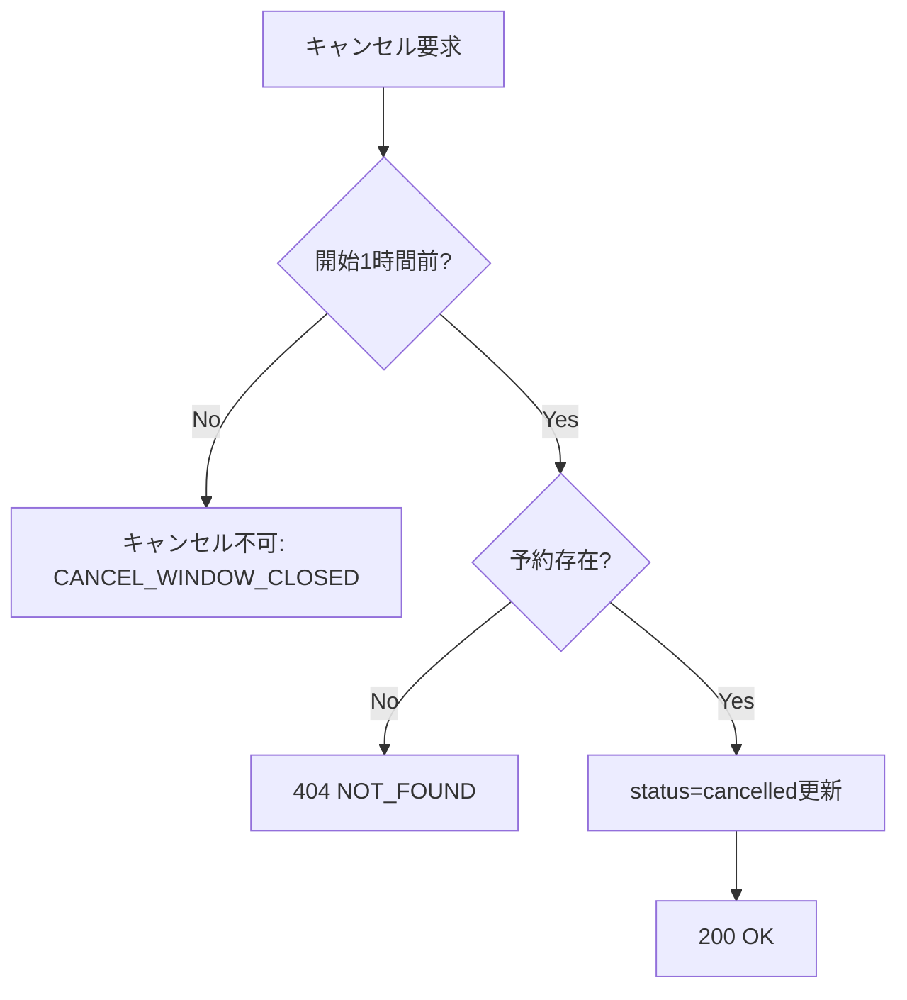

## 9. セキュリティ設計
| 要件 | 内容 | 対策 |
| --- | --- | --- |
| ネットワーク制限 | 社内LANのみ | FW/ACLで外部遮断、HTTPS終端を社内で実施 |
| 認証 | ID/パスワード | パスワード8桁以上英数混在、90日で有効期限、管理者リセットのみ |
| アカウントロック | 不正試行抑止 | 一定回数失敗でis_locked=true、ログ記録 |
| セッション | トークン管理 | HTTP Only, Secure、タイムアウト設定 |
| CSRF/XSS | フォーム保護 | CSRFトークン、出力エスケープ、Content-Security-Policy |
| 入力検証 | サーバ側バリデーション | 時刻刻み・長さ・必須をAPIで再検証 |
| ログ管理 | PII最小化 | 詳細はIDベース、成功/失敗を区別、1年で削除 |
| CSV安全性 | 文字化け防止 | Shift_JIS変換、CRLF、CSVインジェクション防止(先頭記号エスケープ) |

## 10. ソースコード設計

### 10.1 ディレクトリ構成 (AA)
```
project-root/
  frontend/
    src/
      components/
      pages/
      services/
      hooks/
      styles/
  backend/
    src/
      api/
      services/
      repositories/
      models/
      middleware/
      batch/
  docs/
    requirements.md
    design.md
```

### 10.2 ディレクトリ役割
| ディレクトリ | 役割/主なファイル例 |
| --- | --- |
| frontend/src/components | 共通UI部品 |
| frontend/src/pages | 画面単位コンテナ |
| frontend/src/services | API呼び出しとDTO変換 |
| backend/src/api | ルーティング/コントローラ |
| backend/src/services | 業務ロジック(Auth/Reservation等) |
| backend/src/repositories | DBアクセス層 |
| backend/src/models | エンティティ定義 |
| backend/src/middleware | 認証・エラーハンドリング |
| backend/src/batch | バッチジョブ定義 |

### 10.3 コーディング規約
- 命名: PascalCase=クラス、camelCase=メソッド/変数、SCREAMING_SNAKE=定数
- コメント: 日本語で意図と制約を記述
- バリデーション: API受信時に全項目検証し、ドメインサービスでも重要制約を再検証
- ロギング: 成功/失敗を区別し、予約ID・設備ID・ユーザーIDを付与

## 11. テスト設計

### 11.1 テスト種類
| 種類 | 目的 | 方法 |
| --- | --- | --- |
| 単体テスト | サービス/バリデーションの正当性 | Jest等でメソッド単位 |
| 結合テスト | API+DBで業務制約確認 | Supertest等でREST/トランザクション確認 |
| 総合(E2E)テスト | ユーザー視点の動作確認 | ブラウザ自動化で画面遷移/入力/CSVダウンロード |

### 11.2 テストケース（抜粋・必須）
- 予約作成: 30分刻み以外は400、4時間超は400、30日超は400
- 二重予約: 同一設備で時間重複時に409 DOUBLE_BOOKING
- 同時2件: 同一ユーザーで3件目登録時に409 USER_LIMIT_EXCEEDED
- キャンセル: 開始61分前は成功、59分前はCANCEL_WINDOW_CLOSED
- 利用開始/返却: usage_start_at/usage_end_atが正しく更新、statusがcompletedになる
- 状態変更: 備品statusがbroken/maintenanceの場合、予約作成が400
- CSV出力: フィルタ未指定は400、Shift_JIS/CRLFで出力、フィールドエスケープ確認
- 認証: 誤パスワード試行でロック設定、期限切れでAUTH_EXPIRED
- 操作ログ: 主要操作で記録され、1年超のログがバッチで削除される
- 返却遅延: end_at経過かつ未返却でoverdue=trueが返却され、UIで警告表示される（通知送信なし）
- UI: 画面遷移(一覧→空き状況→予約→詳細)、必須項目未入力エラー表示、カレンダーとリスト表示切替

## 12. 整合性レビュー
- 要件の全機能(台帳管理/予約/貸出・返却記録/CSV/ユーザー/操作ログ/警告表示相当)を網羅
- 予約制約(30分刻み/4時間/30日先/同時2件/キャンセル1時間前)をバリデーションとトランザクションで設計
- CSVの文字コード/改行/必須フィルタに対応
- データ保持期間をテーブルとバッチで規定
- 外部連携なし、社内LAN限定をネットワーク設計に反映
- 矛盾・拡張記載なし、実装フェーズ記述なし

## 13. 非機能要件整理
- 性能: 備品一覧/空き状況/予約登録の主要画面応答を2秒以内とする。APIは主要クエリにインデックスを付与し、レスポンス圧縮とキャッシュ抑制ヘッダを設定。
- 利用規模: 備品50点、月間予約100件、同時利用20人を前提にDB接続プールとスレッド/イベントループを設定。
- 可用性: 想定24/7、RPO/RTO指定なし。障害時はDBバックアップとログからのリカバリ手順を運用で準備。
- ブラウザ: PC版Chrome最新版のみサポート。表示崩れ防止のためモダンCSSとレスポンシブは必須としない。
- アクセス制御: 社内LANのみ、FW/ACLで外部遮断、HTTPS終端を社内で実施。
- 操作性: 予約作成1件1分以内を目標とし、画面1枚・必須項目のみ・30分刻み入力で完結させる。
- 台帳更新遅延: 予約確定時に即時反映し、手動変更も10分以内に反映する運用を前提とする。
- ブラックアウト設定: 要件により不要とし、本設計では実装対象外とする。
