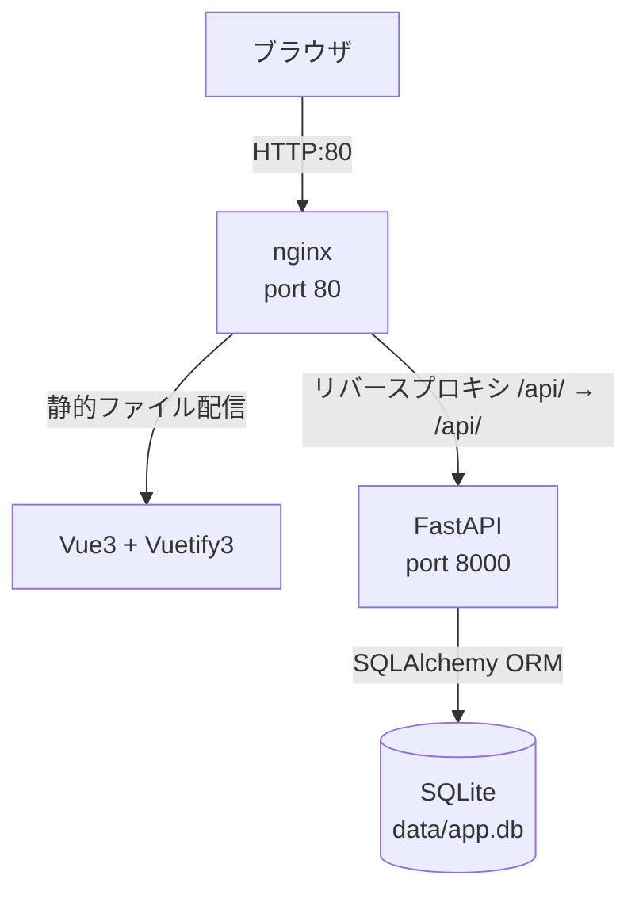
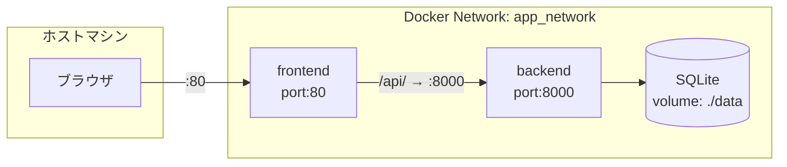
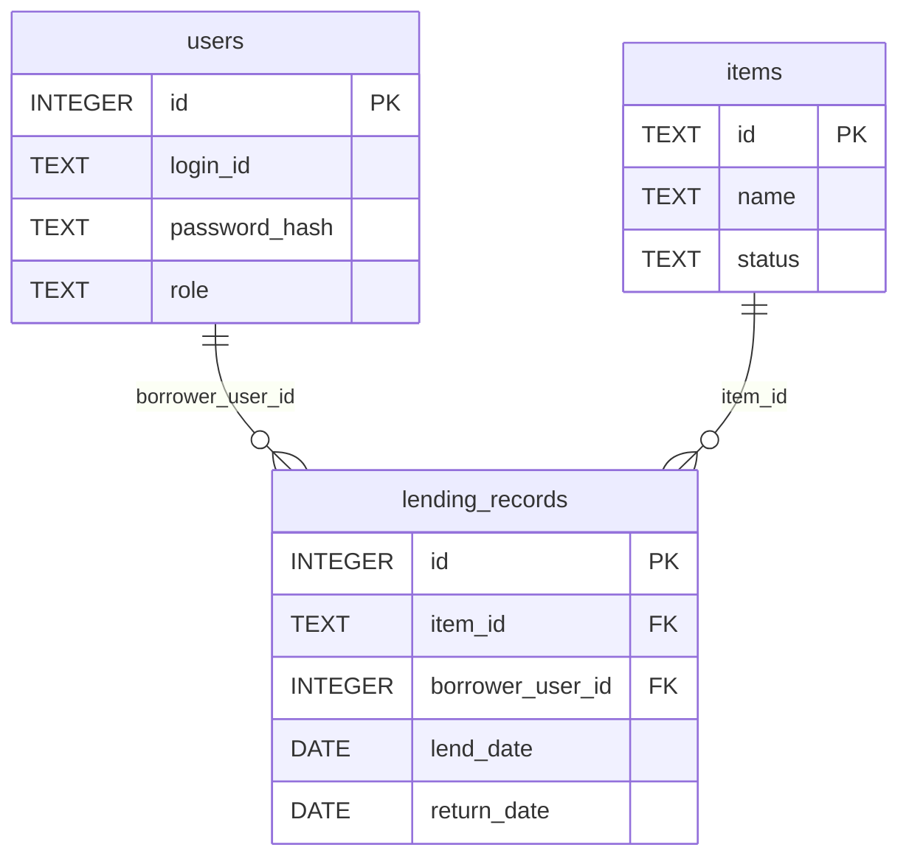
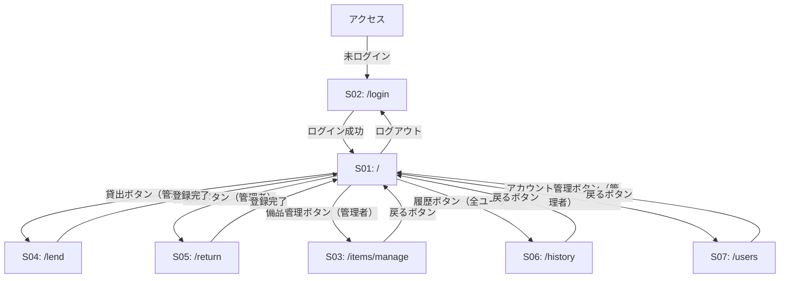
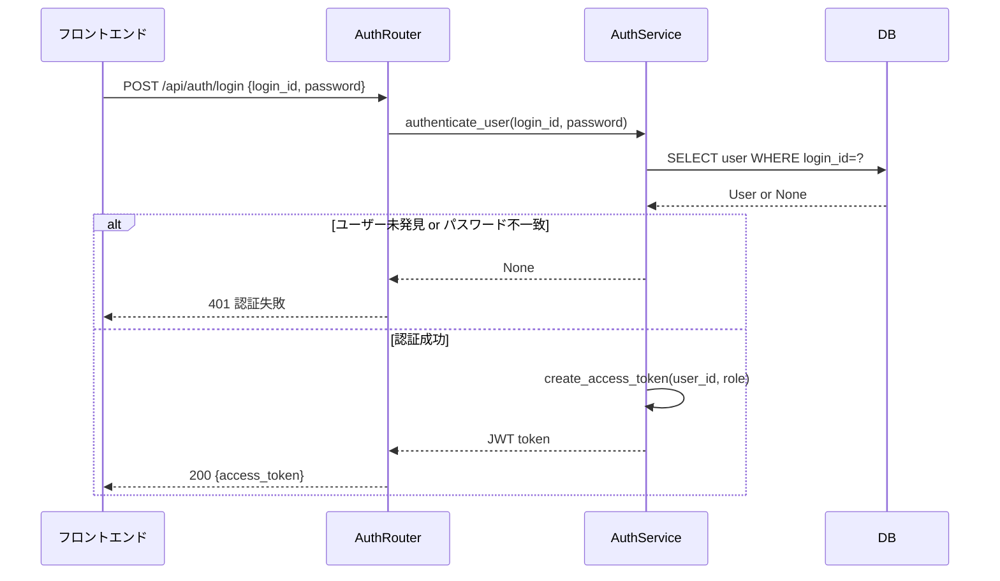
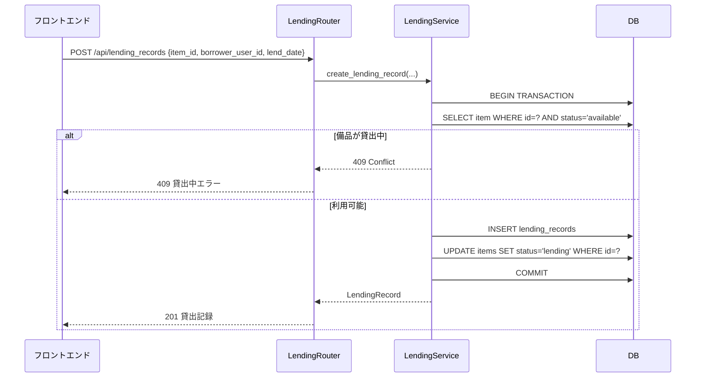
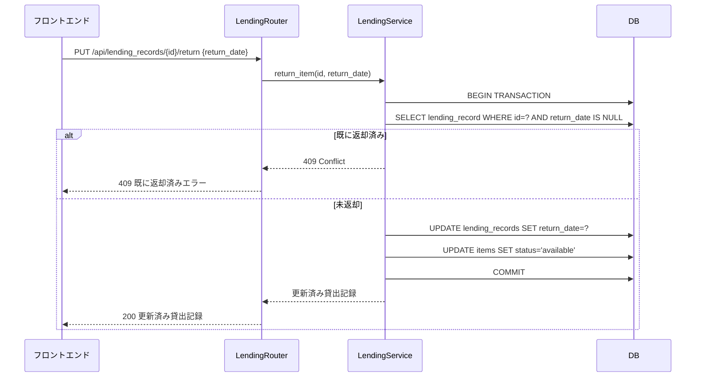
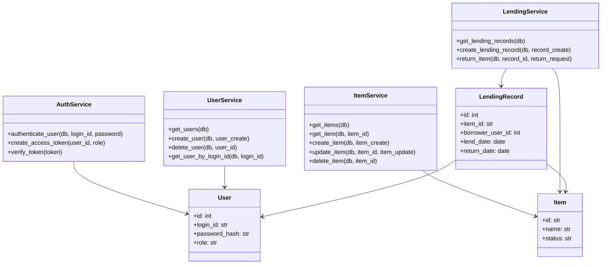
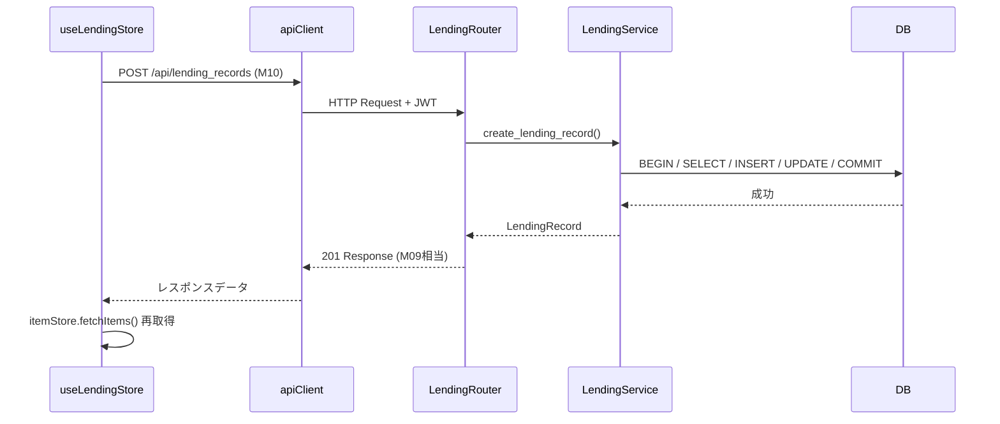

# 備品・貸出管理システム 詳細設計書

---

## 1. 言語・フレームワーク

| 対象 | 選択 | 理由 |
|------|------|------|
| フロントエンド言語 | JavaScript (Vue 3) | 複数画面・ダイアログ・ロールによる表示切替が必要なため |
| フロントエンドFW | Vuetify 3 | UIコンポーネントライブラリ（テーブル・ダイアログ・フォーム） |
| バックエンド言語 | Python 3.11 | FastAPI・SQLAlchemy 2.x の動作検証済み安定版 |
| バックエンドFW | FastAPI | 軽量・型安全・自動API文書生成 |
| DB | SQLite | シングルファイル・外部DB不要・社内10名以下の軽量用途 |
| ORM | SQLAlchemy 2.x | Python標準的ORM |
| 認証 | JWT (PyJWT) | ステートレス認証 |
| パスワードハッシュ | bcrypt (passlib) | セキュアなハッシュ化 |
| Webサーバー | nginx | フロントエンド配信・バックエンドリバースプロキシ |
| 状態管理 | Pinia | Vue 3標準の状態管理 |
| HTTPクライアント | axios | フロントエンドAPIリクエスト |

### ビルド・デプロイ方式

フロントエンドはマルチステージDockerビルドを使用する。

1. **ステージ1（build）**: `node:20-alpine` イメージで `npm run build` を実行し静的ファイルを生成する
2. **ステージ2（serve）**: `nginx:alpine` イメージで生成した静的ファイルを配信する

nginxはフロントエンドの静的ファイルを配信すると同時に、`/api/` プレフィックスのリクエストをバックエンドコンテナ（`http://backend:8000`）にリバースプロキシする。

フロントエンドのすべてのAPIリクエストは `/api/` 以下に対して行う。

---

## 2. システム構成

### コンポーネント一覧

| コンポーネント | 種別 | 役割 |
|--------------|------|------|
| nginx（frontend） | Webサーバー | Vue静的ファイル配信・/api/リバースプロキシ |
| frontend（Vue3） | SPA | ユーザーインターフェース |
| backend（FastAPI） | APIサーバー | ビジネスロジック・DB操作 |
| SQLite | DB | データ永続化 |
| test_playwright | テスト | E2Eテスト実行環境 |

### システム構成図



### ネットワーク構成図



### コンポーネント間データフロー

ブラウザ → `GET /` → nginx → Vue静的ファイル返却  
ブラウザ → `POST /api/auth/login` → nginx → FastAPI → SQLite → レスポンス  
ブラウザ → `GET /api/items` → nginx → FastAPI → SQLite → レスポンス

---

## 3. データベース設計

### テーブル一覧

| テーブル名 | エンティティ |
|-----------|-------------|
| users | ユーザーアカウント |
| items | 備品 |
| lending_records | 貸出記録 |

### テーブル定義

#### users テーブル

| カラム名 | データ型 | 制約 | 説明 |
|---------|---------|------|------|
| id | INTEGER | PK, AUTOINCREMENT | 内部ID |
| login_id | TEXT | NOT NULL, UNIQUE | ログインID |
| password_hash | TEXT | NOT NULL | bcryptハッシュ |
| role | TEXT | NOT NULL, CHECK(role IN ('admin','user')) | ロール |

#### items テーブル

| カラム名 | データ型 | 制約 | 説明 |
|---------|---------|------|------|
| id | TEXT | PK | 管理番号（ユーザー入力） |
| name | TEXT | NOT NULL | 備品名 |
| status | TEXT | NOT NULL, CHECK(status IN ('available','lending')), DEFAULT 'available' | 状態 |

#### lending_records テーブル

| カラム名 | データ型 | 制約 | 説明 |
|---------|---------|------|------|
| id | INTEGER | PK, AUTOINCREMENT | 貸出記録ID |
| item_id | TEXT | NOT NULL, FK(items.id) | 備品管理番号 |
| borrower_user_id | INTEGER | NOT NULL, FK(users.id) | 借用者ユーザーID |
| lend_date | DATE | NOT NULL | 貸出日 |
| return_date | DATE | NULL | 返却日（NULLは未返却）|

### ER図



### データ整合性・制約

| 制約 | 実装方法 |
|------|---------|
| 管理番号一意 | items.id UNIQUE (PK) |
| ログインID一意 | users.login_id UNIQUE |
| 貸出中備品削除不可 | ItemService.delete_item()でstatus確認後削除 |
| 最後の管理者削除不可 | UserService.delete_user()でadminカウント確認後削除 |
| 貸出中借用者削除不可 | UserService.delete_user()で未返却レコード存在確認後削除 |
| 貸出中備品への重複貸出不可 | LendingService.create_lending_record()でstatus確認 |
| 外部キー整合性 | SQLite外部キー有効化（PRAGMA foreign_keys = ON） |

### トランザクション境界

| 処理 | トランザクション範囲 | ロールバック条件 |
|------|---------------------|----------------|
| 貸出登録 | lending_records INSERT + items.status UPDATE | いずれかのSQL失敗時 |
| 返却登録 | lending_records.return_date UPDATE + items.status UPDATE | いずれかのSQL失敗時 |
| 備品削除 | items DELETE | items.status確認で'lending'の場合は実行しない |
| ユーザー削除 | users DELETE | 条件違反時は実行しない |

### 排他制御

SQLiteのシリアライズ分離レベルを使用する。貸出登録時は以下の手順で楽観的制御を行う。

1. `SELECT items WHERE id=? AND status='available'` で利用可能状態を確認
2. 同一トランザクション内で `lending_records INSERT` と `items UPDATE status='lending'`
3. コミット失敗時はHTTP 409を返す

---

## 4. 外部設計

### 4.1 画面一覧

| 画面ID | 画面名 | URLパス | アクセス権 |
|--------|--------|---------|-----------|
| S01 | 備品一覧画面 | / | ログイン済み全ユーザー |
| S02 | ログイン画面 | /login | 全利用者 |
| S03 | 備品管理画面 | /items/manage | 管理者 |
| S04 | 貸出登録画面 | /lend | 管理者 |
| S05 | 返却登録画面 | /return | 管理者 |
| S06 | 貸出履歴画面 | /history | ログイン済み全ユーザー |
| S07 | ユーザーアカウント管理画面 | /users | 管理者 |

### 4.2 画面遷移図



### 4.3 画面モックアップ（AA）

#### S01: 備品一覧画面

```
┌─────────────────────────────────────────────────────┐
│ 備品管理システム                      [ログアウト]  │
│ [貸出] [返却] [備品管理] [アカウント管理] [履歴]    │
│  ↑ 管理者のみ表示（貸出・返却・備品管理・アカウント管理）│
├─────────────────────────────────────────────────────┤
│ 備品一覧                                            │
│ ┌──────────┬──────────────┬──────────┬──────────┐  │
│ │ 管理番号 │ 備品名       │ 状態     │ 借用者   │  │
│ ├──────────┼──────────────┼──────────┼──────────┤  │
│ │ A001     │ ノートPC     │ 貸出中   │ 山田太郎 │  │
│ │ A002     │ プロジェクタ │ 利用可能 │          │  │
│ └──────────┴──────────────┴──────────┴──────────┘  │
└─────────────────────────────────────────────────────┘
```

#### S02: ログイン画面

```
┌─────────────────────────────────────┐
│         備品管理システム             │
│                                     │
│  ログインID  [________________]     │
│  パスワード  [________________]     │
│                                     │
│         [  ログイン  ]              │
│                                     │
│  ※エラー時:                         │
│  「IDまたはパスワードが正しくありません」│
└─────────────────────────────────────┘
```

#### S03: 備品管理画面

```
┌──────────────────────────────────────────────────────┐
│ 備品管理                              [戻る]          │
├──────────────────────────────────────────────────────┤
│                                    [ + 備品追加 ]     │
│ ┌──────────┬──────────────┬──────────┬──────┬──────┐│
│ │ 管理番号 │ 備品名       │ 状態     │ 編集 │ 削除 ││
│ ├──────────┼──────────────┼──────────┼──────┼──────┤│
│ │ A001     │ ノートPC     │ 貸出中   │[編集]│[削除]││
│ │ A002     │ プロジェクタ │ 利用可能 │[編集]│[削除]││
│ └──────────┴──────────────┴──────────┴──────┴──────┘│
└──────────────────────────────────────────────────────┘
```

#### S04: 貸出登録画面

```
┌────────────────────────────────────────┐
│ 貸出登録                               │
├────────────────────────────────────────┤
│  備品:    [ ▼ A002: プロジェクタ    ]  │
│  借用者:  [ ▼ 山田太郎             ]  │
│  貸出日:  [ 2026-04-06             ]  │
│                                        │
│               [  登録  ]              │
└────────────────────────────────────────┘
```

#### S05: 返却登録画面

```
┌────────────────────────────────────────┐
│ 返却登録                               │
├────────────────────────────────────────┤
│  貸出記録: [ ▼ 山田太郎 / ノートPC  ]  │
│  返却日:   [ 2026-04-06            ]  │
│                                        │
│               [  登録  ]              │
└────────────────────────────────────────┘
```

#### S06: 貸出履歴画面

```
┌────────────────────────────────────────────────────────┐
│ 貸出履歴                                    [戻る]      │
├────────────────────────────────────────────────────────┤
│ ┌────────────┬──────────┬──────────┬────────────┬──────┐│
│ │ 備品名     │ 管理番号 │ 借用者名 │ 貸出日     │返却日││
│ ├────────────┼──────────┼──────────┼────────────┼──────┤│
│ │ ノートPC   │ A001     │ 山田太郎 │ 2026-04-01 │      ││
│ └────────────┴──────────┴──────────┴────────────┴──────┘│
└────────────────────────────────────────────────────────┘
```

#### S07: ユーザーアカウント管理画面

```
┌────────────────────────────────────────────┐
│ アカウント管理                    [戻る]    │
├────────────────────────────────────────────┤
│                        [ + アカウント追加 ] │
│ ┌────────────────┬──────────────┬────────┐ │
│ │ ログインID     │ ロール       │ 削除   │ │
│ ├────────────────┼──────────────┼────────┤ │
│ │ admin          │ 管理者       │ [削除] │ │
│ │ user01         │ 一般ユーザー │ [削除] │ │
│ └────────────────┴──────────────┴────────┘ │
└────────────────────────────────────────────┘
```

### 4.4 外部システム連携

外部システム・外部DBとの連携はなし（全データ内部管理）。

### 4.5 API設計

#### エンドポイント一覧

| メソッド | パス | 認証 | 権限 | 機能 |
|---------|------|------|------|------|
| POST | /api/auth/login | 不要 | なし | ログイン |
| GET | /api/items | 必要 | 全ユーザー | 備品一覧取得 |
| POST | /api/items | 必要 | 管理者 | 備品登録 |
| PUT | /api/items/{item_id} | 必要 | 管理者 | 備品編集 |
| DELETE | /api/items/{item_id} | 必要 | 管理者 | 備品削除 |
| GET | /api/lending_records | 必要 | 全ユーザー | 貸出記録一覧取得 |
| POST | /api/lending_records | 必要 | 管理者 | 貸出登録 |
| PUT | /api/lending_records/{id}/return | 必要 | 管理者 | 返却登録 |
| GET | /api/users | 必要 | 管理者 | ユーザー一覧取得 |
| POST | /api/users | 必要 | 管理者 | ユーザー追加 |
| DELETE | /api/users/{user_id} | 必要 | 管理者 | ユーザー削除 |

#### APIリクエスト・レスポンス仕様

**POST /api/auth/login**
- リクエスト: `{ login_id: string, password: string }`
- レスポンス(200): `{ access_token: string, token_type: "bearer" }`
- エラー(401): 認証失敗

**GET /api/items**
- レスポンス(200): `[{ id: string, name: string, status: string, borrower_name: string|null }]`

**POST /api/items**
- リクエスト: `{ id: string, name: string }`
- バリデーション: id・nameは必須・空文字不可、idは一意
- レスポンス(201): 作成したItemオブジェクト
- エラー(409): 管理番号重複

**PUT /api/items/{item_id}**
- リクエスト: `{ name: string }`
- バリデーション: nameは必須・空文字不可
- レスポンス(200): 更新後のItemオブジェクト
- エラー(404): 備品未発見

**DELETE /api/items/{item_id}**
- レスポンス(204): No Content
- エラー(404): 備品未発見、(409): 貸出中のため削除不可

**GET /api/lending_records**
- レスポンス(200): `[{ id: int, item_id: string, item_name: string, borrower_name: string, lend_date: string, return_date: string|null }]`

**POST /api/lending_records**
- リクエスト: `{ item_id: string, borrower_user_id: int, lend_date: string(YYYY-MM-DD) }`
- バリデーション: 全項目必須、lend_dateはISO日付形式
- レスポンス(201): 作成した貸出記録オブジェクト
- エラー(409): 備品が貸出中

**PUT /api/lending_records/{id}/return**
- リクエスト: `{ return_date: string(YYYY-MM-DD) }`
- バリデーション: return_dateは必須・ISO日付形式・lend_date以降
- レスポンス(200): 更新後の貸出記録オブジェクト
- エラー(404): 貸出記録未発見、(409): 既に返却済み

**GET /api/users**
- レスポンス(200): `[{ id: int, login_id: string, role: string }]`

**POST /api/users**
- リクエスト: `{ login_id: string, password: string, role: string("admin"|"user") }`
- バリデーション: 全項目必須、login_idは一意、passwordは1文字以上
- レスポンス(201): 作成したUser（password_hash除く）
- エラー(409): ログインID重複

**DELETE /api/users/{user_id}**
- レスポンス(204): No Content
- エラー(404): ユーザー未発見、(409): 最後の管理者のため削除不可、(409): 貸出中の借用者のため削除不可

---

## 5. 内部設計

### 5.1 主要処理フロー

#### ログイン処理



#### 貸出登録処理



#### 返却登録処理



#### ナビゲーションガード処理（フロントエンド）

```mermaid
flowchart TD
    A[画面遷移要求] --> B{トークンあり?}
    B -->|なし| C[/loginへリダイレクト]
    B -->|あり| D{管理者専用ルート?}
    D -->|いいえ| E[遷移許可]
    D -->|はい| F{roleがadmin?}
    F -->|はい| E
    F -->|いいえ| G[/へリダイレクト]
```

### 5.2 バッチ処理

バッチ処理は不要（リアルタイム処理のみ）。

---

## 6. クラス設計

### 6.1 クラス一覧

#### バックエンド

| クラス名 | 種別 | 役割 |
|---------|------|------|
| User | SQLAlchemy Model | ユーザーアカウントDBモデル |
| Item | SQLAlchemy Model | 備品DBモデル |
| LendingRecord | SQLAlchemy Model | 貸出記録DBモデル |
| LoginRequest | Pydantic Schema | ログインリクエスト |
| TokenResponse | Pydantic Schema | JWTトークンレスポンス |
| UserCreate | Pydantic Schema | ユーザー作成リクエスト |
| UserResponse | Pydantic Schema | ユーザーレスポンス |
| ItemCreate | Pydantic Schema | 備品作成リクエスト |
| ItemUpdate | Pydantic Schema | 備品更新リクエスト |
| ItemResponse | Pydantic Schema | 備品レスポンス |
| LendingRecordCreate | Pydantic Schema | 貸出記録作成リクエスト |
| ReturnRequest | Pydantic Schema | 返却リクエスト |
| LendingRecordResponse | Pydantic Schema | 貸出記録レスポンス |
| AuthService | Service | 認証・JWT操作 |
| ItemService | Service | 備品CRUD |
| LendingService | Service | 貸出・返却操作 |
| UserService | Service | ユーザーCRUD |

#### フロントエンド

| クラス/コンポーネント | 種別 | 役割 |
|---------------------|------|------|
| useAuthStore | Pinia Store | 認証状態管理（token, user, role） |
| useItemStore | Pinia Store | 備品データ管理 |
| useLendingStore | Pinia Store | 貸出記録データ管理 |
| useUserStore | Pinia Store | ユーザーデータ管理 |
| apiClient | axios instance | 共通HTTPクライアント（JWTヘッダー付与） |
| LoginView | Vue Component | S02: ログイン画面 |
| ItemListView | Vue Component | S01: 備品一覧画面 |
| ItemManageView | Vue Component | S03: 備品管理画面 |
| LendView | Vue Component | S04: 貸出登録画面 |
| ReturnView | Vue Component | S05: 返却登録画面 |
| HistoryView | Vue Component | S06: 貸出履歴画面 |
| UserManageView | Vue Component | S07: ユーザーアカウント管理画面 |
| AppBar | Vue Component | 共通ナビゲーションバー（全画面共通） |
| ConfirmDialog | Vue Component | 汎用削除確認ダイアログ（S03・S07で共用） |
| ItemFormDialog | Vue Component | 備品追加・編集ダイアログ（S03で使用） |
| UserFormDialog | Vue Component | ユーザー追加ダイアログ（S07で使用） |

### 6.2 各クラスの詳細

#### AuthService

| 属性/メソッド | 説明 |
|-------------|------|
| `authenticate_user(db, login_id, password)` | DBからユーザー取得しbcryptでパスワード検証。成功時Userを返す |
| `create_access_token(user_id, role)` | JWTトークン生成（有効期限8時間） |
| `verify_token(token)` | JWTトークン検証・デコード。失敗時例外送出 |

#### ItemService

| 属性/メソッド | 説明 |
|-------------|------|
| `get_items(db)` | 全備品を貸出中ユーザー名とともに取得（JOINクエリ） |
| `get_item(db, item_id)` | 指定備品取得。未発見時404例外 |
| `create_item(db, item_create)` | 備品登録。管理番号重複時409例外 |
| `update_item(db, item_id, item_update)` | 備品名更新 |
| `delete_item(db, item_id)` | 備品削除。貸出中の場合409例外 |

#### LendingService

| 属性/メソッド | 説明 |
|-------------|------|
| `get_lending_records(db)` | 全貸出記録を備品名・借用者名とともに取得（S06・S05用。S05はフロントエンドでreturn_date IS NULLのものをフィルタリングする） |
| `create_lending_record(db, record_create)` | 貸出登録。同一トランザクションでitem.status='lending'に更新 |
| `return_item(db, record_id, return_request)` | 返却登録。同一トランザクションでitem.status='available'に更新 |

#### UserService

| 属性/メソッド | 説明 |
|-------------|------|
| `get_users(db)` | 全ユーザー取得（password_hash除く） |
| `create_user(db, user_create)` | ユーザー作成。パスワードをbcryptでハッシュ化。ログインID重複時409 |
| `delete_user(db, user_id)` | ユーザー削除。最後の管理者または貸出中の借用者の場合409例外 |
| `get_user_by_login_id(db, login_id)` | ログインIDでユーザー取得（AuthServiceが使用） |

#### useAuthStore (Pinia)

| 状態/アクション | 説明 |
|---------------|------|
| `token` | JWTトークン文字列（localStorage同期） |
| `user` | ログインユーザー情報 {id, login_id, role} |
| `isAdmin` | computed: role === 'admin' |
| `isAuthenticated` | computed: tokenが存在する |
| `login(login_id, password)` | POST /api/auth/loginを呼びトークンを保存 |
| `logout()` | トークン削除・userクリア・/loginへリダイレクト |
| `restoreFromStorage()` | ページリロード時にlocalStorageからtoken復元・JWTデコード |

#### apiClient (axios instance)

- `baseURL`: `/api/`
- リクエストインターセプター: `Authorization: Bearer {token}` ヘッダーを自動付与
- レスポンスインターセプター: 401レスポンス受信時にauthStore.logout()を実行しログイン画面へリダイレクト

### 6.3 クラス図



---

## 7. メッセージ設計

### システム内メッセージ一覧

| メッセージID | 送信元 | 送信先 | 内容 |
|------------|--------|--------|------|
| M01 | フロントエンド | バックエンド | ログインリクエスト `{login_id, password}` |
| M02 | バックエンド | フロントエンド | トークンレスポンス `{access_token, token_type}` |
| M03 | フロントエンド | バックエンド | 備品一覧リクエスト `GET /api/items` + Authヘッダー |
| M04 | バックエンド | フロントエンド | 備品一覧 `[{id, name, status, borrower_name}]` |
| M05 | フロントエンド | バックエンド | 備品登録 `{id, name}` |
| M06 | フロントエンド | バックエンド | 備品更新 `{name}` |
| M07 | フロントエンド | バックエンド | 備品削除 `DELETE /api/items/{id}` |
| M08 | フロントエンド | バックエンド | 貸出記録一覧リクエスト `GET /api/lending_records` |
| M09 | バックエンド | フロントエンド | 貸出記録一覧 `[{id, item_id, item_name, borrower_name, lend_date, return_date}]` |
| M10 | フロントエンド | バックエンド | 貸出登録 `{item_id, borrower_user_id, lend_date}` |
| M11 | フロントエンド | バックエンド | 返却登録 `{return_date}` |
| M12 | フロントエンド | バックエンド | ユーザー一覧リクエスト `GET /api/users` |
| M13 | バックエンド | フロントエンド | ユーザー一覧 `[{id, login_id, role}]` |
| M14 | フロントエンド | バックエンド | ユーザー追加 `{login_id, password, role}` |
| M15 | フロントエンド | バックエンド | ユーザー削除 `DELETE /api/users/{id}` |
| M16 | バックエンド | フロントエンド | エラーレスポンス `{detail: string}` |

### メッセージフロー（貸出登録の例）



---

## 8. エラーハンドリング

### エラー一覧

| エラー種別 | HTTPステータス | エラーメッセージ | 対象処理 |
|-----------|---------------|----------------|---------|
| 認証失敗（ID/PW不一致） | 401 | 「IDまたはパスワードが正しくありません」 | ログイン |
| 未認証アクセス | 401 | 「ログインが必要です」 | JWT必須API全般 |
| 権限不足（管理者専用） | 403 | 「この操作を行う権限がありません」 | 管理者専用API |
| リソース未発見 | 404 | 「指定されたリソースが見つかりません」 | 個別リソース取得・更新・削除 |
| 管理番号重複 | 409 | 「この管理番号は既に使用されています」 | 備品登録 |
| ログインID重複 | 409 | 「このログインIDは既に使用されています」 | ユーザー追加 |
| 貸出中備品削除 | 409 | 「貸出中の備品は削除できません」 | 備品削除 |
| 重複貸出 | 409 | 「この備品は既に貸出中です」 | 貸出登録 |
| 既返却の返却操作 | 409 | 「この貸出記録は既に返却済みです」 | 返却登録 |
| 最後の管理者削除 | 409 | 「最後の管理者アカウントは削除できません」 | ユーザー削除 |
| 貸出中借用者削除 | 409 | 「貸出中の借用者のアカウントは削除できません」 | ユーザー削除 |
| バリデーションエラー | 422 | フィールドごとのエラーメッセージ | 全POST/PUT |
| サーバー内部エラー | 500 | 「サーバーエラーが発生しました」 | 全般 |

### フロントエンドのエラー表示方針

- 全APIエラーはaxiosレスポンスインターセプターで補足し、画面上部のSnackbar（Vuetify v-snackbar）にエラーメッセージを表示する
- 401エラーは自動でログイン画面へリダイレクトする
- 各操作ダイアログ・フォーム内のエラーはダイアログ内に表示する

---

## 9. セキュリティ設計

| 項目 | 設計内容 |
|------|---------|
| 認証方式 | JWT (HS256)、有効期限8時間 |
| シークレットキー | 環境変数 `SECRET_KEY` から取得（必須） |
| パスワード保存 | bcrypt（ラウンド数: 12）でハッシュ化、平文保存禁止 |
| 認可 | FastAPI Dependency（`require_admin`）で管理者専用エンドポイントを保護 |
| 未認証リダイレクト | フロントエンドnavigation guardで/loginへリダイレクト |
| フロントXSS対策 | Vue.jsテンプレートが自動エスケープ |
| CSRF対策 | JWT Bearer token方式のため不要 |
| SQLインジェクション対策 | SQLAlchemy ORMのパラメータバインディング使用 |
| CORS | FastAPI CORSMiddleware（開発時はlocalhost:5173許可、本番はnginx内部通信のみ） |
| 初期管理者認証情報 | 環境変数 `INITIAL_ADMIN_LOGIN_ID`・`INITIAL_ADMIN_PASSWORD` から取得 |
| 監査ログ | FastAPIアクセスログをuvicornの標準ログとして出力（操作者・操作内容・タイムスタンプを含む） |

---

## 10. ソースコード構成

### ディレクトリ構成

```
project/
├── frontend/
│   ├── src/
│   │   ├── api/
│   │   ├── components/
│   │   ├── stores/
│   │   ├── views/
│   │   ├── router/
│   │   ├── App.vue
│   │   └── main.js
│   ├── Dockerfile
│   ├── nginx.conf
│   ├── package.json
│   └── vite.config.js
├── backend/
│   ├── app/
│   │   ├── models/
│   │   ├── schemas/
│   │   ├── routers/
│   │   ├── services/
│   │   ├── database.py
│   │   ├── dependencies.py
│   │   └── main.py
│   ├── Dockerfile
│   └── requirements.txt
├── e2e/
│   ├── tests/
│   │   └── scenarios.spec.js
│   └── package.json
├── data/              （SQLiteファイル保存ディレクトリ、.gitignore対象）
├── docker-compose.yml
├── .env.example
└── README.md
```

### ファイル一覧（バックエンド）

| ファイルパス | 役割 | 含むクラス |
|-----------|------|-----------|
| app/main.py | FastAPIアプリ初期化・ルーター登録・起動時初期データ生成 | - |
| app/database.py | DBエンジン・セッション・Base宣言 | - |
| app/dependencies.py | 共通Dependency（get_db・get_current_user・require_admin） | - |
| app/models/user.py | ユーザーDBモデル | User |
| app/models/item.py | 備品DBモデル | Item |
| app/models/lending_record.py | 貸出記録DBモデル | LendingRecord |
| app/schemas/auth.py | 認証スキーマ | LoginRequest, TokenResponse |
| app/schemas/user.py | ユーザースキーマ | UserCreate, UserResponse |
| app/schemas/item.py | 備品スキーマ | ItemCreate, ItemUpdate, ItemResponse |
| app/schemas/lending_record.py | 貸出記録スキーマ | LendingRecordCreate, ReturnRequest, LendingRecordResponse |
| app/routers/auth.py | /api/auth/ エンドポイント | - |
| app/routers/items.py | /api/items/ エンドポイント | - |
| app/routers/lending_records.py | /api/lending_records/ エンドポイント | - |
| app/routers/users.py | /api/users/ エンドポイント | - |
| app/services/auth_service.py | 認証ビジネスロジック | AuthService |
| app/services/item_service.py | 備品ビジネスロジック | ItemService |
| app/services/lending_service.py | 貸出ビジネスロジック | LendingService |
| app/services/user_service.py | ユーザービジネスロジック | UserService |

### ファイル一覧（フロントエンド）

| ファイルパス | 役割 | 含むコンポーネント/Stores |
|-----------|------|--------------------------|
| src/api/client.js | axios共通インスタンス | apiClient |
| src/stores/auth.js | 認証状態管理 | useAuthStore |
| src/stores/item.js | 備品状態管理 | useItemStore |
| src/stores/lending.js | 貸出記録状態管理 | useLendingStore |
| src/stores/user.js | ユーザー状態管理 | useUserStore |
| src/router/index.js | ルーティング定義・ナビゲーションガード | - |
| src/components/AppBar.vue | 共通ナビゲーションバー | AppBar |
| src/components/ConfirmDialog.vue | 汎用削除確認ダイアログ | ConfirmDialog |
| src/components/ItemFormDialog.vue | 備品追加・編集ダイアログ | ItemFormDialog |
| src/components/UserFormDialog.vue | ユーザー追加ダイアログ | UserFormDialog |
| src/views/LoginView.vue | S02: ログイン画面 | LoginView |
| src/views/ItemListView.vue | S01: 備品一覧画面 | ItemListView |
| src/views/ItemManageView.vue | S03: 備品管理画面 | ItemManageView |
| src/views/LendView.vue | S04: 貸出登録画面 | LendView |
| src/views/ReturnView.vue | S05: 返却登録画面 | ReturnView |
| src/views/HistoryView.vue | S06: 貸出履歴画面 | HistoryView |
| src/views/UserManageView.vue | S07: ユーザーアカウント管理画面 | UserManageView |
| src/App.vue | ルートコンポーネント | - |
| src/main.js | アプリ初期化（Vue+Vuetify+Pinia+Router） | - |

### コーディング規約

| 項目 | 規約 |
|------|------|
| Python命名: 変数・関数 | snake_case |
| Python命名: クラス | PascalCase |
| Python命名: 定数 | UPPER_SNAKE_CASE |
| JavaScript命名: 変数・関数 | camelCase |
| JavaScript命名: コンポーネント | PascalCase |
| Vueコンポーネント: ファイル名 | PascalCase（例: ItemFormDialog.vue） |
| Vueコンポーネント: data-testid | kebab-case（例: data-testid="login-button"） |
| APIエンドポイント | snake_case（例: /api/lending_records） |
| Pythonインポート | 標準ライブラリ→サードパーティ→自作の順 |
| コメント言語 | 日本語 |

---

## 11. テスト設計

### テスト種別

| 種別 | ツール | 対象 |
|------|--------|------|
| 単体テスト（バックエンド） | pytest | 各Serviceクラスの全メソッド |
| 結合テスト（バックエンド） | pytest + FastAPI TestClient | 全APIエンドポイント |
| E2Eテスト | Playwright | 全テストシナリオT01〜T17 |

### 単体テストケース一覧

| テストID | 対象 | テストケース | 正常/異常 |
|---------|------|-------------|---------|
| UT01 | AuthService.authenticate_user | 正しい認証情報でUserを返す | 正常 |
| UT02 | AuthService.authenticate_user | 存在しないlogin_idでNoneを返す | 異常 |
| UT03 | AuthService.authenticate_user | パスワード不一致でNoneを返す | 異常 |
| UT04 | AuthService.create_access_token | 正しいJWTが生成される | 正常 |
| UT05 | AuthService.verify_token | 有効なトークンをデコードできる | 正常 |
| UT06 | AuthService.verify_token | 無効なトークンで例外が発生する | 異常 |
| UT07 | ItemService.get_items | 全備品を借用者名とともに返す | 正常 |
| UT08 | ItemService.create_item | 備品を登録し返す | 正常 |
| UT09 | ItemService.create_item | 管理番号重複で409例外 | 異常 |
| UT10 | ItemService.update_item | 備品名を更新し返す | 正常 |
| UT11 | ItemService.delete_item | 利用可能な備品を削除する | 正常 |
| UT12 | ItemService.delete_item | 貸出中の備品で409例外 | 異常 |
| UT13 | LendingService.get_lending_records | 全貸出記録を備品名・借用者名とともに返す | 正常 |
| UT14 | LendingService.create_lending_record | 利用可能備品への貸出が成功 | 正常 |
| UT15 | LendingService.create_lending_record | 貸出中備品への貸出で409例外 | 異常 |
| UT16 | LendingService.return_item | 貸出中記録の返却が成功 | 正常 |
| UT17 | LendingService.return_item | 返却済み記録の返却で409例外 | 異常 |
| UT18 | UserService.create_user | ユーザーを作成しpass_hashを保存 | 正常 |
| UT19 | UserService.create_user | ログインID重複で409例外 | 異常 |
| UT20 | UserService.delete_user | 通常ユーザー削除が成功 | 正常 |
| UT21 | UserService.delete_user | 最後の管理者削除で409例外 | 異常 |
| UT22 | UserService.delete_user | 貸出中借用者削除で409例外 | 異常 |

### 結合テストケース一覧

| テストID | エンドポイント | テストケース | 正常/異常 |
|---------|--------------|-------------|---------|
| IT01 | POST /api/auth/login | 正しい認証情報で200+token | 正常 |
| IT02 | POST /api/auth/login | 誤った認証情報で401 | 異常 |
| IT03 | GET /api/items | 認証済みで200+一覧 | 正常 |
| IT04 | GET /api/items | 未認証で401 | 異常 |
| IT05 | POST /api/items | 管理者で201+登録済み備品 | 正常 |
| IT06 | POST /api/items | 一般ユーザーで403 | 異常 |
| IT07 | POST /api/items | 管理番号重複で409 | 異常 |
| IT08 | PUT /api/items/{id} | 管理者で200+更新済み | 正常 |
| IT09 | DELETE /api/items/{id} | 利用可能備品で204 | 正常 |
| IT10 | DELETE /api/items/{id} | 貸出中備品で409 | 異常 |
| IT11 | GET /api/lending_records | 認証済みで200+一覧 | 正常 |
| IT12 | GET /api/lending_records | 未認証で401 | 異常 |
| IT13 | POST /api/lending_records | 利用可能備品で201 | 正常 |
| IT14 | POST /api/lending_records | 貸出中備品で409 | 異常 |
| IT15 | PUT /api/lending_records/{id}/return | 貸出中で200 | 正常 |
| IT16 | PUT /api/lending_records/{id}/return | 返却済みで409 | 異常 |
| IT17 | GET /api/users | 管理者で200+一覧 | 正常 |
| IT18 | GET /api/users | 一般ユーザーで403 | 異常 |
| IT19 | POST /api/users | 管理者でユーザー作成201 | 正常 |
| IT20 | POST /api/users | ログインID重複で409 | 異常 |
| IT21 | DELETE /api/users/{id} | 通常ユーザー削除で204 | 正常 |
| IT22 | DELETE /api/users/{id} | 最後の管理者で409 | 異常 |
| IT23 | DELETE /api/users/{id} | 貸出中借用者で409 | 異常 |

---

## 12. 起動・運用

### 起動方法

システムはdocker composeで起動する。起動時に以下を自動実行する。

1. DBスキーマ自動作成（SQLAlchemy `create_all()`）
2. 初期管理者アカウントの自動生成（環境変数 `INITIAL_ADMIN_LOGIN_ID`・`INITIAL_ADMIN_PASSWORD` を使用。既存の場合はスキップ）

### 環境変数（`.env`）

| 変数名 | 説明 | 例 |
|--------|------|----|
| SECRET_KEY | JWT署名用シークレットキー | ランダム64文字以上の文字列 |
| INITIAL_ADMIN_LOGIN_ID | 初期管理者ログインID | admin |
| INITIAL_ADMIN_PASSWORD | 初期管理者パスワード | password |

### docker-compose.yml 構成

| サービス名 | イメージ | ポート | 役割 |
|----------|---------|--------|------|
| frontend | ./frontend（マルチステージビルド） | 80:80 | nginx + Vue静的ファイル + /api/プロキシ |
| backend | ./backend | （外部公開なし） | FastAPI |
| test_playwright | mcr.microsoft.com/playwright:v1.59.0-noble | （外部公開なし） | E2Eテスト（profile: test） |

- backendはfrontend（nginx）経由でのみアクセスされる。外部ポート公開は不要。
- SQLiteのDBファイルはホスト側 `./data/` ディレクトリをbackendコンテナにマウントして永続化する。

### README.md

以下の内容をREADMEに記述する。
- システム概要
- 前提条件（Docker・docker compose）
- セットアップ手順（`.env`ファイル作成・初回起動）
- 通常起動方法（`docker compose up -d`）
- E2Eテスト実行方法
- 環境変数一覧

---

## 13. E2Eテスト設計

### テスト実行環境

- テストコードをプロジェクトルートの `e2e/` ディレクトリに配置する
- `e2e/tests/scenarios.spec.js` にT01〜T17の全シナリオを実装する
- `e2e/package.json` に `@playwright/test@1.59.0` の依存を定義する
- docker-composeのprofileを `test` とし、通常起動では `test_playwright` サービスは起動しない
- テストコードはホスト側のe2eディレクトリをコンテナにマウントし、変更が即座に反映される
- docker compose内でのアクセスURLはサービス名を使用するため、`BASE_URL=http://frontend` を環境変数に設定する

### テスト実行コマンド

```
docker compose run --rm -e BASE_URL=http://frontend test_playwright sh -c "npm install && npx playwright test"
```

### E2Eテストの実施手順

1. E2Eテストを含む全実装が完了後、`docker compose --profile test up -d` でシステムを起動する
2. 上記コマンドでE2Eテストを実行する
3. テスト結果を確認し、失敗があれば原因を特定して修正する
4. E2Eテストが全て成功するまで実装を繰り返す

### Playwright data-testid 規約

Vuetifyコンポーネント（v-text-field等）は入力要素ではなくラッパーDIVに `data-testid` が付与される。そのため入力操作は以下のパターンを使用する。

- テキスト入力: `page.locator('[data-testid="xxx"] input').fill("値")`
- セレクト選択: `page.locator('[data-testid="xxx"]').click()` 後にオプション選択

### E2Eテストシナリオ一覧

| シナリオID | 目的 | 前提条件 | テスト手順 | 期待される結果 | Playwright操作詳細 |
|-----------|------|----------|-----------|---------------|-------------------|
| T01 | 未ログイン時にログイン画面へリダイレクト | 未ログイン | BASE_URL/にアクセス | /loginにリダイレクト | `page.goto(BASE_URL + '/')` → URLが `/login` を含む |
| T02 | 管理者ログイン | 管理者アカウント存在 | /loginでログインID・PW入力しログイン | S01に遷移し管理者ボタン群が表示 | `locator('[data-testid="login-id"] input').fill(adminId)` → `locator('[data-testid="login-password"] input').fill(pw)` → `locator('[data-testid="login-button"]').click()` → URLが `/` であり貸出・備品管理ボタンが表示されることを確認 |
| T03 | 一般ユーザーログイン | 一般ユーザー存在 | /loginで一般ユーザーの認証情報入力しログイン | S01に遷移し履歴・ログアウトのみ表示 | T02と同様の入力操作 → 貸出・備品管理ボタンが非表示であることを確認 |
| T04 | 管理者が備品登録 | 管理者ログイン済み | S03の備品追加ボタンクリック→管理番号・備品名入力→保存 | 一覧に追加され状態が「利用可能」 | `locator('[data-testid="item-add-button"]').click()` → ダイアログで管理番号・名前入力 → 保存ボタンクリック → テーブルに新備品が表示 |
| T05 | 管理者が備品編集 | 管理者ログイン済み・備品1件以上 | S03の編集ボタンクリック→備品名変更→保存 | 変更が一覧に反映 | 対象行の `[data-testid="item-edit-button-{id}"]` クリック → 名前変更 → 保存 → テーブルに更新名表示 |
| T06 | 管理者が備品削除 | 管理者ログイン済み・利用可能備品存在 | S03の削除ボタンクリック→確認ダイアログで削除 | 備品が一覧から消える | 対象行の削除ボタンクリック → 確認ダイアログの確認ボタンクリック → テーブルから消えることを確認 |
| T07 | 管理者が貸出登録 | 管理者ログイン済み・利用可能備品・ユーザー存在 | S04で備品選択→借用者選択→登録 | 備品状態が「貸出中」に変わり借用者名表示 | S04へ遷移 → セレクトボックスで備品・借用者選択 → 登録ボタンクリック → S01のテーブルで状態が「貸出中」・借用者名表示を確認 |
| T08 | 管理者が返却登録 | 管理者ログイン済み・貸出中記録存在 | S05で貸出記録選択→返却日入力→登録 | 備品状態が「利用可能」に戻る | S05へ遷移 → セレクトで貸出記録選択 → `locator('[data-testid="return-date"] input').fill(「返却日YYYY-MM-DD」)` → 登録ボタンクリック → S01のテーブルで状態「利用可能」を確認 |
| T09 | 貸出履歴確認 | ログイン済み・貸出記録1件以上 | S06にアクセス | 全貸出記録が一覧表示 | S06へ遷移 → 貸出記録テーブルに1件以上の行が表示されることを確認 |
| T10 | 管理者ログアウト | 管理者ログイン済み | ログアウトボタンクリック | S02に遷移 | `locator('[data-testid="logout-button"]').click()` → URLが `/login` を含む |
| T11 | ユーザーアカウント追加 | 管理者ログイン済み | S07の追加ボタンクリック→情報入力→保存 | 新ユーザーが一覧に追加 | S07へ遷移 → 追加ボタンクリック → ダイアログでID・PW・ロール入力 → 保存 → テーブルに新ユーザー表示 |
| T12 | ユーザーアカウント削除 | 管理者ログイン済み・削除対象以外の管理者存在・対象が貸出中でない | S07の削除ボタンクリック→確認ダイアログで削除 | 対象アカウントが一覧から消える | 対象行の削除ボタンクリック → 確認ダイアログの確認ボタンクリック → テーブルから消えることを確認 |
| T13 | 最後の管理者削除不可 | 管理者ログイン済み・管理者1件のみ | S07で削除ボタンクリック | エラーが表示される | 削除ボタンクリック → 確認 → エラーメッセージが表示されることを確認 |
| T14 | 貸出中備品削除不可 | 管理者ログイン済み・貸出中備品存在 | S03で貸出中備品の削除ボタンクリック | エラーが表示される | 削除ボタンクリック → 確認 → エラーメッセージが表示されることを確認 |
| T15 | 一般ユーザーは管理操作不可 | 一般ユーザーログイン済み | 管理専用URLに直接アクセス | S01にリダイレクト | `page.goto(BASE_URL + '/items/manage')` → URLが `/` を確認。`page.goto(BASE_URL + '/lend')` → URLが `/` を確認。`page.goto(BASE_URL + '/return')` → URLが `/` を確認。`page.goto(BASE_URL + '/users')` → URLが `/` を確認 |
| T16 | 貸出中借用者アカウント削除不可 | 管理者ログイン済み・貸出中借用者存在 | S07で該当ユーザーの削除ボタンクリック | エラーが表示される | 削除ボタンクリック → 確認 → エラーメッセージが表示されることを確認 |
| T17 | ログイン失敗時エラー表示 | 未ログイン | S02で誤った認証情報入力しログイン | エラーメッセージ表示・遷移なし | ログインID・PW入力 → ログインボタンクリック → エラーメッセージが表示され、URLが `/login` のままであることを確認 |

---

## 14. エンティティ・画面・API・クラス対応表

| エンティティ | 画面 | APIエンドポイント | Serviceクラス | Modelクラス |
|------------|------|-----------------|--------------|------------|
| 備品 | S01, S03, S04 | GET/POST/PUT/DELETE /api/items | ItemService | Item |
| 貸出記録 | S04, S05, S06 | GET/POST /api/lending_records, PUT /api/lending_records/{id}/return | LendingService | LendingRecord |
| ユーザーアカウント | S02, S04, S07 | POST /api/auth/login, GET/POST/DELETE /api/users | AuthService, UserService | User |

---

## 15. 設計レビュー

### 矛盾チェック

- 要件定義書のF01〜F11すべてに対応するAPIエンドポイントが設計されている ✓
- テストシナリオT01〜T17すべてに対応するE2Eテストが設計されている ✓
- データ制約（貸出中削除不可・最後の管理者削除不可・貸出中借用者削除不可）すべてに対応するエラーハンドリングが設計されている ✓
- S01〜S07のアクセス権がルーターガードおよびバックエンドDependencyに反映されている ✓
- 戻るボタンのある画面（S03・S06・S07）はすべてrouter.push('/')で実装される ✓

### 冗長・削除可能要素の確認

なし。全要素が要件定義書の機能に対応している。

### MVPの確認

- 外部連携なし、バッチなし、スケール・可用性設計なし（社内10名以下）
- SQLiteを採用し外部DBサーバー不要
- 画面・APIは要件定義の機能のみ
- ユーザー編集機能は要件定義に存在しないため設計に含めていない
