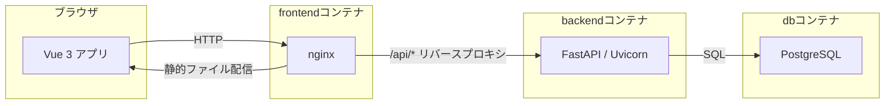
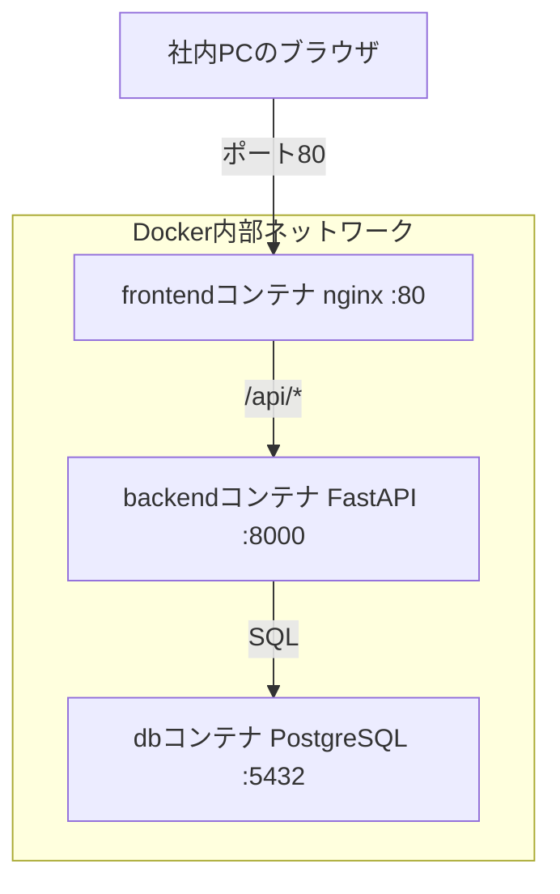
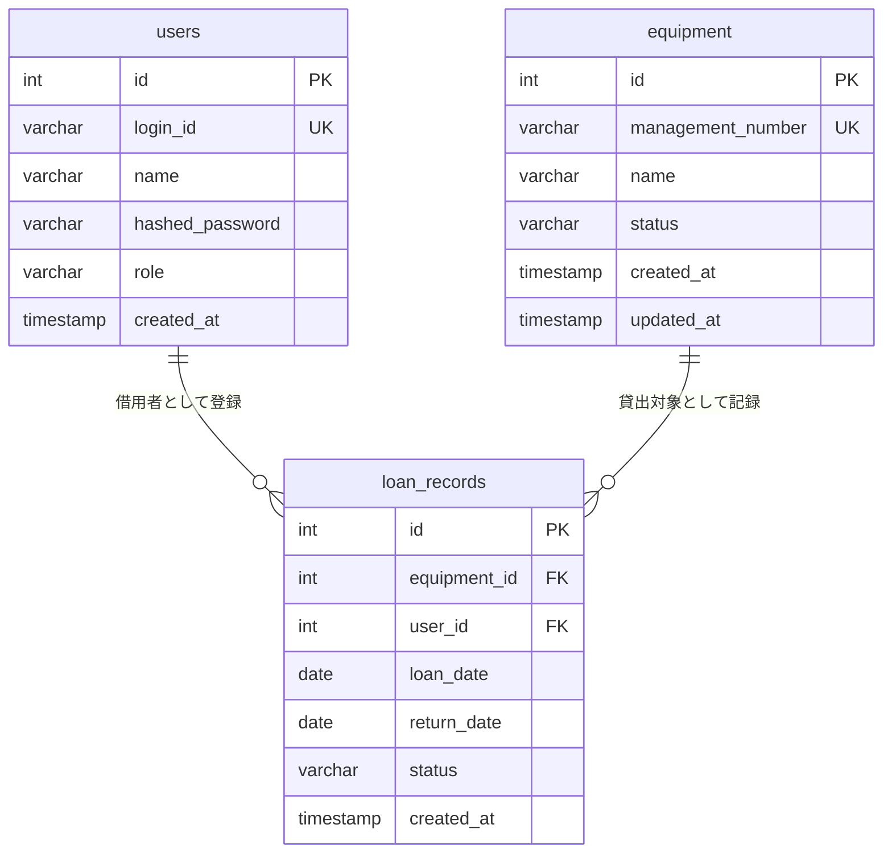
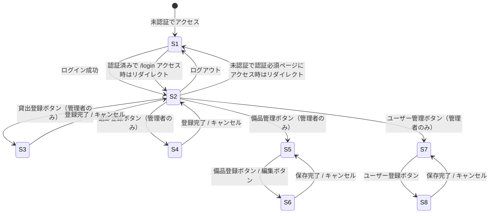
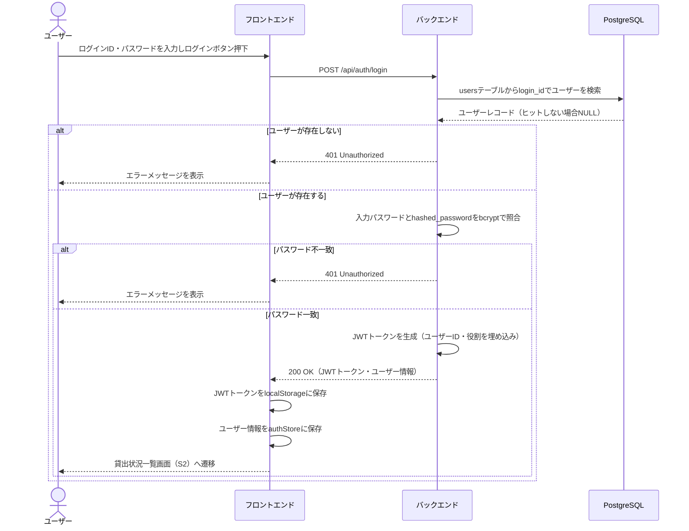
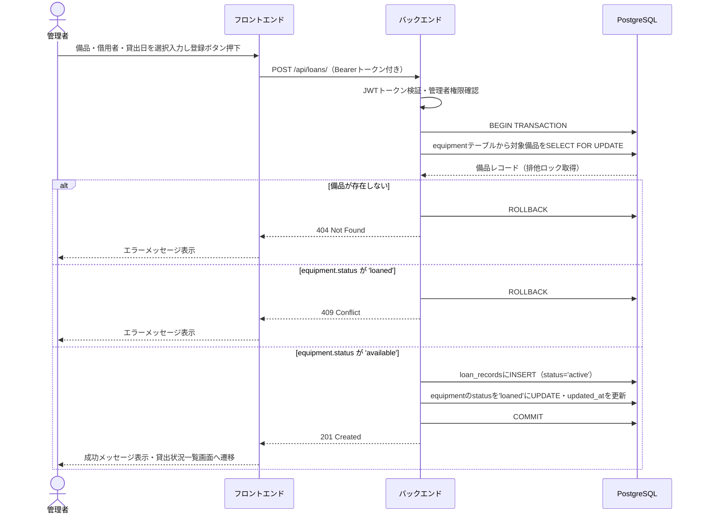
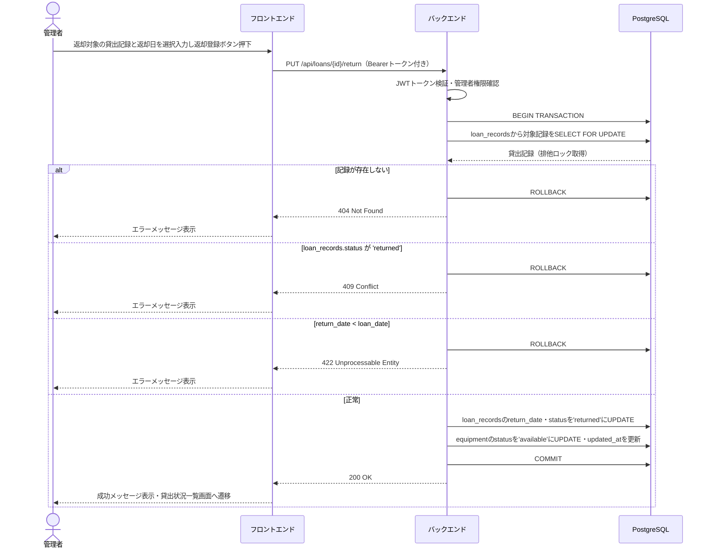
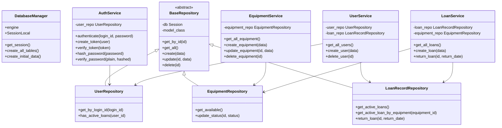
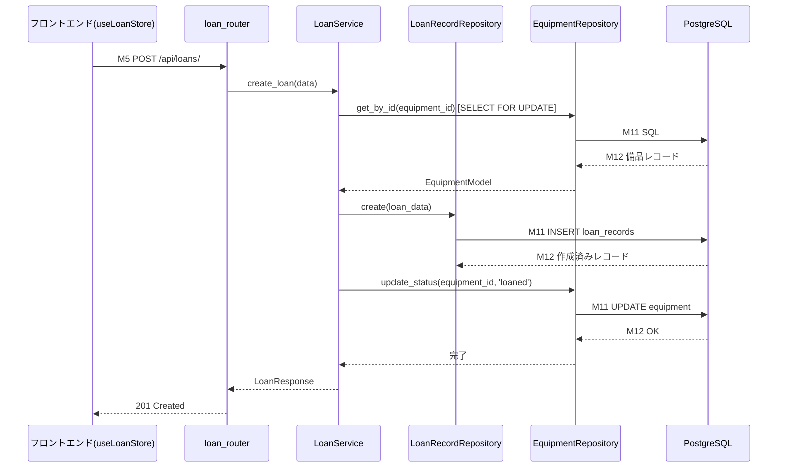

# 備品管理・貸出管理システム 詳細設計書

---

## 1. 言語・フレームワーク

| 区分 | 採用技術 | 理由 |
|------|----------|------|
| フロントエンド言語 | JavaScript (Vue 3) | |
| フロントエンドUIフレームワーク | Vuetify 3 | |
| フロントエンド状態管理 | Pinia | |
| フロントエンドルーター | Vue Router 4 | |
| フロントエンドHTTPクライアント | axios | |
| フロントエンドビルド | npm（Vite） | |
| フロントエンド静的配信 | nginx（マルチステージDockerビルド） | |
| バックエンド言語 | Python 3.12 | |
| バックエンドフレームワーク | FastAPI | |
| バックエンドORMツール | SQLAlchemy 2 | |
| バックエンドWSGI | Uvicorn | |
| データベース | PostgreSQL 16 | |
| バックエンドJWT | python-jose | |
| バックエンドパスワードハッシュ | passlib (bcrypt) | |
| コンテナ | Docker / Docker Compose | |

### フロントエンドDockerビルド方針

フロントエンドのDockerfileはマルチステージビルドで構成する。

- **ステージ1（ビルドステージ）**: node.jsイメージ上でnpm installおよびnpm run buildを実行し、Vueアプリケーションのdistファイルを生成する。
- **ステージ2（配信ステージ）**: nginxイメージ上にステージ1で生成したdistファイルをコピーし、nginxで静的ファイルを配信する。

### nginxリバースプロキシ方針

フロントエンドコンテナのnginxは以下のリクエスト処理を行う。

- `/api/` で始まるリクエストはすべてバックエンドコンテナ（FastAPI / Uvicorn, ポート8000）へリバースプロキシする。
- それ以外のリクエストはVueアプリケーションのindex.htmlを返す（Vue Routerのhistoryモード対応）。

フロントエンド（Vue）はAPIリクエストをすべて `/api/` 以下のパスに対して発行する。バックエンドFastAPIのルータープレフィックスは `/api` とする。

---

## 2. システム構成

### コンポーネント一覧

| コンポーネント | 技術 | 役割 |
|--------------|------|------|
| フロントエンド | Vue 3 + Vuetify 3 + nginx | ユーザーインターフェースの提供、APIリクエストの発行、レスポンスの表示 |
| バックエンド | FastAPI + Uvicorn | ビジネスロジックの実行、REST APIの提供、認証・認可の制御 |
| データベース | PostgreSQL 16 | 備品・貸出記録・ユーザーデータの永続化 |

### システム構成図



### コンポーネント役割・インターフェース

| 区間 | プロトコル | 内容 |
|------|-----------|------|
| ブラウザ ↔ nginx | HTTP (ポート80) | 画面HTML/JS/CSS配信、APIリクエスト転送 |
| nginx ↔ FastAPI | HTTP (ポート8000) | REST APIリクエストの転送（/api/ プレフィックス） |
| FastAPI ↔ PostgreSQL | TCP (ポート5432) | SQLAlchemyによるSQL発行 |

### ネットワーク構成図



---

## 3. データベース設計

### テーブル一覧

| テーブル名 | 対応エンティティ | 概要 |
|-----------|----------------|------|
| users | ユーザー | ログインユーザー（管理者・一般社員）を管理する |
| equipment | 備品 | 貸出対象の備品を管理する |
| loan_records | 貸出記録 | 貸出・返却の履歴を管理する |

### テーブル定義

#### users テーブル

| カラム名 | データ型 | 制約 | 説明 |
|---------|---------|------|------|
| id | SERIAL | PK | ユーザーID（自動採番） |
| login_id | VARCHAR(50) | NOT NULL, UNIQUE | ログインID |
| name | VARCHAR(100) | NOT NULL | 氏名 |
| hashed_password | VARCHAR(255) | NOT NULL | bcryptハッシュ化済みパスワード |
| role | VARCHAR(10) | NOT NULL, CHECK(role IN ('admin','general')) | 役割 |
| created_at | TIMESTAMP | NOT NULL, DEFAULT NOW() | 作成日時 |

#### equipment テーブル

| カラム名 | データ型 | 制約 | 説明 |
|---------|---------|------|------|
| id | SERIAL | PK | 備品ID（自動採番） |
| management_number | VARCHAR(50) | NOT NULL, UNIQUE | 管理番号 |
| name | VARCHAR(100) | NOT NULL | 品名 |
| status | VARCHAR(10) | NOT NULL, DEFAULT 'available', CHECK(status IN ('available','loaned')) | 状態 |
| created_at | TIMESTAMP | NOT NULL, DEFAULT NOW() | 作成日時 |
| updated_at | TIMESTAMP | NOT NULL, DEFAULT NOW() | 更新日時 |

#### loan_records テーブル

| カラム名 | データ型 | 制約 | 説明 |
|---------|---------|------|------|
| id | SERIAL | PK | 貸出ID（自動採番） |
| equipment_id | INTEGER | NOT NULL, FK → equipment.id | 備品ID |
| user_id | INTEGER | NOT NULL, FK → users.id | 借用者ユーザーID |
| loan_date | DATE | NOT NULL | 貸出日 |
| return_date | DATE | NULL | 返却日（未返却の場合NULL） |
| status | VARCHAR(10) | NOT NULL, DEFAULT 'active', CHECK(status IN ('active','returned')) | 状態 |
| created_at | TIMESTAMP | NOT NULL, DEFAULT NOW() | 作成日時 |

### ER図



### データ整合性制約

| 制約種別 | 内容 |
|---------|------|
| PK制約 | 各テーブルのid列（自動採番） |
| UK制約 | users.login_id, equipment.management_number |
| FK制約 | loan_records.equipment_id → equipment.id, loan_records.user_id → users.id |
| CHECK制約 | equipment.status IN ('available','loaned'), users.role IN ('admin','general'), loan_records.status IN ('active','returned') |
| 業務制約（アプリ層） | 貸出登録時: equipment.status = 'available' であること |
| 業務制約（アプリ層） | 返却登録時: loan_records.status = 'active' であること |
| 業務制約（アプリ層） | 備品削除時: equipment.status = 'available' であること |
| 業務制約（アプリ層） | ユーザー削除時: 対象ユーザーのactiveな貸出記録が存在しないこと |
| 業務制約（アプリ層） | 返却日: return_date >= loan_date であること |

---

## 4. 外部設計

### 画面一覧

| 画面ID | 画面名 | URL | 利用者 |
|--------|--------|-----|--------|
| S1 | ログイン画面 | /login | 全ユーザー（未認証） |
| S2 | 貸出状況一覧画面 | / | 全ユーザー（認証済み） |
| S3 | 貸出登録画面 | /loans/create | 管理者のみ |
| S4 | 返却登録画面 | /loans/return | 管理者のみ |
| S5 | 備品一覧・管理画面 | /equipment | 管理者のみ |
| S6 | 備品登録・編集画面 | /equipment/create, /equipment/:id/edit | 管理者のみ |
| S7 | ユーザー管理画面 | /users | 管理者のみ |
| S8 | ユーザー登録画面 | /users/create | 管理者のみ |

### 各画面モックアップ（AA）

#### S1 ログイン画面

```
+--------------------------------------------------+
|                                                  |
|          備品管理・貸出管理システム                 |
|                                                  |
|   ログインID  [ admin                        ]    |
|                                                  |
|   パスワード  [ **********                   ]    |
|                                                  |
|              [      ログイン       ]              |
|                                                  |
|   ※ エラー時: "ログインIDまたはパスワードが         |
|              正しくありません"                     |
+--------------------------------------------------+
```

#### S2 貸出状況一覧画面（管理者）

```
+------------------------------------------------------------+
|  備品管理システム                  管理者:田中  [ログアウト]  |
+------------------------------------------------------------+
|  [貸出登録]  [返却登録]  [備品管理]  [ユーザー管理]          |
+------------------------------------------------------------+
|  貸出状況一覧                                              |
|  +------------+--------+----------+------------+          |
|  | 備品名      | 状態   | 借用者   | 貸出日      |          |
|  +------------+--------+----------+------------+          |
|  | ノートPC    | 貸出中 | 山田太郎  | 2026/03/01 |          |
|  | プロジェクタ | 貸出可 |    -     |     -      |          |
|  | カメラ      | 貸出可 |    -     |     -      |          |
|  | 延長コード  | 貸出可 |    -     |     -      |          |
|  +------------+--------+----------+------------+          |
+------------------------------------------------------------+
```

#### S2 貸出状況一覧画面（一般社員）

```
+------------------------------------------------------------+
|  備品管理システム                  社員:山田   [ログアウト]  |
+------------------------------------------------------------+
|  貸出状況一覧                                              |
|  +------------+--------+----------+------------+          |
|  | 備品名      | 状態   | 借用者   | 貸出日      |          |
|  +------------+--------+----------+------------+          |
|  | ノートPC    | 貸出中 | 山田太郎  | 2026/03/01 |          |
|  | プロジェクタ | 貸出可 |    -     |     -      |          |
|  +------------+--------+----------+------------+          |
+------------------------------------------------------------+
```

#### S3 貸出登録画面

```
+--------------------------------------------+
|  貸出登録                  [← 一覧に戻る]   |
+--------------------------------------------+
|                                            |
|  備品選択   [ プロジェクタ          ▼ ]     |
|             ※ 貸出可の備品のみ表示           |
|                                            |
|  借用者     [ 山田太郎              ▼ ]     |
|                                            |
|  貸出日     [ 2026/03/29               ]   |
|                                            |
|          [キャンセル]  [  登録する  ]        |
|                                            |
+--------------------------------------------+
```

#### S4 返却登録画面

```
+----------------------------------------------------------------+
|  返却登録                              [← 一覧に戻る]           |
+----------------------------------------------------------------+
|  貸出中の一覧から返却する備品を選択してください                    |
|                                                                |
|  +------------+----------+------------+----------+---------+  |
|  | 備品名      | 借用者   | 貸出日      | 返却日    | 操作    |  |
|  +------------+----------+------------+----------+---------+  |
|  | ノートPC    | 山田太郎  | 2026/03/01 |[2026/03/29][返却登録]|  |
|  +------------+----------+------------+----------+---------+  |
+----------------------------------------------------------------+
```

#### S5 備品一覧・管理画面

```
+----------------------------------------------------------+
|  備品管理                          [← 一覧に戻る]         |
+----------------------------------------------------------+
|                                    [+ 備品を登録する]      |
|  +-----------+-------------+--------+-------+--------+   |
|  | 管理番号   | 品名         | 状態   | 編集  | 削除   |   |
|  +-----------+-------------+--------+-------+--------+   |
|  | PC-001    | ノートPC     | 貸出中 | [編集]|   -    |   |
|  | PJ-001    | プロジェクタ  | 貸出可 | [編集]| [削除] |   |
|  | CA-001    | カメラ       | 貸出可 | [編集]| [削除] |   |
|  +-----------+-------------+--------+-------+--------+   |
|   ※ 貸出中の備品は削除不可                                 |
+----------------------------------------------------------+
```

#### S6 備品登録・編集画面

```
+---------------------------------------------+
|  備品登録 / 編集         [← 備品管理に戻る]   |
+---------------------------------------------+
|                                             |
|  管理番号  [ PC-002                     ]   |
|             ※ 新規登録時のみ入力可           |
|             ※ 編集時は変更不可（読み取り専用） |
|                                             |
|  品名      [ ノートPC                   ]   |
|                                             |
|          [キャンセル]   [  保存する  ]        |
|                                             |
+---------------------------------------------+
```

#### S7 ユーザー管理画面

```
+----------------------------------------------------------+
|  ユーザー管理                      [← 一覧に戻る]         |
+----------------------------------------------------------+
|                                    [+ ユーザーを登録する]  |
|  +----------+------------+--------+--------+            |
|  | 氏名      | ログインID  | 役割   | 削除   |            |
|  +----------+------------+--------+--------+            |
|  | 田中一郎  | tanaka     | 管理者 |   -    |            |
|  | 山田太郎  | yamada     | 一般   | [削除] |            |
|  | 鈴木花子  | suzuki     | 一般   | [削除] |            |
|  +----------+------------+--------+--------+            |
|   ※ 貸出中の借用者は削除不可                              |
+----------------------------------------------------------+
```

#### S8 ユーザー登録画面

```
+-----------------------------------------------+
|  ユーザー登録        [← ユーザー管理に戻る]      |
+-----------------------------------------------+
|                                               |
|  氏名         [ 鈴木花子                  ]    |
|                                               |
|  ログインID    [ suzuki                   ]    |
|                                               |
|  パスワード    [ **********               ]    |
|                ※ 8文字以上                    |
|                                               |
|  役割         [ 一般                   ▼ ]    |
|                                               |
|           [キャンセル]   [  保存する  ]         |
+-----------------------------------------------+
```

### 画面遷移図



### API仕様

#### 共通仕様

- ベースパス: `/api`
- 認証方式: BearerトークンをAuthorizationヘッダーに付与（例: `Authorization: Bearer {token}`）
- レスポンス形式: JSON
- 日付形式: ISO 8601（例: `2026-03-29`）

#### 認証API

| メソッド | パス | 認証 | 概要 |
|---------|------|------|------|
| POST | /api/auth/login | 不要 | ログイン |

**POST /api/auth/login**

- リクエストボディ

| フィールド | 型 | 必須 | バリデーション |
|-----------|-----|------|--------------|
| login_id | string | ○ | 最大50文字 |
| password | string | ○ | 最大100文字 |

- レスポンス

| ステータス | 内容 |
|-----------|------|
| 200 | `{ access_token: string, token_type: "bearer", user: { id, name, role } }` |
| 401 | `{ detail: "ログインIDまたはパスワードが正しくありません" }` |
| 422 | バリデーションエラー詳細 |

#### 備品API

| メソッド | パス | 認証 | 権限 | 概要 |
|---------|------|------|------|------|
| GET | /api/equipment/ | 必要 | 全役割 | 備品一覧取得 |
| POST | /api/equipment/ | 必要 | 管理者のみ | 備品登録 |
| PUT | /api/equipment/{id} | 必要 | 管理者のみ | 備品更新 |
| DELETE | /api/equipment/{id} | 必要 | 管理者のみ | 備品削除 |

**GET /api/equipment/**

- レスポンス200: `[ { id, management_number, name, status, created_at, updated_at } ]`

**POST /api/equipment/**

- リクエストボディ

| フィールド | 型 | 必須 | バリデーション |
|-----------|-----|------|--------------|
| management_number | string | ○ | 最大50文字、一意 |
| name | string | ○ | 最大100文字 |

- レスポンス

| ステータス | 内容 |
|-----------|------|
| 201 | `{ id, management_number, name, status: "available" }` |
| 403 | 管理者権限なし |
| 409 | 管理番号が既に存在する |
| 422 | バリデーションエラー |

**PUT /api/equipment/{id}**

- リクエストボディ

| フィールド | 型 | 必須 | バリデーション |
|-----------|-----|------|--------------|
| name | string | ○ | 最大100文字 |

- レスポンス

| ステータス | 内容 |
|-----------|------|
| 200 | `{ id, management_number, name, status }` |
| 403 | 管理者権限なし |
| 404 | 備品が存在しない |

**DELETE /api/equipment/{id}**

- レスポンス

| ステータス | 内容 |
|-----------|------|
| 204 | 削除成功 |
| 403 | 管理者権限なし |
| 404 | 備品が存在しない |
| 409 | 備品が貸出中のため削除不可 |

#### 貸出記録API

| メソッド | パス | 認証 | 権限 | 概要 |
|---------|------|------|------|------|
| GET | /api/loans/ | 必要 | 全役割 | 貸出状況一覧取得 |
| POST | /api/loans/ | 必要 | 管理者のみ | 貸出登録 |
| PUT | /api/loans/{id}/return | 必要 | 管理者のみ | 返却登録 |

**GET /api/loans/**

- レスポンス200: `[ { id, equipment_id, equipment_name, equipment_management_number, user_id, user_name, loan_date, return_date, status } ]`

**POST /api/loans/**

- リクエストボディ

| フィールド | 型 | 必須 | バリデーション |
|-----------|-----|------|--------------|
| equipment_id | integer | ○ | 存在する備品のID |
| borrower_user_id | integer | ○ | 存在するユーザーのID |
| loan_date | date | ○ | ISO 8601形式 |

- レスポンス

| ステータス | 内容 |
|-----------|------|
| 201 | `{ id, equipment_id, borrower_user_id, loan_date, status: "active" }` |
| 403 | 管理者権限なし |
| 404 | 備品またはユーザーが存在しない |
| 409 | 備品が既に貸出中 |

**PUT /api/loans/{id}/return**

- リクエストボディ

| フィールド | 型 | 必須 | バリデーション |
|-----------|-----|------|--------------|
| return_date | date | ○ | ISO 8601形式、loan_date以降であること |

- レスポンス

| ステータス | 内容 |
|-----------|------|
| 200 | `{ id, equipment_id, borrower_user_id, loan_date, return_date, status: "returned" }` |
| 403 | 管理者権限なし |
| 404 | 貸出記録が存在しない |
| 409 | 既に返却済み |
| 422 | return_date < loan_date |

#### ユーザーAPI

| メソッド | パス | 認証 | 権限 | 概要 |
|---------|------|------|------|------|
| GET | /api/users/ | 必要 | 管理者のみ | ユーザー一覧取得 |
| POST | /api/users/ | 必要 | 管理者のみ | ユーザー登録 |
| DELETE | /api/users/{id} | 必要 | 管理者のみ | ユーザー削除 |

**GET /api/users/**

- レスポンス200: `[ { id, name, login_id, role, created_at } ]`

**POST /api/users/**

- リクエストボディ

| フィールド | 型 | 必須 | バリデーション |
|-----------|-----|------|--------------|
| name | string | ○ | 最大100文字 |
| login_id | string | ○ | 最大50文字、一意 |
| password | string | ○ | 8文字以上100文字以下 |
| role | string | ○ | "admin" または "general" |

- レスポンス

| ステータス | 内容 |
|-----------|------|
| 201 | `{ id, name, login_id, role }` |
| 403 | 管理者権限なし |
| 409 | ログインIDが既に存在する |
| 422 | バリデーションエラー |

**DELETE /api/users/{id}**

- レスポンス

| ステータス | 内容 |
|-----------|------|
| 204 | 削除成功 |
| 403 | 管理者権限なし |
| 404 | ユーザーが存在しない |
| 409 | ユーザーが貸出中のため削除不可 |

### 外部システム連携

なし（要件定義書に外部連携なし）

### 外部データベース連携

なし（システム内部のPostgreSQLのみ使用）

---

## 5. 内部設計

### ログイン処理フロー



### 貸出登録処理フロー



### 返却登録処理フロー



### トランザクション設計

| 処理 | トランザクション境界 | ロールバック条件 |
|------|-------------------|----------------|
| 貸出登録 | 備品ステータス確認→貸出記録INSERT→備品ステータスUPDATEを1トランザクション内で実行 | 備品が存在しない、備品が貸出中、DB例外 |
| 返却登録 | 貸出記録確認→貸出記録UPDATE→備品ステータスUPDATEを1トランザクション内で実行 | 記録が存在しない、既に返却済み、return_date不正、DB例外 |
| 備品削除 | 備品ステータス確認→DELETE を1トランザクション内で実行 | 備品が存在しない、備品が貸出中、DB例外 |
| ユーザー削除 | アクティブ貸出確認→DELETE を1トランザクション内で実行 | ユーザーが存在しない、アクティブな貸出あり、DB例外 |

### 排他制御

| 処理 | 排他制御方式 | 対象 |
|------|------------|------|
| 貸出登録 | 悲観的ロック（SELECT FOR UPDATE） | equipmentテーブルの対象行 |
| 返却登録 | 悲観的ロック（SELECT FOR UPDATE） | loan_recordsテーブルの対象行 |

同一備品への同時貸出リクエストが発生した場合、先に取得したトランザクションが処理を完了し、後のトランザクションは409エラーで応答する。

### システム初期化処理

バックエンドコンテナ起動時に以下を自動的に実行する。

1. SQLAlchemyを使用してDBスキーマ（テーブル）を存在しない場合のみ作成する。
2. usersテーブルに管理者ロール（role='admin'）のレコードが存在しない場合、初期管理者ユーザーを1件作成する。
   - ログインID: `admin`
   - 氏名: `管理者`
   - パスワード: `admin1234`（bcryptハッシュ化して保存）

### アプリケーションログ

| ログレベル | 記録タイミング |
|----------|--------------|
| INFO | ログイン成功、各CRUD操作の成功 |
| WARNING | ログイン失敗（認証エラー）、401・403エラー発生時 |
| ERROR | 予期せぬ例外（500エラー）発生時 |

ログはstdout（標準出力）に出力し、Dockerのログ収集機能で管理する。

---

## 6. クラス設計

### バックエンドクラス一覧

| クラス名 | 区分 | 役割 |
|---------|------|------|
| DatabaseManager | インフラ | DBセッション管理、テーブル作成、初期データ投入 |
| UserModel | ORMモデル | usersテーブルのORM定義 |
| EquipmentModel | ORMモデル | equipmentテーブルのORM定義 |
| LoanRecordModel | ORMモデル | loan_recordsテーブルのORM定義 |
| BaseRepository | リポジトリ（基底） | 共通CRUD操作の実装（継承用） |
| UserRepository | リポジトリ | ユーザー固有のデータアクセス |
| EquipmentRepository | リポジトリ | 備品固有のデータアクセス |
| LoanRecordRepository | リポジトリ | 貸出記録固有のデータアクセス |
| AuthService | サービス | 認証・JWTトークン管理 |
| UserService | サービス | ユーザー業務ロジック |
| EquipmentService | サービス | 備品業務ロジック |
| LoanService | サービス | 貸出業務ロジック |
| CommonDependencies | 依存関係 | FastAPI依存性注入（DBセッション、認証、管理者チェック）の共通定義 |

### バックエンドスキーマ（Pydantic）一覧

| スキーマ名 | 用途 |
|----------|------|
| LoginRequest | ログインAPIリクエスト |
| TokenResponse | ログインAPIレスポンス |
| EquipmentCreate | 備品登録リクエスト |
| EquipmentUpdate | 備品更新リクエスト |
| EquipmentResponse | 備品APIレスポンス |
| LoanCreate | 貸出登録リクエスト |
| LoanReturn | 返却登録リクエスト |
| LoanResponse | 貸出記録APIレスポンス |
| UserCreate | ユーザー登録リクエスト |
| UserResponse | ユーザーAPIレスポンス |

### フロントエンドモジュール一覧

| モジュール名 | 区分 | 役割 |
|------------|------|------|
| apiClient | APIクライアント | axiosインスタンス。全APIリクエストの共通ベース。リクエストインターセプターでBearerトークンを付与、レスポンスインターセプターで401時にログイン画面へリダイレクト |
| useAuthStore | Piniaストア | 認証状態（JWTトークン・現在ユーザー情報）の管理、ログイン・ログアウト処理 |
| useEquipmentStore | Piniaストア | 備品一覧状態の管理、CRUD操作のAPI呼び出し |
| useLoanStore | Piniaストア | 貸出記録一覧状態の管理、貸出・返却操作のAPI呼び出し |
| useUserStore | Piniaストア | ユーザー一覧状態の管理、登録・削除操作のAPI呼び出し |
| router | Vue Router | 全画面のルーティング定義、ナビゲーションガード（未認証リダイレクト・権限チェック） |
| LoginView | ビュー | S1 ログイン画面 |
| DashboardView | ビュー | S2 貸出状況一覧画面 |
| LoanCreateView | ビュー | S3 貸出登録画面 |
| ReturnCreateView | ビュー | S4 返却登録画面 |
| EquipmentListView | ビュー | S5 備品一覧・管理画面 |
| EquipmentFormView | ビュー | S6 備品登録・編集画面 |
| UserListView | ビュー | S7 ユーザー管理画面 |
| UserFormView | ビュー | S8 ユーザー登録画面 |

### クラス図（バックエンド）



### エンティティ・画面・API・クラス対応表

| エンティティ | 対応画面 | 対応APIパス | バックエンドモデル | リポジトリ | サービス |
|-------------|---------|------------|-----------------|----------|---------|
| 備品 | S2, S5, S6 | /api/equipment/ | EquipmentModel | EquipmentRepository | EquipmentService |
| 貸出記録 | S2, S3, S4 | /api/loans/ | LoanRecordModel | LoanRecordRepository | LoanService |
| ユーザー | S3, S7, S8 | /api/users/ | UserModel | UserRepository | UserService |
| 認証 | S1 | /api/auth/login | UserModel | UserRepository | AuthService |

---

## 7. メッセージ設計

### メッセージ一覧

| メッセージID | 発信元 | 受信先 | 内容 |
|------------|--------|--------|------|
| M1 | フロントエンド | バックエンド | ログインリクエスト（login_id, password） |
| M2 | バックエンド | フロントエンド | JWTトークン・ユーザー情報 |
| M3 | フロントエンド | バックエンド | 備品一覧取得リクエスト（Bearerトークン付き） |
| M4 | フロントエンド | バックエンド | 貸出状況一覧取得リクエスト（Bearerトークン付き） |
| M5 | フロントエンド | バックエンド | 貸出登録リクエスト（equipment_id, borrower_user_id, loan_date） |
| M6 | フロントエンド | バックエンド | 返却登録リクエスト（loan_id, return_date） |
| M7 | フロントエンド | バックエンド | 備品登録・更新リクエスト（management_number, name） |
| M8 | フロントエンド | バックエンド | 備品削除リクエスト（equipment_id） |
| M9 | フロントエンド | バックエンド | ユーザー登録リクエスト（name, login_id, password, role） |
| M10 | フロントエンド | バックエンド | ユーザー削除リクエスト（user_id） |
| M11 | バックエンド | PostgreSQL | SQLクエリ（SELECT / INSERT / UPDATE / DELETE） |
| M12 | PostgreSQL | バックエンド | クエリ結果（レコードセット or 影響行数） |

### 貸出登録メッセージフロー



---

## 8. エラーハンドリング

### エラー一覧

| エラーコード | 発生条件 | バックエンドの応答 | フロントエンドの表示 |
|------------|---------|-----------------|-------------------|
| 401 | トークン未付与、トークン無効・期限切れ、パスワード不一致 | `{ detail: "..." }` | ログイン画面へリダイレクト（認証失敗はエラーメッセージ表示） |
| 403 | 一般社員が管理者専用APIを呼び出した | `{ detail: "権限がありません" }` | エラーメッセージをスナックバーで表示 |
| 404 | 指定IDのリソースが存在しない | `{ detail: "XXXが見つかりません" }` | エラーメッセージをスナックバーで表示 |
| 409 | 業務制約違反（貸出中備品の再貸出・削除、返却済み記録の再返却、重複キー） | `{ detail: "..." }` | エラーメッセージをスナックバーで表示 |
| 422 | リクエストボディのバリデーション失敗 | FastAPIデフォルトエラー形式 | フィールドエラーをフォーム上に表示 |
| 500 | 予期せぬサーバー例外 | `{ detail: "サーバーエラーが発生しました" }` | エラーメッセージをスナックバーで表示 |

### フロントエンド共通エラー処理

apiClientのaxiosレスポンスインターセプターにて以下を共通処理する。

- ステータス401: authStoreをクリアし、ログイン画面へリダイレクトする。
- ステータス401（/api/auth/login に対するもの）: リダイレクトせず、エラーメッセージを画面に表示する。
- その他エラー: エラーレスポンスのdetailメッセージをスナックバー（Vuetifyのv-snackbar）で表示する。

---

## 9. セキュリティ設計

| 項目 | 設計内容 |
|------|---------|
| 認証方式 | JWTトークン（HS256署名）。有効期限8時間。 |
| トークン保管 | フロントエンドのlocalStorageに保存。 |
| パスワード保管 | bcryptでハッシュ化してDBに保存。平文パスワードは保存しない。 |
| 認可 | バックエンドの管理者専用エンドポイントはCommonDependenciesのrequire_admin依存関係で強制確認。フロントエンドのナビゲーションガードでも管理者ロールを検証し、一般社員は管理者専用URLにアクセス不可とする。 |
| 未認証アクセス | ログイン画面以外の全ルートにグローバルナビゲーションガードを設定し、トークン未保持の場合はログイン画面へリダイレクトする。 |
| SQLインジェクション対策 | SQLAlchemy ORMのパラメータバインディングを使用し、SQLの直接文字列連結を行わない。 |
| XSS対策 | Vueのテンプレートはデフォルトでエスケープする。v-htmlディレクティブは使用しない。 |
| 初期パスワード | 初期管理者ユーザーのパスワードは起動後に変更することをREADME.mdに明記する。ただし、現バージョンではパスワード変更機能は持たないため、ユーザー削除・再登録で対応する。 |
| JWTシークレット | 環境変数(SECRET_KEY)で管理し、docker-compose.ymlのenvまたは.envファイルで設定する。ソースコードにハードコードしない。 |

---

## 10. ソースコード構成

### ディレクトリ構成

```
/
├── docker-compose.yml
├── README.md
├── docs/
│   ├── requirements.md
│   └── detail_design.md
├── frontend/
│   ├── Dockerfile
│   ├── nginx.conf
│   ├── package.json
│   └── src/
│       ├── main.js
│       ├── App.vue
│       ├── api/
│       │   └── client.js
│       ├── router/
│       │   └── index.js
│       ├── stores/
│       │   ├── auth.js
│       │   ├── equipment.js
│       │   ├── loan.js
│       │   └── user.js
│       └── views/
│           ├── LoginView.vue
│           ├── DashboardView.vue
│           ├── LoanCreateView.vue
│           ├── ReturnCreateView.vue
│           ├── EquipmentListView.vue
│           ├── EquipmentFormView.vue
│           ├── UserListView.vue
│           └── UserFormView.vue
├── backend/
│   ├── Dockerfile
│   ├── requirements.txt
│   └── app/
│       ├── main.py
│       ├── database.py
│       ├── dependencies.py
│       ├── models/
│       │   ├── __init__.py
│       │   ├── user.py
│       │   ├── equipment.py
│       │   └── loan_record.py
│       ├── schemas/
│       │   ├── __init__.py
│       │   ├── auth.py
│       │   ├── user.py
│       │   ├── equipment.py
│       │   └── loan_record.py
│       ├── repositories/
│       │   ├── __init__.py
│       │   ├── base.py
│       │   ├── user.py
│       │   ├── equipment.py
│       │   └── loan_record.py
│       ├── services/
│       │   ├── __init__.py
│       │   ├── auth.py
│       │   ├── user.py
│       │   ├── equipment.py
│       │   └── loan.py
│       └── routers/
│           ├── __init__.py
│           ├── auth.py
│           ├── user.py
│           ├── equipment.py
│           └── loan.py
└── tests/
    ├── unit/
    │   └── backend/
    │       ├── test_auth_service.py
    │       ├── test_equipment_service.py
    │       ├── test_loan_service.py
    │       └── test_user_service.py
    └── integration/
        └── backend/
            ├── test_auth_api.py
            ├── test_equipment_api.py
            ├── test_loan_api.py
            └── test_user_api.py
```

### ファイル一覧

#### バックエンド

| ファイルパス | 格納クラス / 役割 |
|------------|----------------|
| app/main.py | FastAPIアプリケーションの初期化、ルーター登録、起動時のDBスキーマ作成・初期データ投入の実行 |
| app/database.py | DatabaseManager。DBエンジン・セッション管理 |
| app/dependencies.py | CommonDependencies。get_db, get_current_user, require_adminの依存関係定義 |
| app/models/user.py | UserModel |
| app/models/equipment.py | EquipmentModel |
| app/models/loan_record.py | LoanRecordModel |
| app/schemas/auth.py | LoginRequest, TokenResponse |
| app/schemas/user.py | UserCreate, UserResponse |
| app/schemas/equipment.py | EquipmentCreate, EquipmentUpdate, EquipmentResponse |
| app/schemas/loan_record.py | LoanCreate, LoanReturn, LoanResponse |
| app/repositories/base.py | BaseRepository |
| app/repositories/user.py | UserRepository |
| app/repositories/equipment.py | EquipmentRepository |
| app/repositories/loan_record.py | LoanRecordRepository |
| app/services/auth.py | AuthService |
| app/services/user.py | UserService |
| app/services/equipment.py | EquipmentService |
| app/services/loan.py | LoanService |
| app/routers/auth.py | /api/auth のルーター |
| app/routers/user.py | /api/users のルーター |
| app/routers/equipment.py | /api/equipment のルーター |
| app/routers/loan.py | /api/loans のルーター |

#### フロントエンド

| ファイルパス | 格納モジュール / 役割 |
|------------|---------------------|
| src/api/client.js | apiClient。axiosインスタンス、インターセプター定義 |
| src/router/index.js | router。Vue Routerの全ルート定義とナビゲーションガード |
| src/stores/auth.js | useAuthStore |
| src/stores/equipment.js | useEquipmentStore |
| src/stores/loan.js | useLoanStore |
| src/stores/user.js | useUserStore |
| src/views/LoginView.vue | S1 ログイン画面コンポーネント |
| src/views/DashboardView.vue | S2 貸出状況一覧画面コンポーネント |
| src/views/LoanCreateView.vue | S3 貸出登録画面コンポーネント |
| src/views/ReturnCreateView.vue | S4 返却登録画面コンポーネント |
| src/views/EquipmentListView.vue | S5 備品一覧・管理画面コンポーネント |
| src/views/EquipmentFormView.vue | S6 備品登録・編集画面コンポーネント |
| src/views/UserListView.vue | S7 ユーザー管理画面コンポーネント |
| src/views/UserFormView.vue | S8 ユーザー登録画面コンポーネント |

### 共通処理の共通化方針

| 共通処理 | 共通化場所 |
|---------|----------|
| 全CRUD基本操作（get_by_id, get_all, create, update, delete） | BaseRepositoryに実装し、各リポジトリが継承する |
| JWTトークンの付与 | apiClientのリクエストインターセプターに実装し、全Viewから直接axiosを使用しない |
| 401エラー時のリダイレクト処理 | apiClientのレスポンスインターセプターに実装する |
| スナックバーによるエラーメッセージ表示 | useAuthStore等の各ストアのエラーハンドリング共通パターンとし、スナックバーをApp.vueに一箇所定義する |
| FastAPI依存性（DBセッション取得・認証検証・管理者チェック） | dependencies.pyに集約し、各ルーターから参照する |

### コーディング規約

#### バックエンド (Python)

| 項目 | 規約 |
|------|------|
| スタイルガイド | PEP 8準拠 |
| 命名: 変数・関数 | snake_case |
| 命名: クラス | PascalCase |
| 命名: 定数 | UPPER_SNAKE_CASE |
| 型ヒント | 全関数の引数・返り値に必須 |
| インポート順 | 標準ライブラリ → サードパーティ → 自プロジェクト |
| コメント | 処理が自明でない箇所のみ日本語で記述 |

#### フロントエンド (Vue / JavaScript)

| 項目 | 規約 |
|------|------|
| スタイルガイド | Vue公式スタイルガイド（優先度A）準拠 |
| 命名: 変数・関数 | camelCase |
| 命名: コンポーネント | PascalCase |
| コンポーネントAPIスタイル | Composition API（`<script setup>`）を使用 |
| APIリクエスト | 必ずapiClientを通す。Viewから直接axiosを使用しない |
| APIコール処理 | 全てPiniaストアに記述し、Viewはストアのアクションを呼び出すのみ |
| コメント | 処理が自明でない箇所のみ日本語で記述 |

---

## 11. テスト設計

### テストの種類

| 種別 | 対象 | 目的 |
|------|------|------|
| 単体テスト | 各Serviceクラスのメソッド | ビジネスロジックの正常・異常動作を検証する |
| 結合テスト | 各APIエンドポイント | APIの入出力・認証・認可・DBとの連携を検証する |
| システムテスト | ユーザー操作フロー全体 | 要件定義の全機能が正しく動作することを検証する |

### 単体テストケース（バックエンド）

| テストID | 対象クラス・メソッド | テスト内容 | 正常/異常 |
|---------|------------------|----------|---------|
| UT-01 | AuthService.authenticate | 正しいlogin_id・パスワードでユーザーオブジェクトを返すこと | 正常 |
| UT-02 | AuthService.authenticate | 存在しないlogin_idでNoneを返すこと | 異常 |
| UT-03 | AuthService.authenticate | パスワード不一致でNoneを返すこと | 異常 |
| UT-04 | AuthService.verify_token | 有効なトークンからユーザーIDを取得できること | 正常 |
| UT-05 | AuthService.verify_token | 無効・期限切れトークンで例外が発生すること | 異常 |
| UT-06 | EquipmentService.create_equipment | 新規備品が作成されること | 正常 |
| UT-07 | EquipmentService.create_equipment | 重複した管理番号で409例外が発生すること | 異常 |
| UT-08 | EquipmentService.update_equipment | 備品名が更新されること | 正常 |
| UT-09 | EquipmentService.update_equipment | 存在しないIDで404例外が発生すること | 異常 |
| UT-10 | EquipmentService.delete_equipment | 貸出可状態の備品が削除されること | 正常 |
| UT-11 | EquipmentService.delete_equipment | 貸出中の備品で409例外が発生すること | 異常 |
| UT-12 | LoanService.create_loan | 貸出登録が作成され備品状態が'loaned'に更新されること | 正常 |
| UT-13 | LoanService.create_loan | 貸出中の備品に対して409例外が発生すること | 異常 |
| UT-14 | LoanService.create_loan | 存在しない備品IDで404例外が発生すること | 異常 |
| UT-15 | LoanService.return_loan | 返却登録が更新され備品状態が'available'に戻ること | 正常 |
| UT-16 | LoanService.return_loan | 返却済み記録に対して409例外が発生すること | 異常 |
| UT-17 | LoanService.return_loan | return_date < loan_dateで422例外が発生すること | 異常 |
| UT-18 | UserService.create_user | 新規ユーザーが作成されること | 正常 |
| UT-19 | UserService.create_user | 重複したlogin_idで409例外が発生すること | 異常 |
| UT-20 | UserService.delete_user | アクティブ貸出のないユーザーが削除されること | 正常 |
| UT-21 | UserService.delete_user | アクティブ貸出中のユーザーで409例外が発生すること | 異常 |
| UT-22 | UserService.delete_user | 存在しないIDで404例外が発生すること | 異常 |

### 結合テストケース（バックエンドAPIエンドポイント）

| テストID | エンドポイント | テスト内容 | 正常/異常 |
|---------|--------------|----------|---------|
| IT-01 | POST /api/auth/login | 正しい資格情報でトークンが返ること | 正常 |
| IT-02 | POST /api/auth/login | 誤ったパスワードで401が返ること | 異常 |
| IT-03 | GET /api/equipment/ | 管理者トークンで備品一覧が返ること | 正常 |
| IT-04 | GET /api/equipment/ | 一般社員トークンで備品一覧が返ること | 正常 |
| IT-05 | GET /api/equipment/ | トークンなしで401が返ること | 異常 |
| IT-06 | POST /api/equipment/ | 管理者トークンで備品が登録されること | 正常 |
| IT-07 | POST /api/equipment/ | 一般社員トークンで403が返ること | 異常 |
| IT-08 | POST /api/equipment/ | 重複管理番号で409が返ること | 異常 |
| IT-09 | PUT /api/equipment/{id} | 管理者トークンで備品名が更新されること | 正常 |
| IT-10 | PUT /api/equipment/{id} | 存在しないIDで404が返ること | 異常 |
| IT-11 | DELETE /api/equipment/{id} | 貸出可の備品が削除されること | 正常 |
| IT-12 | DELETE /api/equipment/{id} | 貸出中の備品で409が返ること | 異常 |
| IT-13 | GET /api/loans/ | 貸出状況一覧が返ること | 正常 |
| IT-14 | POST /api/loans/ | 貸出登録が成功し備品ステータスが更新されること | 正常 |
| IT-15 | POST /api/loans/ | 貸出中の備品への貸出で409が返ること | 異常 |
| IT-16 | PUT /api/loans/{id}/return | 返却登録が成功し備品ステータスが戻ること | 正常 |
| IT-17 | PUT /api/loans/{id}/return | 返却済み記録への返却で409が返ること | 異常 |
| IT-18 | PUT /api/loans/{id}/return | return_date < loan_dateで422が返ること | 異常 |
| IT-19 | GET /api/users/ | 管理者トークンでユーザー一覧が返ること | 正常 |
| IT-20 | GET /api/users/ | 一般社員トークンで403が返ること | 異常 |
| IT-21 | POST /api/users/ | ユーザー登録が成功すること | 正常 |
| IT-22 | POST /api/users/ | 重複login_idで409が返ること | 異常 |
| IT-23 | DELETE /api/users/{id} | アクティブ貸出なしのユーザーが削除されること | 正常 |
| IT-24 | DELETE /api/users/{id} | 貸出中ユーザーの削除で409が返ること | 異常 |

### システムテストケース（ユーザー操作フロー）

| テストID | ユーザー | 操作手順 | 確認内容 |
|---------|---------|---------|---------|
| ST-01 | 全ユーザー | ブラウザで http://localhost にアクセスする | ログイン画面（S1）が表示されること |
| ST-02 | 全ユーザー | 未ログイン状態でダッシュボードURL（/）に直接アクセスする | ログイン画面へリダイレクトされること |
| ST-03 | 管理者 | 正しいlogin_id・パスワードでログインする | 貸出状況一覧画面（S2）に遷移し、操作ボタンが表示されること |
| ST-04 | 一般社員 | 正しいlogin_id・パスワードでログインする | 貸出状況一覧画面（S2）に遷移し、操作ボタンが表示されないこと |
| ST-05 | 一般社員 | ブラウザで /loans/create に直接アクセスする | ログイン画面またはダッシュボードへリダイレクトされること |
| ST-06 | 管理者 | 備品管理画面で備品を新規登録する | 備品一覧に追加され「貸出可」状態で表示されること |
| ST-07 | 管理者 | 備品管理画面で登録済み備品の品名を編集する | 変更後の品名が一覧に反映されること |
| ST-08 | 管理者 | ユーザー管理画面でユーザーを新規登録する | ユーザー一覧に追加されること |
| ST-09 | 管理者 | 貸出登録画面で備品・借用者・貸出日を入力して登録する | 貸出状況一覧に対象備品が「貸出中」で借用者名・貸出日とともに表示されること |
| ST-10 | 一般社員 | ST-09の後、貸出状況一覧を確認する | 一般社員も「貸出中」状態をリアルタイムで閲覧できること |
| ST-11 | 管理者 | 返却登録画面で貸出中の記録を選択し返却日を入力して登録する | 貸出状況一覧の対象備品が「貸出可」に戻り借用者表示が消えること |
| ST-12 | 管理者 | 貸出中の備品を備品管理画面で削除しようとする | 削除ボタンが非活性または非表示で、削除が実行できないこと |
| ST-13 | 管理者 | 貸出中の借用者をユーザー管理画面で削除しようとする | 削除ボタンが非活性または非表示で、削除が実行できないこと |
| ST-14 | 管理者 | ログアウトボタンを押す | ログイン画面に遷移し、その後ブラウザバックしてもダッシュボードが表示されないこと |

---

## 12. 起動・運用

### 起動方法

システムはDocker Composeで起動する。起動方法の詳細はREADME.mdに記述する。

**README.mdに記載すること：**
- 前提条件（Docker・Docker Compose のインストール）
- 起動コマンド（`docker compose up --build`）
- アクセスURL（`http://localhost`）
- 初期管理者ユーザー（login_id: `admin`、パスワード: `admin1234`）
- 初期パスワード変更の案内（ユーザー削除・再登録による変更手順）
- 停止コマンド（`docker compose down`）
- データ永続化の説明（PostgreSQLデータはDockerボリュームに保存）

### Docker Composeサービス構成

| サービス名 | イメージ | ポート | 役割 |
|-----------|---------|-------|------|
| frontend | マルチステージビルド（node→nginx） | 80:80 | Vue静的ファイル配信・リバースプロキシ |
| backend | Python 3.12 + Uvicorn | 非公開（frontendのnginxからのみアクセス） | FastAPI APIサーバー |
| db | postgres:16 | 非公開（backendからのみアクセス） | PostgreSQLデータベース |

### 環境変数

| 変数名 | 設定先サービス | 内容 |
|-------|-------------|------|
| SECRET_KEY | backend | JWTトークン署名秘密鍵 |
| DATABASE_URL | backend | PostgreSQL接続文字列 |
| POSTGRES_DB | db | データベース名 |
| POSTGRES_USER | db | PostgreSQLユーザー名 |
| POSTGRES_PASSWORD | db | PostgreSQLパスワード |

---

## 13. 設計完了後の不要要素確認

以下はMVP要件に照らして設計から除外した。

| 除外要素 | 除外理由 |
|---------|---------|
| 備品・ユーザーの検索機能 | 備品20件・ユーザー50名の規模では一覧表示で十分、課題解決に不要 |
| 貸出履歴の集計・レポート出力 | 要件定義の業務課題に紐づかない |
| ユーザー情報の更新機能（氏名・パスワード変更） | 要件定義に含まれない |
| 返却期限・超過通知 | 要件定義の業務課題に紐づかない |
| 監査ログテーブル（DB） | アプリケーションログ（stdout）で十分。50名・20件規模でDB監査不要 |
| 備品・貸出記録の詳細画面 | 一覧表示に必要な情報を全て含めるため詳細画面は不要 |
| リフレッシュトークン | 社内8時間業務内での使用を想定し、アクセストークンの有効期限8時間で十分 |

---

## レビュー記録

本設計書は作成後にレビューを実施し、以下を確認した。

**矛盾チェック結果：問題なし**

| 確認項目 | 結果 |
|---------|------|
| APIパスと認可設定の整合 | 全APIの権限設定が要件定義の担当者設計と一致している |
| DBの業務制約とサービス処理の整合 | EquipmentService・LoanService・UserServiceの削除チェックが制約と一致している |
| トランザクションと排他制御の整合 | 貸出・返却の両処理にSELECT FOR UPDATEを定義し、ロックの対象テーブルが処理内容と一致している |
| 画面遷移と権限の整合 | ナビゲーションガードの設計が管理者専用画面（S3〜S8）に漏れなく適用されている |
| 共通処理の重複なし | BaseRepository、apiClientインターセプター、dependencies.pyで共通処理を一元化している |

**冗長チェック結果：問題なし**

| 確認項目 | 結果 |
|---------|------|
| 将来拡張の記述 | なし |
| 実装スケジュールの記述 | なし |
| コード例の記述 | なし |
| 業務課題に紐づかない設計要素 | 不要要素として明示し除外済み |
