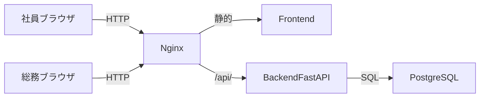
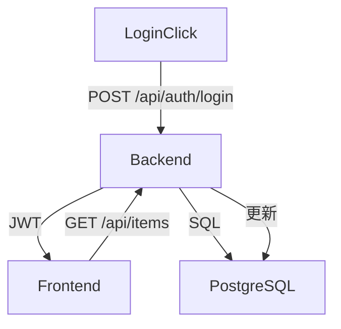
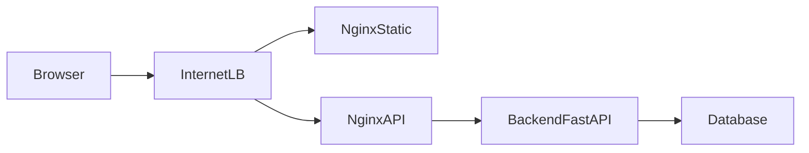
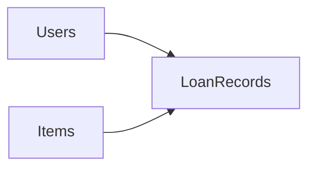
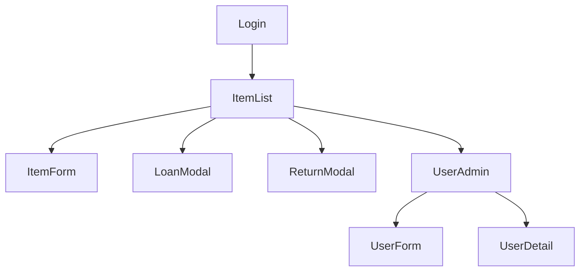
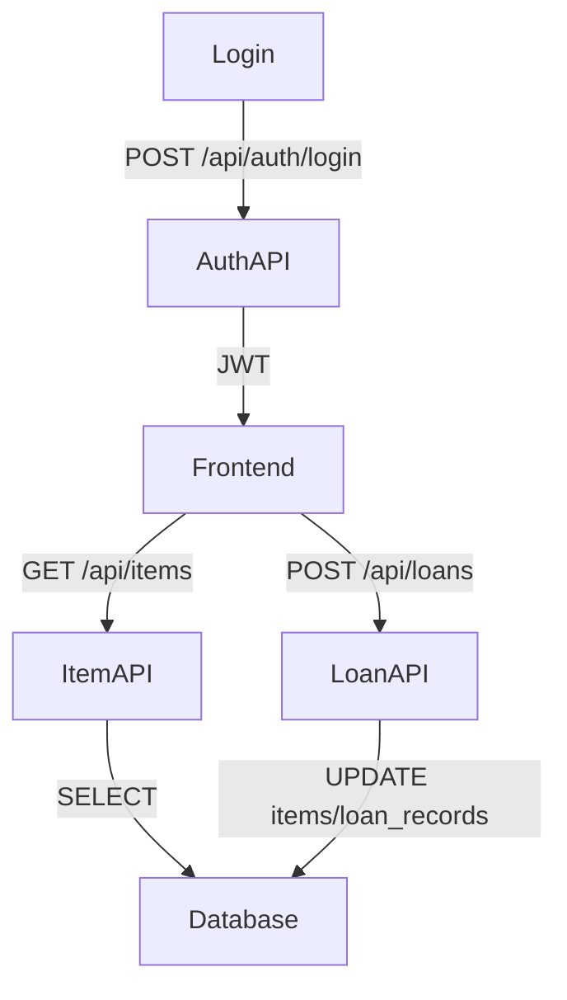
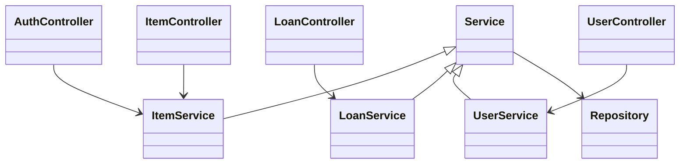
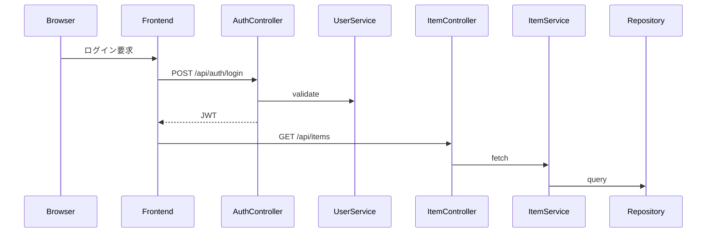

# 備品管理・貸出管理アプリ 詳細設計書（MVP）

## 1. 言語・フレームワーク
- **言語**：Python（FastAPI）をバックエンドに採用し、データ処理・API層を担う。
- **フロントエンド**：Vue 3 + Vuetify（マテリアルコンポーネント）で複数画面を丁寧に構築するため、Streamlitではなく Vue+FastAPI を選択。部品数・画面遷移の複雑性に対応する。
- **ビルド/デプロイ**：フロントエンドは npm で依存解決・ビルドし、マルチステージビルドで静的生成。nginx を用いた Docker イメージでホスティングする。バックエンドも nginx を入口にし、FastAPI アプリへ `/api/` でプロキシする構成とする。

## 2. システム構成

### 2.1 コンポーネント一覧
| コンポーネント | 役割 | インターフェース | 備考 |
|---------------|------|------------------|------|
| ブラウザ（社員） | 備品一覧閲覧・ログイン | フロントエンド | List を参照し、社員用 UI を操作 |
| ブラウザ（総務） | 備品・ユーザー管理、貸出・返却処理 | フロントエンド | 管理メニューにアクセス |
| フロントエンド（Vue + Vuetify） | 画面描画・フォーム・遷移 | nginx（/） | API を整理して表示。認証状態管理を保持 |
| nginx（リバースプロキシ） | 静的ファイル配信・API振り分け | ブラウザ、FastAPI | `/` → フロント、`/api/` → FastAPI に振り分け |
| バックエンド（FastAPI） | REST API、認証・業務ルール | PostgreSQL、nginx | 各エンティティの CRUD を提供、バリデーション・ロール制御 | 
| PostgreSQL | 永続データ（users/items/loan_records） | FastAPI | バックエンドが SQLAlchemy を介してアクセス |

### 2.2 コンポーネント構成図


### 2.3 各コンポーネントの役割
- **Frontend**：ログインフォーム・一覧・モーダルを表示し、`/api/` へのリクエストを送信。ロール判定により画面の操作可否を切り替える。
- **Backend**：認証（メール/パスワード）・認可（総務/社員）・入力バリデーション・状態遷移（貸出可⇄貸出中、ユーザー有効⇄削除済）・排他制御（在庫表で楽観ロック）を実装。
- **Database**：UUID PK + 独自キー制約および FK 制約により整合性を担保。
- **nginx**：`/api/` へのリクエストをバックエンドにプロキシし、他をフロントエンドへ返す。CORS ポリシーを適切に設定。

### 2.4 データフロー


### 2.5 ネットワーク構成


## 3. データベース設計

### 3.1 テーブル一覧
| テーブル | 説明 |
|----------|------|
| users | アカウント情報 + ステータス（有効/削除済） |
| items | 資産管理番号、状態（貸出可/貸出中）、貸出先を保持 |
| loan_records | 現在の貸出記録を管理し、アイテムとユーザーを紐づける |

### 3.2 テーブル定義
| テーブル | カラム | 型 | 制約 | 意味/補足 |
|---------|--------|-----|------|-----------|
| users | id | UUID | PK | 業務エンティティ識別子 |
| | email | text | unique, not null | ログインキー |
| | hashed_password | text | not null | bcrypt などのハッシュ |
| | name | text | not null | 表示名 |
| | role | text | not null, enum('employee','admin') | 総務と社員区別 |
| | status | text | not null, enum('active','deleted') | 削除済の判定 |
| | created_at | timestamp | not null | 自動設定 |
| | updated_at | timestamp | not null | 更新用 |
| items | id | UUID | PK |
| | asset_number | text | unique, not null | 資産管理番号 |
| | name | text | not null | 備品名 |
| | state | text | not null, enum('available','lent') | 貸出状態 |
| | current_user_id | UUID | FK -> users.id, nullable | 貸出中ユーザー |
| | updated_at | timestamp | not null | 変更追跡 |
| loan_records | id | UUID | PK |
| | item_id | UUID | FK -> items.id, not null, unique | 1 備品1履歴（現行の1行） |
| | user_id | UUID | FK -> users.id, not null | 貸出先 |
| | lent_at | timestamp | not null | 貸出日時 |
| | returned_at | timestamp | nullable | 返却日時（null＝貸出中） |

### 3.3 リレーション図


## 4. 外部設計

### 4.1 画面一覧
| 画面 | 主な要素 | 機能 |
|------|----------|------|
| ログイン | メールアドレス入力欄、パスワード、ログインボタン | API 認証、トークン保存 |
| 備品一覧 | 列：資産番号/名称/状態/貸出先、貸出処理ボタン（総務） | 貸出状況確認、総務は貸出・返却操作モーダル起動 |
| 備品登録/編集 | フォーム：資産番号、名称、状態 | 備品登録・更新 |
| 貸出処理 | 選択された備品の詳細、社員選択欄、貸出ボタン | 総務による貸出開始 |
| 返却処理 | 貸出中一覧、返却ボタン | 総務による返却完了 |
| ユーザー管理 | 一覧・詳細・登録/編集フォーム、削除ボタン | 総務によるユーザー CRUD |

### 4.2 画面遷移図


### 4.3 モックアップ（AA）
#### ログイン画面
```
----------------------------------------
|          備品貸出システムへログイン          |
| メールアドレス: [______________________] |
| パスワード:     [______________________] |
|                 [ログイン]                |
----------------------------------------
```

#### 備品一覧画面
```
-------------------------------------------------------------
| 資産番号 | 名称      | 状態     | 貸出先 | 操作（総務）        |
-------------------------------------------------------------
| PC-001   | Surface 3 | 貸出可   | ---    | [貸出] [編集]       |
| PC-002   | MacBook   | 貸出中   | 田中   | [返却]             |
| MON-010  | モニターC | 貸出可   | ---    | [貸出] [編集]       |
-------------------------------------------------------------
| [備品登録]                       [ユーザー管理]            |
-------------------------------------------------------------
```

#### 備品登録 / 編集画面
```
------------------------- 備品登録 --------------------------
| 資産管理番号: [___________]                                |
| 名称          : [________________________]                |
| 状態          : (貸出可) (貸出中)                         |
| [保存] [キャンセル]                                        |
-------------------------------------------------------------
```

#### 貸出処理モーダル
```
----------------------- 貸出処理 ----------------------------
| 備品: PC-001 Surface 3                                    |
| 状態: 貸出可                                              |
| 貸出先社員: [田中 太郎 ▼]                                 |
| [貸出を確定] [キャンセル]                                 |
-------------------------------------------------------------
```

#### 返却処理モーダル
```
----------------------- 返却処理 ----------------------------
| 備品: PC-002 MacBook                                       |
| 貸出先: 田中 太郎                                         |
| 返却日時: [自動設定]                                      |
| [返却を確定] [キャンセル]                                 |
-------------------------------------------------------------
```

#### ユーザー管理画面
```
---------------------------------------------------------------
| 氏名   | メール               | ステータス | 操作           |
---------------------------------------------------------------
| 田中   | tanaka@example.com   | 有効       | [詳細] [編集] [削除] |
| 佐藤   | sato@example.com     | 削除済     | [詳細]             |
---------------------------------------------------------------
| [ユーザー登録]                                             |
---------------------------------------------------------------
```

#### ユーザー登録 / 編集画面
```
----------------------- ユーザー登録 -----------------------
| 氏名　　: [_______________________]                      |
| メール　: [_______________________]                      |
| パスワード: [_______________________]                     |
| ロール　: (総務) (社員)                                   |
| [保存] [キャンセル]                                     |
-------------------------------------------------------------
```

#### ユーザー詳細画面
```
------------------------- ユーザー詳細 ----------------------
| 氏名   : 田中 太郎                                        |
| メール : tanaka@example.com                               |
| 権限   : 社員                                                |
| ステータス: 有効                                         |
| [編集] [削除]                                            |
-------------------------------------------------------------
```

### 4.4 外部連携
| 連携先 | 内容 | 備考 |
|--------|------|------|
| なし | - | MVP のため連携なし |

### 4.5 外部 DB 連携
| 連携先 | 内容 | 備考 |
|--------|------|------|
| なし | - | データベースは内部 PostgreSQL で完結 |

## 5. 内部設計

### 5.1 処理フロー


### 5.2 処理概要
- **認証処理**：メール + パスワードを受け取り、bcrypt 検証。成功で JWT 発行、`role` を含める。
- **備品情報取得**：`items` テーブルを `state` 順で返却。貸出先がある場合、`users` テーブルから名前を JOIN して返す。
- **貸出処理**：対象アイテムが `available` であることをチェックし、`loan_records` に `lent_at` を挿入、`items.state` を `lent` に更新（トランザクションで排他）。
- **返却処理**：`loan_records` の `returned_at` を現在時刻で更新、`items.state` を `available`、`current_user_id` を null に。
- **ユーザー CRUD**：総務のみがアクセス。登録・編集・削除は status を変更し、JWT 連携を変化させる。

### 5.3 排他・トランザクション
- 貸出処理は FastAPI + SQLAlchemy で `with session.begin()` を使用し、`SELECT ... FOR UPDATE` で対象アイテムをロック（悲観的）して重複貸出を防止。
- 返却処理も同様にトランザクションで `loan_records` を更新。

### 5.4 API設計
| エンドポイント | 説明 | 方法 | 入力 | 出力 | バリデーション・エラー |
|----------------|------|------|------|------|-------------------------|
| POST /api/auth/login | ログイン | JSON | email, password | JWT, role, user_id | 400: 欠損、401: 認証失敗 |
| GET /api/items | 備品一覧 | Query | 省略 | items[], state | 200、社員・総務共通 |
| POST /api/items | 備品登録 | JSON | asset_number, name, state | item | 400: asset_number 重複、403: 非総務 |
| PUT /api/items/{id} | 備品編集 | JSON/Path | id, name, state | item | 404: 未登録、409: バリデーション |
| POST /api/items/{id}/loan | 貸出処理 | JSON/Path | id, user_id | loan_record | 400: user_id 無効、409: 既貸出 |
| POST /api/items/{id}/return | 返却処理 | Path | id | loan_record | 404: 貸出記録なし |
| GET /api/users | ユーザー一覧 | Query | 省略 | users[] | 403: 非総務 |
| POST /api/users | ユーザー登録 | JSON | email, name, password | user | 400: email 重複 |
| PUT /api/users/{id} | ユーザー編集 | JSON | id, name, email | user | 404: ユーザーなし |
| DELETE /api/users/{id} | ユーザー削除 | Path | id | status | 404: ユーザーなし |
`/api/` は nginx からプロキシされ、共通の JWT バリデーションを FastAPI で実施する。すべての API は FastAPI の依存注入で DB session を受け取り、内部で rollback できるようにする。

## 6. クラス設計

### 6.1 クラス一覧
| クラス | 役割 | 主な属性・メソッド |
|--------|------|-----------------------|
| AuthController | 認証エンドポイント | `login(credentials)`、`logout()`（実装不要だが状態を破棄） |
| ItemController | 備品一覧・登録・編集 | `list_items()`, `create_item()`, `update_item()`, `get_item_detail()` |
| LoanController | 貸出・返却処理 | `lend_item()`, `return_item()` |
| UserController | ユーザー CRUD | `list_users()`, `create_user()`, `update_user()`, `delete_user()` |
| ItemService | ビジネスロジック | `get_available_items()`, `validate_asset()` |
| LoanService | 貸出ルール | `ensure_item_available()`, `mark_returned()` |
| UserService | アカウント管理 | `hash_password()`, `set_status()` |
| Repository | 共通 DB 操作 | `session`, `commit()`, `rollback()` |
| SharedModule | 共通処理 | `get_current_user()`, `handle_validation_error()` |

### 6.2 クラス図


## 7. メッセージ設計

### 7.1 メッセージ一覧
| メッセージ名 | 内容 | 役割 |
|--------------|------|------|
| auth.login | `email`, `password` | 認証要求 |
| items.list | JWT bearer 付きGET | 備品一覧取得 |
| loans.lend | `item_id`, `user_id` | 貸出要求 |
| loans.return | `item_id` | 返却要求 |
| users.manage | ユーザー情報 | CRUD 操作 |

### 7.2 メッセージフロー


## 8. エラーハンドリング
| 項目 | 内容 |
|------|------|
| 認証失敗 | 401、`Invalid credentials` |
| アクセス権限なし | 403 |
| 備品が貸出不可 | 409、`Item already lent` |
| データ整合性違反 | 400（assets ユニーク違反） |
| サーバーエラー | 500 |

## 9. セキュリティ設計
- TLS 経由で通信。JWT は `Authorization: Bearer` で送信。
- パスワードは bcrypt 以上の強度でハッシュ化。
- ロールによる認可（総務は `/api/users/*`、 `/api/items/*/loan`, `/api/items/*/return` へ、社員は GET のみ）。
- 監査ログ（簡易）: 重要操作（貸出/返却/ユーザー削除）時に `operation_logs` テーブルへ記録（設計に含むが不要な場合は最小ログ）。

### 9.1 ログ・監視・アラート
| 項目 | 内容 | しきい値/トリガ |
|------|------|----------------|
| アクセスログ | FastAPI のリクエスト/レスポンスを JSON 形式で保存（status, path, duration） | 5xx が連続すると Alert Channel に通知 |
| ハートビート | nginx → FastAPI のヘルスチェック（/api/health） | 5分内に失敗3回で PagerDuty などにアラート |
| 状態変化ログ | operation_logs テーブルに貸出/返却/ユーザー削除の履歴を記録 | 監査クエリで定期確認 |
| データベース接続 | DB 接続エラーを監視し、接続プールが枯渇した場合通知 | 接続失敗5秒連続で通知 |
| E2Eテスト結果 | Playwright 実行ログを保存し、失敗は Alert | E2E 失敗時にメンテナンスチャットへ通知 |

## 10. ソースコード構成
```
project-root/
  docker-compose.yml
  README.md
  src/
    backend/
      app/
        controllers/
        services/
        repositories/
        schemas/
        db.py
    frontend/
      src/
        components/
        views/
        assets/
  e2e/
```

### 10.1 ディレクトリ詳細
| ディレクトリ | 役割 | 含まれるクラス/ファイル |
|--------------|------|-------------------------|
| backend/app/controllers | API 層 | `auth.py`, `items.py`, `loans.py`, `users.py` |
| backend/app/services | ビジネスロジック | `item_service.py`, `loan_service.py`, `user_service.py` |
| backend/app/repositories | データアクセス | `base_repository.py`, `user_repo.py` |
| backend/app/schemas | 入出力 DTO | `request.py`, `response.py` |
| frontend/src/components | 再利用部品 | `ItemTable.vue`, `UserForm.vue` |
| frontend/src/views | 各画面 | `LoginView.vue`, `ItemListView.vue` |

### 10.2 コーディング規約
| 規約 | 内容 |
|------|------|
| Python | PEP8 準拠、FastAPI の依存注入を活用 |
| Vue | Composition API + Vuetify、TypeScript なしだが Prop 型定義を明記 |
| 命名 | スネークケース（Python）、ケバブケース（Vue ファイル名） |

## 11. テスト設計

### 11.1 テスト種別
| 種別 | 内容 | 対象 |
|------|------|------|
| 単体 | 各サービス/リポジトリのロジック | `ItemService`, `LoanService`, `UserService` |
| 結合 | FastAPI のエンドポイント + DB | 各 API ルート |
| 総合 | フロントエンドと API を含む | 顧客シナリオ全体 |

### 11.2 具体的ケース
| 目的 | 方法 | 期待結果 |
|------|------|------------|
| ログイン成功 | AuthController テスト | JWT が返る |
| 貸出処理 | LoanController + DB | `items.state` が `lent` になる |
| ユーザー削除 | UserController | `status=deleted` |

### 11.3 テストケース（要件機能網羅）
| ケース | 目的 | 前提条件 | 手順 | 期待結果 |
|------|------|-----------|------|------------|
| ログイン | 正しいアカウントで認証できる | 有効なユーザー | 認証 API を呼ぶ | JWT が返る |
| 備品一覧（社員） | 貸出状況可視化 | 備品登録済 | GET /api/items | 備品と状態が返る |
| 備品登録 | 備品追加 | 総務ログイン | POST /api/items | 新規項目が items に存在 |
| 貸出処理 | 備品を社員に渡す | 備品 state=available | POST /api/items/{id}/loan | items.state=lent, loan_records 追加 |
| 返却処理 | 備品が返却される | loan_record あり | POST /api/items/{id}/return | items.state=available, returned_at 設定 |
| 備品編集 | 総務が情報修正 | 備品登録済 | PUT /api/items/{id} | name/state 変更反映 |
| ユーザー登録 | 追加アカウント | 総務ログイン | POST /api/users | 新ユーザーと status=active |
| ユーザー一覧 | 管理確認 | 複数ユーザー | GET /api/users | 全ユーザーと状態 |
| ユーザー詳細 | ステータス確認 | ユーザーあり | GET /api/users/{id} | user 情報 |
| ユーザー編集 | 情報更新 | ユーザーあり | PUT /api/users/{id} | 変更が反映 |
| ユーザー削除 | 削除済ステータス | ユーザーあり | DELETE /api/users/{id} | status=deleted |

## 12. 起動・運用
- docker compose で backend/frontend/db/test_playwright を定義。
- Startup script で DB マイグレーション（Alembic） + 初期ユーザー（総務）を seeding。初回起動時に FastAPI が `init_db()` を呼び、`ADMIN` ユーザーを登録。
- `README.md` には起動手順、`docker compose up --build` + `docker compose --profile test run --rm test_playwright` 等を記載。
- データベース URL、JWT 秘密鍵などは `.env` で管理。

## 13. E2E テスト設計
- Playwright を使用し、`e2e/` 配下にテストコードを配置。`package.json` もここに含める。
- docker compose に `test_playwright` サービスを追加し、`profile: test` で起動。`package.json` に `playwright test` を定義。
- テスト実行方法： `docker compose run --rm test_playwright sh -c "npm install && npx playwright test"` 。サービス内からフロントエンドへはサービス名（例 `frontend:4173`）でアクセス。
- すべての要件シナリオ（ログイン、備品一覧/登録、貸出、返却、ユーザー登録/編集/削除、一覧、詳細）に対する Playwright テストケースを作成し、シナリオごとに目的・前提・手順・期待結果の表をREADMEに追記する。

### 13.1 E2Eシナリオ一覧
| シナリオ | 目的 | 前提 | 手順 | 期待結果 |
|----------|------|------|------|-----------|
| ログイン | 認証成功確認 | 有効アカウント | ログインフォームに入力 | JWT 取得、社員画面遷移 |
| 備品一覧（社員） | 貸出状況確認 | 備品と貸出データ | 社員画面を表示 | 一覧に全備品と状態 |
| 備品登録 | 備品が追加される | 総務ログイン | 登録フォーム入力→送信 | 一覧に新規備品 |
| 貸出処理 | 貸出開始 | 貸出可備品 | 貸出モーダルで社員選択 | 状態が貸出中に変わり貸出先表示 |
| 返却処理 | 返却状態更新 | 貸出中備品 | 返却ボタン押下 | 状態が貸出可に戻る |
| 備品編集 | 情報更新 | 編集対象あり | 編集フォーム更新 | 変更反映 |
| ユーザー登録 | 総務アカウント追加 | 総務画面 | ユーザー登録 → 保存 | 一覧に新ユーザー |
| ユーザー一覧 | ユーザー確認 | 複数ユーザー | 一覧画面を表示 | 全ユーザーとステータス |
| ユーザー詳細 | 詳細確認 | ユーザー存在 | 詳細リンク | ステータス表示 |
| ユーザー編集 | 情報変更 | ユーザー存在 | 編集 → 保存 | 変更反映 |
| ユーザー削除 | ログイン不可確認 | ユーザー存在 | 削除実行 | status=deleted、ログイン不可 |

### 13.2 Playwright構成詳細
- `docker-compose.yml` に `test_playwright` サービスを追加し、profile を `test` に設定。通常起動 (`docker compose up`) では起動せず、テスト時のみ `docker compose --profile test run --rm test_playwright ...` で起動。
- `test_playwright` は `npm install` と `npx playwright test` を実行し、`frontend` サービス名（例: `frontend:4173`）をベースURLとする。
- E2Eコードは `e2e/` ディレクトリ内に格納し、`package.json` で playwright 設定を管理。コンテナではテストコードをマウントし、編集内容が即反映される。
- テストに失敗した場合、監視セクションにある Alert チャネルへ通知し、再実行を要する。

## 14. レビューと不要要素
- 冗長コード禁止: 共通処理は services/repositories に集約し、API 個別実装で duplication しない。
- 不要要素：予約/検索/過去履歴/カテゴリ/故障管理は実装せず、設計から完全に除外。
- レビュー結果：設計後に整合性チェック（エンティティ、画面、API）が実施済み。

## 15. レビュー記録
- 内容を読み直し、不足/矛盾がない（要件と設計の整合）。
- 設計で追加された各図・表が欠けていないか確認済み。
