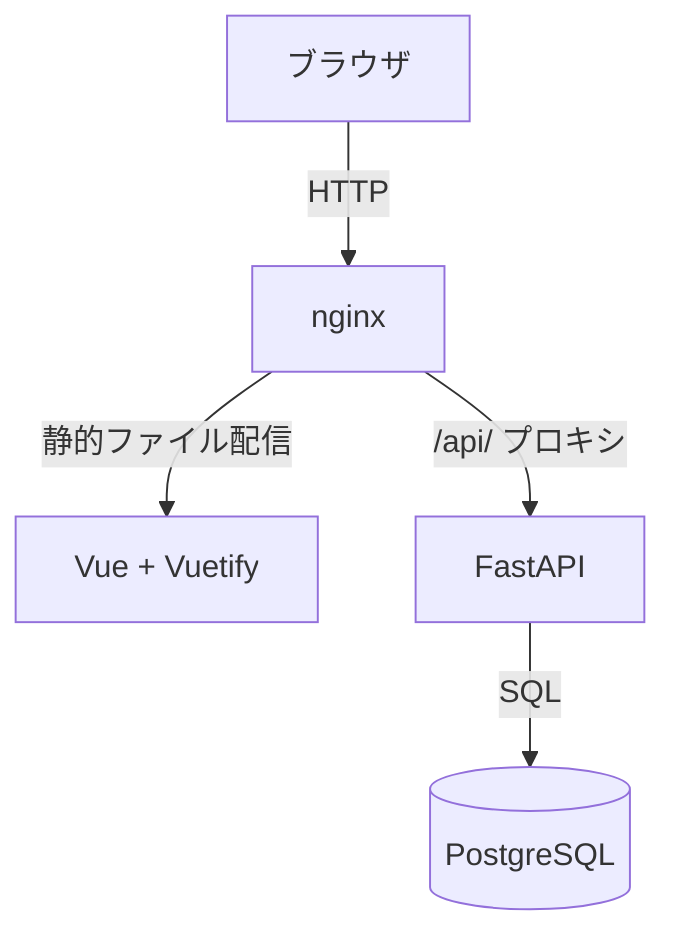
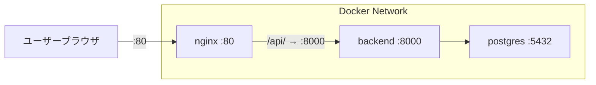
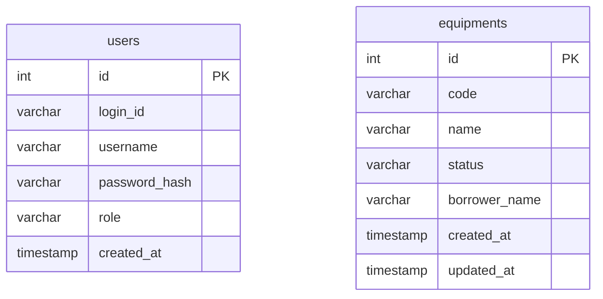
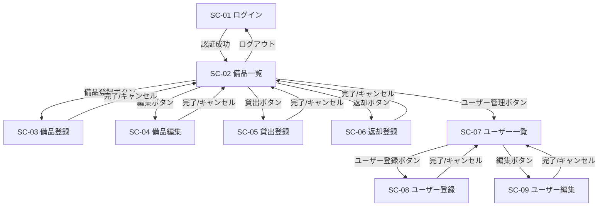
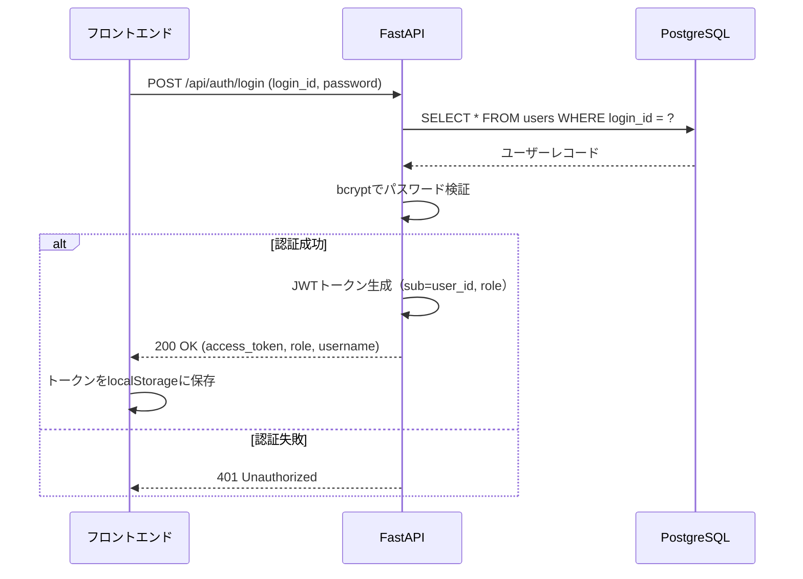
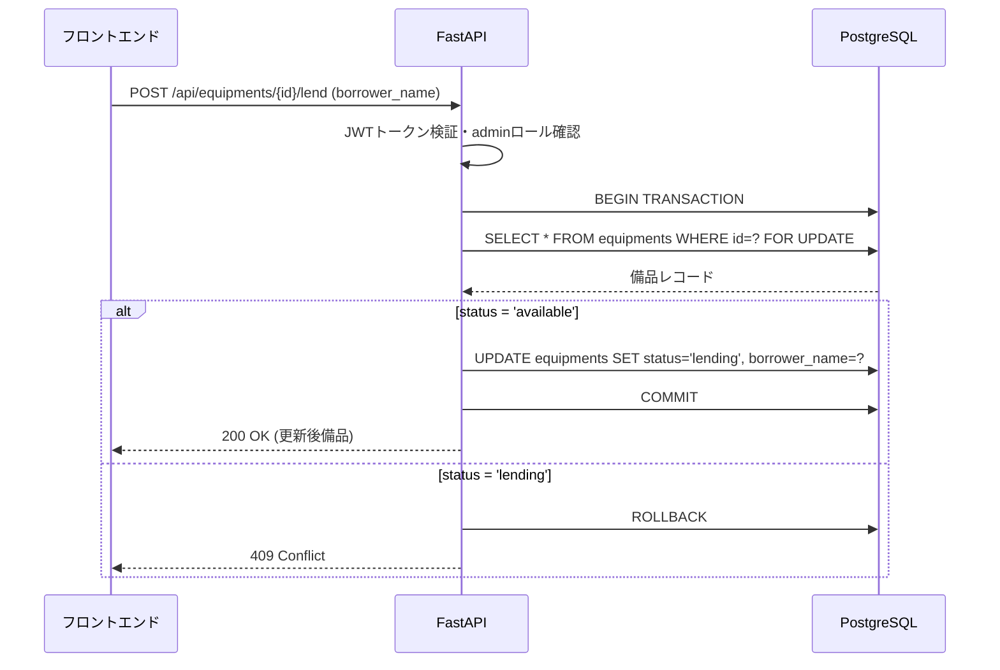
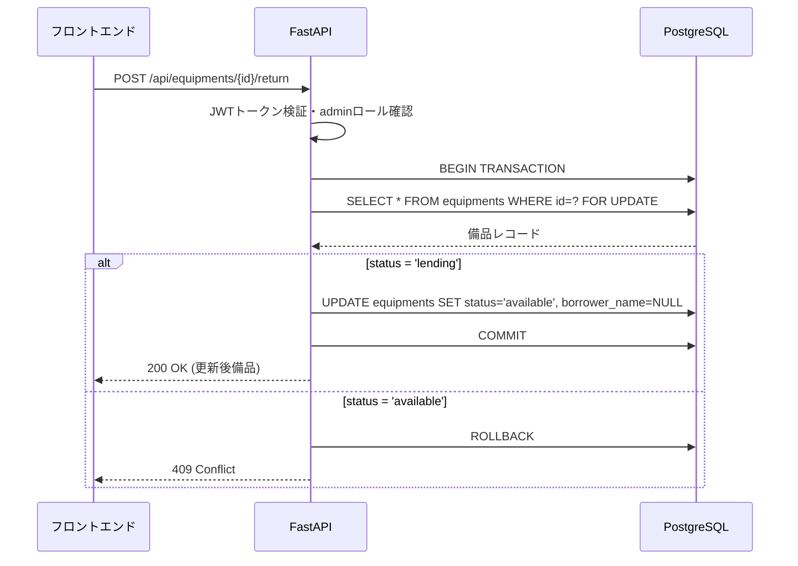
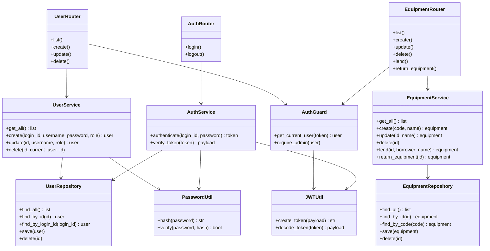
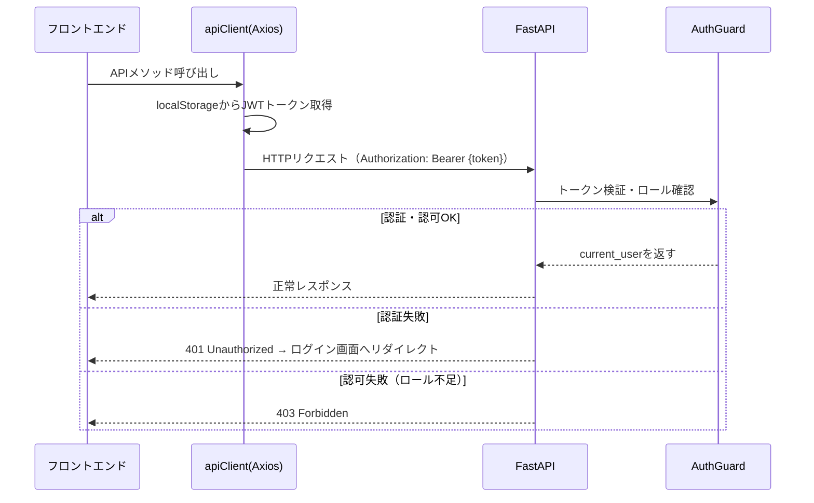

# 詳細設計書：備品管理・貸出管理Webアプリ

---

## 1. 言語・フレームワーク

| 区分 | 採用技術 | 理由 |
|------|---------|------|
| フロントエンド | Vue 3 + Vuetify 3 | 9画面・ロール別UI制御など複雑な画面遷移が必要なため |
| バックエンド | Python / FastAPI | 要件規模に適した軽量フレームワーク |
| DB | PostgreSQL | 信頼性・トランザクション対応 |
| リバースプロキシ | nginx | フロント配信 + バックエンドへのプロキシ |
| コンテナ | Docker / Docker Compose | 環境統一・起動簡略化 |

### フロントエンドビルド方針

- フロントエンドはマルチステージビルドで構成する
- ステージ1：Node.js環境でnpmビルドを実行し、distを生成する
- ステージ2：nginxイメージにdistをコピーして配信する
- nginxはフロントエンドの静的ファイルを配信し、`/api/` 以下のリクエストをバックエンドコンテナにリバースプロキシする
- フロントエンドからのすべてのAPIリクエストは `/api/` 以下のパスに対して行う

---

## 2. システム構成

### コンポーネント一覧

| コンポーネント | 役割 |
|--------------|------|
| フロントエンド（Vue + Vuetify） | ユーザーインターフェース。ロール別に表示・操作を制御する |
| nginx | フロントエンド静的ファイルの配信、`/api/` へのリクエストをバックエンドにプロキシする |
| バックエンド（FastAPI） | REST APIの提供。認証・認可・ビジネスロジック・DB操作を担う |
| PostgreSQL | 備品・ユーザーデータの永続化 |

### システム構成図



### ネットワーク構成図



### コンポーネント間インターフェース

- ブラウザ → nginx：HTTP（ポート80）
- nginx → バックエンド：HTTP（ポート8000）、パス `/api/` 以下を転送
- バックエンド → PostgreSQL：TCP（ポート5432）、SQLAlchemy経由

---

## 3. データベース設計

### テーブル一覧

#### usersテーブル

| カラム名 | データ型 | 制約 | 説明 |
|---------|---------|------|------|
| id | SERIAL | PK | 内部ID |
| login_id | VARCHAR(50) | NOT NULL, UNIQUE | ログインID |
| username | VARCHAR(100) | NOT NULL | 表示名 |
| password_hash | VARCHAR(255) | NOT NULL | bcryptハッシュ |
| role | VARCHAR(20) | NOT NULL | 'admin'（総務担当者）または 'staff'（一般社員） |
| created_at | TIMESTAMP | NOT NULL, DEFAULT NOW() | 作成日時 |

#### equipmentsテーブル

| カラム名 | データ型 | 制約 | 説明 |
|---------|---------|------|------|
| id | SERIAL | PK | 内部ID |
| code | VARCHAR(50) | NOT NULL, UNIQUE | 管理番号 |
| name | VARCHAR(200) | NOT NULL | 備品名 |
| status | VARCHAR(20) | NOT NULL, DEFAULT 'available' | 'available'（在庫あり）または 'lending'（貸出中） |
| borrower_name | VARCHAR(100) | NULL | 借用者名（貸出中のみ設定） |
| created_at | TIMESTAMP | NOT NULL, DEFAULT NOW() | 作成日時 |
| updated_at | TIMESTAMP | NOT NULL, DEFAULT NOW() | 更新日時 |

### ER図



### データ整合性制約

| 制約 | 内容 |
|------|------|
| equipments.code UNIQUE | 管理番号の重複登録を禁止する |
| users.login_id UNIQUE | ログインIDの重複登録を禁止する |
| equipments.status CHECK | 'available' または 'lending' のみ許可する |
| users.role CHECK | 'admin' または 'staff' のみ許可する |
| borrower_name NULL制約 | status='lending' のとき borrower_name は必須（アプリ層で制御） |
| 貸出中備品の削除禁止 | status='lending' の備品は削除不可（アプリ層で制御） |
| 自己アカウント削除禁止 | ログイン中ユーザー自身の削除不可（アプリ層で制御） |

### トランザクション境界・ロールバック条件

| 操作 | トランザクション境界 | ロールバック条件 |
|------|-------------------|----------------|
| 貸出登録 | status更新 + borrower_name設定を1トランザクションで実行 | status が 'lending' の場合はエラーとしてロールバック |
| 返却登録 | status更新 + borrower_name クリアを1トランザクションで実行 | status が 'available' の場合はエラーとしてロールバック |
| 備品登録・更新・削除 | 単一レコード操作のため単一トランザクション | バリデーションエラー時にロールバック |
| ユーザー登録・更新・削除 | 単一レコード操作のため単一トランザクション | バリデーションエラー時にロールバック |

### 排他制御

| 対象 | 方式 | 内容 |
|------|------|------|
| 貸出登録 | 悲観的ロック（SELECT FOR UPDATE） | 同一備品への同時貸出登録を防ぐ |
| 返却登録 | 悲観的ロック（SELECT FOR UPDATE） | 同一備品への同時返却登録を防ぐ |
| その他CRUD | 楽観的ロック不要 | 同時更新の競合リスクが低いため |


---

## 4. 外部設計

### 4-1. API設計

すべてのAPIエンドポイントは `/api/` 以下に配置する。

#### 認証API

| メソッド | パス | 説明 | 認可 |
|---------|------|------|------|
| POST | /api/auth/login | ログイン（JWTトークン発行） | 全員 |
| POST | /api/auth/logout | ログアウト（クライアント側トークン破棄） | ログイン済み |

#### 備品API

| メソッド | パス | 説明 | 認可 |
|---------|------|------|------|
| GET | /api/equipments | 備品一覧取得 | ログイン済み |
| POST | /api/equipments | 備品登録 | adminのみ |
| PUT | /api/equipments/{id} | 備品名更新 | adminのみ |
| DELETE | /api/equipments/{id} | 備品削除 | adminのみ |
| POST | /api/equipments/{id}/lend | 貸出登録 | adminのみ |
| POST | /api/equipments/{id}/return | 返却登録 | adminのみ |

#### ユーザーAPI

| メソッド | パス | 説明 | 認可 |
|---------|------|------|------|
| GET | /api/users | ユーザー一覧取得 | adminのみ |
| POST | /api/users | ユーザー登録 | adminのみ |
| PUT | /api/users/{id} | ユーザー更新（ユーザー名・ロール） | adminのみ |
| DELETE | /api/users/{id} | ユーザー削除 | adminのみ |

#### APIリクエスト・レスポンス仕様

**POST /api/auth/login**
- リクエスト：login_id（文字列、必須）、password（文字列、必須）
- レスポンス（成功）：access_token（JWT文字列）、role（文字列）、username（文字列）
- レスポンス（失敗）：401 Unauthorized

**GET /api/equipments**
- レスポンス：備品オブジェクトの配列（id, code, name, status, borrower_name）

**POST /api/equipments**
- リクエスト：code（文字列、必須）、name（文字列、必須）
- バリデーション：code・name 未入力禁止、code 重複禁止
- レスポンス（成功）：201 Created + 登録した備品オブジェクト
- レスポンス（失敗）：400 Bad Request（バリデーションエラー）、409 Conflict（code重複）

**PUT /api/equipments/{id}**
- リクエスト：name（文字列、必須）
- バリデーション：name 未入力禁止
- レスポンス（成功）：200 OK + 更新後備品オブジェクト
- レスポンス（失敗）：400 Bad Request、404 Not Found

**DELETE /api/equipments/{id}**
- バリデーション：status='lending' の場合は削除禁止
- レスポンス（成功）：204 No Content
- レスポンス（失敗）：409 Conflict（貸出中）、404 Not Found

**POST /api/equipments/{id}/lend**
- リクエスト：borrower_name（文字列、必須）
- バリデーション：borrower_name 未入力禁止、status='available' であること
- レスポンス（成功）：200 OK + 更新後備品オブジェクト
- レスポンス（失敗）：409 Conflict（既に貸出中）

**POST /api/equipments/{id}/return**
- バリデーション：status='lending' であること
- レスポンス（成功）：200 OK + 更新後備品オブジェクト
- レスポンス（失敗）：409 Conflict（既に在庫あり）

**POST /api/users**
- リクエスト：login_id（文字列、必須）、username（文字列、必須）、password（文字列、必須）、role（'admin'または'staff'、必須）
- バリデーション：全項目未入力禁止、login_id 重複禁止
- レスポンス（成功）：201 Created + 登録ユーザーオブジェクト（password_hash除く）
- レスポンス（失敗）：400 Bad Request、409 Conflict（login_id重複）

**PUT /api/users/{id}**
- リクエスト：username（文字列、必須）、role（必須）
- レスポンス（成功）：200 OK + 更新後ユーザーオブジェクト
- レスポンス（失敗）：400 Bad Request、404 Not Found

**DELETE /api/users/{id}**
- バリデーション：自分自身のIDと一致する場合は削除禁止
- レスポンス（成功）：204 No Content
- レスポンス（失敗）：403 Forbidden（自己削除）、404 Not Found

### 4-2. 画面設計

#### 画面一覧と対応API

| 画面ID | 画面名 | 使用API |
|--------|--------|---------|
| SC-01 | ログイン画面 | POST /api/auth/login |
| SC-02 | 備品一覧画面 | GET /api/equipments |
| SC-03 | 備品登録画面 | POST /api/equipments |
| SC-04 | 備品編集画面 | PUT /api/equipments/{id} |
| SC-05 | 貸出登録画面 | POST /api/equipments/{id}/lend |
| SC-06 | 返却登録画面 | POST /api/equipments/{id}/return |
| SC-07 | ユーザー一覧画面 | GET /api/users |
| SC-08 | ユーザー登録画面 | POST /api/users |
| SC-09 | ユーザー編集画面 | PUT /api/users/{id} |

#### 画面遷移図



#### 画面モックアップ（AA）

**SC-01 ログイン画面**
```
+------------------------------------------+
|        備品管理システム                    |
+------------------------------------------+
|                                          |
|   ログインID: [________________]          |
|   パスワード: [________________]          |
|                                          |
|              [  ログイン  ]               |
|                                          |
|   ※エラー時: IDまたはパスワードが違います  |
+------------------------------------------+
```

**SC-02 備品一覧画面（総務担当者ロール）**
```
+----------------------------------------------------------+
|  備品管理システム    [ユーザー管理]  [ログアウト] 山田太郎  |
+----------------------------------------------------------+
|  備品一覧                          [+ 備品登録]           |
+----------------------------------------------------------+
| 管理番号 | 備品名       | 状態    | 借用者  | 操作         |
|----------|-------------|---------|---------|-------------|
| PC-001   | ノートPC A  | 在庫あり|         | [編集][削除][貸出] |
| PC-002   | ノートPC B  | 貸出中  | 鈴木一郎| [編集][返却] |
| PJ-001   | プロジェクター| 在庫あり|        | [編集][削除][貸出] |
+----------------------------------------------------------+
```

**SC-02 備品一覧画面（一般社員ロール）**
```
+------------------------------------------+
|  備品管理システム          [ログアウト]    |
+------------------------------------------+
|  備品一覧                                 |
+------------------------------------------+
| 管理番号 | 備品名        | 状態    | 借用者 |
|----------|--------------|---------|--------|
| PC-001   | ノートPC A   | 在庫あり|        |
| PC-002   | ノートPC B   | 貸出中  | 鈴木一郎|
+------------------------------------------+
```

**SC-03 備品登録画面**
```
+------------------------------------------+
|  備品登録                                 |
+------------------------------------------+
|  管理番号: [________________] ※必須       |
|  備品名:   [________________] ※必須       |
|                                          |
|         [登録]  [キャンセル]              |
+------------------------------------------+
```

**SC-05 貸出登録画面**
```
+------------------------------------------+
|  貸出登録                                 |
+------------------------------------------+
|  管理番号: PC-001（変更不可）              |
|  備品名:   ノートPC A（変更不可）          |
|  借用者名: [________________] ※必須       |
|                                          |
|       [貸出登録]  [キャンセル]            |
+------------------------------------------+
```

**SC-07 ユーザー一覧画面**
```
+------------------------------------------+
|  ユーザー管理                [+ ユーザー登録] |
+------------------------------------------+
| ユーザー名 | ログインID | ロール    | 操作  |
|-----------|-----------|----------|-------|
| 山田太郎  | yamada    | 総務担当者| [編集][削除] |
| 鈴木一郎  | suzuki    | 一般社員  | [編集][削除] |
+------------------------------------------+
```


---

## 5. 内部設計

### 処理フロー

#### ログイン処理



#### 貸出登録処理



#### 返却登録処理



---

## 6. クラス設計

### クラス一覧

| クラス名 | 区分 | 役割 |
|---------|------|------|
| AuthRouter | バックエンド・ルーター | ログインAPIのルーティング |
| EquipmentRouter | バックエンド・ルーター | 備品APIのルーティング |
| UserRouter | バックエンド・ルーター | ユーザーAPIのルーティング |
| AuthService | バックエンド・サービス | 認証ロジック（パスワード検証・JWT発行） |
| EquipmentService | バックエンド・サービス | 備品のCRUD・貸出・返却ビジネスロジック |
| UserService | バックエンド・サービス | ユーザーのCRUDビジネスロジック |
| EquipmentRepository | バックエンド・リポジトリ | equipmentsテーブルのDB操作 |
| UserRepository | バックエンド・リポジトリ | usersテーブルのDB操作 |
| JWTUtil | バックエンド・共通 | JWTトークンの生成・検証（共通処理） |
| PasswordUtil | バックエンド・共通 | bcryptハッシュ化・検証（共通処理） |
| AuthGuard | バックエンド・共通 | FastAPI依存性注入によるJWT検証・ロール確認（共通処理） |
| EquipmentModel | バックエンド・モデル | equipmentsテーブルのORMモデル |
| UserModel | バックエンド・モデル | usersテーブルのORMモデル |
| useAuth | フロントエンド・Composable | ログイン状態・ロール・トークン管理（共通処理） |
| useEquipment | フロントエンド・Composable | 備品API呼び出しと状態管理 |
| useUser | フロントエンド・Composable | ユーザーAPI呼び出しと状態管理 |
| apiClient | フロントエンド・共通 | Axiosインスタンス。Authorizationヘッダー付与を共通化 |
| router | フロントエンド・共通 | Vue Router。未認証リダイレクト・ロール別ガードを共通化 |

### クラス図



---

## 7. メッセージ設計

### システム内メッセージ一覧

| メッセージID | 発生元 | 受信先 | 内容 |
|------------|--------|--------|------|
| M-01 | フロントエンド | バックエンド | ログインリクエスト（login_id, password） |
| M-02 | バックエンド | フロントエンド | JWTトークン・ロール・ユーザー名 |
| M-03 | フロントエンド | バックエンド | 備品一覧取得リクエスト（Authorizationヘッダー付き） |
| M-04 | バックエンド | フロントエンド | 備品一覧（配列） |
| M-05 | フロントエンド | バックエンド | 貸出登録リクエスト（borrower_name） |
| M-06 | バックエンド | フロントエンド | 更新後備品オブジェクト または エラー |
| M-07 | フロントエンド | バックエンド | 返却登録リクエスト |
| M-08 | フロントエンド | バックエンド | ユーザー登録・更新・削除リクエスト |

### メッセージフロー（認証付きAPIリクエスト共通）



---

## 8. エラーハンドリング

### エラー一覧

| エラーID | 発生箇所 | 条件 | HTTPステータス | ユーザー向けメッセージ |
|---------|---------|------|--------------|-------------------|
| E-01 | ログイン | login_idまたはpassword不一致 | 401 | IDまたはパスワードが正しくありません |
| E-02 | 備品登録 | code重複 | 409 | この管理番号は既に登録されています |
| E-03 | 備品登録・編集 | 必須項目未入力 | 400 | 入力してください |
| E-04 | 備品削除 | status='lending' | 409 | 貸出中の備品は削除できません |
| E-05 | 貸出登録 | status='lending' | 409 | この備品は既に貸出中です |
| E-06 | 返却登録 | status='available' | 409 | この備品は貸出中ではありません |
| E-07 | ユーザー登録 | login_id重複 | 409 | このログインIDは既に使用されています |
| E-08 | ユーザー削除 | 自己削除 | 403 | 自分自身のアカウントは削除できません |
| E-09 | 全API | JWTトークン無効・期限切れ | 401 | セッションが切れました。再ログインしてください |
| E-10 | 全API | adminロール必要な操作をstaffが実行 | 403 | この操作は許可されていません |
| E-11 | 全API | 対象リソースが存在しない | 404 | 対象データが見つかりません |

### エラーハンドリング方針

- バックエンドは全エラーを `{"detail": "エラーメッセージ"}` 形式のJSONで返す
- フロントエンドのapiClientはHTTPエラーをインターセプトし、401の場合はログイン画面へリダイレクトする
- フロントエンドは各操作後にスナックバー（Vuetify v-snackbar）でエラーメッセージを表示する

---

## 9. セキュリティ設計

| 項目 | 設計内容 |
|------|---------|
| 認証方式 | JWT（HS256）。有効期限8時間 |
| パスワード保存 | bcryptでハッシュ化して保存する |
| 認可制御 | FastAPIの依存性注入（AuthGuard）でエンドポイントごとにロールを検証する |
| 未認証アクセス | フロントエンドのVue RouterガードでJWTが無い場合はSC-01へリダイレクトする |
| CORS | バックエンドはフロントエンドのオリジン（nginx）のみ許可する |
| HTTPSについて | 本設計はDocker Compose内部通信のため、本番運用時は上位のリバースプロキシでTLS終端を行うこと |
| 監査ログ | バックエンドはすべてのAPIリクエストについて、日時・ユーザーID・操作内容・結果をアプリケーションログに出力する |

---

## 10. ソースコード構成

```
project/
├── docker-compose.yml
├── nginx/
│   └── nginx.conf
├── backend/
│   ├── Dockerfile
│   ├── requirements.txt
│   ├── main.py               # FastAPIアプリ起動・ルーター登録
│   ├── database.py           # DB接続・セッション管理
│   ├── init_db.py            # DBスキーマ作成・初期ユーザー投入
│   ├── models/
│   │   ├── equipment.py      # EquipmentModel（ORM）
│   │   └── user.py           # UserModel（ORM）
│   ├── schemas/
│   │   ├── equipment.py      # 備品リクエスト・レスポンスのPydanticスキーマ
│   │   └── user.py           # ユーザーリクエスト・レスポンスのPydanticスキーマ
│   ├── routers/
│   │   ├── auth.py           # AuthRouter
│   │   ├── equipment.py      # EquipmentRouter
│   │   └── user.py           # UserRouter
│   ├── services/
│   │   ├── auth_service.py   # AuthService
│   │   ├── equipment_service.py # EquipmentService
│   │   └── user_service.py   # UserService
│   ├── repositories/
│   │   ├── equipment_repository.py # EquipmentRepository
│   │   └── user_repository.py      # UserRepository
│   └── utils/
│       ├── jwt_util.py       # JWTUtil（共通）
│       ├── password_util.py  # PasswordUtil（共通）
│       └── auth_guard.py     # AuthGuard（共通）
└── frontend/
    ├── Dockerfile
    ├── package.json
    ├── vite.config.js
    └── src/
        ├── main.js           # Vueアプリ起動
        ├── router/
        │   └── index.js      # Vue Router・ナビゲーションガード（共通）
        ├── api/
        │   └── client.js     # apiClient（Axiosインスタンス・共通）
        ├── composables/
        │   ├── useAuth.js    # useAuth（共通）
        │   ├── useEquipment.js # useEquipment
        │   └── useUser.js    # useUser
        └── views/
            ├── LoginView.vue       # SC-01
            ├── EquipmentListView.vue # SC-02
            ├── EquipmentFormView.vue # SC-03・SC-04共用
            ├── LendView.vue        # SC-05
            ├── ReturnView.vue      # SC-06
            ├── UserListView.vue    # SC-07
            └── UserFormView.vue    # SC-08・SC-09共用
```

### ファイル・クラス対応表

| ファイル | 含まれるクラス/関数 | 役割 |
|---------|-----------------|------|
| utils/jwt_util.py | JWTUtil | JWT生成・検証（共通） |
| utils/password_util.py | PasswordUtil | パスワードハッシュ化・検証（共通） |
| utils/auth_guard.py | AuthGuard | 認証・認可の依存性注入（共通） |
| api/client.js | apiClient | Axiosインスタンス・Authヘッダー付与（共通） |
| router/index.js | router | ルーティング・未認証ガード（共通） |
| composables/useAuth.js | useAuth | 認証状態管理（共通） |

### コーディング規約

| 項目 | 規約 |
|------|------|
| Python命名規則 | 変数・関数はsnake_case、クラスはPascalCase |
| Vue命名規則 | コンポーネントはPascalCase、composableはcamelCase（use〜） |
| APIパス | すべて `/api/` 以下、リソース名は複数形スネークケース |
| エラーレスポンス | `{"detail": "メッセージ"}` に統一 |
| 共通処理 | 2箇所以上で使用する処理は必ずutils/またはcomposables/に集約する |
| コメント | 日本語で記述する |


---

## 11. テスト設計

### テスト種別

| 種別 | 目的 | 対象 |
|------|------|------|
| 単体テスト | 各モジュールの処理が仕様通りか確認する | バックエンドの全サービス・ユーティリティクラス |
| 結合テスト | APIエンドポイントが要件通りに動作するか確認する | 全APIエンドポイント（正常・異常系） |
| 総合テスト | ユーザー視点でシステム全体が動作するか確認する | 全業務フロー（ブラウザ操作） |

### 単体テストケース一覧

| テストID | 対象 | テスト内容 | 期待結果 |
|---------|------|-----------|---------|
| UT-01 | PasswordUtil.hash | 平文パスワードをハッシュ化する | ハッシュ文字列が返る |
| UT-02 | PasswordUtil.verify | 正しいパスワードで検証する | Trueが返る |
| UT-03 | PasswordUtil.verify | 誤ったパスワードで検証する | Falseが返る |
| UT-04 | JWTUtil.create_token | ペイロードからトークンを生成する | JWT文字列が返る |
| UT-05 | JWTUtil.decode_token | 有効なトークンをデコードする | ペイロードが返る |
| UT-06 | JWTUtil.decode_token | 無効なトークンをデコードする | 例外が発生する |
| UT-07 | EquipmentService.lend | status='available'の備品を貸出する | status='lending'に更新される |
| UT-08 | EquipmentService.lend | status='lending'の備品を貸出する | 409エラーが発生する |
| UT-09 | EquipmentService.return_equipment | status='lending'の備品を返却する | status='available'に更新される |
| UT-10 | EquipmentService.return_equipment | status='available'の備品を返却する | 409エラーが発生する |
| UT-11 | EquipmentService.delete | status='lending'の備品を削除する | 409エラーが発生する |
| UT-12 | EquipmentService.delete | status='available'の備品を削除する | 正常に削除される |
| UT-13 | UserService.delete | 自分自身のIDで削除する | 403エラーが発生する |
| UT-14 | UserService.create | 重複login_idで登録する | 409エラーが発生する |

### 結合テストケース一覧

| テストID | 対象API | テスト内容 | 期待結果 |
|---------|--------|-----------|---------|
| IT-01 | POST /api/auth/login | 正しいID・パスワードでログイン | 200 + JWTトークン返却 |
| IT-02 | POST /api/auth/login | 誤ったパスワードでログイン | 401 |
| IT-03 | GET /api/equipments | 有効なJWTで備品一覧取得 | 200 + 備品配列 |
| IT-04 | GET /api/equipments | JWTなしで備品一覧取得 | 401 |
| IT-05 | POST /api/equipments | adminロールで備品登録 | 201 + 登録備品 |
| IT-06 | POST /api/equipments | staffロールで備品登録 | 403 |
| IT-07 | POST /api/equipments | 重複codeで備品登録 | 409 |
| IT-08 | POST /api/equipments/{id}/lend | 在庫ありの備品を貸出 | 200 + status='lending' |
| IT-09 | POST /api/equipments/{id}/lend | 貸出中の備品を貸出 | 409 |
| IT-10 | POST /api/equipments/{id}/return | 貸出中の備品を返却 | 200 + status='available' |
| IT-11 | POST /api/equipments/{id}/return | 在庫ありの備品を返却 | 409 |
| IT-12 | DELETE /api/equipments/{id} | 貸出中の備品を削除 | 409 |
| IT-13 | DELETE /api/equipments/{id} | 在庫ありの備品を削除 | 204 |
| IT-14 | POST /api/users | 重複login_idでユーザー登録 | 409 |
| IT-15 | DELETE /api/users/{id} | 自分自身を削除 | 403 |
| IT-16 | GET /api/users | staffロールでユーザー一覧取得 | 403 |

### 総合テストケース一覧

| テストID | シナリオ | 操作手順 | 期待結果 |
|---------|---------|---------|---------|
| ST-01 | 備品貸出フロー | ①ログイン→②備品一覧確認→③貸出ボタン→④借用者名入力→⑤登録 | 備品ステータスが「貸出中」に変わり借用者名が表示される |
| ST-02 | 備品返却フロー | ①ログイン→②備品一覧確認→③返却ボタン→④返却登録 | 備品ステータスが「在庫あり」に戻り借用者名が消える |
| ST-03 | 備品登録フロー | ①ログイン→②備品登録ボタン→③管理番号・備品名入力→④登録 | 一覧に新しい備品が表示される |
| ST-04 | 一般社員の閲覧制限 | ①一般社員でログイン→②備品一覧確認 | 登録・編集・削除・貸出・返却ボタンが表示されない |
| ST-05 | 未認証リダイレクト | ①ログインせずに備品一覧URLに直接アクセス | ログイン画面にリダイレクトされる |
| ST-06 | ユーザー管理フロー | ①ログイン→②ユーザー管理→③ユーザー登録→④一覧確認 | 新しいユーザーが一覧に表示される |
| ST-07 | 重複貸出防止 | ①貸出中の備品の貸出ボタンが非活性であることを確認 | 貸出ボタンが非活性（クリック不可）になっている |

---

## 12. 起動・運用設計

### Docker Compose構成

- サービス構成：nginx、backend、db（PostgreSQL）の3サービス
- 起動コマンド：`docker compose up --build`
- バックエンドコンテナ起動時に `init_db.py` を自動実行し、DBスキーマ作成と初期ユーザー（総務担当者アカウント1件）を投入する
- PostgreSQLのデータはDockerボリュームで永続化する

### 初期化処理

- DBスキーマ（usersテーブル・equipmentsテーブル）をバックエンド起動時に自動作成する
- 初期ユーザーとして総務担当者アカウント（login_id: admin、password: admin、role: admin）を1件投入する
- 初期ユーザーが既に存在する場合は重複投入しない

### README.md記載内容

- システム概要
- 前提条件（Docker・Docker Compose のインストール）
- 起動方法（`docker compose up --build`）
- 初期ログイン情報（login_id: admin / password: admin）
- 各画面の操作説明

---

## 13. エンティティ・画面・API・クラス対応表

| エンティティ | 画面 | API | サービスクラス | リポジトリクラス |
|------------|------|-----|-------------|--------------|
| 備品（Create） | SC-03 | POST /api/equipments | EquipmentService.create | EquipmentRepository.save |
| 備品（Read一覧） | SC-02 | GET /api/equipments | EquipmentService.get_all | EquipmentRepository.find_all |
| 備品（Update属性） | SC-04 | PUT /api/equipments/{id} | EquipmentService.update | EquipmentRepository.save |
| 備品（Update状態:貸出） | SC-05 | POST /api/equipments/{id}/lend | EquipmentService.lend | EquipmentRepository.save |
| 備品（Update状態:返却） | SC-06 | POST /api/equipments/{id}/return | EquipmentService.return_equipment | EquipmentRepository.save |
| 備品（Delete） | SC-02 | DELETE /api/equipments/{id} | EquipmentService.delete | EquipmentRepository.delete |
| ユーザー（Create） | SC-08 | POST /api/users | UserService.create | UserRepository.save |
| ユーザー（Read一覧） | SC-07 | GET /api/users | UserService.get_all | UserRepository.find_all |
| ユーザー（Update） | SC-09 | PUT /api/users/{id} | UserService.update | UserRepository.save |
| ユーザー（Delete） | SC-07 | DELETE /api/users/{id} | UserService.delete | UserRepository.delete |

---

## 14. レビュー結果

### 矛盾チェック

- 備品削除はstatus='available'のみ許可。SC-02の削除ボタンは在庫ありの場合のみ活性とし、APIでも同様に制御するため二重に保護されており矛盾なし
- 貸出ボタンは在庫ありのみ活性、返却ボタンは貸出中のみ活性。APIのバリデーションと一致している
- 自己アカウント削除禁止はSC-07のUI制御とAPIの両方で制御するため矛盾なし

### 冗長チェック・削除した要素

- SC-03とSC-04は `EquipmentFormView.vue` として1ファイルに統合（登録・編集で入力項目がほぼ同一のため）
- SC-08とSC-09は `UserFormView.vue` として1ファイルに統合（同上）
- 認証・認可処理はAuthGuard（バックエンド）とapiClient・router（フロントエンド）に集約し、各ルーターへの重複実装を排除した

### 完全性確認

- 全エンティティのCRUD・状態遷移・対応画面・APIを定義済み
- トランザクション境界・排他制御を定義済み
- 全APIのバリデーション・エラー仕様を定義済み
- 認証・認可・監査ログを定義済み
- 全機能に対応する単体・結合・総合テストを定義済み
- 共通処理（JWT・パスワード・認可・APIクライアント・ルーター）を専用モジュールに集約済み

