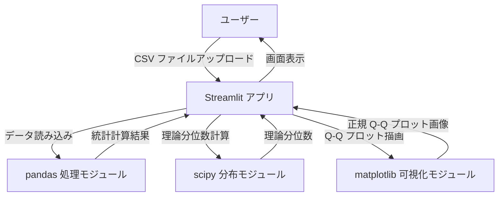
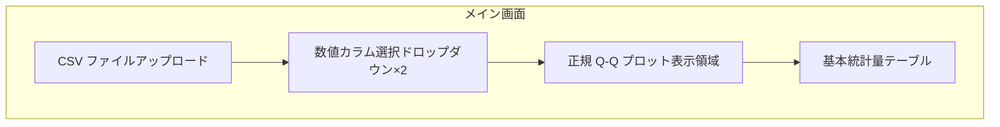
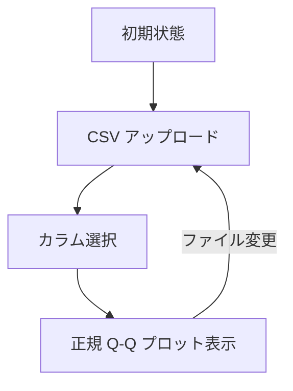
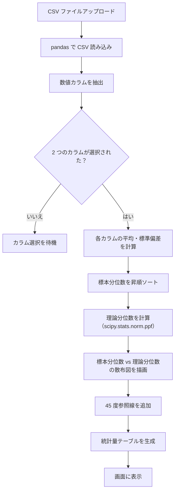
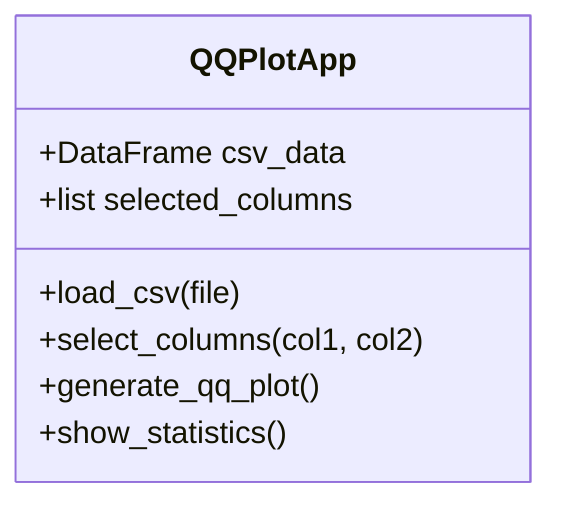

# 詳細設計書：正規 Q-Q プロット可視化アプリ

## 1. 言語・フレームワーク

- **言語**: Python 3.10+
- **Web GUI**: Streamlit（単一ファイルで動作）
- **データ処理**: pandas, numpy
- **可視化**: matplotlib

## 2. システム構成

### 2.1 コンポーネント一覧

| コンポーネント | 役割 |
|--------------|------|
| Streamlit アプリ | Web UI と業務ロジック |
| pandas データ処理モジュール | CSV 読み込み、数値カラム抽出、統計計算 |
| scipy 分布モジュール | 理論分位数の計算（Q-Q プロット用） |
| matplotlib 可視化モジュール | 正規 Q-Q プロットの生成 |

### 2.2 システム構成図



### 2.3 コンポーネント間のインターフェース

| インターフェース | 方向 | データ形式 |
|-----------------|------|-----------|
| CSV ファイルアップロード | A→B | binary (bytes) |
| データ処理結果 | C→B | pandas DataFrame |
| 理論分位数計算 | B→D | 標本サイズ、分布タイプ |
| Q-Q プロット描画 | B→E | 標本分位数、理論分位数 |

## 3. データベース設計

- **不要**（メモリ上でのみ処理、永続化なし）

## 4. 外部設計

### 4.1 ユーザーインターフェース

#### 画面一覧

| 画面 ID | 画面名 | 要素 | 機能 |
|--------|-------|------|------|
| S01 | メイン画面 | CSV アップロードエリア、カラム選択ドロップダウン×2、正規 Q-Q プロット表示領域、統計量テーブル | データ入力・選択・可視化 |

#### 画面レイアウト図



#### 画面遷移図



#### 画面 AA（モックアップ）

**S01 メイン画面**:
- CSV ファイルをドラッグ＆ドロップまたはファイル選択ボタンでアップロード
- 数値カラムが自動的に検出され、ドロップダウンに表示される
- 2 つのドロップダウンからカラムを選択すると、正規 Q-Q プロットが自動生成される
- 各プロットに 45 度参照線を表示
- プロットの下部に基本統計量（平均、標準偏差、最小値、最大値）がテーブル形式で表示される

### 4.2 外部システム連携
- なし

## 5. 内部設計

### 5.1 処理フロー



### 5.2 各処理の役割と機能

| 処理 ID | 処理名 | 役割 |
|--------|-------|------|
| P01 | CSV ファイル読み込み | pandas で CSV を DataFrame に変換 |
| P02 | 数値カラム抽出 | dtype が数値（int/float）の列をフィルタリング |
| P03 | 統計量計算 | 平均、標準偏差、最小値、最大値を算出 |
| P04 | 標本分位数の計算 | データを昇順ソートして標本分位数とする |
| P05 | 理論分位数の計算 | scipy.stats.norm.ppf で正規分布の理論分位数を計算 |
| P06 | 可視化描画 | matplotlib で標本分位数 vs 理論分位数の散布図を描画し、45 度参照線を追加 |
| P07 | 統計量テーブル生成 | DataFrame から表形式で出力 |

### 5.3 バッチ処理
- **不要**（インタラクティブな Web アプリ）

## 6. クラス設計

### 6.1 クラス一覧

| クラス名 | 役割 | 主な属性 | 主なメソッド |
|---------|------|----------|-------------|
| QQPlotApp | メインアプリケーションクラス | csv_data: DataFrame, selected_columns: list | load_csv(), select_columns(), generate_qq_plot() |

### 6.2 クラス図



### 6.3 メッセージフロー

| メッセージ | 送信元 | 宛先 | 内容 |
|-----------|--------|------|------|
| load_csv() | ユーザー | QQPlotApp | CSV ファイルを渡して読み込む |
| select_columns() | ユーザー | QQPlotApp | 2 つのカラム名を指定 |
| generate_qq_plot() | QQPlotApp | matplotlib, scipy | 標本分位数と理論分位数を計算して散布図を描画 |

## 7. エラーハンドリング

| エラー ID | エラー内容 | 対処方法 |
|----------|-----------|---------|
| E01 | CSV ファイルがアップロードされていない | アップロードを促すメッセージを表示 |
| E02 | 数値カラムが 1 つ以下 | 数値カラムがない旨を表示 |
| E03 | 選択されたカラムが 2 つ未満 | 2 つ選択するよう促す |
| E04 | 標準偏差が 0（変化するデータがない） | 「変化するデータがありません」と表示 |
| E05 | データ数が少なすぎる（<3） | 十分なデータ数がない旨を表示 |

## 8. セキュリティ設計

- ファイルアップロードはローカル環境のみ想定
- 外部システム連携なしのため、認証・認可は不要

## 9. ソースコード構成

### 9.1 ディレクトリ構成

```
/app
├── app.py              # メインアプリケーション（単一ファイル）
└── requirements.txt    # 依存ライブラリ
```

### 9.2 ファイル一覧と役割

| ファイル | 役割 |
|---------|------|
| app.py | Streamlit アプリケーションの実装（CSV 読み込み、Q-Q プロット） |
| requirements.txt | pandas, streamlit, matplotlib, scipy の依存関係定義 |

### 9.3 コーディング規約

- Python PEP8 に準拠
- 関数名は小文字アンダースコア区切り（snake_case）
- コメントは日本語で記述

## 10. テスト設計

| テスト ID | テスト種類 | テスト目的 | 方法 |
|----------|-----------|-----------|------|
| T01 | 単体テスト | CSV ファイル読み込みが正しく動作するか | pandas で読み込んだ結果を確認 |
| T02 | 単体テスト | 数値カラム抽出が正しく動作するか | dtype が数値の列のみ抽出されるか確認 |
| T03 | 単体テスト | 理論分位数の計算が正しく動作するか | scipy.stats.norm.ppf の出力を確認 |
| T04 | 単体テスト | 正規 Q-Q プロットが正しく描画されるか | matplotlib の出力を確認 |
| T05 | 結合テスト | CSV アップロードから可視化までの一連の流れが動作するか | Streamlit でアプリを起動し操作確認 |
| T06 | 総合テスト | ユーザー視点での動作確認 | 実際の CSV ファイルでエンドツーエンドテスト |

## 11. 起動・運用

### 11.1 起動方法

```bash
pip install -r requirements.txt
streamlit run app.py
```

### 11.2 README.md 記載事項
- 依存ライブラリのインストール方法
- アプリの起動方法
- CSV ファイルのアップロード手順

## 12. E2E テスト設計

| シナリオ ID | テストの目的 | 前提条件 | テスト手順 | 期待される結果 |
|------------|-------------|---------|-----------|---------------|
| E01 | CSV ファイルが正しく読み込めるか確認する | CSV ファイルが存在する | 1. app.py を起動<br>2. CSV ファイルをアップロード<br>3. 数値カラムを選択 | 数値カラムの一覧が表示され、正規 Q-Q プロットが描画される |
| E02 | 正規 Q-Q プロットが正しく表示されるか確認する | CSV ファイルが読み込まれている | 1. 数値カラムを 2 つ選択<br>2. プロットが表示される | 標本分位数 vs 理論分位数の散布図と 45 度参照線が表示される |
| E03 | 統計量テーブルが正しく表示されるか確認する | 正規 Q-Q プロットが表示されている | 1. カラムを選択<br>2. テーブルが表示される | 平均、標準偏差、最小値、最大値が正しく表示される |

### E2E テスト実行方法（docker compose 使用）
- 本システムは単一ファイルのため、E2E テストは不要（MVP の範囲内）

## 13. 要件網羅性レビュー

### 13.1 削除可能な要素
- E2E テスト：単一ファイルの Streamlit アプリのため不要
- Docker 構成：ローカル実行のみ想定

### 13.2 MVP に必要な要素
- app.py の単一ファイル実装のみで要件を満たす

### 13.3 矛盾・不足のレビュー
- **矛盾**：なし（シグマプロットを正規 Q-Q プロットに修正）
- **不足**：なし

## 14. 承認
- 作成日：2026 年 4 月 12 日
- レビュー結果：要件に矛盾はなく、MVP に必要な設計のみを網羅している。シグマプロットを正規 Q-Q プロットに修正完了