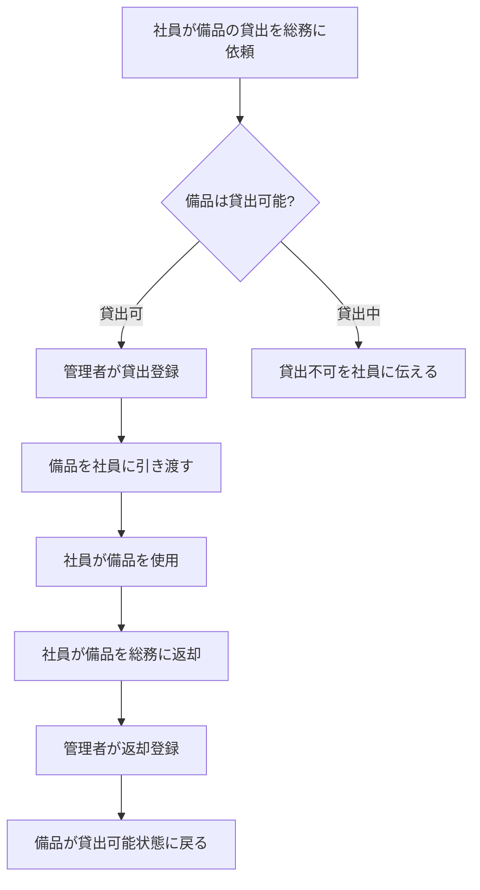
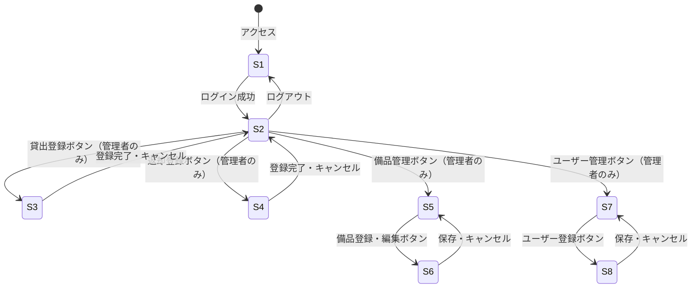
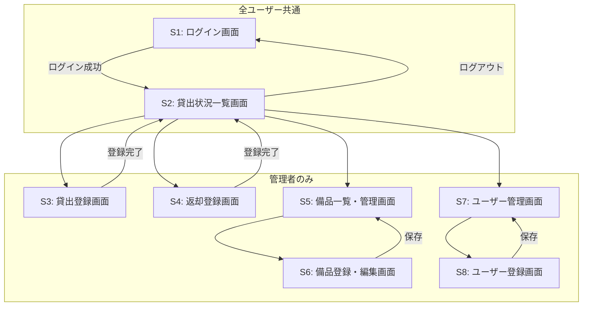
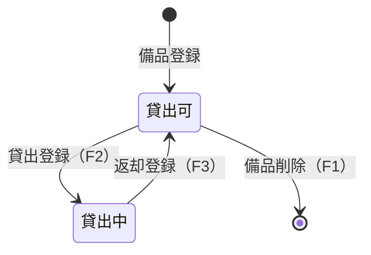
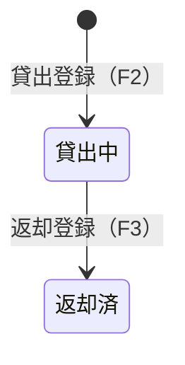

# 備品管理・貸出管理システム 要件定義書

---

## 1. 目的・前提

### システム目的

社員50名の会社の総務部門が管理する備品（10〜20点）の貸出状況をリアルタイムで可視化し、「誰が何を借りているか不明」という業務課題を解消する。

### 用語集

| 用語 | 定義 |
|------|------|
| 備品 | 社員に貸出可能な会社所有の物品（ノートPC、プロジェクター、延長コード、カメラ等） |
| 貸出 | 総務担当者が社員に備品を手渡し、使用を許可すること |
| 返却 | 社員から備品を受け取り、貸出を終了させること |
| 管理者 | 総務担当者。備品登録・貸出登録・返却登録を行う権限を持つ |
| 一般社員 | 貸出状況の閲覧のみ可能なユーザー |
| 貸出状況 | 各備品が現在誰に貸し出されているか、または貸出可能かを示す情報 |

### インターフェース

Webアプリ（GUI）。社内PCのブラウザからアクセスする。

---

## 2. 業務

### 対象業務一覧

| # | 業務名 | 担当者 |
|---|--------|--------|
| B1 | 備品登録・管理 | 管理者（総務担当者） |
| B2 | 貸出処理 | 管理者（総務担当者） |
| B3 | 返却処理 | 管理者（総務担当者） |
| B4 | 貸出状況照会 | 管理者・一般社員 |

### 業務フロー

### 業務の範囲・担当者

| 担当者 | 担当業務 |
|--------|---------|
| 管理者（総務担当者） | 備品登録・編集・削除、貸出登録、返却登録、ユーザー登録・削除 |
| 一般社員 | 貸出状況の閲覧のみ |

### 業務課題・KPI

| 課題ID | 業務課題 | 現状 | KPI（目標） |
|--------|----------|------|-------------|
| C1 | 誰が何を借りているか不明 | Excelで管理しており更新漏れ・タイムラグが発生、貸出状況をリアルタイムで把握できない | 貸出状況の把握漏れ件数 = 0件/月 |

### 解決すべき課題と対応方針

| 課題ID | 対応方針 |
|--------|----------|
| C1 | 貸出・返却のたびにシステムに記録し、常に最新の貸出状況（誰が・何を・いつから借りているか）を全社員が閲覧できるようにする |

### システム化による見込み経営効果

| 効果区分 | 内容 |
|----------|------|
| Soft Saving（人件費削減） | 総務担当者のExcel更新・状況確認の問い合わせ対応工数の削減 |
| Cost Avoidance（コスト回避） | 備品の所在不明・二重貸出による備品紛失・再購入コストの抑制 |

---

## 3. 機能要件

### 機能一覧

| 機能ID | 機能名 | 対応業務課題 | この機能がない場合の問題 |
|--------|--------|-------------|--------------------------|
| F1 | 備品登録・編集・削除 | C1 | 管理対象備品をシステムに登録できず、貸出管理が成立しない |
| F2 | 貸出登録 | C1 | 誰が何を借りたか記録できず、課題が解消されない |
| F3 | 返却登録 | C1 | 返却後も貸出中のまま表示され続け、貸出状況が正確でなくなる |
| F4 | 貸出状況一覧表示 | C1 | 貸出状況をリアルタイムで把握できず、課題が解消されない |
| F5 | ログイン・ログアウト | C1 | 管理者と一般社員の操作権限を区別できず、不正操作が発生しうる |
| F6 | ユーザー登録・削除 | C1 | 貸出先社員をシステムに登録できず、貸出登録が成立しない |

### 入力データ

| データ | 入力者 | 入力方法 |
|--------|--------|---------|
| 備品情報（品名、管理番号） | 管理者 | 手入力 |
| 貸出情報（備品、借用者、貸出日） | 管理者 | 画面選択・手入力 |
| 返却情報（返却する貸出記録の選択、返却日） | 管理者 | 画面選択・手入力 |
| ユーザー情報（氏名、ログインID、パスワード、役割） | 管理者 | 手入力 |

### 出力データ

| データ | 出力先 |
|--------|--------|
| 貸出状況一覧（備品名・状態・借用者氏名・貸出日） | 画面表示 |
| 備品一覧（管理番号・品名・状態） | 画面表示 |
| ユーザー一覧（氏名・ログインID・役割） | 画面表示 |

### 外部連携

なし

### 全画面仕様

| 画面ID | 画面名 | 利用者 | 主な操作・表示内容 |
|--------|--------|--------|-------------------|
| S1 | ログイン画面 | 全ユーザー | ログインID・パスワード入力、ログインボタン |
| S2 | 貸出状況一覧画面（TOP） | 全ユーザー | 全備品の貸出状況（備品名・状態・借用者・貸出日）の一覧表示。管理者には貸出登録・返却登録・備品管理・ユーザー管理への遷移ボタンを表示 |
| S3 | 貸出登録画面 | 管理者 | 貸出可能な備品の選択、借用者（ユーザー）の選択、貸出日入力、登録ボタン |
| S4 | 返却登録画面 | 管理者 | 貸出中の記録一覧から対象を選択、返却日入力、登録ボタン |
| S5 | 備品一覧・管理画面 | 管理者 | 備品一覧（管理番号・品名・状態）の表示、備品登録ボタン、各備品の編集・削除ボタン（貸出可の備品のみ削除可） |
| S6 | 備品登録・編集画面 | 管理者 | 品名・管理番号の入力・編集、保存ボタン、キャンセルボタン |
| S7 | ユーザー管理画面 | 管理者 | ユーザー一覧（氏名・ログインID・役割）の表示、ユーザー登録ボタン、各ユーザーの削除ボタン（貸出中の借用者は削除不可） |
| S8 | ユーザー登録画面 | 管理者 | 氏名・ログインID・パスワード・役割の入力、保存ボタン、キャンセルボタン |

### 全画面の遷移

### 全機能のユーザー利用フロー

### 業務フローとの対応関係

| 業務フローステップ | 対応機能ID | 対応画面 |
|-------------------|-----------|---------|
| 備品をシステムに用意する | F1 | S5, S6 |
| 貸出可否の確認 | F4 | S2 |
| 貸出登録 | F2 | S3 |
| 返却登録 | F3 | S4 |
| 貸出状況照会 | F4 | S2 |

---

## 4. データ

### 業務エンティティ一覧

| エンティティ | 種別 | 主な属性 | 登録 | 参照 | 更新 | 削除 | 一覧 | 状態管理 |
|-------------|------|---------|------|------|------|------|------|---------|
| 備品 | 内部データ | 管理番号、品名、状態 | ○ | ○ | ○ | ○（貸出可時のみ） | ○ | 貸出可 / 貸出中 |
| 貸出記録 | 内部データ | 貸出ID、備品、借用者、貸出日、返却日 | ○ | ○ | ○（返却日の更新のみ） | × | ○ | 貸出中 / 返却済 |
| ユーザー | 内部データ | ユーザーID、氏名、ログインID、パスワード、役割 | ○ | ○ | × | ○（借用中でない場合のみ） | ○ | － |

### 備品の状態遷移

### 貸出記録の状態遷移

### データ保持期間

| エンティティ | 保持期間 |
|-------------|---------|
| 備品 | 削除操作まで無期限 |
| 貸出記録 | 無期限（返却済も保持） |
| ユーザー | 削除操作まで無期限 |

### 外部DB接続先

なし（システム内部DBのみ使用）

---

## 5. 非機能要件

| 項目 | 要件 |
|------|------|
| 性能（応答時間） | 画面操作から3秒以内に結果を表示する |
| 利用人数（同時接続） | 最大50名（社員全員が同時アクセスする想定） |
| セキュリティ | ログインID・パスワードによる認証を行う。管理者と一般社員で操作可能な機能を分離する。未ログイン状態ではどの画面にもアクセスできない |

---

## 要件網羅性チェック

### エンティティ網羅確認

| エンティティ | 登録 | 参照（一覧） | 更新 | 削除 | 状態遷移定義 |
|-------------|------|-------------|------|------|------------|
| 備品 | F1/S6 | F4/S5 | F1/S6 | F1/S5 | ○（貸出可/貸出中） |
| 貸出記録 | F2/S3 | F4/S2 | F3/S4（返却日） | 削除なし | ○（貸出中/返却済） |
| ユーザー | F6/S8 | F6/S7 | 更新なし | F6/S7 | 不要 |

**備品検索・ユーザー検索の省略理由**：最大備品20件・最大ユーザー50名であり、一覧表示で十分把握可能なため、課題解決に不要として除外。

### 機能カテゴリ網羅確認

| カテゴリ | 対応機能 |
|---------|---------|
| 業務機能 | F2 貸出登録、F3 返却登録、F4 貸出状況一覧 |
| マスタ管理 | F1 備品管理、F6 ユーザー管理 |
| 共通（認証・認可） | F5 ログイン・ログアウト |
| 運用 | なし（規模・課題上不要） |
| 外部連携 | なし |

### MVPから除外した要件

以下は業務課題（C1：誰が何を借りているか不明）に直接紐づかないため除外した。

| 除外要件 | 除外理由 |
|---------|---------|
| 返却期限日の管理・超過通知 | 課題は「把握不能」であり、期限管理は課題外 |
| 備品・ユーザーの検索機能 | 件数が少なく一覧表示で十分対応可能 |
| 貸出履歴の集計・レポート出力 | 課題解決に不要 |
| ユーザー情報の更新機能 | 業務課題に紐づく必要性がない |
