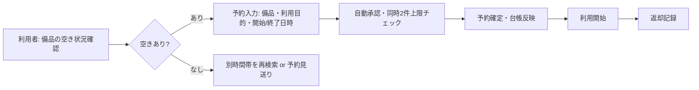

# 備品管理・貸出予約アプリ 要件定義書

## 1. 作成目的
- Excel台帳＋メール申請で発生している二重予約と情報不整合を解消し、予約を自動承認で即時反映する。
- 予約作成所要時間を短縮し、管理者の台帳更新工数を削減する。

## 2. 用語集
| 用語 | 定義 | 備考 |
| --- | --- | --- |
| 二重予約 | 同一備品・同一時間帯に重なる予約が登録されること | 本システムでは不可とする |
| 台帳 | 備品属性（管理番号、名称、カテゴリ、設置場所、状態、説明）を保持する一覧 | システム内で一元管理 |
| 状態 | 備品の利用可否を示す区分（利用可/故障/メンテ） | 予約可否判定に利用 |
| 予約 | 利用者が開始・終了日時を指定して備品を確保する行為 | 自動承認とする |
| 操作ログ | 画面操作・データ更新の記録 | 1年保持 |

## 3. 対象業務
- 備品台帳管理（登録・編集・状態変更）
- 予約管理（時間単位予約、キャンセル、空き状況確認）
- 貸出・返却記録（自動承認後の利用開始/完了記録）
- CSV出力（期間・備品・利用者で絞り込み）

### 3.1 業務フロー（現行→課題）
- 現行: Excel台帳更新＋メール申請 → 管理者手動反映 → 二重予約・情報不整合が発生
- 課題: 二重予約防止仕組みなし、最新状態が台帳と実態で乖離

### 3.2 業務フロー（To-Be）

### 3.3 業務範囲と担当
| 業務 | 担当者 |
| --- | --- |
| 台帳登録・更新 | 備品管理者 |
| 予約作成・キャンセル | 一般利用者 |
| 返却記録更新 | 備品管理者 |
| CSV出力 | 備品管理者 |

## 4. 対象業務の課題と指標
| 業務 | 担当 | 現状課題 | 指標 |
| --- | --- | --- | --- |
| 予約受付 | 一般利用者 | 二重予約発生 | 二重予約ゼロ |
| 台帳更新 | 備品管理者 | 最新情報不整合 | 台帳更新遅延10分以内 |
| 予約操作 | 一般利用者 | 手続きが煩雑 | 予約作成所要時間1件1分以内 |

期待効果: 二重予約防止による業務停止ゼロ、管理工数削減、予約迅速化。

## 5. 解決すべき業務課題と対応
| 業務 | 課題 | 解決方法 |
| --- | --- | --- |
| 予約受付 | 二重予約 | 空き状況チェックと同時2件上限によるブロック |
| 台帳更新 | 情報不整合 | 予約確定と同時に状態を即時反映 |
| 予約操作 | 時間がかかる | 必須項目最小化と30分刻み入力 UI |

## 6. システムに必要な機能
- 備品台帳管理: 登録/編集、状態変更（利用可/故障/メンテ）
- 予約管理: 時間単位、30分刻み、最大30日先、1回4時間、同時2件上限、ダブルブッキング防止、開始1時間前までキャンセル、延長不可、自動承認
- 空き状況表示: カレンダー/リスト
- CSV出力: 期間・備品・利用者で絞り込み、項目=管理番号・名称・カテゴリ・場所・予約者・開始/終了・状態
- ユーザー管理: 管理者が手動登録、ID/パスワードポリシー適用
- 操作ログ: 1年保持
- 警告表示: 貸出遅延時の警告（管理者通知なし）
- アクセス制御: 社内ネットワークのみ、PCブラウザ（Chrome最新版）

## 7. 情報源と入力
### 7.1 外部情報源
| 種別 | 有無 | 備考 |
| --- | --- | --- |
| 社員マスタ/AD連携 | なし | ユーザーは手動登録 |

### 7.2 人手入力項目
| タイミング | 必須項目 | 任意項目 |
| --- | --- | --- |
| 備品登録 | 管理番号、名称、カテゴリ、設置場所、状態、説明 | なし |
| 予約作成 | 備品、利用目的、開始日時、終了日時 | なし |

## 8. データ項目・保持
| データ | 主な項目 | 保持期間 |
| --- | --- | --- |
| 備品台帳 | 管理番号、名称、カテゴリ、設置場所、状態、説明 | 無期限（論理削除想定） |
| 予約・貸出履歴 | 備品、利用者、開始/終了日時、状態 | 5年 |
| 操作ログ | 操作種別、実行者、日時、対象 | 1年 |

## 9. 非機能要件
- 性能: 主要画面応答2秒以内（備品一覧/空き状況/予約登録）
- 利用規模: 備品50点、月間予約100件、同時利用20人
- 可用性: 24/7 想定、RPO/RTO指定なし
- セキュリティ: 社内ネットワーク限定、ID/パスワード認証、ポリシー=8桁以上・英数混在・有効期限90日、パスワードリセットは管理者実施
- ブラウザ: Chrome最新版
- 出力: CSV文字コード=Shift_JIS、改行=CRLF

## 10. 画面・操作方式
- PCブラウザGUIのみ
- 予約入力は30分刻み、必須項目のみ表示し1画面完結
- 空き状況はカレンダー表示とリスト表示を提供

## 11. 制約条件・運用ルール
- 外部連携なし、ブラックアウト設定不要
- 社内ネットワーク内からの利用のみ
- CSV出力は期間・備品・利用者でフィルタ必須
- パスワードリセットは管理者対応

## 12. 業務フローのループ・分岐整理
- 予約作成: 空きなしの場合は再検索ループ
- 予約キャンセル: 開始1時間前まで可能、それ以降は不可（分岐）
- 同時予約数チェック: 利用者ごとに同時2件を超える場合エラー分岐

## 13. 出力・データ
- CSV出力のみ（印刷レポートなし）
- 出力項目: 管理番号、名称、カテゴリ、設置場所、予約者、開始日時、終了日時、状態

## 14. 指標と期待効果
- KPI: 二重予約ゼロ、台帳更新遅延10分以内、予約作成所要時間1件1分以内
- 期待効果: 管理工数削減、予約迅速化、二重予約による業務停止ゼロ

## 15. リスクと留意事項
- ユーザー登録が手動のため、初期登録と異動時の運用徹底が必要
- Shift_JIS/CRLF指定により文字化けを防ぐため、CSV出力時のエスケープ処理が必須

