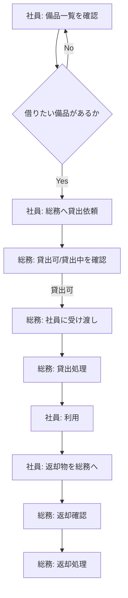
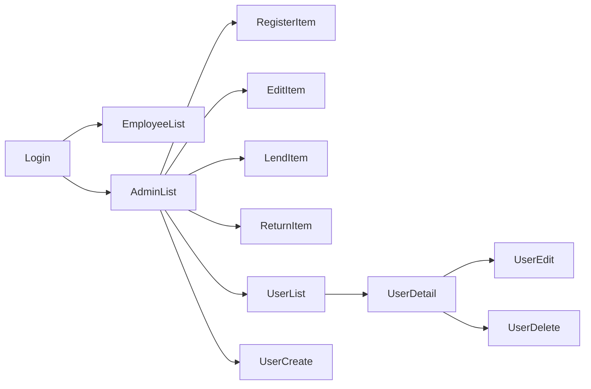

# 備品管理・貸出管理アプリ 要件定義書（MVP）

以下に提示した要件定義書を保存します。

（内容は前メッセージで提示したものと同一です）

## 1. 目的・前提

### 1.1 システム目的
- 社員が会社備品（PC・モニター等）を利用する際に、現在の貸出状況を確認できるようにする。
- 総務が備品の貸出・返却を正確に管理できるようにし、紛失・管理漏れを防止する。
- 最小限の情報（資産管理番号・備品名・状態・貸出先）で備品の所在を明確にする。

このシステムが無い場合の問題
- 現在どの備品が誰に貸出中なのか即座に把握できず、紛失や二重貸出のリスクが高い
- 貸出・返却の記録が手作業となり、認識齟齬が発生しやすい

### 1.2 用語集
- **備品**：PC、モニターなど。資産管理番号ごとに個別管理される対象
- **資産管理番号**：備品を個別識別するための一意の番号
- **貸出**：総務が社員に備品を渡す行為
- **返却**：社員が備品を戻し、総務が確認・処理する行為
- **社員**：備品一覧を閲覧する一般利用者
- **総務**：備品の登録・貸出・返却処理を行う管理者

### 1.3 システム利用形態
- **GUI（ブラウザ操作）**

## 2. 業務

### 2.1 対象業務一覧
- 備品の登録・管理（総務）
- 貸出処理（総務）
- 返却処理（総務）
- 備品の貸出状況確認（社員・総務）

### 2.2 業務フロー

### 2.3 業務の範囲・担当者
- **社員**：備品一覧の閲覧のみ
- **総務**：備品登録、編集、貸出処理、返却処理

### 2.4 業務課題・KPI
- 課題
  1. 現在の貸出状況が手作業では把握しづらい
  2. 二重貸出や所在不明のリスクがある
  3. 備品情報の更新作業が煩雑で属人化している

- KPI
  - 二重貸出発生率の低減
  - 貸出情報確認リードタイムの短縮（数分→即時）
  - 貸出・返却記録の入力漏れゼロ

### 2.5 解決すべき課題と対応方針
- 一覧画面で備品状態を即時表示し、貸出状況を可視化
- 備品状態を「貸出可/貸出中」で管理し、二重貸出を防止
- 返却処理は総務のみが行い、返却漏れを防止
- 備品情報は総務のみが編集し、更新管理を標準化

### 2.6 システム化による経営効果
- Hard Saving：紛失削減による備品購入費削減
- Soft Saving：総務の管理工数削減
- Cost Avoidance：二重貸出による業務遅延防止
- Total Cost of Ownership Savings：台帳等の外部ツール不要化

## 3. 機能要件

### 3.1 機能一覧
- 認証（ログイン、アカウント削除）
- 社員向け：備品一覧閲覧
- 総務向け：備品登録、編集、貸出処理、返却処理
- 総務向け：ユーザー登録、編集、一覧、詳細、削除

### 3.2 入力データ
- ログイン：メールアドレス、パスワード
- 備品登録：資産管理番号、備品名
- 貸出処理：貸出先社員
- 返却処理：返却日時（自動生成）

### 3.3 出力データ
- 備品一覧（資産管理番号、名前、状態、貸出先）
- 備品詳細
- 現在貸出中一覧

### 3.4 外部連携
- なし

### 3.5 画面一覧
- ログイン画面
- 社員用：備品一覧
- 総務用：備品一覧、備品登録、編集、貸出、返却
- 総務用：ユーザー一覧、詳細、登録/編集/削除

### 3.6 画面遷移

## 4. データ

### 4.1 エンティティ一覧
- 備品
- ユーザー
- 貸出状態（備品属性）

### 4.1.1 ユーザーの状態（ステータス）
- 有効
- 削除済（ログイン不可：退職・異動時に総務が実施）

### 4.2 内部データ
- 備品データ
- ユーザーデータ

### 4.2.1 ユーザーのCRUD
- 登録：総務が初期アカウントを登録し、メールアドレスとパスワードをセットするため必要
- 編集：メールアドレスや名前を修正するときに総務が利用するため必要
- 削除：退職・異動時にログイン不可にするため必要（削除済ステータス）
- 一覧：総務がユーザーの状態・存在を把握するため必要
- 詳細：ユーザーの情報とステータスを確認するため必要
- 検索：MVPでは不要（少数ユーザーと一覧で目的達成可能）

### 4.2.2 エンティティ別操作一覧（行：エンティティ、列：機能）

| エンティティ | Create | Read | Update | Delete | 一覧 | 検索 | 状態 |
|--------------|--------|------|--------|--------|------|------|------|
| 備品 | 総務が資産管理番号・備品名を登録し、個体ごとに貸出対象とする（登録できないと貸出管理が始まらない） | 備品ごとの状態・貸出先を表示し、現在の貸出状況を確認（確認できなければ所在不明や二重貸出が発生） | 備品名や資産番号の訂正を可能とし、情報精度を保つ（編集手段がないと誤情報が放置される） | MVPでは未実施（資産は記録し直して再利用する運用で要件を絞る） | すべての備品と状態・貸出先を一覧で表示し、貸出可の備品確認につなげる（一覧なしで貸出可判断が困難になる） | タイプの似た備品を目視で確認できるため不要（一覧で目的達成可能） | 貸出可 / 貸出中で状態を管理し、二重貸出を防止・貸出可判断を可能にする |
| ユーザー | 総務がメールアドレス＋パスワードをセットしてアカウント作成（登録できないと社員がシステムを利用できない） | メール・ステータスなどを表示してアカウント状態を確認（詳細がないと削除済の区別ができず貸出処理に影響） | メールアドレス・名前変更を受けて情報を更新し、ログイン混乱を防止（編集不可だと古い情報が残る） | 総務が退職・異動者を削除し、削除済ステータスにする（削除されないと退職者がログイン可能） | 総務が全ユーザーとステータスを一覧確認し、貸出可能/不可を把握する（一覧なしでは運用管理が困難） | 少人数のため不要（一覧で確認できる構成で十分） | 有効 / 削除済により、ログイン可能かどうかを判定し、安全性を担保する |

### 4.3 外部データ
- なし

### 4.4 データ保持期間
- 現在貸出中の状況のみ保持（過去履歴なし）

## 5. 非機能要件
- 一覧画面表示：1秒以内
- 同時接続：20名
- 認証：メール＋PW、権限制御（総務/社員）

## 6. テストシナリオ（表）

| No | シナリオ名 | 目的 | 前提 | 手順 | 期待結果 |
|----|------------|------|------|------|-----------|
| 1 | ログイン | 正しいアカウントでログイン | 有効アカウント | メール＋PW入力→ログイン | 成功 |
| 2 | 備品一覧（社員） | 状態を確認 | 備品登録済 | 一覧を開く | 表示される |
| 3 | 備品登録 | 新規備品登録 | 総務ログイン | 入力→保存 | 一覧に表示 |
| 4 | 貸出処理 | 貸出可の備品を貸出 | 貸出可 | 貸出先入力→貸出 | 状態が貸出中 |
| 5 | 返却処理 | 貸出中の備品を返却 | 貸出中 | 返却操作 | 状態が貸出可 |
| 6 | 備品編集 | 備品名を変更 | 備品あり | 編集→保存 | 更新内容表示 |
| 7 | アカウント削除 | 不要アカウント削除 | 総務ログイン | ユーザー削除 | ログイン不可 |
| 8 | ユーザー登録 | 新規アカウント登録 | 総務ログイン | メール＋PW入力→保存 | ユーザー一覧に表示 |
| 9 | ユーザー編集 | メールアドレスを更新 | 対象ユーザーあり | 編集→保存 | 変更内容が反映 |
| 10 | ユーザー一覧 | 登録済ユーザーを把握 | 複数ユーザーあり | 一覧表示 | 全ユーザーと状態が表示 |
| 11 | ユーザー詳細 | ユーザーの状態確認 | ユーザーあり | 詳細画面を開く | ユーザー情報とステータス表示 |

## 7. 削除した要件一覧
- 過去履歴機能：現在の貸出状況確認に不要のため削除
- 検索機能：一覧で目的達成可能なため削除
- 予約機能：当日貸出モデルに不要なため削除
- カテゴリ管理：資産管理番号＋備品名の組み合わせで十分なため削除
- 故障管理：今回のMVP範囲外であるため削除
