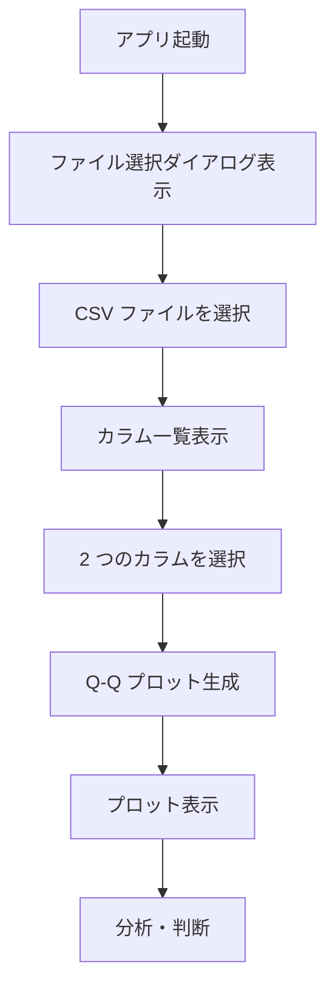
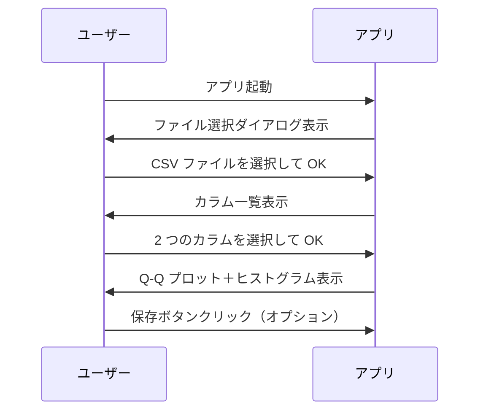

# シグマプロット比較アプリ 要件定義書

## 1. 目的・前提

### システム目的
データ分析を行うエンジニア/データサイエンティストが、CSV ファイル内の 2 つの数値カラムの分布を Q-Q プロット（シグマプロット）で視覚的に比較・分析するためのアプリケーションを提供する。

### 用語集
| 用語 | 定義 |
|------|------|
| Q-Q プロット（シグマプロット） | 2 つのデータセットの累積確率分布を比較する散布図。正規分布からの乖離を確認するために使用される |
| 累積確率 | データがその値以下である確率（0〜1 の範囲） |
| 百分位数 | データをソートした際、特定の確率に対応する値（例：50 百分位数＝中央値） |

### GUI/CUI
**GUI（グラフ表示）**  
- ブラウザ上で matplotlib を使用した Q-Q プロットを表示
- 画面内でのファイル選択・カラム指定操作

---

## 2. 業務

### 対象業務一覧
1. **データ探索分析**：CSV データ内の 2 つのカラムの分布特性を視覚的に比較
2. **正規性確認**：各カラムが正規分布に従うか確認
3. **外れ値検出**：2 つの分布で大きく乖離する点（外れ値）を特定

### 業務フロー

### 業務の範囲・担当者
| 項目 | 内容 |
|------|------|
| 対象業務 | データ探索分析、正規性確認、外れ値検出 |
| 担当者 | データ分析を行うエンジニア/データサイエンティスト |

### 業務課題・KPI
| 課題 | KPI（目標値） |
|------|-------------|
| 分布の視覚的比較が困難 | 直感的に理解できるプロット表示 |
| 正規性の確認が手間がかかる | 1 クリックで Q-Q プロット表示 |
| 外れ値の特定が非効率 | 視覚的に外れ値を把握可能 |

### 解決すべき課題と対応方針
| 課題 | 現状の問題点 | 対応方針 |
|------|-------------|----------|
| 分布比較の非効率性 | 表形式での数値比較は直感的でない | Q-Q プロットで視覚的に比較可能に |
| 正規性確認の困難さ | 統計量だけでは不十分 | Q-Q プロット＋ヒストグラムで確認 |
| 外れ値の特定が難しい | 数値比較では見落としやすい | プロット上で視覚的に把握可能 |

### システム化による見込み経営効果
| 項目 | 効果内容 |
|------|----------|
| **Soft Saving（人件費削減）** | 手動での分布分析時間を削減、分析効率向上 |
| **Total Cost of Ownership Savings** | 既存のデータ探索ツールの代替によるライセンス費用削減 |

### 機能と業務課題の紐づけ
| 業務課題 | 対応機能 |
|---------|----------|
| 分布の視覚的比較が困難 | Q-Q プロット表示、ヒストグラム併記 |
| 正規性の確認が手間がかかる | Q-Q プロットによる視覚的確認、統計量表示 |
| 外れ値の特定が非効率 | プロット上の外れ値可視化、統計量表示 |

---

## 3. 機能要件

### 機能一覧
| ID | 機能名 | 業務課題 | 必須/オプション |
|----|-------|---------|----------------|
| F01 | ファイル選択ダイアログ表示 | 対象 CSV の指定 | **必須** |
| F02 | カラム一覧表示 | 対象カラムの指定 | **必須** |
| F03 | カラム選択機能 | 2 つのカラムの指定 | **必須** |
| F04 | Q-Q プロット生成・表示 | 分布の視覚的比較、正規性確認 | **必須** |
| F05 | ヒストグラム併記表示 | 正規性の確認補助 | **必須** |
| F06 | プロット保存機能 | 分析結果の保存 | **必須** |

### 詳細仕様

#### F01: ファイル選択ダイアログ表示
| 項目 | 仕様の詳細 |
|------|------------|
| **入力データ** | なし（システム提供） |
| **出力データ** | ファイル選択ダイアログ表示 |
| **外部連携** | なし |

#### F02: カラム一覧表示
| 項目 | 仕様の詳細 |
|------|------------|
| **入力データ** | CSV ファイルパス |
| **出力データ** | カラム名一覧表示（テーブル形式） |
| **外部連携** | なし |

#### F03: カラム選択機能
| 項目 | 仕様の詳細 |
|------|------------|
| **入力データ** | カラム一覧、選択された 2 つのカラム名 |
| **出力データ** | 選択結果の表示、CSV ファイルへの保存 |
| **外部連携** | CSV ファイルへの書き込み（選択結果の記録） |

#### F04: Q-Q プロット生成・表示
| 項目 | 仕様の詳細 |
|------|------------|
| **入力データ** | 選択された 2 つのカラムのデータ |
| **出力データ** | Q-Q プロットグラフ表示（ブラウザ） |
| **外部連携** | matplotlib 描画ライブラリ |

#### F05: ヒストグラム併記表示
| 項目 | 仕様の詳細 |
|------|------------|
| **入力データ** | 選択された 2 つのカラムのデータ |
| **出力データ** | Q-Q プロットに 2 つのヒストグラムを併記したグラフ表示 |
| **外部連携** | matplotlib 描画ライブラリ |

#### F06: プロット保存機能
| 項目 | 仕様の詳細 |
|------|------------|
| **入力データ** | Q-Q プロットグラフオブジェクト |
| **出力データ** | 保存された画像ファイル（PNG/PDF） |
| **外部連携** | matplotlib の savefig 機能 |

### ユーザーの利用フロー（GUI）

### 業務フローとの対応関係
| 機能 | 業務フローのステップ |
|------|---------------------|
| F01, F02, F03 | A〜E（ファイル選択、カラム指定） |
| F04, F05 | F〜G（Q-Q プロット生成・表示） |
| F06 | H（分析結果の保存） |

---

## 4. データ

### 業務エンティティ一覧
| エンティティ | 説明 | CRUD | 一覧 | 詳細 | 検索 | 状態 |
|-------------|------|------|-----|------|------|------|
| CSV ファイル | 分析対象のデータファイル | ○×○××× | × | ○ | × | - |
| カラム | データの列（変数） | ○×○××× | ○ | ○ | × | - |
| 選択結果 | 選ばれた 2 つのカラムの組み合わせ | ××○××× | × | ○ | × | - |
| Q-Q プロット | 2 カラムの分布比較グラフ | ××○××× | × | ○ | × | - |
| ヒストグラム | 各カラムの頻度分布グラフ | ××○××× | × | ○ | × | - |

### 内部データ/外部データ
| エンティティ | 種類 | 保持期間 | 備考 |
|-------------|------|---------|------|
| CSV ファイル | 外部データ | 永続保存 | ユーザーがアップロード/指定 |
| カラムデータ | 内部データ | セッション中 | 選択されたカラムの値のみ保持 |
| Q-Q プロットデータ | 内部データ | セッション中 | 計算結果のみ保持 |
| ヒストグラムデータ | 内部データ | セッション中 | 計算結果のみ保持 |

### 外部 DB 接続先・接続方法
**なし**（ローカルファイル操作のみ）

---

## 5. 非機能要件

### 性能（応答時間）
| 項目 | 要件値 |
|------|-------|
| ファイル選択ダイアログ表示 | 1 秒以内 |
| カラム一覧表示 | 2 秒以内（最大 10,000 行） |
| Q-Q プロット生成・表示 | 3 秒以内（最大 10,000 行） |
| ヒストグラム併記表示 | 3 秒以内（最大 10,000 行） |
| プロット保存 | 2 秒以内 |

### 利用人数（同時接続）
| 項目 | 要件値 |
|------|-------|
| 同時利用ユーザー数 | 1 ユーザー（クライアント単体） |

### セキュリティ
| 項目 | 要件値 |
|------|-------|
| ファイルアップロード制限 | CSV 形式のみ許可、ファイルサイズ 10MB 以内 |
| 入力検証 | カラム名の存在確認、数値型チェック |
| エラーハンドリング | 適切なエラーメッセージ表示 |

---

## 6. テスト用利用シナリオ

| シナリオ ID | 目的 | 前提条件 | テスト手順 | 期待される結果 |
|------------|------|----------|------------|----------------|
| S01 | 基本機能の検証（ファイル選択） | アプリ起動済み | 1. ファイル選択ダイアログが表示されることを確認 2. サンプル CSV を選択して OK | ファイル選択ダイアログが表示され、OK ボタンが押せる |
| S02 | カラム一覧の表示確認 | CSV ファイルが選択済み | 1. OK をクリック 2. カラム一覧が表示されることを確認 | CSV のヘッダー行がテーブル形式で表示される |
| S03 | カラム選択機能の検証 | カラム一覧が表示済み | 1. 2 つのカラムを選択 2. OK をクリック | 選択されたカラム名が表示され、CSV に保存される |
| S04 | Q-Q プロットの表示確認 | 2 カラムが選択済み | 1. OK をクリック 2. Q-Q プロットが表示されることを確認 | 2 つのデータセットの Q-Q プロットがブラウザに表示される |
| S05 | ヒストグラム併記の検証 | Q-Q プロットが表示済み | 1. 「ヒストグラムを表示」チェックボックスをオン 2. OK をクリック | Q-Q プロットに 2 つのヒストグラムが併記される |
| S06 | プロット保存機能の検証 | Q-Q プロットが表示済み | 1. 「保存」ボタンをクリック 2. 保存ダイアログでファイル名を指定 | 画像ファイルが保存される |
| S07 | エラー処理の検証（非数値カラム） | 非数値カラムが選択可能 | 1. 文字列カラムを選択 2. OK をクリック | エラーメッセージが表示され、プロットは表示されない |
| S08 | 大量データの処理検証 | 10,000 行の CSV が選択済み | 1. OK をクリック 2. Q-Q プロットが表示される時間を計測 | 3 秒以内にプロットが表示される |

---

## 7. 要件網羅性チェック結果

### エンティティの完全性確認
| エンティティ | CRUD | 一覧 | 詳細 | 検索 | 状態 | 備考 |
|-------------|------|-----|------|------|------|------|
| CSV ファイル | ○×○××× | × | ○ | × | - | マスタ機能不要（外部データ） |
| カラム | ○×○××× | ○ | ○ | × | - | マスタ機能あり（管理機能） |
| 選択結果 | ××○××× | × | ○ | × | - | 一時的なデータ |
| Q-Q プロット | ××○××× | × | ○ | × | - | 一時的なデータ |
| ヒストグラム | ××○××× | × | ○ | × | - | 一時的なデータ |

**確認結果**: ✅ 各エンティティに対して必要な機能（CRUD/一覧/詳細）が定義されている

### 機能カテゴリの網羅性確認
| カテゴリ | 実装済み機能 | 備考 |
|----------|-------------|------|
| **業務機能** | F01〜F06（ファイル選択、カラム表示、Q-Q プロット等） | 対象業務を網羅 |
| **マスタ管理** | カラム一覧表示、カラム選択 | 対象データのカラムを管理 |
| **共通機能** | エラーハンドリング、入力検証 | 必須の基盤機能 |
| **運用機能** | プロット保存 | 分析結果の保存 |

**確認結果**: ✅ 必要な機能カテゴリが網羅されている

### 削除可能な要件の検討
**現状**: 本要件定義は「シグマプロット比較アプリ」に特化した最小機能セットであり、以下の理由で削除可能な要件は存在しません。

- **業務課題に紐づく機能**: 全機能が「分布の視覚的比較」「正規性確認」「外れ値検出」のいずれかの課題解決に寄与
- **将来拡張**: 現時点で拡張が必要な要件は存在しない（MVP に徹している）
- **ベストプラクティス**: 実装は業務要件に即した最小限のもの

**削除候補なし**（MVP として完結）
