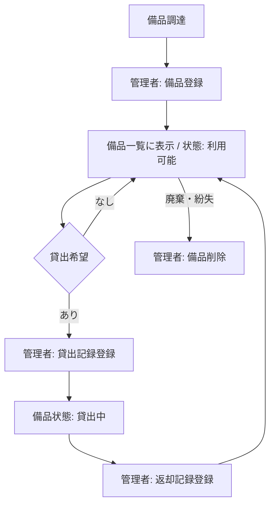
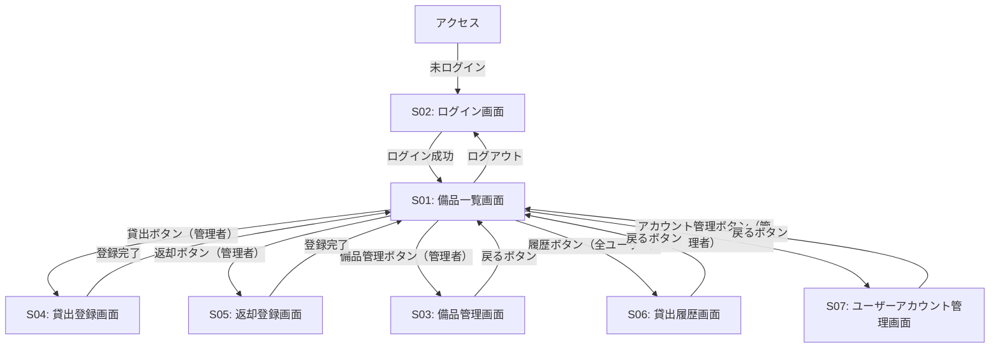
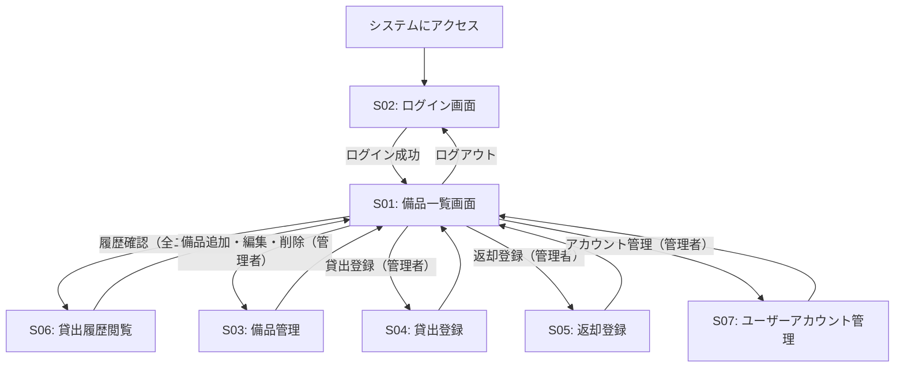
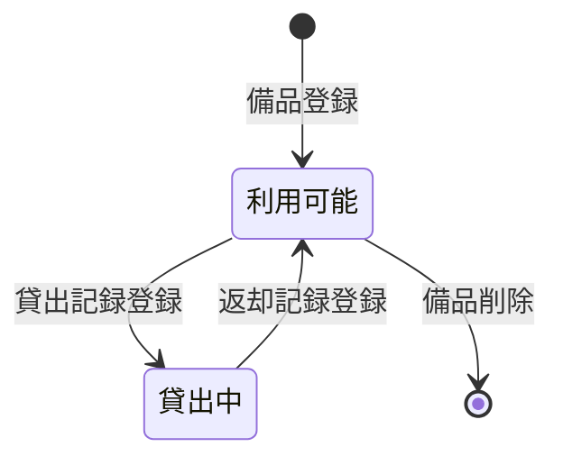
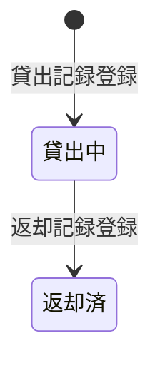

# 備品・貸出管理システム 要件定義書

---

## 1. 目的・前提

### システム目的

Excel・紙台帳による備品管理から脱却し、備品の貸出状況をリアルタイムで把握できるWebシステムを構築する。総務部担当者が備品の登録・貸出・返却を記録し、全社員がいつでも現在の貸出状況と履歴を確認できるようにする。

### 用語集

| 用語 | 定義 |
|------|------|
| 備品 | 管理番号と備品名を持つ管理対象の物品 |
| 貸出記録 | 備品の貸出・返却に関する情報（借用者・貸出日・返却日） |
| 管理者 | 備品の登録・編集・削除・貸出・返却・ユーザー管理操作が可能な総務部担当者 |
| 一般ユーザー | ログイン後に備品一覧・貸出履歴の閲覧のみ可能な利用者 |
| 貸出中 | 備品が誰かに貸し出されており返却されていない状態 |
| 利用可能 | 備品が返却済みまたは一度も貸し出されておらず使用可能な状態 |
| ロール | ユーザーアカウントに付与された権限区分（管理者／一般ユーザー） |

### UI方式

WebブラウザからアクセスできるGUI（Webアプリケーション）

---

## 2. 業務

### 対象業務一覧

| 業務 | 担当者 | この業務が無いと困ること |
|------|--------|--------------------------|
| 備品登録・編集・削除 | 管理者 | 管理対象備品が把握できない |
| 貸出記録登録 | 管理者 | 誰が何を借りているか記録できない |
| 返却記録登録 | 管理者 | 備品が返却されたことを記録できない |
| 備品一覧・状態閲覧 | ログイン済み全ユーザー | 備品の現在の貸出状況を確認できない |
| 貸出履歴閲覧 | ログイン済み全ユーザー | 過去の貸出記録を確認できない |
| ユーザーアカウント管理 | 管理者 | 複数の総務担当者・一般ユーザーのアクセス管理ができない |

### 業務フロー

### 業務課題・対応方針

| 業務課題 | 現状 | 対応方針 |
|----------|------|----------|
| 貸出状況の把握困難 | Excel・紙台帳で管理しており、誰が何を借りているか即座に確認できない | Webシステムで備品の状態と貸出履歴をリアルタイム表示する |

### 経営効果

| 種別 | 内容 |
|------|------|
| Soft Saving | 台帳確認・更新にかかる総務担当者の作業時間削減 |
| Cost Avoidance | 備品の所在不明・二重貸出による紛失・損失の防止 |

---

## 3. 機能要件

### 機能一覧

| 機能ID | 機能名 | 利用者 | 業務課題との紐付け |
|--------|--------|--------|-------------------|
| F01 | 備品一覧表示 | ログイン済み全ユーザー | 貸出状況の把握困難 |
| F02 | 備品登録 | 管理者 | 貸出状況の把握困難 |
| F03 | 備品編集 | 管理者 | 貸出状況の把握困難 |
| F04 | 備品削除 | 管理者 | 貸出状況の把握困難 |
| F05 | 貸出記録登録 | 管理者 | 貸出状況の把握困難 |
| F06 | 返却記録登録 | 管理者 | 貸出状況の把握困難 |
| F07 | 貸出履歴表示 | ログイン済み全ユーザー | 貸出状況の把握困難 |
| F08 | ログイン | 全利用者 | 管理操作・閲覧を登録ユーザーに限定するため |
| F09 | ログアウト | ログイン済み全ユーザー | 管理操作・閲覧を登録ユーザーに限定するため |
| F10 | ユーザーアカウント追加 | 管理者 | 複数担当者・一般ユーザーのアクセス管理のため |
| F11 | ユーザーアカウント削除 | 管理者 | 担当者変更時のアクセス管理のため |

### 画面一覧

| 画面ID | 画面名 | アクセス権 | 関連機能 |
|--------|--------|-----------|----------|
| S01 | 備品一覧画面 | ログイン済み全ユーザー | F01・F09 |
| S02 | ログイン画面 | 全利用者（ログイン前） | F08 |
| S03 | 備品管理画面 | 管理者 | F02・F03・F04 |
| S04 | 貸出登録画面 | 管理者 | F05 |
| S05 | 返却登録画面 | 管理者 | F06 |
| S06 | 貸出履歴画面 | ログイン済み全ユーザー | F07 |
| S07 | ユーザーアカウント管理画面 | 管理者 | F10・F11 |

### 各画面の要素と機能

#### S01: 備品一覧画面
- ログイン済みユーザーのみアクセス可能（未ログイン時はS02へリダイレクト）
- 備品一覧をテーブル形式で表示（管理番号・備品名・状態・借用者名）
- 全ユーザー共通：履歴ボタン・ログアウトボタンを表示
- 管理者のみ追加表示：貸出ボタン・返却ボタン・備品管理ボタン・アカウント管理ボタン

#### S02: ログイン画面
- ログインID入力フィールド
- パスワード入力フィールド
- ログインボタン
- 認証失敗時エラーメッセージ表示

#### S03: 備品管理画面
- 備品一覧テーブル（管理番号・備品名・状態）
- 備品追加ボタン → ダイアログ（管理番号・備品名入力）→ 保存
- 各行に編集ボタン → ダイアログ（管理番号・備品名編集）→ 保存
- 各行に削除ボタン → 確認ダイアログ → 削除実行（貸出中の備品は削除不可）
- 戻るボタン → S01に戻る

#### S04: 貸出登録画面
- 備品選択セレクトボックス（利用可能な備品のみ表示）
- 借用者選択セレクトボックス（登録済みユーザー一覧から選択）
- 貸出日入力（デフォルト：当日）
- 登録ボタン → S01に戻る

#### S05: 返却登録画面
- 貸出中の貸出記録選択セレクトボックス（借用者名・備品名で表示）
- 返却日入力（デフォルト：当日）
- 登録ボタン → S01に戻る

#### S06: 貸出履歴画面
- ログイン済みユーザーのみアクセス可能
- 全貸出記録一覧テーブル（備品名・管理番号・借用者名・貸出日・返却日）
- 戻るボタン → S01に戻る

#### S07: ユーザーアカウント管理画面
- ユーザーアカウント一覧テーブル（ログインID・ロール）
- 追加ボタン → ダイアログ（ログインID・パスワード・ロール選択）→ 保存
- 各行に削除ボタン → 確認ダイアログ → 削除実行（管理者ロールの最後の1アカウントは削除不可。貸出中（未返却）の借用者であるアカウントは削除不可）
- 戻るボタン → S01に戻る

### 画面遷移図

### ユーザー利用フロー

---

## 4. データ

### 業務エンティティ一覧

| エンティティ | 項目 | CRUD | 一覧 | 状態管理 |
|------------|------|------|------|----------|
| 備品 | 管理番号（主キー）・備品名・状態 | C/R/U/D | ○ | 利用可能 ↔ 貸出中 |
| 貸出記録 | ID（主キー）・備品管理番号・借用者ユーザーID・貸出日・返却日 | C/R | ○ | 貸出中 → 返却済 |
| ユーザーアカウント | ID（主キー）・ログインID・パスワード（ハッシュ）・ロール | C/R/D | ○ | なし |

### 備品の状態遷移

### 貸出記録の状態遷移

### データ制約

| エンティティ | 制約 |
|------------|------|
| 備品 | 管理番号は一意。貸出中の備品は削除不可 |
| 貸出記録 | 紐付く備品・ユーザーアカウントが存在すること（外部キー制約）。貸出中の備品に重複貸出不可 |
| ユーザーアカウント | ログインIDは一意。管理者ロールの最後の1アカウントは削除不可。貸出中（未返却）の借用者であるユーザーアカウントは削除不可 |

### 初期データ

- システム起動時に初期管理者アカウントを1件自動生成する（ログインID・パスワードは環境変数で設定。ロール：管理者）

### 内部データ / 外部データ

- 全データ内部管理（外部DB・外部連携なし）

### データ保持期間

- 備品データ：削除操作まで永続保持
- 貸出記録：削除操作まで永続保持（返却後も履歴として保持）
- ユーザーアカウント：削除操作まで永続保持

---

## 5. 非機能要件

### 性能

| 項目 | 要件 |
|------|------|
| 画面応答時間 | 通常操作で3秒以内 |

### 利用人数

| 項目 | 要件 |
|------|------|
| 同時接続数 | 10名以下（社内利用） |

### セキュリティ

| 項目 | 要件 |
|------|------|
| 認証 | 全操作・全画面閲覧にID/パスワードによるログイン認証必須（未ログイン時はログイン画面にリダイレクト） |
| パスワード管理 | パスワードはハッシュ化して保存（平文保存禁止） |
| 認可 | ログイン済みユーザーは閲覧操作のみ可能。登録・編集・削除・ユーザー管理操作は管理者ロールのみ |

---

## 6. テスト用利用シナリオ

| シナリオID | 目的 | 前提条件 | テスト手順 | 期待される結果 |
|-----------|------|----------|-----------|---------------|
| T01 | 未ログイン時にログイン画面へリダイレクトされる | 未ログイン状態 | S01のURLに直接アクセス | S02（ログイン画面）にリダイレクトされる |
| T02 | 管理者がログインする | 管理者アカウントが存在する | S02でログインID・パスワードを入力しログインボタンをクリック | S01に遷移し、貸出・返却・備品管理・履歴・アカウント管理・ログアウトボタンが表示される |
| T03 | 一般ユーザーがログインする | 一般ユーザーアカウントが存在する | S02でログインID・パスワードを入力しログインボタンをクリック | S01に遷移し、履歴・ログアウトボタンのみ表示される（貸出・返却・備品管理・アカウント管理ボタンは非表示） |
| T04 | 管理者が備品を登録する | 管理者ログイン済み | S03の追加ボタンをクリック→管理番号・備品名入力→保存 | 入力した備品が一覧に追加され、状態が「利用可能」と表示される |
| T05 | 管理者が備品を編集する | 管理者ログイン済み、備品が1件以上存在 | S03の編集ボタンをクリック→備品名を変更→保存 | 変更した備品名が一覧に反映される |
| T06 | 管理者が備品を削除する | 管理者ログイン済み、利用可能な備品が存在 | S03の削除ボタンをクリック→確認ダイアログで削除実行 | 備品が一覧から削除される |
| T07 | 管理者が貸出記録を登録する | 管理者ログイン済み、利用可能な備品・登録ユーザーが存在 | S04で備品を選択→借用者（登録ユーザー）を選択→登録 | 備品の状態が「貸出中」に変わり、借用者名が一覧に表示される |
| T08 | 管理者が返却記録を登録する | 管理者ログイン済み、貸出中の記録が存在 | S05で貸出記録を選択→返却日入力→登録 | 備品の状態が「利用可能」に戻る |
| T09 | 貸出履歴を確認する | ログイン済み、貸出記録が1件以上存在 | S06にアクセス | 全貸出記録（借用者名・貸出日・返却日）が一覧表示される |
| T10 | 管理者がログアウトする | 管理者ログイン済み | ログアウトボタンをクリック | S02（ログイン画面）に遷移する |
| T11 | ユーザーアカウントを追加する | 管理者ログイン済み | S07の追加ボタンをクリック→ログインID・パスワード・ロール選択→保存 | 新しいユーザーアカウントが一覧に追加される |
| T12 | ユーザーアカウントを削除する | 管理者ログイン済み、削除対象以外の管理者アカウントが存在する、かつ削除対象アカウントが貸出中の借用者でない | S07の削除ボタンをクリック→確認ダイアログで削除実行 | 対象アカウントが一覧から削除される |
| T13 | 管理者ロールの最後の1アカウントは削除できない | 管理者ログイン済み、管理者ロールアカウントが1件のみ存在 | S07の削除ボタンをクリック | 削除できない旨のエラーが表示される |
| T14 | 貸出中の備品は削除できない | 管理者ログイン済み、貸出中の備品が存在 | S03で貸出中備品の削除ボタンをクリック | 削除できない旨のエラーが表示される |
| T15 | 一般ユーザーは管理操作ができない | 一般ユーザーログイン済み | 貸出・返却・備品管理・アカウント管理の各URLに直接アクセス | S01（備品一覧画面）にリダイレクトされる |
| T16 | 貸出中の借用者であるユーザーアカウントは削除できない | 管理者ログイン済み、貸出中（未返却）の借用者として紐付くユーザーアカウントが存在する | S07で該当ユーザーの削除ボタンをクリック | 削除できない旨のエラーが表示される |
| T17 | ログイン失敗時にエラーメッセージが表示される | 未ログイン状態 | S02で誤ったログインID・パスワードを入力しログインボタンをクリック | ログイン画面にエラーメッセージが表示され、画面遷移しない |
