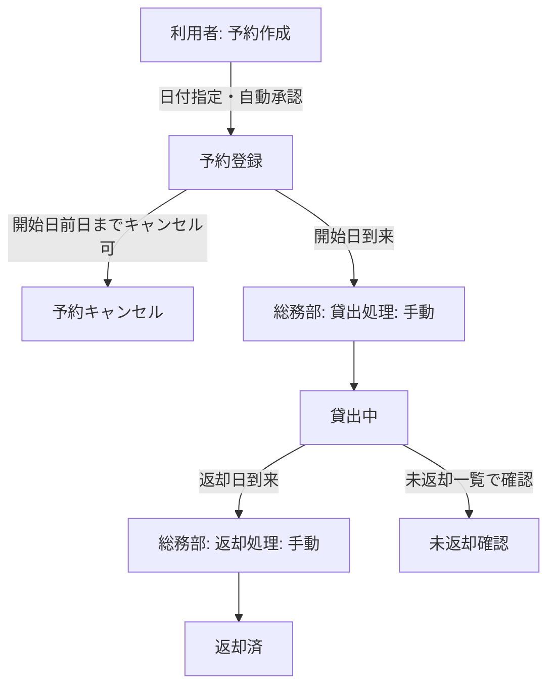

# 備品管理・貸出予約アプリ 要件定義書

## 1. 作成目的
- 社内備品（文具・什器・少数の機器）を単一拠点で、所在管理と貸出予約・返却を効率化する
- 全社員が備品の閲覧・予約を行い、総務部が登録・貸出・返却を一元管理する

## 2. 用語集
| 用語 | 定義 | 備考 |
| --- | --- | --- |
| 備品ID | 備品ごとに付与する固有ID。貸出・返却時に必須入力 | ラベル/QR運用は行わず手入力 |
| 予約 | 利用者が日付単位で備品の利用期間を確保すること | 自動承認。開始日前日までキャンセル可 |
| 貸出 | 予約済み備品を総務部が手動で「貸出中」状態にする処理 | 日単位。最大7日、延長不可 |
| 返却 | 利用終了時に総務部が手動で「返却済み」へ更新する処理 | |
| 未返却一覧 | 返却予定日を過ぎていない/過ぎている貸出中の備品一覧 | 通知なし。画面で確認のみ |
| 総務部 | 備品登録・編集・廃棄、貸出/返却処理、アカウント管理を担当する部門 | 管理者ロール |

## 3. 対象業務と範囲
- 対象備品: 文具・什器・少数機器、単一拠点、個別ID管理
- 利用者: 全社員が閲覧・予約。総務部が登録・貸出・返却・設定を実施
- 時間単位: 日単位（開始日・返却予定日）。最大貸出日数7日、延長不可。同一備品は期間重複不可。1人あたり上限なし
- 認証: メール+パスワード（8文字以上）、社内ネットワークのみ
- UI: ブラウザGUI（PC最適化、スマホ非対応）

### 3.1 業務要件一覧
| 業務ID | 業務 | 目的 | 担当 |
| --- | --- | --- | --- |
| B01 | 備品登録/編集/廃棄 | 備品マスタを整備し貸出対象を管理 | 総務部 |
| B02 | 予約 | 利用者が日付単位で利用枠を確保 | 全社員 |
| B03 | 貸出処理 | 予約開始日に備品を貸出中へ更新 | 総務部 |
| B04 | 返却処理 | 利用終了時に返却完了を登録 | 総務部 |
| B05 | 未返却確認 | 期限内/超過の貸出中備品を把握 | 総務部、全社員閲覧 |
| B06 | アカウント管理 | 利用者登録・削除、権限付与 | 総務部 |

### 3.2 業務フロー（予約〜貸出〜返却）

### 3.3 業務フローの条件/ループ整理
- 重複予約: 同一備品は期間重複不可（先着）。時間帯管理なし（日単位）
- 延長: 不可（新規予約で対応）
- キャンセル: 利用者が開始日前日まで可。開始日当日は不可（総務部が必要に応じて取消）
- 貸出・返却: いずれも総務部が手動処理

## 4. 対象業務の課題と指標
### 4.1 現状課題
| 業務 | 担当 | 課題 |
| --- | --- | --- |
| 備品所在管理 | 総務部 | 所在不明が多い（個別ID管理・貸出履歴がない） |
| 返却管理 | 総務部 | 返却遅延が多い（期限超過の把握が遅い） |
| 利用状況把握 | 全社員/総務部 | 貸出状況が見えない（予約・貸出の可視化不足） |

### 4.2 業務指標
| 指標 | 対象 | 目標 |
| --- | --- | --- |
| サイクルタイム | 貸出処理（手動） | 1分以内で更新完了 |
| リードタイム | 予約〜貸出処理完了 | 予約開始日に処理完了（当日内） |
| 処理能力 | 同時処理 | 同時利用10人未満で性能劣化なし |
| エラー率 | 入力・登録エラー | 1%未満（必須入力と重複検知で防止） |
| 待機時間 | 画面応答 | 標準Web性能（主要操作体感2秒以内目安） |

### 4.3 見込み経営効果
- Soft Saving（人件費削減）: 貸出/返却管理の手作業工数削減
- Cost Avoidance: 所在不明による備品再購入の抑止
- TCO削減: 紙やスプレッドシートによる管理からの移行で管理コスト低減

## 5. このシステムが解決すべき課題
| 業務 | 説明 | 業務課題 | 解決方法 |
| --- | --- | --- | --- |
| 備品所在管理 | 個別IDで所在と貸出状態を一元化 | 所在不明が多い | 個別ID必須入力・予約/貸出履歴によるトレーサビリティ |
| 返却管理 | 返却予定日の可視化と未返却一覧 | 返却遅延が多い | 未返却一覧で期日管理（通知なし） |
| 利用状況把握 | 予約・貸出の状態を一覧化 | 貸出状況が見えない | 予約一覧・貸出一覧で可視化 |

## 6. システムに必要な全機能
### 6.1 機能一覧（トップダウン）
- 認証/認可: ログイン（メール+パスワード）、ロール（一般/管理=総務部）
- 備品マスタ管理: 登録・編集・廃棄、検索/一覧
- 予約: 作成・キャンセル（日単位、期間重複不可、最大7日）
- 貸出: 総務部による手動貸出開始
- 返却: 総務部による手動返却完了
- 未返却一覧: 返却予定日と借用者の確認（通知なし）
- アカウント管理: 総務部による利用者登録/削除、パスワードポリシー8文字以上

### 6.2 情報源・入力
| 区分 | 内容 | 入力者/取得元 |
| --- | --- | --- |
| 備品マスタ | 個別ID・名称（必須） | 総務部がGUIで手入力 |
| 予約情報 | 期間（日付）、備品ID、利用者 | 利用者がGUIで入力（自動承認） |
| 貸出/返却 | 貸出開始日、返却日 | 総務部がGUIで手動入力 |
| 利用者マスタ | メール、氏名、ロール | 総務部がGUIで手動登録/削除 |

### 6.3 外部機能
- 外部連携: なし
- UI形態: ブラウザGUI（PC最適化、スマホ非対応）。CUIなし
- 画面一覧（想定）
  - ログイン画面
  - ダッシュボード/お知らせ簡易
  - 備品一覧・詳細・登録/編集（総務部のみ編集）
  - 予約作成画面（日付範囲指定、備品ID指定、期間重複検知）
  - 予約一覧/マイ予約
  - 貸出/返却管理画面（総務部用）
  - 未返却一覧画面（備品ID、名称、借用者、貸出開始日、返却予定日）
  - アカウント管理画面（総務部用）

### 6.4 内部機能・データ
| データ | 主な項目 | 備考 |
| --- | --- | --- |
| 利用者 | メール、氏名、ロール、パスワードハッシュ | パスワード8文字以上 |
| 備品 | 個別ID、名称、貸出可否 | 必須はID・名称のみ |
| 予約 | 予約ID、備品ID、利用者、開始日、返却予定日、状態 | 自動承認、期間重複不可 |
| 貸出 | 貸出ID、予約ID、貸出開始日、返却予定日、返却日、状態 | 総務部が手動更新 |
| 操作ログ | 操作種別、実行者、日時 | 無期限保持 |

### 6.5 出力データ
- 帳票/CSV出力: 不要（画面確認のみ）

### 6.6 データ保持期間
- 予約・貸出・返却履歴、操作ログ、マスタ類すべて無期限保持

## 7. 非機能要件
| 項目 | 要件 |
| --- | --- |
| 性能 | 標準的なWebアプリ性能（主要操作体感2秒以内目安、同時利用10人未満想定） |
| 利用規模 | 利用者100人未満、同時利用10人未満 |
| セキュリティ | 社内ネットワークのみからアクセス、メール+パスワード（8文字以上）認証、ロールによる権限制御、操作ログ無期限保持 |

## 8. レビュー
- 矛盾確認: 予約は自動承認・日単位・期間重複不可・最大7日・延長不可。貸出/返却は総務部手動。キャンセルは開始日前日まで。通知不要。これらの前提は全セクションで整合
- 範囲確認: 単一拠点・個別ID・PCブラウザのみ・帳票出力なしを明記
- セキュリティ整合: 社内ネットワーク限定＋パスワード8文字以上、MFAなしを全体で一貫
- データ保持: 無期限保持をマスタ・履歴・ログで統一
- 残課題: なし（要件は現時点で充足）
